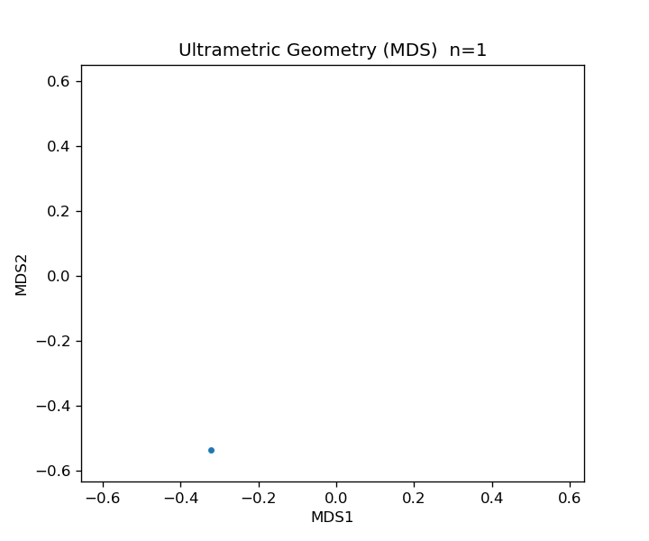
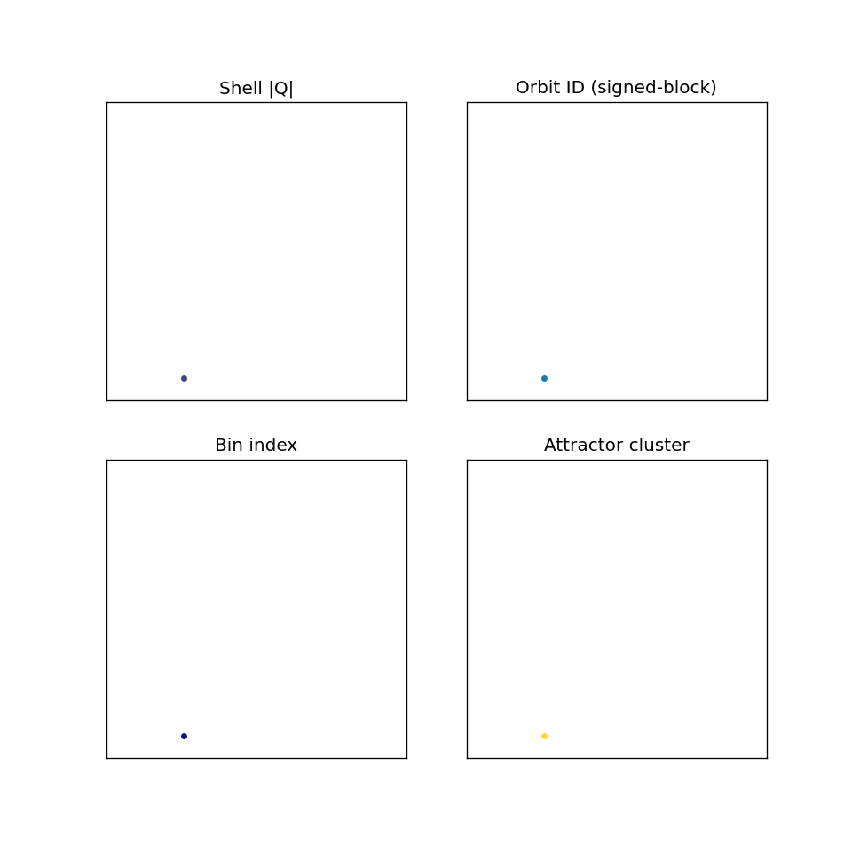
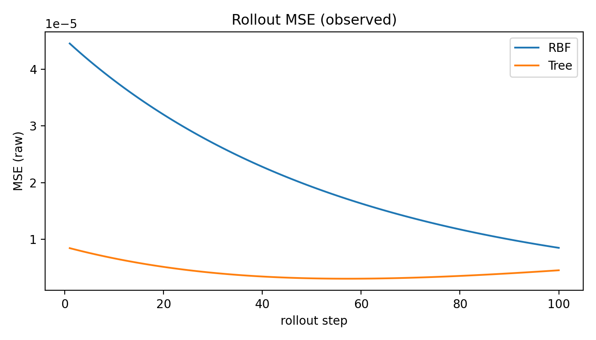
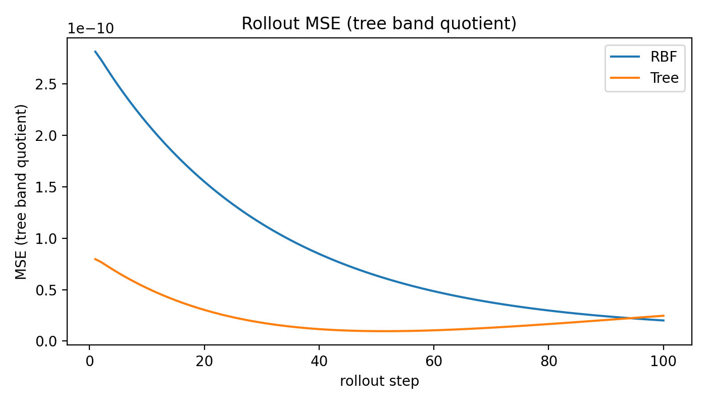
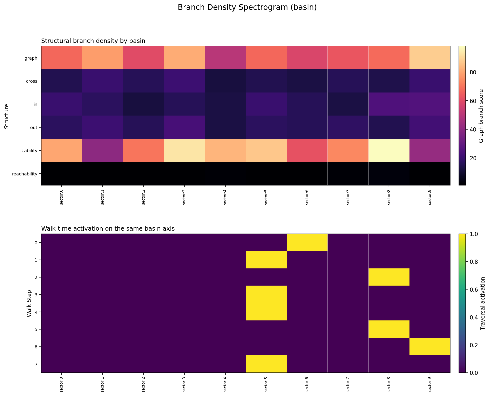
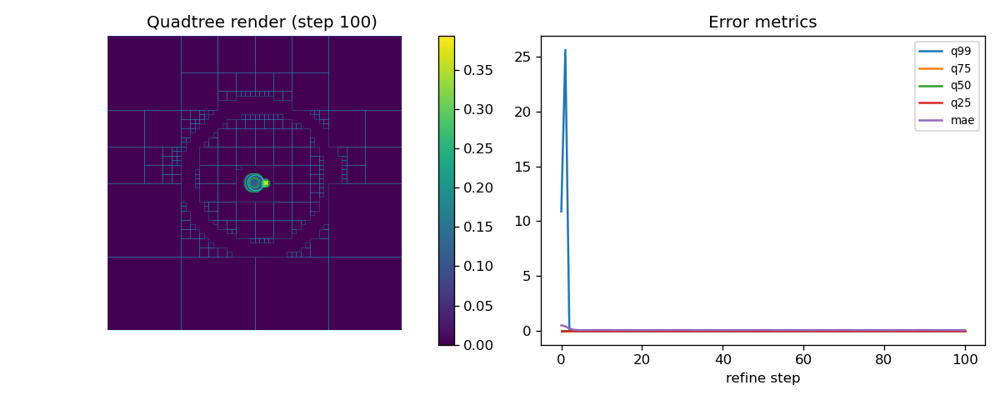

# DASHI: A Constructive Carrier Derivation Program for Physics-Unification Structures

Subtitle: Ultrametric Carrier Geometry, Projection-Defect Semantics, and
Mechanized Closure Frontiers

Status: integrated Paper 1 Markdown manuscript; paper-writing surface;
non-promoting beyond `ClaimLedger.md`.

## Abstract

Background: physics-unification programs often state target equations before
making explicit which carrier, quotient, source, and calibration obligations
are actually inhabited. Objective: this paper constructs a typed ultrametric
carrier geometry for staging those obligations without collapsing theorem,
target, obstruction, and empirical receipt into one status. Methods: DASHI
combines a ternary/refinement carrier, `FactorVec` valuation coordinates,
projection-defect decomposition, filtered operator surfaces, local transport,
root-shell boundaries, UFT/motif compression, and mechanized admissibility
receipts. Results: the manuscript derives a carrier spine from unresolvedness
through recursive refinement, ultrametric distance, tracked lane commutation,
projection residuals, and quotient-sensitive filtration; then applies that
spine to gauge curvature, Yang-Mills ordering defects, QFT commutator targets,
GR curvature/Bianchi targets, measurement residuals, sector splitting,
compression admissibility, and a bounded below-Z Drell-Yan `t43` empirical
contact surface (`chi2/dof = 2.1565191176` under threshold `4.0`). The same
typed discipline blocks stronger readings: strict `chi2/dof <= 2` and strict
log-covariance tests fail, upstream E8 completion is not promoted, and accepted
empirical authority, sourced non-flat GR, continuum recovery, GRQFT closure,
and completed unification remain open. Conclusion: DASHI proposes a
constructive ultrametric carrier geometry in which admissible refinement,
compression, transport, and quotient structure generate staged physics-facing
derivation surfaces, while typed closure semantics track the residual
obligations that block stronger promotion.

**Keywords:** ultrametric geometry; physics unification; gauge theory; filtered
operator algebras; projection-defect decomposition; dependent type theory;
constructive mathematics; formal methods.

## 1. Introduction

DASHI separates proved structure, target equations, empirical fits, and
unresolved obstructions inside one constructive carrier geometry. A state
carries trit-valued local data, tracked prime-lane valuations, ultrametric refinement
depth, lane-local actions, and projections into observable surfaces. The
residual left by a projection remains part of the formal state rather than
being discarded or promoted by convention.

Observable structure is modeled as a projection from a richer carrier space.
For a surface `s`, a projection \(P_s:X\to Y_s\) exposes the admissible
component of \(x\in X\). The defect \(D_s(x)\) records the residual structure:
unresolved branches, incompatible quotient data, missing adapters, or absent
empirical authority. Filtrations organize limiting behavior and associated
graded constructions. Ultrametric refinement organizes address depth and
precision. Independent lane actions give componentwise laws for selected
coordinate sectors.

The same carrier supports local transport, filtered operators, ultrametric
refinement, finite root-shell boundaries, compression structures, and bounded
empirical receipts. Direction-indexed discrete sites define local transport
schemas. Finite-support operators define filtered contraction targets. The
tracked G6 commuting theorem gives a coordinate-independence law for selected
prime-lane actions. Local E8/LILA surfaces record bounded root-geometry and
upstream-promotion boundaries. UFT-style compression records repeated
refinement motifs and recoverable residual distinctions. The bounded
Drell-Yan empirical receipt records one comparison against a frozen typed
surface.

## Target Obligation Surfaces and DASHI Derivation Roles

The governing order for every displayed equation is:

```text
carrier schema < interpretation map < field-equation law < calibrated physics claim
```

Until the interpretation map, quotient laws, physical units, source interface,
and empirical/authority receipts are inhabited, the equations in this opening
section are target obligation surfaces. They are placed here first because
they are the reason the derivation spine matters, not because they are already
closed.
DASHI's current claim is that it gives a typed derivation route in which each
term has an explicit carrier-side obligation:

\[
\Omega_p=H_p-I,
\qquad
F_A=dA+A\wedge A,
\qquad
[\nabla_\mu,\nabla_\nu]V^\rho
=R^\rho{}_{\sigma\mu\nu}V^\sigma,
\]
\[
R_{\mu\nu}=R^\rho{}_{\mu\rho\nu},
\qquad
G_{\mu\nu}=R_{\mu\nu}-\frac12Rg_{\mu\nu},
\]
\[
G_{\mu\nu}+\Lambda g_{\mu\nu}
=
\frac{8\pi G}{c^4}T_{\mu\nu}.
\]

The gauge and operator targets are similarly explicit:

\[
d_AF_A=0,
\qquad
d_A{*F_A}=J,
\qquad
dF=0,\quad d{*F}=J,
\]
\[
U(t)=e^{-itH},
\qquad
i\partial_t\psi=H\psi,
\qquad
[\phi(t,x),\pi(t,y)]=i\delta(x-y).
\]

| Physics term | DASHI structural reading | First residual obligation |
|---|---|---|
| \(g_{\mu\nu}\) | projected metric over the refinement carrier | metric emergence, inverse, signature, units |
| \(\nabla\) | admissible transport law between carrier-local fibres | non-flat connection/transport adapter |
| \(R^\rho{}_{\sigma\mu\nu}\) | transport defect from noncommuting refinement transport | curvature carrier, covariance, torsion convention |
| \(R_{\mu\nu},R\) | contracted transport defect | Ricci/scalar contraction and index laws |
| \(G_{\mu\nu}\) | stable curvature-obstruction tensor | contracted Bianchi/divergence-free law |
| \(T_{\mu\nu}\) | source/stress-energy target projection / matter residual carrier | accepted stress-energy interface and authority |
| \(\Lambda g_{\mu\nu}\) | background refinement/vacuum term | cosmological-term convention and calibration |
| \(8\pi G/c^4\) | source-coupling normalization | weak-field/Newtonian limit and unit calibration |

The normalization \(\kappa=8\pi G/c^4\) is not an arbitrary decoration. In a
completed route it must be fixed by geometric normalization, spherical-flux
structure, and weak-field consistency with the Newtonian limit. Paper 1 does
not prove that calibration. It makes the missing calibration a named
obligation rather than hiding it behind the formal carrier.

## Core Carrier Grammar

The constructions in this paper use a carrier of the form

\[
x \in \mathcal X \simeq (a,\nu,\tau,d,\ell,r),
\qquad
\tau \in \{-1,0,+1\}.
\]

Here \(a\) is a refinement address, \(\nu\) is `FactorVec`-style prime-lane
valuation data, \(\tau\) is the ternary coordinate, \(d\) is refinement depth,
\(\ell\) is the active lane, and \(r\) records residual/projection status. A
surface \(s\) exposes only its admitted projection:

\[
x = P_s(x) + D_s(x), \qquad
\rho(x,y)=\alpha^{k(x,y)},\; 0<\alpha<1.
\]

\(P_s(x)\) is the promoted component; \(D_s(x)\) is the residual defect; and
\(k(x,y)\) is the first incompatible address, valuation, or prefix depth.
Filtered operator surfaces use \(F_0 \subseteq F_1 \subseteq \cdots\),
\(\operatorname{gr}_nF=F_n/F_{n-1}\), and descended brackets only where
quotient, equivalence, norm, and bracket laws are inhabited. Lane actions
commute only on the official tracked independent `GL.FactorVec` route.
UFT/motif compression records reusable projected structure while residual
defects remain visible.

## Derivation Map at a Glance

The closure frontier appears later. The early reader map is a derivation-role
map: each target equation is read as a structural role to be produced by the
carrier, followed by the adapter still needed for a calibrated physics claim.

| Target role | DASHI derivation engine | Adapter still needed |
|---|---|---|
| Maxwell / abelian gauge | commuting local transports give additive plaquette curvature \(F=dA\) with \(dF=0\) from \(d_1d_0=0\) | bind adopted G2 schema into Maxwell scope; exterior derivative/nilpotency, Hodge star, source current, U(1) sector/action, covariance, units/convention |
| Yang-Mills / nonabelian gauge | noncommuting local transports force the commutator term \(A\wedge A\) in \(F_A=dA+A\wedge A\) | representation, sector restriction, action/source law, calibrated field equation and coupling convention |
| QFT commutator | filtered finite-support operators descend only through quotient-correct brackets | equivalence modulo denominator filtration, accepted quotient carrier, descended norm/bracket, Hilbert/amplitude/CCR/Born laws |
| GR curvature | path-dependent carrier transport yields curvature as the minimal commutator obstruction | non-flat connection, Christoffel-from-metric law, Ricci/Bianchi reduction, stress-energy interface, units/calibration/source law |
| Measurement / uncertainty | projection \(\pi:X\to Q\) leaves residual fibres \(R_\pi(x)\) | amplitude/probability law plus empirical projection and observable map |
| Sector splitting | projection preserves a subgroup \(H\subseteq G\), leaving residual cosets \(G/H\) | concrete SM representation, subgroup projection law, coupling/mixing calibration |

## 2. Background and Related Work

DASHI draws on standard mathematical neighborhoods including ultrametric and
p-adic structure, lattice and gauge language, contraction and associated
graded constructions, root-system classification, mechanized mathematics, and
compression-style trie geometry. The claims made here are restricted to the
repo-local receipt and obstruction surfaces cited in the claim ledger.

Agda is used as the mechanized verification surface for selected propositions,
receipts, audits, and blockers. A proved construction is represented by an
inhabited artifact; a missing constructor is recorded as a manuscript-relevant
obligation. This is closest in spirit to proof assistants, dependent type
theory, mechanized mathematics, and proof-carrying artifacts, while remaining
narrower than an end-to-end certified physics pipeline.

Ultrametric and p-adic language organizes refinement by depth: nearby states
share high-level valuation or prefix structure, while separation can occur at
the first incompatible digit or coordinate. Hensel-style lifting is useful as
an external analogy for compatible refinement across precision levels. In
Paper 1 this is expository support for carrier and compression geometry, not
an independent proof of convergence.

The labels G2, G3, and G6 are DASHI derivation-lane names. They should not be
read as claims of equivalence to standard mathematical objects with similar
names, such as the exceptional Lie group \(G_2\), unless an inhabited surface
states that equivalence. E8 is different: the paper explicitly uses standard
root-system language there, but only for the bounded local enumeration and
promotion-boundary surfaces stated below.

The G2, G3, G6, and E8/LILA lanes are likewise placed in recognizable
mathematical neighborhoods. G2 uses direction-indexed discrete site language
related to lattice and gauge constructions. G3 uses filtered finite-support
operator surfaces and associated-graded quotient targets related to
contraction. G6 uses tracked independence between coordinate sectors. E8/LILA
uses finite root-enumeration and upstream-promotion boundaries. The novelty
claimed here is not the invention of these classical ingredients, but their
integration into a typed unification architecture where promotion and
obstruction are represented explicitly.

### 2.1 External Formal Bridges and Terminal Boundaries

DASHI is not presented as an isolated replacement for existing formal
geometry or algebraic QFT. It is a carrier-and-receipt layer that can be
bridged to external formal mathematics when the corresponding adapters are
made explicit. The current bridge layer has six named obligation slots,
B0--B5, each recorded as a typed obligation rather than as a prose promise.

**B0 (geometric emergence).** Wave-coherent and refinement-stable DASHI
transport should determine a DCHoTT `G-structures` socket. This is the central
open bridge theorem and the target of the next paper. The current receipt is
`LeviCivitaBridge.agda`: it typechecks against the cloned DCHoTT-Agda flat
modules and records B0 as a named postulated obligation, not an imported
theorem.
`DCHoTTBridgeObligationIndex.agda` further names the B0.1 pro-object
compatible-family/formal-disk scaffold, the B0.2 flat-formal-disk target, and
the B0.3 refinement-stable frame/metric/G-structure reduction target.
`ProObjectSemantics.agda` constructs the DASHI-side B0.1 compatible-family
limit surface: pro-object points, depth projections, refinement coherence,
depthwise agreement balls, and the depth-zero formal-thickening relation. The
analytic and external-geometric steps remain open: real-valued ultrametric
completion, transport-smooth sheaves, formal-disk-to-DCHoTT equivalence,
DCHoTT manifold/G-structure promotion, and Levi-Civita specialization are not
proved here.

**B1 (curvature from nilpotent transport).** The discrete Bianchi and Einstein
candidate surfaces are downstream of B0. They remain suspended until the
non-flat metric/Levi-Civita adapter is imported or proved; the current
manuscript therefore discusses curvature and Einstein tensors as target
surfaces, not completed GR.

**B2 (local quantum field).** The cited Haag-Kastler stack route is recorded
as identifying a
locally covariant AQFT as a point of the relevant HK 2-functor. The
Klein-Gordon free-field witness is recorded in
`KleinGordonAQFTReceipt.agda`, which cites the stack result as a bounded
free-field surface while leaving concrete algebra-net reconstruction, GNS
state selection, and Born-rule derivation open.
`AQFTCarrierAlgebraQuotientSurface.agda` stages \(A(O)\), \(A_d(O)\), the
filtered colimit \(\mathrm{colim}_d A_d(O)\), and Cauchy time-slice evolution
as typed targets only.

**B3 (interacting boundary).** Interacting QFT, renormalisation, and coupling
calibration are typed adapter boundaries. The record
`InteractingQFTBoundaryReceipt.agda` treats constructive interacting local
algebra nets as the first missing primitive and explicitly blocks Standard
Model or interacting-QFT promotion.

**B4 (compression admissibility).** Compression is governed by an MDL
Lyapunov condition: admissible transport must not increase the required
description length at the active projection grade. This is recorded by the
compression admissibility receipt and used in the compression section below.

**B5 (honest frontier).** The terminal status layer separates weak modulo
accounting from unqualified closure. The repository records a weak terminal
claim only modulo an explicit minimal package: B0.1 \(\Im\) reflection, B0.3
`WeakBG`, Bisognano--Wichmann/time-slice authority,
Doplicher--Roberts reconstruction, \(C^*\)-completion, and
pointwise-to-uniform mass-gap transfer. This is not a terminal theorem. The
unqualified terminal claim remains blocked; continuum mass-gap authority,
`laneDimension`, DHR-to-Standard-Model matching, final adapter acceptance,
stress-energy/Wald authority, and GRQFT composition remain open gates. The
repository files `ExternalFormalImportRoadmapReceipt.agda`,
`BalabanRGMassGapReceiptSurface.agda`,
`TerminalOpenProblemStatusSurface.agda`, and
`GRQFTTerminalCompositionBoundary.agda` record these terminal boundaries
without promoting completed unification.

The honest frontier claim is therefore deliberately weaker than a completed
unification theorem: DASHI localizes which pieces are derived from carrier
transport and which pieces require external geometric, algebraic, empirical,
or calibration input. The absence of an inhabitant is manuscript-relevant
state, not an editorial disclaimer.

The 15 supersingular-prime coordinate framing, JMD provenance, Base369/trit
intuition, UFT-C/SWAR implementation context, Markov-after-quotient readings,
and orbit-shell/signature families are useful for background, appendix, and
future-work routing. They are not theorem authority for Paper 1 unless a
repo-local receipt promotes a specific statement. Trading, legal, social,
religious, and cultural archive material is excluded from the main positive
claim path.


## 3. Derivation Spine

The carrier geometry is not introduced as an inventory. It is derived from a
small sequence of representational obligations: unresolved local state,
coordinate traversal, recursive refinement, prime-lane valuation, surface
projection, residual defect, and filtered operator descent.

| Stage | Object introduced | Spine statement |
|---|---|---|
| 1 | Primitive ternary state | Signed evidence with unresolved residue requires at least three local statuses. |
| 2 | Traversal | Coordinate-local updates turn primitive states into paths in a finite state graph. |
| 3 | Voxel / hypercube cell | A finite block of ternary coordinates is a `3^k` cell with coordinate-wall adjacency. |
| 4 | Trie and ultrametric | Recursive cell refinement is represented by prefix addresses whose natural distance is ultrametric. |
| 5 | `FactorVec` | Prime-lane valuation counts refine addresses into the tracked `Vec15 Nat` carrier. |
| 6 | Projection-defect | Every visible reading is a projection together with a residual defect. |
| 7 | Filtration | Depth, support, valuation, and admissibility organize surfaces into filtered theorem targets. |

**Definition 4.1 (Primitive local state).** Let
\[
T=\{-1,0,+1\}.
\]
A primitive local state is an element `t : T`. The values `+1` and `-1`
record oriented alternatives. The value `0` records unresolved residue:
structure that has not been discharged by the current surface.

**Lemma 4.2 (Ternary minimality).** Any local carrier that distinguishes a
positive orientation, a negative orientation, and unresolved residue needs at
least three local values.

**Proof.** A two-valued carrier distinguishes at most two equivalence classes.
If unresolved residue is identified with `+1`, unresolved structure is promoted
as positive evidence. If it is identified with `-1`, unresolved structure is
promoted as negative evidence. If `+1` and `-1` are identified, orientation is
lost. The three roles therefore require three values. This is a bookkeeping
minimality result, not a physical law. \(\square\)

**Definition 4.3 (Traversal).** For a finite coordinate set `I`, a primitive
state is a function
\[
x:I\to T.
\]
A coordinate update is a map \(u_{i,\phi}:T^I\to T^I\) that changes only
coordinate \(i\), using a local rule \(\phi:T\to T\), and leaves every
\(j\neq i\) fixed. A traversal is a finite sequence
\[
x_0 \xrightarrow{u_1} x_1 \xrightarrow{u_2}\cdots
\xrightarrow{u_n} x_n .
\]

**Lemma 4.4 (Traversal as address word).** Every traversal determines a word
in the update alphabet \(\Sigma=\{(i,\phi)\mid i\in I,\phi:T\to T\}\).

**Proof.** Record the label \((i_m,\phi_m)\) of each update \(u_m\). The
traversal is represented by the word
\[
(i_1,\phi_1)(i_2,\phi_2)\cdots(i_n,\phi_n)\in\Sigma^\ast.
\]
The word is a formal update trace relative to the chosen carrier; it does not
by itself claim a unique physical history. \(\square\)

**Definition 4.5 (Ternary cell and voxel refinement).** For a finite block
\(B\subseteq I\) with \(|B|=k\), the local cell is \(C_B=T^B\). It has \(3^k\)
vertices. Two vertices are coordinate-adjacent when they differ in exactly one
coordinate. A voxel refinement replaces one coordinate \(i\) by a finite child
block \(B_i\), replacing the factor \(T\) at \(i\) by \(T^{B_i}\).

**Lemma 4.6 (Hypercube language is finite-coordinate language).** The cube,
voxel, and hypercube terms used in the origins story can be read as finite
coordinate cells and their refinements.

**Proof.** A block \(T^B\) is a finite product of local coordinate carriers.
Its coordinate-adjacency graph is the ternary analogue of a cubical graph:
faces are obtained by fixing coordinates, and refinements replace a coordinate
by a child product. Thus the geometric language refers to finite-coordinate
movement and refinement, not to an assertion that physical spacetime has been
derived. \(\square\)

**Definition 4.7 (Refinement trie and ultrametric).** Let \(\Sigma\) be a
finite refinement alphabet. A trie address is a finite or infinite word in
\(\Sigma\). For infinite addresses \(a,b\), let \(\lambda(a,b)\) be the length
of their longest common prefix, with \(\lambda(a,a)=\infty\). Fix
\(0<\alpha<1\), and define
\[
\rho(a,b)=
\begin{cases}
0, & a=b,\\
\alpha^{\lambda(a,b)}, & a\neq b.
\end{cases}
\]

**Lemma 4.8 (Trie distance is ultrametric).** The distance \(\rho\) satisfies
\[
\rho(a,c)\leq \max(\rho(a,b),\rho(b,c)).
\]

**Proof.** If \(a\) and \(b\) agree for \(m\) symbols, and \(b\) and \(c\)
agree for \(m\) symbols, then \(a\) and \(c\) also agree for \(m\) symbols.
Hence
\[
\lambda(a,c)\geq \min(\lambda(a,b),\lambda(b,c)).
\]
Since \(0<\alpha<1\), increasing prefix depth decreases distance. Therefore
\[
\alpha^{\lambda(a,c)}
\leq
\max(\alpha^{\lambda(a,b)},\alpha^{\lambda(b,c)}).
\]
The cases with equal addresses are immediate. \(\square\)

**Definition 4.9 (`FactorVec`).** Let
\[
P=\{2,3,5,7,11,13,17,19,23,29,31,41,47,59,71\}
\]
be the tracked supersingular-prime lane set used by the repo-native carrier.
A `FactorVec` is a function \(\nu:P\to\mathbb{N}\), equivalently a
`Vec15 Nat` exponent vector with one coordinate for each tracked prime lane.

For \(p\in P\), define the prime-lane bump
\[
B_p(\nu)(q)=
\begin{cases}
\nu(q)+1, & q=p,\\
\nu(q), & q\neq p.
\end{cases}
\]

**Lemma 4.10 (Coordinate bumps commute).** For all \(p,q\in P\),
\[
B_p(B_q(\nu))=B_q(B_p(\nu)).
\]

**Proof.** Check each coordinate \(r\in P\). If \(r\) is neither \(p\) nor
\(q\), both sides equal \(\nu(r)\). If \(r=p\neq q\), both sides equal
\(\nu(p)+1\). If \(r=q\neq p\), both sides equal \(\nu(q)+1\). If
\(p=q=r\), both sides equal \(\nu(p)+2\). The vectors are equal
coordinatewise. \(\square\)

**Definition 4.11 (Surface projection and defect).** A surface \(s\) consists
of a visible carrier \(Y_s\), an admissibility gate \(G_s\), and a projection
\[
P_s:X\to Y_s
\]
from the richer carrier \(X\) to the visible surface. The defect \(D_s(x)\) is
the residual information not promoted by \(P_s\). When the carrier has an
additive split, this is written
\[
x=P_s(x)+D_s(x).
\]

**Lemma 4.12 (Defect makes non-closure visible).** If two states
\(x,x'\in X\) satisfy \(P_s(x)=P_s(x')\) but differ in gate status, residual
content, or unmet obligations, then the projection alone cannot distinguish
them. Recording \((P_s(x),D_s(x))\) keeps the promoted component and the
unpromoted residual in the same formal account. \(\square\)

**Definition 4.13 (Filtration and associated graded target).** A filtration
on \(X\) is an increasing sequence
\[
F_0\subseteq F_1\subseteq F_2\subseteq\cdots .
\]
When quotient structure is available, the \(n\)-th graded piece is
\[
\operatorname{gr}_nF=F_n/F_{n-1}.
\]
This notation is a target unless the equivalence relation, quotient carrier,
projection-respects-equivalence law, and descended operations are supplied.

**Lemma 4.14 (Descent requires equivalence preservation).** Suppose \(A:X\to X\)
is filtration-preserving and \(x\sim_n y\) means \(x-y\in F_{n-1}\). If
\[
x\sim_n y \Rightarrow A(x)\sim_n A(y),
\]
then \(A\) induces an operator on \(F_n/F_{n-1}\).

**Proof.** Define the induced map by \([x]\mapsto[A(x)]\). If \([x]=[y]\),
then \(x\sim_n y\). By equivalence preservation, \(A(x)\sim_n A(y)\), so
\([A(x)]=[A(y)]\). Thus the definition is independent of representative.
\(\square\)

**Theorem 4.15 (Early DASHI carrier spine).** Starting from primitive signed
state with unresolved residue, the carrier grammar is forced in the restricted
sense
\[
\text{primitive state}
\to
\text{traversal}
\to
\text{voxel / hypercube cell}
\to
\text{trie / ultrametric refinement}
\to
\text{`FactorVec` valuation}
\to
\text{projection-defect}
\to
\text{filtration}.
\]

**Proof.** Lemma 4.2 gives ternary local state. Definitions 4.3 and Lemma 4.4
turn such states into coordinate-local traversals with update-word addresses.
Definition 4.5 and Lemma 4.6 give the bounded reading of voxel and hypercube
traversal. Recursive refinement of those cells is prefix refinement, so
Definition 4.7 and Lemma 4.8 give ultrametric geometry. When refinement labels
include tracked prime-lane information, Definition 4.9 and Lemma 4.10 produce
the `FactorVec` valuation route and its basic coordinate commutation fact.
Once a surface observes only part of the richer state, Definition 4.11 and
Lemma 4.12 require a projection-defect split. Finally, when traversal becomes
operator language, Definition 4.13 and Lemma 4.14 show that filtration and
quotient descent are the required path to theorem-facing dynamics. \(\square\)

The derivation theorem does not assert that the grammar completes physics. It
asserts that the listed structures are not a catalog: they arise as successive
obligations once signed unresolved state, traversal, recursive refinement,
prime-lane valuation, surface projection, and filtered operator descent are all
kept visible.

## 4. Core Constructive Architecture

The carrier used below has six recurring components:
\[
  x \in X \simeq (a,\nu,\tau,d,\ell,r),
\]
where \(a\) is a refinement address, \(\nu\) is tracked prime-lane valuation
data, \(\tau\) is local trit state, \(d\) is depth or filtration grade, \(\ell\)
records the active lane/action context, and \(r\) records residual structure.
The later gauge, operator, root-shell, compression, and empirical sections use
different projections of this same carrier.

### 4.1 Carrier Coordinates and Depth

States are indexed by ternary local coordinates, refinement depth, and tracked
prime-lane valuation vectors. Prime and supersingular-prime coordinates provide
addressable lanes. Trit and Base369-style carriers distinguish positive,
negative, and unresolved positions. A `FactorVec` assigns one valuation
coordinate to each tracked prime lane, so lane updates can be checked
componentwise.

Trie addresses induce an ultrametric: states are close when they share a long
common refinement prefix, and they separate at the first incompatible depth.
The carrier therefore records depth and precision without treating every
refinement branch as an observed physical fact. Hensel-style lifting remains an
external analogy for compatible partial information across increasing
precision.

### 4.2 Projection-Defect Decomposition

The central local equation is the projection-defect split:

```text
x = P(x) + D(x)
```

Here `P(x)` denotes the promoted projection visible to a chosen surface, and
`D(x)` denotes the residual defect left by that projection. Projection exposes
the admissible component of a carrier state while retaining the unresolved
residual. Later promotion requires a typed bridge from `D(x)` into the stronger
surface.

This split is what lets the paper connect mathematical and physical layers
without flattening them. In G3, the admissible projection is a selected
finite-support operator surface and the defect is the missing quotient and
descended-law infrastructure. In G6, the admissible projection is the tracked
commuting route and the defect is the older universal `LaneOperator` law. In
the empirical lane, the admissible projection is the bounded Drell-Yan receipt
and the defect is the strict residual shape law. The same pattern is used
again in the cross-domain spine, where the architecture records a shared
projection grammar without claiming domain recovery.

### 4.3 Filtration, Lane Action, and Compression

Filtrations organize limiting behavior and associated graded constructions.
For an operator surface, the key question is whether restricted operators
descend to \(F_n/F_{n-1}\), whether the quotient is well defined, and whether
norms or brackets are preserved after projection. Lane actions are
coordinate-local transformations on tracked sectors; the tracked G6 commuting
theorem checks selected cross-lane actions on the current prime-valuation
route.

Repeated local substructures permit refinement-address compression without
collapsing admissible distinctions. UFT addresses record refinement structure,
motifs record reusable projected substructure at a chosen grade, and residuals
record distinctions that compression must preserve. A motif is not equality; it
is evidence of reusable projection structure subject to the compression
admissibility theorem below. A CID or content address can identify an artifact,
but semantic equivalence still depends on the typed projection and receipt
surfaces.

### 4.4 Closure Discipline

Closure in DASHI is a mathematical typing rule, not an editorial disclaimer. A
surface promotes only the projection whose evidence is inhabited at that
surface. The residual part remains visible as a defect: a missing quotient
law, adapter, authority token, convention receipt, calibration, or upstream
constructor.

This gives the manuscript one discipline for all lanes. A theorem surface may
promote a local algebraic statement; an empirical receipt may promote a bounded
comparison; a boundary record may promote only the fact that a stronger bridge
is still absent. Diagnostics, analogies, provenance, and request surfaces can
motivate later work, but they do not promote stronger physical claims.

The positive claim form is:

```text
surface S promotes projection P_s(x);
residual D_s(x) records the first missing bridge for stronger claim Q.
```

The intervening sections use this rule locally: each lane states its promoted
surface, its first residual obligation, and no stronger reading unless the
corresponding surface is inhabited.

## 5. Mathematical Constructions as Applications

The G2, G3, G6, and E8/LILA constructions instantiate the derivation spine on
specific local carriers: discrete plaquette transport, finite-support
operators, prime-lane commuting updates, and bounded root-shell geometry.

| Internal label | Mathematical role in the paper | Current positive surface | First fail-closed boundary |
|---|---|---|---|
| G2 | Directed plaquette carrier schema | Direction-indexed SFGC schema | No Maxwell closure or field equation follows |
| G3 | Finite-support operator filtration | Selected finite-support subtraction support | Associated-graded quotient descent remains open |
| G6 | Prime-lane coordinate independence | Tracked cross-lane commuting theorem | Universal lane-operator promotion remains blocked |
| E8/LILA | Finite root-shell enumeration | Integer/two-sparse local completeness | Upstream E8 completion remains blocked |

### 5.1 G2: Local Plaquettes from Coordinate Traversal

The local carrier is modeled by directed plaquette neighborhoods. A site has
two visible movement directions; the minimal local cell records traversal in
one coordinate, traversal in the other, and comparison around the resulting
small square. This defines a checked interface for sites, directed edges, and
plaquette-shaped neighborhoods.

The positive surface is the G2 schema-extension receipt together with the G2
no-remaining-missing witness. Direction-indexed SFGC schema adoption is complete
for the current core surfaces. Dynamics remain open: curvature, field
equations, continuum recovery, and calibration are deferred to the closure
frontier.

### 5.2 G3: Selected Finite-Support Operators and the Quotient Gap

The G3 application starts where local traversal becomes operator calculus. The
current constructive result is certified subtraction support for a selected
constructive finite-support subtype, not arbitrary operator closure.
Subtraction closure is required before filtered operators descend to stable
quotient structures.

The relevant inhabited surfaces are the selected finite-support subtraction
support receipt, the selected subtraction support witness, and the selected
subtraction certified-support record. A genuine associated graded layer still
requires quotient classes of the form `F_n / F_{n-1}` under the current
increasing-filtration convention, together with the kernel-equivalence law:

```text
[x] = [0]  iff  x lies in the denominator filtration piece.
```

Without that equivalence, quotient notation is only a target shape. The
missing infrastructure includes the accepted equivalence modulo the
denominator filtration, the accepted quotient carrier,
projection-respects-equivalence, and the descended norm, bracket, and
isomorphism laws needed for a genuine associated-graded contraction statement.

The current positive surface is selected finite-support subtraction support.
The open obstruction is quotient-correct norm, product, bracket, and
contraction structure.

### 5.3 G6: Distinct-Coordinate Commutation in Tracked `FactorVec`

The G6 lane records cross-lane independence inside the prime-coordinate
carrier. An update to the `p` lane and an update to the `q` lane factor through
distinct valuation exponents, so for `p != q` the order of those two tracked
updates should not change the projected state. The tracked route proves that
independent prime-lane updates commute componentwise.

The positive surfaces are the tracked G6 commuting theorem and the tracked
above-threshold coordinate-independence consumer.
The old full `LaneOperator` interface is not promoted. Its universal vanished
prime identity law blocks the nontrivial scaling route that the tracked theorem
uses. Migration from the tracked route to the older universal interface, or to
downstream physics, remains uninhabited.

### 5.4 E8/LILA: Local Completeness and Upstream Promotion Boundary

The E8/LILA application uses the same spine in an enumeration setting. The
carrier is finite local root geometry: integer and sparse local shapes can be
enumerated, audited, and compared against the local semantic boundary. The
positive and boundary surfaces are the E8 integer/two-sparse completeness
theorem, the E8 upstream-promotion boundary, and the E8 upstream-promotion
audit. The positive result is local integer/two-sparse completeness under the
current audit boundary. The missing adapter is the upstream completion
constructor or promotion API, not a stronger physics claim by local enumeration
alone.

**Lemma 5.1 (Root-shell emergence as bounded local geometry).** Suppose a
finite carrier region admits signed local coordinates, a norm or shell
predicate, and an admissibility test that retains only locally compatible
coordinate differences. Then the visible local states are organized first by
shell membership and adjacency, not by arbitrary list position. When the
admissible shell is finite, enumeration can certify completeness of that
bounded shell and detect duplicate or missing local representatives.

**Proof sketch.** The norm/shell predicate partitions candidate local
differences into finite fibres. The compatibility test removes candidates
outside the current local geometry. Completeness is therefore a finite
membership statement: every admissible representative in the shell has been
listed, and no listed representative violates the predicate. This is exactly
the shape of the local E8/LILA root-boundary surface. It does not supply an
upstream E8 completion token or a physical representation theorem. \(\square\)

## 6. Locality, Time, and Causality from Finite-Support Traversal

**Definition 8.1 (Finite-support configuration).** Let \(I\) be a coordinate
index set and let \(\mathcal A_i\) be the value space at coordinate \(i\). A
configuration is an admissible finite-support assignment
\[
x\in\mathcal C\subseteq\prod_{i\in I}^{\mathrm{fin}}\mathcal A_i,
\qquad
\operatorname{supp}(x)=\{i\in I\mid x(i)\neq 0_i\}.
\]

**Lemma 8.2 (Finite support gives a local boundary).** If \(x,y\in\mathcal C\)
have finite support, then
\[
\Delta(x,y)=\{i\in I\mid x(i)\neq y(i)\}
\]
is finite.

**Proof sketch.** \(\Delta(x,y)\subseteq
\operatorname{supp}(x)\cup\operatorname{supp}(y)\), and the right side is
finite. Thus any actual state difference has a finite coordinate witness.
\(\square\)

**Definition 8.3 (Local move and traversal history).** A move
\(m:\mathcal C\rightharpoonup\mathcal C\) has finite footprint
\(\operatorname{foot}(m)\subset I\) when \(m(x)=y\) implies
\[
x|_{I\setminus\operatorname{foot}(m)}
=
y|_{I\setminus\operatorname{foot}(m)}.
\]
A traversal history is a sequence
\[
H=(x_0\xrightarrow{m_0}x_1\xrightarrow{m_1}x_2\cdots)
\]
with \(x_{k+1}=m_k(x_k)\). Its internal time is the occurrence order of this
sequence, not an assumed physical spacetime parameter.

**Lemma 8.4 (Local moves preserve finite support).** If \(x\) has finite
support and \(m\) has finite footprint, then \(m(x)\), when defined, has finite
support.

**Proof sketch.** If \(y=m(x)\), then
\[
\operatorname{supp}(y)\subseteq\operatorname{supp}(x)\cup\operatorname{foot}(m).
\]
The right side is finite. \(\square\)

**Construction 8.5 (Traversal filtration and causal preorder).** Define
\[
S_n(H)=
\bigcup_{k\le n}\operatorname{supp}(x_k)
\cup
\bigcup_{k<n}\operatorname{foot}(m_k).
\]
Then \(S_0(H)\subseteq S_1(H)\subseteq\cdots\). An event
\(e_k=(k,m_k,x_k,x_{k+1})\) directly depends on \(e_j\) when \(j<k\) and the
later move inspects a coordinate affected or certified by the earlier move,
for example
\[
\operatorname{foot}(m_j)\cap\operatorname{insp}(m_k)\neq\varnothing.
\]
The reflexive-transitive closure gives an internal causal preorder subordinate
to traversal order.

**Lemma 8.6 (Finite-speed propagation in traversal steps).** If the coordinate
set carries a locally finite graph and every move footprint lies in a bounded
neighborhood of its inspection set, then after \(n\) traversal steps the
support of \(x_n\) lies in the \(n\)-step reachable region from the initial
support.

This is an internal locality theorem target. It does not yet assert
relativistic locality, light cones, or spacetime completion. The residual
obligations are the coordinate adjacency structure, admissible move class,
finite-branching law, dependence predicate, and history-equivalence criterion.

**Corollary 8.7 (Lorentz bridge as propagation-envelope target).** If local
moves have a uniform propagation bound and admissible histories preserve an
invariant propagation envelope, then the reachability preorder determines
cone-shaped regions
\[
\mathcal C^+(e)=\{e'\mid e\preceq e'\},
\qquad
\mathcal C^-(e)=\{e'\mid e'\preceq e\}.
\]
A Lorentz-like structure is the additional target in which these cones are
represented by an invariant quadratic envelope, for example
\[
q(\Delta)=c^2\Delta t^2-\|\Delta x\|^2\ge 0,
\]
up to the accepted signature and calibration laws.

**Proof sketch.** Bounded traversal gives finite reachable regions at each
step. If the bound is stable under admissible changes of local coordinates,
then reachability cannot be represented as an arbitrary graph property; it
becomes an invariant envelope of possible influence. The Lorentz target is the
case where that envelope is coordinatized by a nondegenerate quadratic cone.
The present paper does not inhabit that target; it names the adapter from
finite traversal to invariant cone geometry. \(\square\)

## 7. Gauge Transport from Local Sections

**Definition 9.1 (Local section and transition).** Let \(C\) be the finite
carrier and let \(\pi:P\to C\) be a bundle target. A local chart over
\(U_i\subseteq C\) is a section
\[
s_i:U_i\to P,
\qquad
\pi\circ s_i=\mathrm{id}_{U_i}.
\]
On overlaps \(U_{ij}=U_i\cap U_j\), a transition map is a gauge element
\[
g_{ij}:U_{ij}\to G,
\qquad
s_j(x)=s_i(x)\cdot g_{ij}(x),
\]
with target cocycle laws \(g_{ii}=1\), \(g_{ji}=g_{ij}^{-1}\), and
\(g_{ij}g_{jk}=g_{ik}\) on triple overlaps.

**Construction 9.2 (Connection and plaquette defect).** A local connection
assigns an oriented edge \(e:x\to y\) a transport \(U_e:F_x\to F_y\), or after
trivialization an element \(U_e\in G\). For a plaquette \(p\) with oriented
boundary \(e_1+e_2-e_3-e_4\), define holonomy
\[
\operatorname{Hol}(p)=U_{e_4}^{-1}U_{e_3}^{-1}U_{e_2}U_{e_1},
\]
up to boundary convention, and discrete curvature defect
\[
\Omega(p)=\operatorname{Hol}(p)-1
\quad\text{or}\quad
F(p)\approx\log(\operatorname{Hol}(p)).
\]
Flatness is the special case \(\operatorname{Hol}(p)=1\) for every admissible
plaquette.

**Lemma 9.3 (Abelian transport reduces to a boundary sum).** When link
transports commute, plaquette holonomy can be represented additively by a
cochain \(a:E_1\to A\):
\[
F(p)=d_1a(p)=a(e_1)+a(e_2)-a(e_3)-a(e_4),
\qquad
a\mapsto a+d_0\lambda.
\]
Curvature is gauge invariant when \(d_1d_0=0\).

**Construction 9.4 (Nonabelian target).** When transports do not commute, the
order around the plaquette matters and the smooth target becomes
\[
F=dA+A\wedge A,
\qquad
F_{\mu\nu}=
\partial_\mu A_\nu-\partial_\nu A_\mu+[A_\mu,A_\nu].
\]
This is a target adapter, not a Maxwell or Yang-Mills closure. The residual
obligations are carrier patches, local sections, transition maps, cocycle
laws, oriented 0/1/2-cells, finite incidence, \(d_1d_0=0\), a nondegenerate
curvature carrier, and field-equation witnesses.

**Corollary 9.5 (Why the abelian/nonabelian split has this target shape).** If the
transport group is abelian, the plaquette defect is a boundary-of-boundary
object: \(F=dA\), gauge change is \(A\mapsto A+d\lambda\), and the homogeneous
law \(dF=0\) follows from \(d^2=0\). This is the DASHI route to an EM-shaped
abelian sector. If the transport group is nonabelian, additive boundary
calculus is not stable under composition; the commutator correction is the
minimal local term that records the ordering defect, giving the
Yang-Mills-shaped curvature \(F_A=dA+A\wedge A\). The field equations
\(d{*F}=J\) and \(d_A{*F_A}=J\) are not obtained from this split alone; they
require a Hodge/source/action adapter.

**Derivation Sketch 9.6 (Plaquette ordering motivates the Yang-Mills curvature target).**
Let \(U_\mu(x)=\exp(\epsilon A_\mu(x))\) and
\(U_\nu(x)=\exp(\epsilon A_\nu(x))\) be infinitesimal transports in two local
directions. The
second-order plaquette holonomy has the form
\[
U_\nu(x)^{-1}U_\mu(x+\nu)^{-1}U_\nu(x+\mu)U_\mu(x)
=
I+\epsilon^2\bigl(
\partial_\mu A_\nu-\partial_\nu A_\mu+[A_\mu,A_\nu]
\bigr)+O(\epsilon^3),
\]
up to the chosen orientation convention. Thus the nonabelian curvature target
is not an optional embellishment: the commutator term is the first
order-sensitive local obstruction to plaquette closure.

**Proof sketch.** Expand each edge transport to second order and compare the
two orders around the plaquette. The derivative terms record the change of
the local connection along neighboring edges. The only second-order term that
survives solely because the two transports fail to commute is
\([A_\mu,A_\nu]\). In the abelian case this term vanishes and the curvature
reduces to \(dA\). The residual obligations are the accepted smooth-limit
adapter, representation, action/source law, Hodge operator, and calibrated
field equation. \(\square\)

## 8. QFT and Operator Surfaces from Filtered Quotients

Let \(A_{\mathrm{fs}}\) denote the selected finite-support operator surface
over the current G3 wave-function carrier \(W\):
\[
W=\mathrm{SelectedG3State}\to\mathbb Q,
\qquad
A_{\mathrm{fs}}\subseteq \operatorname{End}(W).
\]
Let \(F_n\) be the selected filtration piece. The associated graded target is
not \(F_n\) itself but
\[
\operatorname{gr}_n(F)=F_n/F_{n-1}.
\]

**Definition 10.1 (Quotient descent law).** The quotient projection
\(\pi_n:F_n\to\operatorname{gr}_n(F)\) is well formed only with an equivalence
\[
A\sim_n B \quad\Longleftrightarrow\quad A-B\in F_{n-1}
\]
and the kernel law
\[
\pi_n(A)=\pi_n(B)
\quad\Longleftrightarrow\quad
A-B\in F_{n-1}.
\]

**Construction 10.2 (Descended bracket target).** The local bracket is
\[
[A,B]=A\circ B-B\circ A.
\]
The associated-graded bracket target is
\[
[\pi_m(A),\pi_n(B)]_{\mathrm{gr}}
=
\pi_{m+n}([A,B]).
\]
This definition is representative-independent only if
\[
A\sim_m A',\;B\sim_n B'
\Rightarrow
[A,B]-[A',B']\in F_{m+n-1}.
\]

**Construction 10.3 (Amplitude and commutator target).** A physical operator
claim requires a structure map
\[
\Phi:\operatorname{gr}(F)\to \operatorname{End}(\mathcal H)
\]
that preserves the descended bracket. A canonical commutator is therefore a
residual target
\[
R_{\mathrm{CCR}}(i,j)=
[\Phi(X_i),\Phi(P_j)]-i\hbar\delta_{ij}I,
\]
with promotion only after \(R_{\mathrm{CCR}}(i,j)=0\) is inhabited under an
accepted state space, scalar/amplitude structure, identity, calibration, and
quotient-descent receipt.

**Lemma 10.4 (Why the commutator is the obstruction object).** For operators
that descend through \(\pi_n\), the expression \(A\circ B-B\circ A\) is the
least local witness of order-dependence: it vanishes exactly when the two
updates commute at the chosen projection grade. Thus the QFT-facing bracket
does not enter as a decorative analogy. It is the obstruction to exchanging
filtered updates after quotienting. The remaining physics step is the
representation map \(\Phi\) that turns that obstruction calculus into a
calibrated operator algebra over \(\mathcal H\).

The residual obligations are the quotient carrier, kernel-equivalence law,
finite-support product and commutator closure, bracket descent, amplitude
space \(\mathcal H\), bracket preservation, and physical calibration. QFT,
local QFT, field algebra, Born rule, and interaction closure remain open.

## 9. Curvature and GR from Transport Defect

The GR target remains
\[
G_{\mu\nu}+\Lambda g_{\mu\nu}
=
\frac{8\pi G}{c^4}T_{\mu\nu}.
\]
In this paper the equation is a target: each term specifies a carrier-side
construction still to be supplied. The left side requires
metric, connection, curvature, Ricci contraction, scalar curvature, Einstein
tensor, cosmological term, and a contracted-Bianchi law. The right side
requires an authority-backed matter/stress-energy tensor, physical-unit
normalization, and covariant conservation.

**Definition 11.1 (Transport defect).** Let \(X\) be a discrete carrier with
vertices \(x\), oriented edges \(e:x\to y\), and local fibres \(F_x\). A local
transport assigns \(U_e:F_x\to F_y\). For a path
\(\gamma=e_n\cdots e_1\), let \(U_\gamma=U_{e_n}\cdots U_{e_1}\). For a
plaquette \(p\) based at \(x\), define
\[
H_p=U_{\partial p}:F_x\to F_x,
\qquad
\Omega_p=H_p-\mathrm{id}_{F_x}.
\]
A non-flat curvature target requires a carrier where some plaquette defect is
nonzero and transforms covariantly under frame change.

**Construction 11.2 (Connection and curvature target).** A discrete connection
can be treated as primitive transport \(U_{x,\mu}\), or by an expansion
\[
U_{x,\mu}=I+\epsilon\Gamma_\mu(x)+O(\epsilon^2).
\]
The covariant difference target is
\[
\nabla_\mu\phi(x)=U_{x,\mu}^{-1}\phi(x+\mu)-\phi(x).
\]
For a GR route, this must supply \(\Gamma^\rho_{\mu\nu}\), \(g_{\mu\nu}\),
\(g^{\mu\nu}\), metric compatibility \(\nabla_\lambda g_{\mu\nu}=0\), and
torsion-free symmetry where the Levi-Civita route is intended.

Curvature is the failure of covariant transport to commute:
\[
[\nabla_\mu,\nabla_\nu]V^\rho
=
R^\rho{}_{\sigma\mu\nu}V^\sigma
-T^\lambda{}_{\mu\nu}\nabla_\lambda V^\rho.
\]
The torsion-free GR target sets the torsion term to zero.

**Construction 11.3 (Bianchi, contraction, and source).** The Bianchi targets
are
\[
R^\rho{}_{[\sigma\mu\nu]}=0,
\qquad
\nabla_{[\lambda}R^\rho{}_{|\sigma|\mu\nu]}=0.
\]
Once \(R^\rho{}_{\sigma\mu\nu}\) exists, the Ricci and scalar contractions are
\[
R_{\mu\nu}=R^\rho{}_{\mu\rho\nu},
\qquad
R=g^{\mu\nu}R_{\mu\nu},
\]
and the Einstein tensor is
\[
G_{\mu\nu}=R_{\mu\nu}-\frac12 Rg_{\mu\nu}.
\]
The sourced equation then requires the same carrier, index convention, metric,
connection, units, and physical regime for \(G_{\mu\nu}\), \(\Lambda g_{\mu\nu}\),
and \(T_{\mu\nu}\).

**Lemma 11.4 (Why the Einstein tensor is the natural source-facing target).**
In the standard GR target, once a Levi-Civita route and contracted-Bianchi
adapter are supplied, the contracted Bianchi identity gives
\[
\nabla^\mu G_{\mu\nu}=0.
\]
Any sourced curvature equation coupled to a conserved stress-energy target
must therefore put a divergence-free curvature object on the left-hand side.
The cosmological term is compatible because \(\nabla^\mu g_{\mu\nu}=0\). This
does not prove the DASHI GR adapter; it explains why the adapter must target
\[
G_{\mu\nu}+\Lambda g_{\mu\nu}=\kappa T_{\mu\nu}
\]
rather than an arbitrary curvature expression. The value
\(\kappa=8\pi G/c^4\) remains a weak-field/Newtonian calibration obligation.

The residual obligations are a non-flat connection, curvature covariance,
finite-radius Bianchi identity, metric/inverse/contraction laws, contracted
Bianchi law, physical stress-energy interface, unit constants \(G,c,\Lambda\),
and an inhabited sourced equation.

## 10. Measurement, Interference, Entropy, and Sector Splitting

Let \(X\) be a carrier state space and let
\[
\pi:X\to Q
\]
be a projection, coarse-graining, or quotient map into an observational state
space. Two states are observationally equivalent when
\[
x\sim_\pi x' \Longleftrightarrow \pi(x)=\pi(x').
\]
Measurement is modeled first as selecting or stabilizing a quotient
representative in \(Q\), rather than as direct access to \(x\).

**Definition 10.1 (Residual fibre).** The residual fibre of \(x\) is
\[
R_\pi(x)=\pi^{-1}(\pi(x)).
\]
Uncertainty is represented by the residual equivalence class left by the
projection, pending a probability/amplitude law.

**Theorem 10.2 (Incompatible projections force residual growth).** Let
\(\pi_1:X\to Q_1\) and \(\pi_2:X\to Q_2\) be two projections. If there is no
projection \(\pi_{12}:X\to Q_{12}\) and maps \(r_i:Q_{12}\to Q_i\) such that
\[
\pi_i=r_i\circ\pi_{12}
\quad(i=1,2),
\]
while preserving the required distinctions of both \(Q_1\) and \(Q_2\), then
the two observations admit no joint quotient representative. Sequential
measurement must therefore leave an order-dependent residual
\[
\begin{aligned}
D_{12}(x)
&=
\pi_2\!\left(s_1(\pi_1(x))\right)
-
\pi_1\!\left(s_2(\pi_2(x))\right),
\end{aligned}
\]
where \(s_i\) is any chosen section or representative rule. Nonzero
\(D_{12}\) is the projection-defect route to uncertainty and interference
targets.

**Proof sketch.** A joint quotient representative is precisely a common
refinement through which both projections factor. If no such refinement
preserves the demanded distinctions, choosing a representative for one
projection collapses distinctions needed by the other. The lost information
does not disappear; it moves into a residual fibre, and different section
choices can produce different downstream projected states. A probability or
amplitude law is still required before this becomes quantum measurement
theory. \(\square\)

**Construction 10.3 (Interference and entropy targets).** If unresolved
branches \(x_i\) combine before projection,
\[
\Psi=\sum_i a_i x_i,
\qquad
\pi(\Psi)
\]
can depend on branch combination before quotient separation. Entropy may be
read projection-relatively as residual volume:
\[
S_\pi(q)\sim\log\mu(\pi^{-1}(q)),
\qquad
S_\pi=-\sum_i p_i\log p_i
\]
when branch weights \(p_i\) are supplied by the chosen formal model.

**Construction 10.4 (Sector splitting).** Let \(\mathcal A\) be an algebra of
transformations on \(X\). The projection-compatible subalgebra is
\[
\mathcal A_\pi=\{a\in\mathcal A\mid \pi\circ a
\text{ is well defined on }Q\}.
\]
Commuting projected operations \([a,b]_\pi=0\) form abelian sector targets.
Noncommuting residual operations \([a,b]_\pi\neq0\) point toward nonabelian
targets. If a symmetry group \(G\) acts on \(X\) but projection preserves only
\(H\subseteq G\), then residual cosets \(G/H\) label directions no longer
treated equivalently by the projected description. This is a target mechanism
for sector splitting, not a derivation of the observed weak/strong/EM
decomposition.

The residual obligations are the base category, the precise nature of
\(\pi\), branch-weight law, interference theorem, residual commutator, concrete
group \(G\), subgroup \(H\), representation data, and empirical calibration.

## 11. Empirical Contact

The empirical result used in this paper is deliberately bounded: a below-\(Z\)
Drell-Yan comparison against CMS-SMP-20-003 / HEPData `t43`. The receipt binds
a named observable to a frozen comparison while leaving accepted authority,
convention, and strict-fit obligations open.

The current positive surface is the bounded W3 below-Z Drell-Yan
comparison-law receipt over CMS-SMP-20-003 / HEPData `ins2079374/t43`, using
the `ins2079374/t44` covariance convention. It is attached to the `FactorVec`
falsification-lane protocol by the Drell-Yan adjacent-ratio lane receipt.

| Field | Recorded value | Paper interpretation |
|---|---:|---|
| HEPData table | `ins2079374/t43` | Below-Z adjacent-ratio observable |
| Covariance table | `ins2079374/t44` | Covariance convention consumed by the bounded receipt |
| `chi2/dof` | `2.1565191176` | Passes the bounded comparison-law threshold, not the strict threshold |
| Bounded threshold | `4.0` | Local W3 comparison-law criterion |
| Mean prediction/data | `0.9941233097` | Near-unity aggregate ratio under the frozen comparison |
| Strict `chi2/dof <= 2` | `false` | Strict falsification-lane target is not passed |
| Above-Z promotion | none | `t45/t46` remains parked behind PDF/convention obligations |

The strongest paper-admissible empirical sentence is therefore: DASHI has an
inhabited bounded W3 `t43` below-Z Drell-Yan comparison-law receipt with
`chi2/dof = 2.1565191176` under threshold `4.0` and mean prediction/data
`0.9941233097`, with no above-Z or accepted-authority promotion.

Two stricter protocols are explicitly negative and remain visible in the
manuscript. First, the adjacent-ratio receipt records that the stricter
`chi2/dof <= 2` falsification-lane target is not satisfied:

```text
2.1565191176 > 2.0
```

Second, the strict log-covariance diagnostic is a separate stronger protocol
recorded by the Drell-Yan strict-log diagnostic receipt. It is also negative:
`phiStarRatioPredictor` has strict log `chi2/dof =
283.45739523864586`, and `sigmaDashiV4Predictor` has strict log `chi2/dof =
3180.211733150705`. The strict-log receipt localizes the failure: full
covariance reduces chi-square relative to diagonal-only covariance, so the
failure is not explained by covariance inflation. The main obstruction is the
log-linear residual subspace. Any frozen no-refit route discharging
`StrictPassOrthogonalityObligation` is downstream of the provider contract:
the strict-log comparison first requires a native event-level \(\phi^*\)
provider with the exact CMS \(Z+\geq 1\)-jet selection, not a \(q_T\)-grid
remapping. Until then, it remains a named theorem target, not a prose
promotion.

### Typed Residual Basis Decomposition

The empirical lane also exposes a reusable method: Typed Residual Basis
Decomposition (TRBD). A TRBD receipt records
\[
\text{residual}
\longrightarrow
\text{projection onto a typed basis}
\longrightarrow
\text{named obstruction}
\longrightarrow
\text{coverage and perpendicular residual}
\longrightarrow
\text{promotion decision}.
\]
The reusable core is `DASHI.Core.TypedResidualBasisDecomposition`. The
Drell-Yan strict-log receipt instantiates it with the structural basis
\(\{1,\log(\varphi^*)\}\). For `sigmaDashiV4Predictor`, the raw strict-log
`chi2/dof` is `3180.211733150705`, the perpendicular `chi2/dof` is
`111.96455543013676`, and the basis coverage is `0.968705212853035`. The
coverage is high, but the perpendicular residual still fails the strict
threshold `2.0`, so the TRBD status is `obstructionTypedPartial`; no
promotable TRBD receipt is constructed.

Operationally, the Drell-Yan TRBD diagnostic decomposes
\(\Delta\sigma_i=\sigma_i^{\rm data}-\sigma_i^{\rm theory}\) at the transition
regions around \(\varphi^*\approx0.14\) and \(\varphi^*\approx0.84\), using
log-linear, log-quadratic, and log-cubic projections. The observed sign change
near \(\varphi^*=0.1395\) is not treated as endpoint antisymmetry; it is
recorded as evidence for a two-transition residual basis. The implementation
surface is `dy_slope_decomposition.py`, while
`DrellYanLogLinearShapeLawReceipt.agda` binds the strict-log obstruction and
keeps the stronger lane blocked on a native Z+jet, event-level \(\varphi^*\)
provider.

This is a methodological contribution independent of the particular
Drell-Yan predictor. TRBD distinguishes a typed obstruction from a passing
shape law: identifying the residual subspace is useful, but it does not
promote the predictor unless the complement is also discharged.

The bounded W3 comparison-law receipt is not the same object as accepted W3
empirical authority. The accepted-authority type remains constructorless at
the canonical boundary: no accepted provider token, non-postulated policy hook,
or authority payload currently inhabits `W3AcceptedEvidenceAuthorityToken`.
W4 and W5 likewise remain blocked by convention and authority. The accepted
Drell-Yan luminosity/convention authority needed for W4/W5 is still missing.
Local numeric probes, CT18-style experiments, packet drafts, or self-populated
convention records are non-promoting unless they are accepted at the canonical
boundary.

## 12. Compression and Semantic Geometry

UFT addresses compress repeated refinement structure. Two states may share a
motif at grade \(\Omega\) only when the distinctions required below \(\Omega\)
remain recoverable. A coarse address names a region of structure; descending
the trie adds precision, distinguishes branches, and exposes incompatibilities.
Branch distance is ultrametric, branch membership is projection-grade
dependent, and unresolved branches can remain live without binary collapse.

**Theorem 12.1 (Compression admissibility at a projection grade).** Let
\(\Xi\) be a semantic state, let \(\Omega\) be the active projection grade, and
let \(\Pi_{\mathrm{compress}}(\Xi)\) be a compressed representative. The
compression is admissible at grade \(\Omega\) only if every finer grade
\(\Omega'\leq\Omega\) has an explicit recoverability witness:
\[
\forall \Omega'\leq\Omega,\quad
\mathrm{RequiredDistinctions}(\Omega')
\subseteq
\mathrm{Recoverable}_{\Omega'}
\bigl(\Pi_{\mathrm{compress}}(\Xi)\bigr).
\]
The compression admissibility receipt inhabits this condition at motif grade
for exact, PNF, and motif
recoverability witnesses. It also records that the residual carrier is
preserved, CID identity and semantic identity are separated, and false
semantic collapse is excluded.

The same receipt also records the MDL form of admissibility:
\[
L_{\rm MDL}(T(s))\leq L_{\rm MDL}(s).
\]
Thus admissible carrier transport is description-length non-increasing at the
chosen projection grade. Cone monotonicity and max-severity joins are
downstream of this condition. Vacuum energy and cosmological-constant terms
remain MDL-calibration open obligations: no receipt currently supplies a
description-length bound that would promote those physical claims.

**Boundary.** The receipt status is diagnostic. It does not construct an
external ITIR runtime authority token, and it does not identify byte-exact CID
equality with semantic equivalence. Its paper role is to formalize when
compression preserves required distinctions, not to promote external runtime
or domain recovery.

UFT-C, lattice-logic, null/hinge codes, SWAR implementation machinery,
Base369/trit notation, Hensel-style refinement, and Markov-after-quotient
readings are routed as background or appendix material unless a repo-local
surface promotes a stronger claim. Some DASHI surfaces can be read as
Markov-compatible after the observed state is enlarged to include the typed
projection, residual, and receipt information that the next step depends on.
This is a joined-state or quotient-lifted Markov interpretation, not a claim
that the upstream carrier is a classical memoryless Markov chain.

The 15-coordinate SSP framing has historical provenance in JMD and
Monster-facing exploration. In this paper it functions as carrier background
and source-lattice context. The formal claims are DASHI-local typed receipt
claims, and Paper 1 does not require or assert a Monster moonshine theorem.

## 13. Cross-Domain Variational Spine

The cross-domain variational-spine boundary records a common typed schema,
`(X, delta, pi, defect, gate, observation, symmetry)`, shared by several
non-promoting target rows. Paper 1 does not infer chemistry closure,
biological prediction, perceptual empirical fit, or universal closure from
that boundary.

## 14. Closure Frontier

The closure frontier records the exact residual obligations remaining for
stronger physical claims.

| Gate / lane | Current surface | First missing primitive / token | Unsupported stronger claim |
|---|---|---|---|
| Constructive physics-unification thesis | Carrier geometry with projection-defect structure, filtrations, lane actions, empirical receipts, and typed closure semantics | Completed empirical closure, accepted physical-lane authority, non-flat GR recovery, full unification receipts | Completed physics, completed physics unification, full downstream closure |
| G2 | Direction-indexed SFGC schema adoption | Maxwell / curvature / field-equation carrier and promotion receipts | Maxwell closure, gauge-field recovery, physical curvature |
| G3 | Selected finite-support subtraction support | Associated-graded quotient carrier, kernel-equivalence law, descended norm/product/bracket/isomorphism laws | Arbitrary operator support, global Schrodinger recovery, Galilei/Poincare closure |
| G6 | Official tracked `GL.FactorVec` commuting route and above-threshold consumer | Migration or split of the old universal `LaneOperator` law | Old full `LaneOperator` promotion, universal cross-lane commuting |
| E8/LILA | Integer-root completeness and local semantic boundary | Upstream `E8RootEnumerationComplete` constructor or promotion API | Upstream E8 completion, LILA physical closure |
| W2 | Request / obstruction surface | `NaturalP2ConvergencePromotionAuthorityToken` | Natural p2-convergence promotion |
| W3 | Bounded Drell-Yan comparison receipts but constructorless accepted authority | Accepted W3 evidence-authority token | Accepted empirical authority, CMS validation, above-Z promotion |
| W4 | Local/request surfaces only | `AcceptedDYLuminosityConventionAuthority`, W4 adequacy, Candidate256 calibration, `matterFieldFromW4`, `stressEnergyTensorFromW4` | W4 adequacy, matter field, stress-energy tensor, sourced physics |
| W5 | Parked / blocked downstream of accepted DY convention | Accepted W5 correction receipt for the intended observable/regime | W5 correction, CT18/LHAPDF agreement, DY convention closure |
| DCHoTT bridge | `LeviCivitaBridge.agda` plus B0.1/B0.2/B0.3 sockets; DASHI-side B0.1 pro-object semantics | DCHoTT formal-D-space adapter; real-valued ultrametric completion; refinement-stable frame/metric tower; G-structure reduction; torsion-free/Levi-Civita specialization | Levi-Civita uniqueness, GR promotion |
| AQFT net | `AQFTNetReceipt.agda`, `KleinGordonAQFTReceipt.agda`, and `AQFTCarrierAlgebraQuotientSurface.agda` target sockets | Constructive local algebra quotient, filtered colimit, Cauchy time-slice receipt, GNS/vacuum adapter, Born-rule derivation | Interacting QFT, Standard Model |
| GRQFT / terminal boundary | Weak terminal grammar modulo explicit postulates; terminal promotion blocked | B0 plus AQFT net, DHR/SM comparison, continuum mass-gap authority, laneDimension, final adapter acceptance, stress-energy/Wald authority | Unqualified terminal GRQFT/TOE claim |
| GR | Future adapter path from finite differences to non-flat connection and curvature | Prime-difference-to-Riemann adapter bundle, curvature carrier, Ricci contraction, sourced stress-energy interface | Riemann/Ricci/Einstein tensor, Schwarzschild, continuum GR, GRQFT |
| Cross-domain spine | Shared typed projection-defect / MDL schema `(X, delta, pi, defect, gate, observation, symmetry)` | Quantitative calibration, universality, tractability, domain receipts, recovery equivalence | Chemistry closure, biology prediction, perception fit, TOE promotion |
| Brain/DNA/synthetic lanes | Non-promoting theorem targets and calibration fixtures | Domain datasets, transition laws, inverse-projection proofs, ranking validation | fMRI validation, DNA blueprint, disease-gene validation, synthetic biology closure |
| JMD / 15 SSP / Monster provenance | Carrier-background context | Typed theorem or receipt promoting the material into Paper 1 inventory | Monster closure, moonshine closure, provenance-as-proof |
| Archive / NotebookLM / outreach sources | Routing, provenance, reviewer preparation | Repo-local typed surfaces or accepted external authority values | Expansion of the positive claim inventory |

Every row identifies a residual defect: the exact bridge, authority, quotient
law, adapter, or calibration object required for a stronger projection.

## 15. Reproducibility and Assembly

The canonical manuscript, claim ledger, source ledger, archive-topic plan, and
relative archive-location reference are included in the accompanying
repository. Exact repository paths are listed in the supplemental repository
materials rather than in the main prose.

The main reader-facing diagram is `Docs/PublicPaperNarrativeFlow.puml` with
rendered `.svg` output and a vector PDF conversion at
`Docs/PaperDraftWorkingFolder/figures/PublicPaperNarrativeFlow.pdf` for the
LaTeX build. Dense internal diagrams such as
`PhysicsUnificationMap`, `PhysicsRealityRoadmap`, `CanonicalProofSpine`,
`HEPDataResidualCoordinationMap`, `ObservableSignatureGaugeEntryRound`,
`TRAINING_DYNAMICS`, and `RepoMetasystem` belong in appendix/traceability
surfaces rather than the main narrative flow.

The narrow verification surface for this paper draft is:

```bash
plantuml -checkonly Docs/*.puml
./scripts/render_docs_diagrams.sh
git diff --check -- Docs/PaperDraftWorkingFolder Docs README.md
rg -n -i "validated|validation|completed TOE|complete TOE|solved physics|full unification|completed unification|derives Einstein|Einstein equations|Schwarzschild|continuum recovery|GRQFT|stress-energy|matter field|W3 accepted|accepted empirical authority|physical calibration|strict pass|chi2/dof <= 2|upstream E8RootEnumerationComplete|universal G6|chemistry closure|biology prediction|consciousness|DNA encodes" Docs/PaperDraftWorkingFolder/Paper1_Manuscript.md
```

Allowed hits in the final grep must be explicitly blocked, future-work,
diagnostic-only, request-only, absent, or missing.

### Receipt Index

Agda identifiers are kept out of explanatory prose except where the exact name
is the object under discussion. The table below gives the exact receipt names
for the human-readable labels used in the body.

| Receipt label | Module | Agda identifier |
|---|---|---|
| G2 schema extension | `DASHI.Physics.Closure.G2SFGCGaugeFieldSchemaExtension` | `canonicalG2SFGCGaugeFieldSchemaExtensionReceipt` |
| G2 no-missing witness | `DASHI.Physics.Closure.G2SFGCGaugeFieldSchemaExtension` | `noRemainingG2SFGCSchemaExtensionMissing` |
| G3 selected subtraction support | `DASHI.Physics.Closure.G3P2LimitConvergenceSurface` | `selectedFiniteSupportOperatorSubtractionCertifiedSupport` |
| G3 selected subtraction witness | `DASHI.Physics.Closure.G3P2LimitConvergenceSurface` | `selectedFiniteSupportOperatorSubtractionSupportWitnessFromCertified` |
| G3 certified-support record | `DASHI.Physics.Closure.G3P2LimitConvergenceSurface` | `G3SelectedSubtractionCertifiedSupport` |
| G6 tracked commuting theorem | `DASHI.Physics.Closure.G6CrossLaneCommutingTheorem` | `canonicalG6OfficialTrackedCrossLaneCommutingTheorem` |
| G6 above-threshold independence | `DASHI.Physics.Closure.G6AboveThresholdIndependence` | `canonicalG6OfficialTrackedAboveThresholdCoordinateIndependence` |
| E8 integer/two-sparse completeness | `DASHI.Algebra.Trit.E8RootEnumeration` | `integerIndexedRootsCompleteForTwoSparseShapeTheorem` |
| E8 upstream-promotion boundary | `DASHI.Algebra.Trit.E8RootEnumeration` | `canonicalE8RootEnumerationCompletePromotionBoundary` |
| E8 upstream-promotion audit | `DASHI.Physics.Closure.LilaE8RootEnumerationNoDuplicatesSurface` | `canonicalE8UpstreamCompleteReceiptPromotionAudit` |
| W3 bounded comparison law | `DASHI.Physics.Closure.HEPDataW3ComparisonLawReceipt` | `canonicalHEPDataW3ComparisonLawReceipt` |
| Drell-Yan adjacent-ratio lane | `DASHI.Physics.Closure.DrellYanAdjacentRatioEmpiricalLaneReceipt` | `canonicalDrellYanAdjacentRatioEmpiricalLaneReceipt` |
| Drell-Yan strict-log diagnostic | `DASHI.Physics.Closure.DrellYanStrictLogLinearSubspaceReceipt` | `canonicalDrellYanStrictLogLinearSubspaceReceipt` |
| Compression admissibility | `DASHI.Physics.Closure.CompressionAdmissibilityReceipt` | `canonicalCompressionAdmissibilityReceipt` |
| DCHoTT import shim | `DASHI.Geometry.DCHoTTImportShim` | `canonicalDCHoTTImportShimReceipt` |
| DCHoTT Levi-Civita bridge | `DASHI.Geometry.LeviCivitaBridge` | `canonicalLeviCivitaBridgeReceipt` |
| DCHoTT B0 obligation index | `DASHI.Geometry.DCHoTTBridgeObligationIndex` | `canonicalDCHoTTBridgeObligationIndex` |
| B0.1 pro-object semantics | `DASHI.Geometry.ProObjectSemantics` | `canonicalB01ProObjectSemanticsReceipt` |
| AQFT carrier algebra quotient surface | `DASHI.Physics.QFT.AQFTCarrierAlgebraQuotientSurface` | `canonicalAQFTCarrierAlgebraQuotientSurface`; `canonicalDepthFilteredLocalAlgebraSurface`; `canonicalCauchyEvolutionReceiptTarget` |
| Adapter irreducibility no-go index | `DASHI.Physics.Closure.AdapterIrreducibilityNoGoIndex` | `canonicalAdapterIrreducibilityNoGoIndex` |
| AQFT net receipt | `DASHI.Physics.Closure.AQFTNetReceipt` | `canonicalAQFTNetReceipt` |
| Klein-Gordon AQFT witness | `DASHI.Physics.Closure.KleinGordonAQFTReceipt` | `canonicalKleinGordonAQFTReceipt` |
| Interacting QFT boundary | `DASHI.Physics.Closure.InteractingQFTBoundaryReceipt` | `canonicalInteractingQFTBoundaryReceipt` |
| Terminal open-problem status | `DASHI.Physics.Closure.TerminalOpenProblemStatusSurface` | `canonicalTerminalOpenProblemStatusSurface` |
| GRQFT terminal composition boundary | `DASHI.Physics.Closure.GRQFTTerminalCompositionBoundary` | `canonicalGRQFTCompositionBoundary` |
| External formal import roadmap | `DASHI.Physics.Closure.ExternalFormalImportRoadmapReceipt` | `canonicalExternalFormalImportRoadmapReceipt` |
| Cross-domain variational spine | `DASHI.Physics.Closure.CrossDomainVariationalSpine` | `canonicalCrossDomainVariationalSpineBoundary` |

## 16. What This Paper Does Not Claim

This paper presents a constructive carrier derivation architecture and several
partial inhabited surfaces. It does not claim completed empirical closure,
sourced non-flat GR, GRQFT unification, upstream E8 completion, accepted
W3/W4/W5 authority, or completed physics unification. Stronger readings
remain conditioned on the residual obligations listed in the closure frontier.
In particular, weak terminal status modulo named postulates is not an
unqualified terminal theorem.

## Appendix A. Glossary and Naming Conventions

| Term | Meaning in this paper |
|---|---|
| G2 lane | DASHI-native direction-indexed carrier schema for local plaquette/traversal constructions. It is not identified with the exceptional Lie group \(G_2\) unless such an equivalence is explicitly inhabited. |
| G3 lane | DASHI-native filtered finite-support operator lane. The current positive result is selected finite-support subtraction support; associated graded quotient descent remains open. |
| G6 lane | DASHI-native tracked cross-lane commuting lane over `FactorVec` valuation coordinates. It is not a universal `LaneOperator` theorem. |
| E8/LILA | Local finite root-shell enumeration and audit surfaces associated with bounded E8-style root geometry. Upstream E8 completion is separate. |
| Surface | A projection context with a visible carrier, admissibility gate, projection map, and residual defect. |
| Inhabited | Constructed or proved in the current typed surface. |
| Target | A specified mathematical obligation shape that is not yet inhabited. |
| Receipt | A mechanized or repo-local witness record for a bounded claim. |
| Promotion | Admissible elevation of a claim to the status allowed by its evidence surface. |
| Residual / defect | Residual structure after projection. |
| Obstruction | A named missing bridge, law, token, adapter, or authority value that blocks a stronger claim. |
| Calibration | The units, constants, empirical convention, or source-coupling normalization needed for a physical claim. |
| Projection-defect decomposition | The reading \(x=P_s(x)+D_s(x)\), where \(P_s(x)\) is the admitted projection and \(D_s(x)\) is residual structure. |
| UFT | Ultrametric Floating Trie: a hierarchical refinement-address structure where shared prefixes induce ultrametric distance. |
| `FactorVec` | Prime-lane valuation vector indexed by the tracked prime coordinate set. |

## Appendix B. Symbol and Object Index

| Symbol | Meaning |
|---|---|
| \(\mathcal X\) | DASHI carrier state space. |
| \(x\) | Carrier state. |
| \((a,\nu,\tau,d,\ell,r)\) | Address, valuation vector, ternary coordinate, refinement depth, active lane, and receipt/projection status. |
| \(\tau\in\{-1,0,+1\}\) | Primitive ternary coordinate: opposed, unresolved, affirmed. |
| \(P_s\) | Projection admitted by surface \(s\). |
| \(D_s(x)\) | Residual defect of \(x\) at surface \(s\). |
| \(\rho(x,y)\) | Ultrametric distance between carrier states. |
| \(F_n\) | Filtration layer. |
| \(\operatorname{gr}_n(F)\) | Associated graded target \(F_n/F_{n-1}\). |
| \(U_e\) | Transport operator on an oriented edge. |
| \(\operatorname{Hol}(p)\) | Plaquette holonomy. |
| \(\Omega(p)\) | Plaquette transport defect. |
| \(A,F_A\) | Connection one-form and nonabelian curvature target. |
| \(\nabla\) | Connection/covariant derivative target. |
| \(R^\rho{}_{\sigma\mu\nu}\) | Curvature target. |
| \(R_{\mu\nu},R\) | Ricci and scalar curvature targets. |
| \(G_{\mu\nu}\) | Einstein tensor target. |
| \(T_{\mu\nu}\) | Stress-energy/source target. |
| \(\pi:X\to Q\) | Observation or quotient projection. |
| \(R_\pi(x)\) | Residual fibre \(\pi^{-1}(\pi(x))\). |
| \(H\subseteq G\) | Preserved subgroup under sector projection. |
| \(G/H\) | Residual coset sector. |

## Appendix C. Origins: From Ternary Traversal to Carrier Geometry

The earliest DASHI experiments used cyclic ternary and nonary carriers. A
trit distinguished positive, negative, and unresolved states; larger wrapped
state spaces represented transition, tension, overflow, and refinement without
collapsing the unresolved case into a binary decision. Later dialectical
language in the archive corresponds to the same mechanism: a transition may
carry unresolved residue, and the current projection records that residue as
`D_s(x)`.

The geometric intuition then moves from a one-dimensional cycle to traversal
through a cube-like state space. Rubik-like cube, hypercube, and voxel language
is useful only as intuition for finite-coordinate movement: each coordinate
records a local trit, phase, or valuation, and a traversal is a sequence of
admissible coordinate updates. Voxel language fits the same role at nonary
scale: a local `3^2` or `3^k` block can be read as a small cell of structured
state, and overflow means that the current cell cannot preserve the relevant
invariant without adding a refinement coordinate. Finite cube and voxel
traversals model local state, transition, carry, and refinement.

Early implementations tested traversal continuity using sampled video/state
traces. A video trace is a sampled path through state space: continuity testing
asks whether adjacent frames preserve the expected local carrier relation,
whether an apparent jump is an admissible carry/refinement, and whether the
projection defect increases at the boundary. Such tests motivated carrier
choices and exposed discontinuities. The experiments are heuristic unless
bound to a reproducible metric and verification surface.

The sibling inventories record this boundary. Early implementations explored
ultrametric refinement, traversal continuity, diffusion rollout, branch-density
localization, and adaptive refinement. One tree-diffusion diagnostic records
`tree_rollout_mse = 4.246448141002339e-06` versus
`rbf_rollout_mse = 2.155684319973986e-05`. These experiments motivated the
refinement and transport structures later formalized in the carrier; they are
not theorem-level evidence.

The selected figures are copied into `Docs/Images/paper1-origin-figures/` and
recorded in `Docs/PaperDraftWorkingFolder/FigureCandidateManifest.md`. They
illustrate the refinement and traversal geometries that motivated the carrier
formalism.










UFT/trie refinement gives this traversal a compression geometry. A trie node
is a coarse address; descending the trie adds precision. Nearby branches share
prefix structure, and separation occurs at the first incompatible depth. This
matches the ternary ultrametric reading already used in the carrier spine:
refinement depth is not just a storage index but a metric and semantic
relation. A motif is then a reusable local shape in the trie, not an equality
claim. Two regions may share enough projection structure for comparison while
still differing in residual content, empirical status, or promotion gate.

`FactorVec` is the corresponding prime-coordinate refinement of the same idea.
Instead of only trit positions, a state carries valuation data across tracked
prime lanes. Multi-lane transport, chamber legality, signed scans, and defect
summaries turn traversal into a controlled carrier geometry: a move may be
legal or illegal, stable or repatterning, contractive or expansive, and these
labels are computed at the representation layer rather than inferred from
prose. This is where the cube/hypercube intuition becomes mathematically
sharper: the relevant object is not an undifferentiated high-dimensional box,
but a typed coordinate carrier with lane-local actions, chamber walls, and
explicit defect behavior.

The transition from trits to carrier geometry is therefore historical and
mathematical. Ternary traversal made unresolvedness explicit; `Base369`,
cube/voxel traversal, video-like continuity traces, UFT tries, and `FactorVec`
lanes added progressively sharper ways to represent transition, address,
refinement, and defect. These origins do not prove full physics unification,
automatic convergence, Monster representation semantics, empirical adequacy,
or domain recovery. They record the path by which stronger claims would have
to be typed, projected, tested, and closed.

## 17. Conclusions

DASHI is a constructive physics-unification program centered on a coherent
carrier geometry. Prime-coordinate structure, ultrametric refinement,
projection-defect decomposition, filtered operator surfaces, tracked lane
actions, local root-geometry boundaries, semantic compression, and bounded
empirical receipts are treated as parts of one mathematical construction.

The current frontier is substantial but not final. G2 records a
direction-indexed carrier schema, G3 records selected finite-support
subtraction support, G6 records tracked cross-lane commutation, and E8/LILA
records local root-boundary structure. UFT and motif structures keep
refinement, semantic distance, and residual structure in the same typed
vocabulary; the Drell-Yan receipt records bounded empirical contact and a
stricter residual shape law that still fails.

The residual obligations remain explicit throughout the construction, so
stronger physical claims require the corresponding adapters before promotion.
Paper 1's contribution is a constructive ultrametric carrier geometry whose
refinement, transport, projection, compression, and quotient structures support
staged physics-facing derivation surfaces with a visible certification
frontier.
