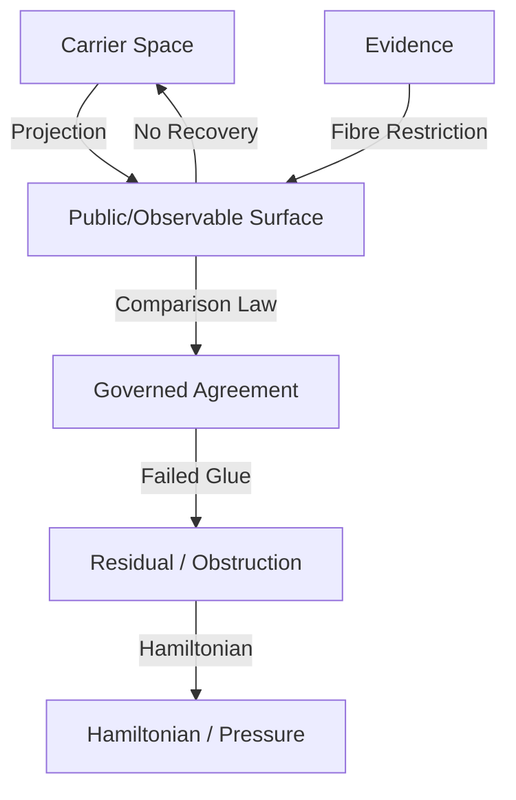

# Comparison, Restriction, and Contact Geometry

This document outlines the core mathematical and conceptual abstractions governing comparison, restriction, and contact geometry in DASHI, showing how they compress and unify existing core idioms.

## The Core Geometric Pipeline

Rather than treating a contact surface as primitive, DASHI models **governed interconnection** as a pipeline of projection, comparison, and restriction:

1. **Projection**: Private or high-dimensional carrier structures project into a common public surface.
2. **Comparison**: A comparison law governs admissible agreement/gluing on the public surface.
3. **Residual**: A typed obstruction (residual) records the mismatch when the projections fail to commute or glue.
4. **Fibre Restriction**: Evidence narrows the projected fibre on the public surface without recovering the hidden carrier.
5. **Hamiltonian / Pressure**: The residual mismatch is mapped to a scalar energy or pressure value.
6. **Gate / Receipt**: Promotion remains blocked until an external authority chain or gate closes.

---

## Architectural Invariants

To prevent mathematical promotion without external authority, the following invariants are strictly maintained:

> [!IMPORTANT]
> **Core Architectural Invariants**
> - **Contact never means recovery**: Establishing observable contact does not reconstruct the private carrier.
> - **Comparison never means truth**: Commutation or agreement under comparison is candidate-only/observational, not absolute truth.
> - **Evidence never means authority**: Restricting a fibre does not establish authority or promote a claim.
> - **Residual never means diagnosis**: Obstruction signals do not constitute clinical or systemic diagnoses.
> - **Hamiltonian never means promotion**: High pressure or low energy does not auto-promote a candidate package.
> - **Receipt determines what is actually allowed**: Promotion conditions, diagnostic limits, and authority boundaries are strictly determined by the specialized receipt type.

---

## Compression of Existing Core Idioms

The new geometric pipeline unifies and compresses several older DASHI core modules:

### 1. Lens Observation $\rightarrow$ Comparison Surface
- **Old Idiom**: [LensKernel](file:///home/c/Documents/code/dashi_agda/DASHI/Core/LensKernel.agda) observes a state space.
- **New Geometry**: Mapped as a projection onto a comparison surface where equality functions as the comparison law, and identity serves as the residual.

### 2. Fingerprint Projection $\rightarrow$ Fibre/Preimage Restriction Surface
- **Old Idiom**: [FingerprintProjectionCore](file:///home/c/Documents/code/dashi_agda/DASHI/Core/FingerprintProjectionCore.agda) checks digest matches.
- **New Geometry**: Restricts the preimage fibre of a projection. Knowing the fingerprint narrows the fibre, but does not recover the original object (anti-recovery).

### 3. Hidden-Lift Projection $\rightarrow$ Carrier/Public Contact Surface
- **Old Idiom**: [HiddenLiftProjectionCore](file:///home/c/Documents/code/dashi_agda/DASHI/Core/HiddenLiftProjectionCore.agda) handles private coordinates and public quotients.
- **New Geometry**: Instantiates observable contact geometry where private coordinates are the carrier, and public quotients are the shared comparison surface.

### 4. Statistical Evidence $\rightarrow$ Non-Promoting Fibre Restriction
- **Old Idiom**: [StatisticalEvidenceCore](file:///home/c/Documents/code/dashi_agda/DASHI/Core/StatisticalEvidenceCore.agda) models partial evidence.
- **New Geometry**: Framed as a fibre restriction that explicitly sets `promotesTruth = false`, blocking any claims to authority.

### 5. Authority Boundary $\rightarrow$ Contact Promotion Block
- **Old Idiom**: [AuthorityBoundary](file:///home/c/Documents/code/dashi_agda/DASHI/Core/AuthorityBoundary.agda) guards promotions.
- **New Geometry**: Functions as a closed contact gate where promotion is blocked by default (`authorityGateClosed = false`).

### 6. Bridge Requirement $\rightarrow$ Promotion Prerequisite
- **Old Idiom**: [BridgeRequirementCore](file:///home/c/Documents/code/dashi_agda/DASHI/Core/BridgeRequirementCore.agda) mandates consistency between domains.
- **New Geometry**: Modeled as a promotion prerequisite receipt that must be satisfied before candidate packages can advance.

---

## Realization: Residual Phase Geometry (Cognition)

The cognition-specific trace lane instantiates this general contact geometry:

- **Carrier**: `ResidualPhaseCarrier` (private state-space representation).
- **Observable / Trace**: `TraceEvent` (public split/transition sequences).
- **Residual**: `ResidualMismatch` (failure of contexts to glue).
- **Fibre Restriction**: Narrows candidate branch choices without reconstructing private lexemes.
- **Hamiltonian**: `TracePressure` tracking mismatch, instability, fixation, and drift.
- **Receipt**: `DyadicNonaryTraceReceipt` containing explicit authority blockers (numerology, clinician, prophecy, mythic certainty) to enforce the non-promotion boundary.
