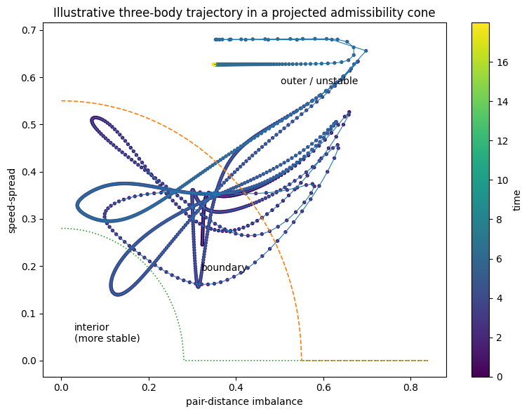
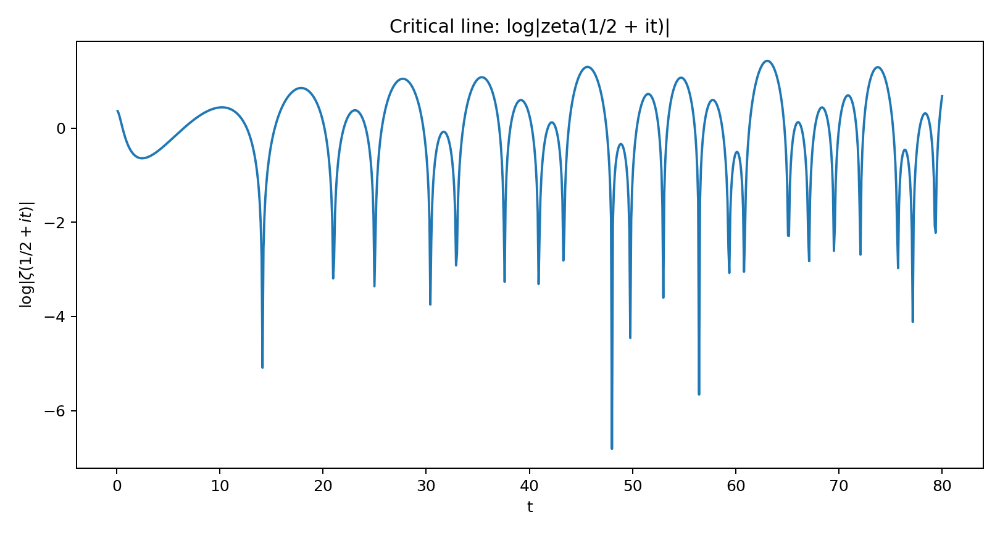
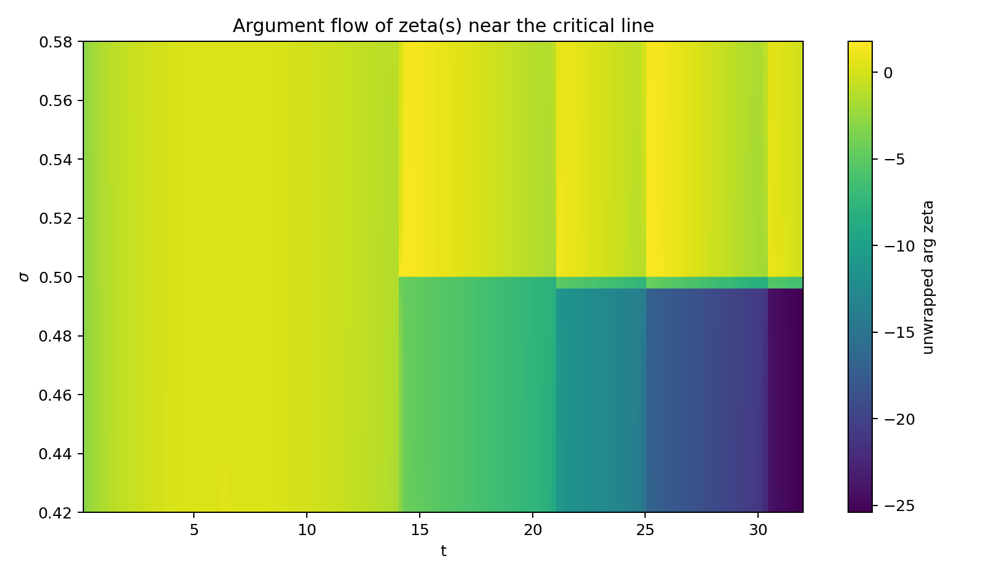
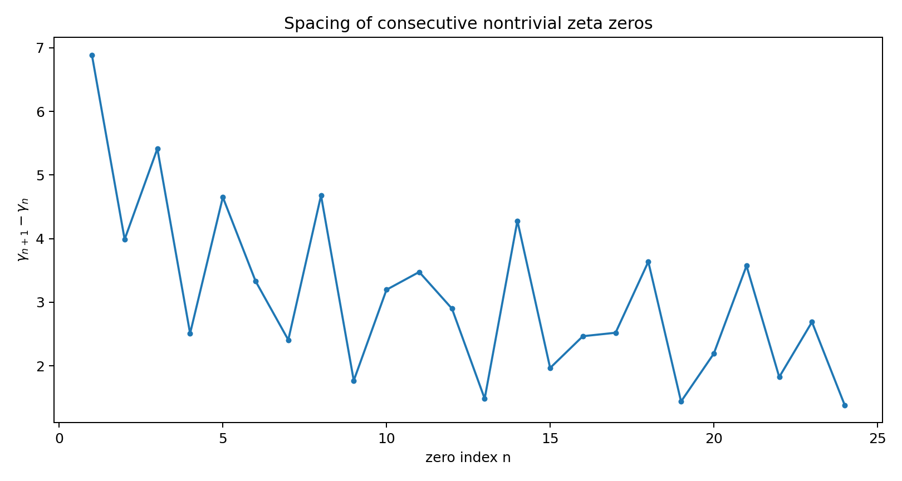
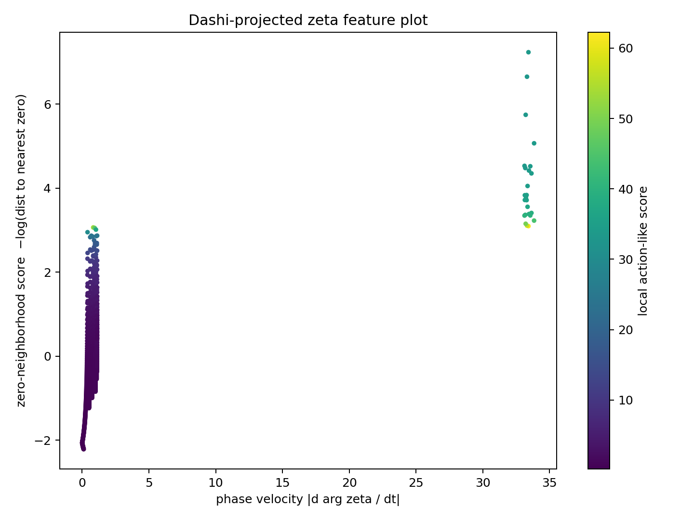

## Start Here

This repo is a formal-and-bridge workspace around the DASHI program.
For a new serious reader, the important split is:

- `proved`: the canonical Agda theorem spine and the specific closure claims it currently discharges
- `bridge`: documents and modules that connect the formal spine to physics-facing interpretations without claiming full derivation
- `packaging`: summary surfaces that assemble current lanes without strengthening theorems
- `empirical`: data-facing and measurement-facing surfaces that stay explicitly non-claiming
- `speculative`: roadmap or intuition surfaces that are not current repo claims

For the current "DASHI as simulator" orientation, start with
`Docs/roadmaps/SimulatorRoadmap.md`. It explains the checked unified facade, the
cross-scale matter ladder, and the first recommended quantitative slice:
composition vector -> bounded matter/force proxy carrier -> stability observable ->
receipt -> fail-closed Agda guard. This is a simulator scaffold and roadmap,
not a claim that the repo already derives arbitrary physics, chemistry,
biology, stellar, or clinical predictions.
For paper publication sequencing, start with
`Docs/papers/PublicationRoadmap.md`. It records the current three-paper core
and satellite order while preserving the non-promotion boundary for Clay,
unification, and externally reviewed claims.
The first executable slice is now present as
`scripts/run_stellar_composition_proxy_diagnostic.py` with the Agda guard
`DASHI.Unified.StellarCompositionProxyReceipt`; it remains proxy-only and
non-promoting.
The broader route/lane joining plan is `Docs/support/reference/UnifiedRoutesLanePlan.md`, which
extends the same receipt-gated architecture across physics, empirical,
biology, runtime, arithmetic, Gate 3, NS, and YM lanes.

Current Agda/PhysLean physics-library parity context:
the archived thread `Physics Library for Agda` was refreshed from ChatGPT URL
`https://chatgpt.com/c/6a2e6b6c-f4b0-83ec-b233-126757c70248` into canonical
archive thread `95d1157fa037ad3143960e629431b1d40439396c`. The implemented
repo response is a six-layer, fail-closed parity surface: linear
analysis/foundations, differential geometry, Lie/gauge theory, quantum/QFT,
GR/PDE, and theorem-ergonomics roadmap receipts. The checked modules are
`DASHI.Foundations.PhysicsLinearAnalysisParity`,
`DASHI.Geometry.DifferentialGeometryParity`,
`DASHI.Algebra.LieGaugeTheoryParity`,
`DASHI.Algebra.Quantum.QFTParitySurface`,
`DASHI.Physics.Closure.GRPDEParityBoundary`, and
`DASHI.Physics.Closure.AgdaPhysicsParityRoadmapReceipt`. They name reusable
interfaces and authority blockers; they do not claim PhysLean parity, imported
continuum theorem authority, Clay promotion, or terminal unification.
The current intake-strengthened versions also record the exact law-shape
payloads required by those sockets: scalar/vector/Hilbert/operator/spectral
and ODE shapes; manifold/chart/exterior-calculus theorem targets; Lie/gauge
Jacobi, curvature, YM, Wilson, BRST, and gauge-fixing shapes; QFT Hilbert,
CCR/CAR, Fock, OS, and Wightman rows; GR/PDE Koszul, curvature, Einstein,
weak-solution, and energy-estimate rows; and the canonical finite discrete-YM
spectral example receipt. These remain checked intake contracts, not imported
continuum proofs.
The proof-term-level pass now makes those rows more auditably exact: scalar
and vector law fields use the requested names, finite bases use `foldr2` plus
indexed lookup, DG records include the Christoffel transform and named Stokes
orientation slot, Lie/gauge records include SU(2)/SU(3) finite-Jacobi
authority rows plus gauge-naturality/BRST nilpotence payloads, QFT records the
exact Hilbert/Operator/CCR/CAR/OS/Wightman field surfaces, GR/PDE records the
Koszul/MTW/contracted-Bianchi/Einstein/SI-unit/weak-form payloads, and the
finite discrete-YM spectral example records its exact boolean pattern. The
continuum authority slots remain false or external.
The finite Base369 algebra pass adds an internal scalar/ring layer:
`DASHI.Foundations.Base369RingShape`,
`DASHI.Foundations.Base369Nat`,
`DASHI.Foundations.Base369TriTruthField`,
`DASHI.Foundations.Base369HexTruthRing`,
`DASHI.Foundations.Base369NonaryTruthRing`,
`DASHI.Foundations.Base369FiniteRingLaws`, and
`DASHI.Foundations.Base369FiniteRingRegression`, with
`DASHI.Foundations.Base369NumeralOntologyBoundary` as the role-separation
receipt. `Base369Nat` is a DASHI-namespaced builtin-only compatibility surface
for the tiny `%`/`NonZero` support that `Base369` needs; the repo does not
vendor or shadow `Data.Nat.Base`. `TriTruth` is recorded as the GF(3) field
carrier with additive and multiplicative inverse receipts; `HexTruth` and
`NonaryTruth` are recorded as rings with typed zero-divisor witnesses, not
fields. The ontology boundary separates algebraic carriers, 15-prime
coordinate boundaries, and UFT traversal addresses, and marks narrative
readings as non-promoting. This gives the linear-analysis scalar-law socket a
local finite algebra inhabitant without promoting real/complex completeness,
spectral theorem authority, physical calibration, or Clay claims.
The discrete-to-transcendental bridge is now recorded as a bounded formal
stack: `DASHI.Foundations.SurrealCompactification`,
`DASHI.Metric.AgreementSurrealGaugeBridge`,
`DASHI.Geometry.NatUltrametricCompletenessBridge`,
`DASHI.Algebra.StageQuotientIrreversibilityBoundary`, and
`DASHI.Physics.Closure.CRTMonsterFixedPointCompactificationBoundary`, all wired
through `DASHI.Everything`. These surfaces separate the checked finite content
from the extension story: finite trit towers, prefix/suffix agreement metrics,
Nat-valued ultrametric completeness, the stage-quotient irreversibility seam,
and the CRT/J fixed-point receipts are recorded locally. Surreal arithmetic,
the `agreeDepth -> 3^-n` gauge as an isometry, compactification error theorems,
Monster moonshine theorem authority, Carnot/thermodynamic promotion, and any
terminal Clay or physics claim remain fail-closed.

Current cross-lane scope-resolution boundary: `DASHI.Promotion.ObligationIndex`
now includes a six-row `scopeResolutionSummaries` layer. The checked surfaces
are `DASHI.Promotion.FiniteQuantumPhysicalScopeDecision`,
`DASHI.Promotion.GRBoundaryClarification`,
`DASHI.Promotion.BiologyFiniteScopeClarification`,
`DASHI.Promotion.ChemistryFiniteRuleTargets`,
`DASHI.Promotion.EmpiricalReplayAcceptanceCriteria` via
`canonicalEmpiricalReplayInfrastructureTokenSummary`, and
`DASHI.Physics.Closure.YMCompletionBoundaryTightening`. They resolve finite or
authority-bound scope decisions for quantum, GR, biology, chemistry,
empirical/runtime, and YM. They do not promote infinite-dimensional quantum
mechanics, non-flat GR, physical chemistry/wet-lab chemistry, biological
causation/clinical validity, empirical adequacy, YM Clay, NS Clay, or terminal
unification.

Current cross-lane hard-gate boundary: `DASHI.Promotion.ObligationIndex` also
includes a six-row `hardGateAdvancementSummaries` layer. The checked surfaces
are `DASHI.Physics.Closure.NSMigrationInitiationThresholdConstantsReceipt`,
`DASHI.Physics.Closure.YMExternalAcceptancePacketNormalization`,
`DASHI.Promotion.StandardModelFiniteRepresentationNarrowing`,
`DASHI.Promotion.MaxwellHodgeSourceConservationObligations`,
`DASHI.Promotion.NumericMeasuredAuthorityTokenNormalization`, and
`DASHI.Promotion.ChemistryAuthorityBinding`. These normalize the next proof or
authority gates for NS, YM, finite SM content, Maxwell, measured constants, and
chemistry. They do not promote NS Clay, YM Clay, broad Standard Model,
Maxwell field equations, measured numeric values, physical chemistry, or full
unification.

Current cross-lane closure-computation boundary: `DASHI.Promotion.ObligationIndex`
also includes a six-row `closureComputationSummaries` layer. The checked
surfaces are `DASHI.Physics.Closure.NSSprint150SourceViscosityBalanceReceipt`,
`DASHI.Promotion.ChemistryFiniteComputationSurface`,
`DASHI.Promotion.StandardModelFiniteAnomalyHyperchargeCheck`,
`DASHI.Promotion.MaxwellFiniteExteriorChainStrengthening`,
`DASHI.Promotion.NumericAuthorityPayloadValidator`, and
`DASHI.Promotion.FiniteQuantumQFTScopedClosure`. They add concrete finite or
ledger-checked work: NS source/viscosity balance decomposition, first-18
chemistry computations, finite SM hypercharge/anomaly checks, a 13-row Maxwell
exterior chain, a 20-field numeric authority payload validator, and finite-mode
Schrodinger/Born closure. They still do not promote NS Clay, physical chemistry
or wet-lab chemistry, broad Standard Model, Maxwell field equations, measured
numeric values, infinite-dimensional quantum/QFT, or terminal unification.

Current atomic-clock / SI-second empirical boundary:
`DASHI.Physics.Closure.AtomicClockSISecondCalibrationBridge`,
`DASHI.Promotion.Cs133NumericAuthorityPayloadRequest`,
`DASHI.Physics.Closure.QuantumClockSIObservableBridge`,
`DASHI.Physics.Closure.StoneSISecondTimeParameterBridge`, and
`DASHI.Promotion.RydbergClockMetreBridge` record the first narrow metrology
contact lane. They expose the SI time/frequency carrier shape, the exact
Cs-133 integer/text request, quantum-clock phase/visibility/squeezing
observable requirements, Gate 5 time-parameter requirements, and the
clock-to-metre route needed before Rydberg wavenumber use. The lane remains
fail-closed: no BIPM/NIST artifact is loaded, no authority token is locally
constructed, no numeric payload is promoted, and W4/Candidate256, Stone,
chemistry, spectroscopy, and terminal promotion remain false.
The follow-up SI-second adapter tranche adds
`DASHI.Physics.Closure.AtomicClockCandidate256DimensionAdapter`,
`DASHI.Promotion.SIDefiningConstantsAuthorityArtifactRequest`,
`DASHI.Promotion.PlanckHbarSIPayloadRequest`,
`DASHI.Physics.Closure.QuantumClockProperTimeRedshiftBridge`, and
`DASHI.Physics.Closure.AtomicClockW4ReceiptAdapterRequest`. These sharpen the
Candidate256 dimension-vector adapter, exact Cs/c/h artifact request rows,
derived `hbar` request, leading uniform-field atomic-clock redshift law, and
the W4 receipt field mapping. They remain request/adaptor surfaces only: the
constructorless Candidate256 authority token and external calibration receipt
are still not inhabited.
The third SI-second/metrology tranche adds
`DASHI.Promotion.SIExactConstantParsedCarrierRequest`,
`DASHI.Physics.Closure.AtomicClockSecondRealTimeTopologyRequest`,
`DASHI.Physics.Closure.QuantumClockDimensionlessObservableLaw`,
`DASHI.Promotion.SIMetreFromSecondAndCAdapter`, and
`DASHI.Physics.Closure.W4AtomicClockCandidateReceiptChecklist`. These record
structural parsed carriers for exact SI constants, the Real-time topology
request needed for Stone strong continuity, local dimensionless checks for
clock phase and redshift observables, the metre-from-second-and-`c` route for
Rydberg use, and a W4/Candidate256 external receipt checklist. They still do
not load artifacts, accept SHA256/access-date evidence, construct authority
tokens, promote numeric payloads, or claim empirical clock/redshift adequacy.

Current Standard Model first-principles boundary:
`DASHI.Promotion.ObligationIndex` now includes a nine-row
`smFirstPrinciplesBoundarySummaries` layer. The checked surfaces are
`DASHI.Promotion.StandardModelFirstPrinciplesGapIndex`,
`DASHI.Promotion.StandardModelUniquenessCountermodelBoundary`,
`DASHI.Promotion.StandardModelHiggsYukawaParameterFrontier`,
`DASHI.Promotion.StandardModelGaugeCouplingAuthorityFrontier`,
`DASHI.Promotion.StandardModelObservableAuthorityBridge`,
`DASHI.Promotion.StandardModelArchiveContextBinding`, and
`DASHI.Promotion.StandardModelPrototypeSourceIntake`, plus
`DASHI.Promotion.StandardModelHiggsHEPDataReceiptAdapter` and
`DASHI.Promotion.StandardModelHiggsCovariantComparisonLaw`. They preserve the
positive finite SM content and anomaly/hypercharge checks while making the
broad first-principles gap typed: uniqueness, generation count, Higgs/Yukawa,
CKM/PMNS, gauge couplings/running, QFT observables, empirical authority, and
archive/prototype/HEPData context all remain non-promoting boundaries. The
Higgs/HEPData adapter emits checksum-bound JSON receipts from `dashiQ/13tev.py`
and `dashiQ/pseudo_data_harness.py`; the covariant comparison adapter then
computes four fixture-baseline Higgs rows with positive-definite covariance
checks and `(d - m)^T Sigma^-1 (d - m)`. Fixture baseline authority, raw
provider vector binding, authority token, holdout, empirical validation, and
SM promotion remain false.

Downloaded new-additions context boundary:
`DASHI.Promotion.DownloadedNewAdditionsReferenceIndex` records the 36 local
files under `temp-DOWNLOADED/new additions` as checksum-bound context only.
The executable surfaces `scripts/downloaded_new_additions_manifest.py`,
`scripts/downloaded_ym_hodge_artifact_summary.py`, and
`scripts/downloaded_pdf_context_probe.py` emit manifests under `outputs/`.
They are useful for Hodge/Maxwell/YM/string/quantum lane routing, especially
the finite SFGC Hodge-star/current/variation/IBP target and the downloaded
YM Sprint 82/93 WC3 arithmetic, but they do not promote theorem authority,
empirical authority, YM Clay, Maxwell field equations, or terminal unification.

Current unification critical path:
`DASHI.Promotion.UnificationCriticalPathReceipt` consumes the checked
contraction/quadratic/signature spine, `DefectQuadraticClosureDependencyIndex`,
`DASHI.Physics.Closure.DefectQuadraticParallelogramCriticalSeam`,
`HodgeVariationPairingDepth9`,
`DASHI.Physics.Closure.YMStrictSelectedHodgeVariationPairing`,
`DASHI.Physics.Closure.YMStrictSelectedHodgeAlgebraLaws`,
`DASHI.Physics.Closure.YMStrictSelectedBoundaryCancellationCriterion`,
`DASHI.Physics.Closure.YMStrictSelectedNonzeroActionVariation`,
`DASHI.Physics.Closure.YMStrictSelectedSourceCurrentCoupling`,
`DASHI.Physics.Closure.YMFiniteSelectedPairingToRealCarrierBoundary`,
`DASHI.Physics.Closure.YMStrictSelectedMatterCurrentAuthorityBridge`,
`DASHI.Physics.Closure.YMMatterCurrentConservationAuthorityBoundary`,
`DASHI.Physics.Closure.YMRealSourcedDStarFEquationBoundary`,
`DASHI.Physics.Closure.YMConditionalMatterAuthorityToRealDStarF`,
`DASHI.Physics.Closure.YMSourcedEquationToHamiltonianQuotientBoundary`,
`DASHI.Physics.Closure.YMSelfAdjointHamiltonianQuotientRequirementNormalizer`,
`DASHI.Physics.Closure.DefectCriticalSeamIdentityDynamicsInstance`,
`DASHI.Physics.Closure.DefectCriticalSeamIdentityQuotientHierarchy`,
`DASHI.Physics.Closure.DefectCriticalSeamConcreteShiftReducer`,
`DASHI.Physics.Closure.DefectCriticalSeamIdentityCompositeReceipt`,
`DASHI.Physics.Closure.DefectCriticalSeamGeneralizationObstruction`,
`DASHI.Physics.Closure.UnificationNextAnalyticCalculationIndex`,
`YMStrictHodgeVariationBlockerIndex`, the SM/Higgs covariant comparison law,
finite chemistry computation, finite quantum scope, known-input population, and
downloaded context intake. The key correction is that finite Hodge/current
support is already present: Route-B and pure zero-current `D * F = J` are
checked, and the strict selected finite variation/IBP instance over the
user-supplied variation/action carriers is now checked. The strict selected
finite package now also includes selected Hodge algebra laws, zero-boundary
IBP reduction, a nonzero finite action split, selected source-current carrier
coupling, matter-current authority boundary, real sourced `D * F = J`
wrappers, a conditional real `D * F = J` target, and the Hamiltonian quotient
dependency/requirement normalizer naming
`missingSelfAdjointYangMillsHamiltonianOnCarrierQuotient`. The defect seam now
also has checked identity dynamics, identity quotient/hierarchy premises, a
concrete m=4 shift reducer, a composite receipt, and an obstruction matrix for
generalization beyond identity. The next analytic calculation index names the
six live calculations: matter-current coupling, real `D * F = J`,
self-adjoint YM Hamiltonian quotient, broad defect seam, Higgs authority
replacement, and metrology authority binding. The broader
`missingDefectAdmissibilityHierarchyToParallelogram` theorem, physical matter
authority, real `D * F = J`, empirical authority, measured metrology, continuum
physics, and terminal promotion remain false.

Current NS kappa-bias transfer boundary:
`DASHI.Physics.Closure.NSTransferOperatorBiasNeutralityBoundary` records the
conditional finite-statistical NS-F7 receipt.  Under arcsine transfer output
and lambda/kappa independence at residual scale, it records
`|Bias(mu_r)| <= delta_r * sqrt(11/60)`.  This collapses the
`NSTypeIBlowupKappaBiasBound` route to the actual analytic first rung:
constructing CKN-scale Abel triadic defect measures and proving approximate
`T_NS` stationarity for Type-I or ancient blowup rescalings.  The helper
`scripts/ns_transfer_operator_bias_neutrality_harness.py` tests the neutral
independent baseline and a correlated counterexample.  The receipt and harness
do not prove PDE stationarity, Type-I regularity, residual depletion, NS Clay,
or terminal unification.

Current NS Abel/stationarity analytic rung:
`DASHI.Physics.Closure.NSAbelTriadicStationarityConstructionBoundary` records
the live A1-A4 proof obligations: bounded Abel triadic mass, true Leray
triadic observable recording, approximate `T_NS` stationarity with
`delta_r -> 0`, and Lei-Ren-Tian output-support transfer.  The paired
diagnostic `scripts/ns_abel_triadic_stationarity_proxy_harness.py` and receipt
`DASHI.Physics.Closure.NSAbelTriadicStationarityProxyHarnessResult` exercise a
finite synthetic bounded-mass/stationarity/bias-bound proxy only.  They do not
construct a CKN-scale PDE defect measure, prove quantitative stationarity,
prove the kappa-bias bound for actual Type-I/ancient rescalings, prove the
compensated leakage identity, or promote Clay NS.
The split analytic frontier now has separate checked boundary receipts:
`DASHI.Physics.Closure.NSBoundedAbelMassEstimateBoundary` for the A1
Type-I / `L^{3,infty}` -> LP shell mass -> Abel finite-variation target,
`DASHI.Physics.Closure.NSQuantitativeStationarityRateBoundary` for the A3.3
`W_r = U_r - U_infty` energy-ODE / Seregin-ESS rate target,
`DASHI.Physics.Closure.NSTriadicShellBernsteinHolderBoundary` for the A2
tight shell estimate, and
`DASHI.Physics.Closure.NSLeiRenTianOutputSupportTransferBoundary` for the A4
physical-to-Fourier output-support coupling target.  The local diagnostic
`DASHI.Physics.Closure.NSLeiRenTianFourierOutputCouplingBoundary` now sharpens
that A4 target into the explicit Whitney/frame coupling contract: physical
angular measure, localized frame packets, Fourier output pushforward,
Whitney-overlap inequality, no-angular-collapse transfer, and scale/window
compatibility.  The paired
`scripts/ns_lrt_fourier_output_coupling_proxy_harness.py` is manifest-routed
as a diagnostic split only; it does not prove A4 or Clay NS.
The A4 contract is now split into checked child receipts:
`DASHI.Physics.Closure.NSPhysicalAngularMeasureConstructionBoundary`,
`DASHI.Physics.Closure.NSLocalizedWhitneyFramePacketEstimateBoundary`,
`DASHI.Physics.Closure.NSFourierOutputPushforwardBoundary`, and
`DASHI.Physics.Closure.NSWhitneyCouplingInequalityBoundary`.  These name the
remaining physical angular measure, Whitney packet, Fourier pushforward, and
Whitney coupling/Sard-Fubini obligations; they do not prove the coupling
theorem, A4, A6, NS Clay, or terminal promotion.
The Sard/Fubini residual is now further split by
`DASHI.Physics.Closure.NSAntipodalTubeNullMassBoundary`,
`DASHI.Physics.Closure.NSSardRegularValueSlicingBoundary`,
`DASHI.Physics.Closure.NSWhitneyFubiniDisintegrationBoundary`, and
`DASHI.Physics.Closure.NSPhiJacobianLowerBoundBoundary`, covering antipodal
tube discard, regular-value slicing, Whitney/Fubini packet disintegration,
and off-antipodal Jacobian control.  These are proof contracts only.
`DASHI.Physics.Closure.NSA4SardFubiniCompositeBoundary` now reconnects those
four child receipts to the A4 Whitney coupling consumer.  The next local A4
transfer blockers are recorded by
`DASHI.Physics.Closure.NSOutputGreatCircleStripSlicingBoundary`,
`DASHI.Physics.Closure.NSBonyLipschitzAngularPushforwardBoundary`, and
`DASHI.Physics.Closure.NSLowVorticityExceptionalMassRoutingBoundary`.
The direct A4 transfer composition is now also checked through
`DASHI.Physics.Closure.NSOutputStripPreimageMeasureEstimateBoundary`,
`DASHI.Physics.Closure.NSA4ExceptionalMassCompositeBoundary`, and
`DASHI.Physics.Closure.NSA4NoAngularCollapseTransferCompositeBoundary`.
These normalize the output great-circle strip preimage estimate, the
log-window exceptional-mass budget, and the physical-measure to output
no-angular-collapse consumer.  They still do not prove the analytic
coarea/Jacobian/Fubini estimates, A4, A6, NS Clay, or terminal promotion.
`DASHI.Physics.Closure.NSA4CoareaStripPreimageCalculationBoundary`,
`DASHI.Physics.Closure.NSA4GradientFormulaLocalChartBoundary`,
`DASHI.Physics.Closure.NSA4UniformInNormalConstantsBoundary`,
`DASHI.Physics.Closure.NSA4DerivativeJacobianLowerBoundCompositeBoundary`,
`DASHI.Physics.Closure.NSA4EtaStripCoareaSlabEstimateBoundary`,
`DASHI.Physics.Closure.NSA4UniformErrorBudgetCompositeBoundary`,
`DASHI.Physics.Closure.NSA4ResidualPositiveAfterErrorsBoundary`, and
`DASHI.Physics.Closure.NSA4ToA6TransferLadderBoundary`, plus
`DASHI.Physics.Closure.NSA4ResidualPositiveTheoremLadderBoundary`, now
isolate the exact coarea scalar calculation, local-chart gradient formula,
derivative/Jacobian lower-bound composite, eta-strip coarea slab estimate,
uniform-in-normal constants, the `c eta` minus exceptional-error budget,
residual positivity for `r < r0(eta,R,M)`, and the A4 -> A5 -> A6 -> A7
dependency ladder.
These make the next analytic calculation explicit without promoting A4, A6,
residual depletion, or Clay NS.
The local diagnostic
`scripts/ns_bounded_abel_mass_proxy_harness.py` separates bounded proxy
profiles from a deliberately bad mass-growth profile, while
`scripts/ns_stationarity_rate_proxy_harness.py` simulates log-rate
stationarity decay and a nondecaying counterprofile.  The receipt
`DASHI.Physics.Closure.NSQuantitativeStationarityRateProxyHarnessResult`
binds the latter harness to Agda.  The hard A6 transfer split is now recorded
in `DASHI.Physics.Closure.NSPointwiseToAbelAveragingBoundary`: replace
localized pointwise `omega . S omega` by the Abel/shell mean with diagonal,
off-diagonal, localization, pressure, and mixing errors controlled.  The A6
child blockers are now split into
`DASHI.Physics.Closure.NSDiagonalStretchingToAbelMeanBoundary`,
`DASHI.Physics.Closure.NSOffDiagonalShellAbsorptionBoundary`, and
`DASHI.Physics.Closure.NSAbelShellMixingLLNBoundary`, covering diagonal
identification, non-diagonal absorption, and Abel-window LLN/mixing.  The
fourth child,
`DASHI.Physics.Closure.NSLocalizationPressureCommutatorBoundary`, records
localized cutoff, Leray pressure reconstruction, commutator, boundary annulus,
and pressure-tail controls.  `DASHI.Physics.Closure.NSPointwiseToAbelCompositeA6Boundary`
ties the four child blockers back to the parent A6 boundary, and
`DASHI.Physics.Closure.NSPointwiseToAbelAveragingProxyHarnessResult` binds the
existing proxy harness to Agda.  The diagnostics
`scripts/ns_pointwise_to_abel_averaging_proxy_harness.py` and
`scripts/ns_localization_pressure_commutator_proxy_harness.py` are routed
through the manifest and reject deliberately bad correlated or persistent-tail
profiles.  `DASHI.Physics.Closure.NSA6ErrorBudgetCompositeBoundary` now
collects those child blockers into a seven-line budget: diagonal residual,
off-diagonal absorption, Abel LLN variance, localization cutoff, pressure
commutator, pressure tail, and Abel tail/recentering.  The diagnostic
`scripts/ns_a6_error_budget_proxy_harness.py` is routed through the manifest
as a synthetic aggregate-budget separator only.
`DASHI.Physics.Closure.NSPressureCommutatorEstimateContractBoundary` now
sharpens the pressure/localization child into an explicit theorem contract for
`[P_j, phi] R_i R_l`, local Calderon-Zygmund pressure, harmonic pressure tail,
annular cutoff, epsilon-gradient absorption, and lower-order residual routing.
`scripts/ns_pressure_tail_absorption_proxy_harness.py` is routed through the
manifest and
`DASHI.Physics.Closure.NSPressureTailAbsorptionProxyHarnessResult` records the
diagnostic split between compact/Schwartz/localized good profiles and
harmonic-tail / annular-plateau / nonabsorbed-gradient bad profiles.
`scripts/ns_cutoff_riesz_commutator_kernel_proxy_harness.py` and
`DASHI.Physics.Closure.NSCutoffRieszCommutatorKernelProxyHarnessResult` now
record the finite `[P_j, phi] R_i R_l` kernel diagnostic: smooth compact,
separated-annulus, and shell-recentered good profiles are separated from rough
cutoff, no-cancellation, and touching-core bad profiles.
`DASHI.Physics.Closure.NSHarmonicPressureTailAbsorptionEstimateBoundary` and
`scripts/ns_harmonic_pressure_tail_decay_proxy_harness.py` record the harmonic
tail contract and matching mean-subtraction / annular-separation /
moment-cancellation diagnostic.  They are not pressure-tail or localization
theorems.
`DASHI.Physics.Closure.NSPressureLocalizationSubBudgetCompositeBoundary` now
collects those pressure/localization children into one sub-budget composite:
cutoff/Riesz commutator, local Calderon-Zygmund core, harmonic tail,
pressure-tail proxy, annular cutoff, epsilon-gradient absorption, and Abel
recentering/lower-order routing.  The paired
`scripts/ns_pressure_localization_subbudget_proxy_harness.py` and
`DASHI.Physics.Closure.NSPressureLocalizationSubBudgetProxyHarnessResult`
record a synthetic aggregate diagnostic only.
`scripts/ns_pressure_subbudget_component_sensitivity_harness.py` and
`DASHI.Physics.Closure.NSPressureSubBudgetComponentSensitivityProxyHarnessResult`
now sweep those seven pressure/localization components one at a time.  This is
manifest-routed diagnostic bookkeeping only; it does not prove component
sensitivity, pressure localization, A6, residual depletion, or NS Clay.
`DASHI.Physics.Closure.NSBiotSavartShellLocalizationBoundary` now isolates the
remaining A6.2 Biot-Savart shell localization theorem contract: same-shell
strain multiplier ownership, off-shell leakage decay, Calderon-Zygmund kernel
control, Type-I `L^{3,inf}` dependence, and diagonal-to-Abel compatibility.
The paired `scripts/ns_biot_savart_shell_localization_proxy_harness.py` and
`DASHI.Physics.Closure.NSBiotSavartShellLocalizationProxyHarnessResult`
separate same-shell/Abel-localized good profiles from separated-tail and
nonlocal-plateau bad profiles.  They are diagnostic only; the CZ estimate,
A6, residual depletion, and NS Clay remain unproved.
`DASHI.Physics.Closure.NSBonyParaproductA6RepairBoundary` records the repaired
A6.2 route after the naive whole-strain same-shell localization target fails:
low-frequency Bony paraproduct ownership, finite near-diagonal resonant
shells, high-frequency subleading tail, and corrected Abel-window error
routing.  The paired `scripts/ns_bony_paraproduct_a6_repair_proxy_harness.py`
is manifest-routed and diagnostic only; no paraproduct theorem, A6 theorem, or
residual depletion is promoted.
`DASHI.Physics.Closure.NSA6TheoremLadderBoundary` records the child-estimate
to CKN/BKM ladder.  All of these are proxy or boundary surfaces and keep
promotion false.  The next NS analytic proof to calculate is now the A4
Whitney/frame physical-to-Fourier output-support coupling, while the corrected
A6.2 Bony split is the current route for the localization side of the triadic
compensated leakage identity / pointwise-to-Abel averaging theorem.

Current YM and unification first-rung hardening:
`DASHI.Physics.Closure.YMFiniteGaugeQuotientHamiltonianPreconditionBoundary`
records the finite gauge quotient, self-adjoint Hamiltonian, holonomy/action
split, and Hamiltonian-domination preconditions downstream of the admissible
BT boundary convention.  `DASHI.Physics.Closure.YMSelfAdjointFiniteHamiltonianBoundary`
now isolates the finite YM self-adjointness target itself: finite domain,
symmetric form, gauge quotient descent, self-adjoint finite operator, and
discrete spectrum.  The local diagnostic
`scripts/ym_finite_selfadjoint_hamiltonian_proxy_harness.py` checks a
symmetric quotient-stable matrix against bad nonsymmetric and domain-unstable
cases, and
`DASHI.Physics.Closure.YMFiniteSelfAdjointHamiltonianProxyHarnessResult` binds
that diagnostic to Agda.  The additional diagnostic
`scripts/ym_hamiltonian_domination_proxy_harness.py` tests finite quotient
matrix margins for `H >= c1 Delta + c2 Hol - E` against weak-H and
near-zero-sector counterprofiles, with
`DASHI.Physics.Closure.YMHamiltonianDominationProxyHarnessResult` and
`DASHI.Physics.Closure.YMHamiltonianDominationCompositeBoundary` recording the
diagnostic and dependency chain.
`DASHI.Physics.Closure.YMHamiltonianDominationErrorBudgetBoundary` records the
finite self-adjoint, quotient-domain, holonomy/action, negative `E_d`,
spectral-margin, reflection-positive, and OS/continuum residual budgets while
leaving domination and transfer theorems open.
`scripts/ym_domination_spectral_margin_proxy_harness.py` is the current
finite symmetric-matrix margin diagnostic for that budget: dominated quotient,
holonomy-controlled, and stable-`E_d` good cases are checked against weak
kinetic, missing-holonomy, and near-zero pollution bad cases.
`DASHI.Physics.Closure.YMDominationSpectralMarginProxyHarnessResult` binds
that diagnostic to Agda, and
`DASHI.Physics.Closure.YMSpectralMarginErrorBudgetCompositeBoundary` now
imports it into the spectral-margin -> domination -> OS/continuum
error-budget chain.  These are not YM Hamiltonian-domination, OS transfer, or
mass-gap theorems.
`scripts/ym_spectral_margin_boundary_sensitivity_harness.py` and
`DASHI.Physics.Closure.YMSpectralMarginBoundarySensitivityProxyHarnessResult`
now sweep kinetic, holonomy, `E_d`, and pollution margins around that finite
proxy.  This is still a diagnostic receipt only; spectral-margin stability,
Hamiltonian domination, OS/continuum transfer, and YM Clay remain unproved.
`DASHI.Physics.Closure.YMKillingBoundarySelfAdjointnessDomainContract` now
records the first YM domain theorem contract after boundary sensitivity:
full-degree/Killing boundary convention, finite BT cell domain closure,
boundary flux cancellation, gauge-domain invariance, quotient descent, and
finite self-adjointness.  The paired
`scripts/ym_killing_boundary_self_adjointness_proxy_harness.py` checks a
finite diagnostic split for symmetry defect, gauge-null leakage,
nonorthogonal projection, induced collapse, and spectral margin.  This does
not prove Hamiltonian domination, OS transfer, continuum mass gap, or YM Clay.
`DASHI.Physics.Closure.YMKillingBoundarySelfAdjointnessProxyHarnessResult`
binds that diagnostic into Agda while keeping YM-1, domination, OS/continuum
transfer, no spectral pollution, and YM Clay false.
`DASHI.Physics.Closure.YMKillingBoundaryFluxCancellationBoundary` now records
the YM-1 child obligation for finite BT Killing/full-degree boundary flux
cancellation, opposing face pairing, gauge-domain preservation, induced-ball
collapse exclusion, and self-adjointness routing.  It does not prove YM-1.
`DASHI.Physics.Closure.YMKillingBoundaryOppositeFaceInvolutionBoundary` splits
out the finite BT opposite-face involution, Killing weight preservation,
orientation cancellation, and gauge compatibility prerequisites behind that
flux-cancellation route.
`DASHI.Physics.Closure.YMKillingBoundaryWeightPreservationBoundary` isolates
the full-degree/Killing weight equality target under the opposite-face
involution before the flux-cancellation proof can close.
`DASHI.Physics.Closure.YMKillingBoundaryOrientationCancellationBoundary` and
`DASHI.Physics.Closure.YMKillingBoundaryGaugeDomainPreservationBoundary` now
split the remaining YM-1 finite-boundary domain route into orientation-normal
flux cancellation and gauge-domain/quotient preservation.  Finite
self-adjointness, Hamiltonian domination, OS/continuum transfer, YM Clay, and
terminal promotion remain false.
`DASHI.Physics.Closure.YMKillingBoundarySelfAdjointnessCompositeBoundary`
now composes those YM-1 child routes into the finite self-adjointness
boundary, and
`DASHI.Physics.Closure.YMFiniteGaugeQuotientSelfAdjointHamiltonianCompositeBoundary`
records the finite gauge-quotient Hamiltonian self-adjointness target.
`DASHI.Physics.Closure.YMFiniteGaugeQuotientCarrierConstructionBoundary`
records the finite gauge action/orbit carrier, invariant quotient pairing,
Killing-domain descent, and Hamiltonian equivariance preconditions before
that self-adjoint quotient target can promote.
`DASHI.Physics.Closure.YMBochnerWeitzenbockHamiltonianDominationBoundary`
records the YM-5 Bochner-Weitzenbock domination route over that composite.
`DASHI.Physics.Closure.YMUniformPositiveHolonomyActionBoundary` records the
uniform positive holonomy/Wilson-action lower-bound obligation, while
`DASHI.Physics.Closure.YMHolonomyActionToDominationCompositeBoundary` records
the holonomy-to-domination handoff and spectral-margin preconditions.  These
remain fail-closed theorem contracts.
`DASHI.Physics.Closure.GluingOperatorLinearityOnDefectQuotientBoundary`
records the U-1a quotient-linearity blocker before four-point cancellation.
The diagnostic `scripts/gluing_operator_linearity_proxy_harness.py` checks a
finite quotient-linear proxy and a nonlinear counterexample, and
`DASHI.Physics.Closure.GluingOperatorLinearityProxyHarnessResult` binds that
diagnostic to Agda.  `DASHI.Physics.Closure.UnificationGluingLinearityCompositeBoundary`
now records the quotient-linearity -> four-point cancellation -> parallelogram
-> quadratic emergence chain.  The additional diagnostic
`scripts/unification_gluing_quotient_admissibility_proxy_harness.py` is routed
through the manifest and separates a representative-invariant linear quotient
case from representative-leak, nonlinear, and norm-like near-miss bad cases.
`DASHI.Physics.Closure.UnificationGluingQuotientAdmissibilityProxyHarnessResult`
now binds that diagnostic to Agda.
`scripts/unification_quotient_four_point_stress_harness.py` is routed through
the manifest as an additional finite stress diagnostic for representative
shifts, nonlinear quotient gluing, p-norm near misses, and asymmetric
cross-terms against a quadratic quotient good case.
`DASHI.Physics.Closure.UnificationGluingCrossTermNullClassBoundary` now
isolates the next U-1a sub-obligation: the cross-term
`G(s1+s2)-G(s1)-G(s2)` must lie in the null class of the admissible defect
quotient before gluing linearity can feed four-point cancellation.
`DASHI.Physics.Closure.UnificationCrossTermToFourPointCompositeBoundary` now
composes that sub-obligation into the quotient-linearity -> four-point
cancellation -> parallelogram -> quadratic-emergence dependency chain without
promoting any theorem.
`DASHI.Physics.Closure.UnificationGluingCrossTermLinearityLiftBoundary` now
records the lift from cross-term-null vocabulary toward modulo-null quotient
linearity and the downstream four-point cancellation dependency; true
linearity, four-point cancellation, parallelogram, and quadratic emergence
remain open.
`DASHI.Physics.Closure.UnificationNullClassStabilityBoundary` records the
null-class operation and gluing-stability prerequisites needed to transport
cross-term nullity into modulo-null quotient linearity.
`DASHI.Physics.Closure.UnificationNullToQuotientEqualityTransportBoundary`
records the next transport surface from null cross-term evidence to quotient
equality and modulo-null gluing linearity.
`DASHI.Physics.Closure.UnificationGluingModuloNullLinearityCompositeBoundary`
now composes null-class stability, null-to-quotient transport, and
cross-term-linearity lift into a single modulo-null gluing-linearity route.
`DASHI.Physics.Closure.UnificationCrossTermNullityTheoremBoundary` now
records the actual U-1a theorem target that
`G(s1+s2)-G(s1)-G(s2)` lies in the admissible null class.
`DASHI.Physics.Closure.UnificationFourPointCancellationFromCrossTermNullityBoundary`
records the downstream route from that nullity target to four-point
cancellation through additive test functionals and quotient representative
invariance.
`DASHI.Physics.Closure.UnificationModuloNullLinearityFromCrossTermNullityBoundary`
now records the composite ladder from cross-term nullity through modulo-null
linearity to the same four-point cancellation consumer.
These are fail-closed boundary/diagnostic receipts; YM Clay, terminal
unification, and all promotion flags remain false.

Current finite projection/nonlocality spectral tranche:
`DASHI.Physics.Closure.NSDefectLaplacianRankOneSpectrum`,
`DASHI.Physics.Closure.NSMonodromyIntegralBoundFinite`,
`DASHI.Physics.Closure.YMBTMetricRatioDefectGapFinite`,
`DASHI.Physics.Closure.YMStrictSelectedHodgeVariationToyPairing`,
`DASHI.Physics.Closure.NSThreeCaseDefectResidualExhaustionFinite`, and
`DASHI.Physics.Closure.UniformProjectionNonlocalityGapFinite` are imported
through `DASHI.Everything`. They check the finite arithmetic frontier behind
the projection/nonlocality program: NS rank-one defect Laplacian samples
`0,3,4,3,0` over denominator `16`, a four-point monodromy average `1/2`,
finite YM/BT `kappa_p = (p - 1)^2 / p^2` for `p = 2,3,5`, a non-vacuous toy
selected-Hodge variation pairing, a finite NS three-case residual table, and a
finite uniform projection/nonlocality receipt. These are finite surfaces only:
semiclassical concentration, topological stretching leakage, pressure
commutator gain, real selected Hodge variation, BT finite Hodge theorem,
continuum mass gap, Clay/YM/NS promotion, semantic unification, and terminal
promotion remain false/open.

Current defect-Laplacian zero-mode boundary: the repo records the shared P0
object `Delta_{Pi,N} = Pi N^dagger (1-Pi) N Pi` in
`DASHI.Physics.Closure.ProjectionNonlocalityDefectLaplacianZeroModeSheaf`.
For NS, the older single-output-angle split in
`DASHI.Physics.Closure.NSZeroModeSetClassificationBoundary` records
`Z_NS = Z_rad union Z_tan` as a historical/fail-closed support surface, but
the current corrected Clay-facing object is triadic.  The checked boundaries
`DASHI.Physics.Closure.NSTrueLerayTriadicDefectSymbol`,
`DASHI.Physics.Closure.NSCascadeClosedZeroModeOutputWidthBoundary`,
`DASHI.Physics.Closure.NSTriadicAngularDefectSheafLeakageBoundary`, and
`DASHI.Physics.Closure.NSTriadicLeakageSquareFunctionCoercivityBoundary`
record the true non-averaged Leray bilinear interaction symbol, the
cascade-closed zero-mode output-width target, the Abel triadic interaction
defect sheaf with Lei-Ren-Tian output condition, and the corrected
square-function/coercivity transfer target.  Tao averaged-NS is recorded as a
falsifiability guard, and ordinary Calderon-Zygmund/Littlewood-Paley
boundedness is explicitly rejected as a source of strict depletion by itself.
The hardening receipts
`DASHI.Physics.Closure.NSTrueLerayTriadicZeroModeClassificationBoundary`,
`DASHI.Physics.Closure.NSAbelTriadicDefectMeasureConstructionBoundary`, and
`DASHI.Physics.Closure.NSTriadicCompensatedLeakageIdentityBoundary` now split
the current NS P0 into the finite symbolic gate
`CascadeClosedZeroModeOutputWidth` and the analytic signed-transfer gate
`TriadicCompensatedLeakageIdentity`.  The next analytic proof to calculate is
not an improved generic multiplier norm; it is the compensated leakage
identity that makes
`int_R lambda_NS^triad d mu_r` enter the local pressure/stretching residual
with a negative square-function correction.
`DASHI.Physics.Closure.NSExactStrainEigenbundleHarnessBoundary` records the
2026-06-08 local exact finite-symbol diagnostic round.  The exact
Biot-Savart/Leray/strain bookkeeping in
`scripts/ns_exact_strain_eigenbundle.py` and
`scripts/ns_exact_strain_symbol_sanity_harness.py` checks as finite algebra,
but the current Family-I/II zero-mode residual is too permissive under that
exact finite-symbol model.  The extended
`scripts/ns_triadic_output_width_harness.py` reports `800/800` single-depth
zero hits and `800/800` depth-2 continuations under `--frame-model
exact-strain`; `scripts/ns_cascade_depth2_harness.py` reports `1000/1000`;
and `scripts/ns_exact_strain_width_comparison_harness.py` reports proxy `1`
zero hit versus exact `1200` zero hits in the capped A/B run.  This is a
falsification signal for the current `CascadeClosedZeroModeOutputWidth`
formulation, not evidence for Clay closure.  The next finite theorem target
must strengthen propagated polarization/coherence or replace the present
zero-mode-width condition before the analytic compensated-leakage proof can
close NS.  The next round added
`DASHI.Physics.Closure.NSSignAntisymmetryExactIdentityBoundary`, recording the
exact true-triad identity `(a . omega_c) + (b . omega_c) = 0`; this finite
identity is now the algebraic precondition for the repaired theorem target
`NSCascadeTransversalityCollapse` /
`PropagatedPolarizationCascadeClosedOutputWidth`.  Local harnesses
`scripts/ns_sign_antisymmetry_depth_sweep.py` and
`scripts/ns_propagated_coherence_jacobian_harness.py` currently show roundoff
sign-identity error, depth-wise propagated survivor decay, and sampled rank
growth `0,2,4,6` through depth 4.  These are diagnostic finite calculations
only; the output-width theorem, signed PDE leakage identity, residual
monotonicity, and Clay NS promotion remain false.
The angular S2 Biot-Savart/curl diagnostic adds
`scripts/ns_s2_biot_savart_eigenbundle.py`,
`scripts/ns_s2_cascade_width_harness.py`, and
`DASHI.Physics.Closure.NSS2BiotSavartEigenbundleCascadeDiagnosticBoundary`.
This is a distinct local formula lane: it uses the supplied `m11/m12`
angular eigenline and `omega_hat(c) = normalize (c x e_plus)`, with the
Cantarella-DeTurck-Gluck-Teytel Biot-Savart/curl eigenfield paper recorded
only as an external authority boundary.  The corrected lambda diagnostic is
non-tautological: in the capped 12000-triad run, lambda mean/median/p95 is
`0.06369 / 0.04150 / 0.19444`, strict threshold `0.01` depth-1 zeros are
`2966 / 12000`, random first-valid depth-2 survival is `932 / 2966`, and
best-of-120 existential survival is `2966 / 2966`.  The theorem target is
therefore sharpened to an analytic `CascadeDepth2DegreeComputation` /
transversality statement: finite sampling shows random filtering, but
existential continuations remain abundant under the sampled pool.
The corrected finite NS statistical package is now explicit as a five-result
finite/statistical normal form.  `DASHI.Physics.Closure.NSSignAntisymmetryExactIdentityBoundary`
records the exact true-triad sign antisymmetry
`(a . omega_c) + (b . omega_c) = 0`,
`DASHI.Physics.Closure.NSCascadeKappaArcsineLawBoundary` records the kappa
arcsine law rather than a uniform law,
`DASHI.Physics.Closure.NSCoherentStretchingExactFormulaBoundary` records
`omega . S omega = lambda(c)(2 kappa^2 - 1)`,
`DASHI.Physics.Closure.NSFiniteCascadeStretchingNeutralityBoundary` records
finite random-cascade stretching neutrality, and
`DASHI.Physics.Closure.NSBiotSavartStrainMeanSquareExactFormulaBoundary`
records `<lambda^2>_{S2} = 11/60` without identifying it with `<lambda>`.
The companion harnesses are `scripts/ns_kappa_arcsine_law_harness.py`,
`scripts/ns_stretching_formula_harness.py`,
`scripts/ns_strain_mean_square_formula_harness.py`, and
`scripts/ns_kappa_bias_variational_harness.py`.  The next proxy surface,
`scripts/ns_typeI_selfsimilar_kappa_bias_harness.py`, samples synthetic shell
profiles with diffusion, self-similar drift-slope, and triadic transfer
weights; its capped smoke run keeps neutral/depleted profiles mean-negative
after penalty while an intentionally forward-biased synthetic profile remains
positive.  Its role is diagnostic only.  These harnesses sharpen the
remaining PDE gate to `NSTypeIBlowupKappaBiasBound`: whether a Type-I or
self-similar NS blowup can produce persistent positive
`lambda(c)(kappa^2 - 1/2)` bias in its Abel triadic defect measure.  They do
not prove the Type-I bias bound, Abel triadic defect measure construction,
compensated leakage identity, local defect monotonicity, CKN/BKM closure, or
Clay NS.
The corrected Gaussian self-similar bookkeeping now fixes the next analytic
rung more sharply: multiplying the Leray self-similar vorticity equation by
`omega G`, with `G(y)=exp(-|y|^2/4)`, gives the recorded balance
`2 int |grad omega|^2 G - 1/2 int |omega|^2 G =
4 Bias_G Omega_G + Drift_G Omega_G`; the OU Poincare lower bound forces
`1 <= 4 Bias_G + Drift_G` for any nontrivial self-similar profile.  The
current variational harness indicates stationarity is the decisive proxy
constraint on kappa-bias, while LRT remains an angular-collapse guard.  The
next named gap is therefore `AbelTriadicDefectMeasureConstruction` at CKN
scales: proving blowup rescalings produce Abel triadic measures with the
approximate `T_NS`-stationarity required by `NSTypeIBlowupKappaBiasBound`.
`NSLeiRenTianGreatCircleCriterionBoundary`,
`NSLeiRenTianRadialZeroModeAuthorityBoundary`,
`NSGreatCircleZeroModeTrapExclusionBoundary`, and
the archived `NSZeroModeGreatCircleGeometryTheorem` record the Lei-Ren-Tian
2025 great-circle route as an external authority boundary plus fail-closed
geometry/trap obligations.  The archived single-angle geometry module is no
longer imported through `DASHI.Everything` until its historical
`Setomega`/canonical-equality style is ported.  `NSTangentialZeroModePressureStarvationBoundary`
keeps Buaria/Bodenschatz/Pumir as DNS evidence only.  For YM,
`YMGaugeZeroModeVacuumRigidityBoundary` names the finite gauge-compatible
zero-mode sheaf-rigidity target with holonomy classification, and
`YMHamiltonianDominatesFiniteHodgeDefectBoundary` names the strengthened
Hamiltonian domination target
`H_d | Omega^perp >= c Delta_YM,d + c' Hol_d - E_d`.
`DASHI.Physics.Closure.YMAdmissibleBTBoundaryConventionBoundary` now records
the boundary-convention precondition exposed by finite BT regressions:
induced-ball truncations can collapse the gap signal, while full-degree
conventions are the current admissible candidate for the route.  This is not a
mass-gap proof; it is a prerequisite for the Hamiltonian domination and OS
transfer gates.
`YMBruhatTitsToOSLatticeTransferBoundary` records external 2026
OS/mass-gap preprints as candidate authorities only; DASHI still has to prove
BT-to-Wilson action comparison, reflection positivity, clustering/DS
hypotheses, observable-class inclusion, the primary H3a transfer-matrix /
norm-resolvent convergence obligation on the vacuum-orthogonal sector, the
secondary H3b vacuum-projection continuity obligation against the
OS-reconstructed vacuum, and no spectral pollution as a consequence of those
stronger interfaces rather than of Mosco compactness alone.  Level-zero/cuspidal and
BT-building cohomology inputs are external-boundary rows only; YM
sheaf-rigidity, holonomy-action, self-adjoint quotient, OS, and continuum
transfer proofs remain open.  The core unification spine likewise remains
fail-closed:
`DASHI.Physics.Closure.GluingResidualForcesFourPointCancellationBoundary`
records that coarse hierarchy conditions do not force Hilbert structure.  The
next unification proof is a gluing/polarization residual theorem that kills
the four-point defect before parallelogram and quadratic-form consumers can
promote.
For core unification,
`DefectFourPointParallelogramLawBoundary` normalizes the exact four-point
identity target, and
`DefectSheafGluingFourPointParallelogramBoundary` records the sheafified
route from local defect sections and gluing residuals to
`HierarchyConsistencyKillsFourPointDefect`.  The 2026-06-08 sprint verification policy used
`timeout 10s agda ...`; these heavy modules timed out under that cap rather
than returning type errors, so longer targeted Agda checks are still required.
Microlocal defect mass, deterministic depletion, radial/tangential/wedge
exclusion as internal PDE proofs, YM Hamiltonian domination, continuum
transfer, Clay promotion, and terminal promotion remain false.

Current NS Sprint 158 boundary: the repo records
`SymmetricHouLuoRegularityClassClosure=true` and
`SymmetricAxisymmetricWithSwirlGlobalRegularity=true` for the scoped symmetric
Hou-Luo theorem. The checked receipt
`DASHI.Physics.Closure.NSSprint158SymmetricHouLuoRegularityClassClosureReceipt`
anchors to `DASHI.Physics.Closure.NSSprint157BKMIntegralContinuationReceipt`,
keeps `BKMIntegralEstimate=true`, `ContinuationTheoremBridge=true`, and
`SymmetricHouLuoBKMFinite=true`, and normalizes the theorem class: smooth
finite-energy `H^s`, `s >= 3`, axisymmetric-with-swirl data with
`z -> -z` symmetry and bounded Gamma/circulation input. The executable
surfaces `scripts/ns_sprint158_theorem_statement_closure.py`,
`scripts/ns_sprint158_assumption_scope_matrix.py`, and
`scripts/ns_sprint158_publication_packet_readiness.py` emit the theorem
statement, assumption/scope matrix, and publication-readiness packet for the
symmetric result. `MechanismExhaustionForFullClayNS`,
`GeneralSmoothFiniteEnergyNSRegularity`, `full_clay_ns_solved`,
`fullClayNSSolved`, `fullNavierStokesSolutionConstructed`, and
`clayNavierStokesPromoted` remain false.

Current NS Sprint 159 boundary: the repo records the full-Clay jump from the
scoped symmetric Hou-Luo theorem as an external-authority boundary, not as an
internal proof obligation. The checked receipt
`DASHI.Physics.Closure.NSSprint159FullClayExternalAuthorityBoundaryReceipt`
anchors to Sprint 158, keeps the symmetric support true, records
`ExternalAuthorityBoundary=true`, and keeps
`MechanismExhaustionForFullClayNS`, general-data critical-profile reduction,
non-axisymmetric vortex-stretching control, pressure nonlocality closure,
critical-norm exhaustion, full NS continuation, Clay submission promotion,
`full_clay_ns_solved`, `fullClayNSSolved`,
`fullNavierStokesSolutionConstructed`, and `clayNavierStokesPromoted` false.
The executable surfaces `scripts/ns_sprint159_external_authority_boundary.py`,
`scripts/ns_sprint159_mechanism_exhaustion_gap.py`, and
`scripts/ns_sprint159_criteria_inventory.py` emit the authority-boundary,
mechanism-gap, and known-criteria inventory ledgers.

Current NS Sprint 160 governance rule: the repo records
`NoLocalClayMechanismSprintWithoutNewPDEMath=true` and
`SymmetricHouLuoPublicationIsolation=true`. The checked receipt
`DASHI.Physics.Closure.NSSprint160NoLocalClayMechanismSprintRuleReceipt`
anchors to Sprint 159 and formalizes the rule that the full Clay NS route may
not be reopened by another localized-enstrophy or mechanism-exhaustion receipt
unless a new PDE theorem or an external authority artifact is supplied. The
executable surfaces `scripts/ns_sprint160_clay_governance_rule.py`,
`scripts/ns_sprint160_symmetric_publication_isolation.py`, and
`scripts/ns_sprint160_unification_gap_tier_map.py` emit the stop-rule,
symmetric publication-isolation packet, and tier map. The tier map prioritizes
the SM/Higgs observable bridge, then the Hodge/Maxwell finite-geometry bridge,
while keeping Clay NS and continuum YM mass gap as external-boundary targets.

Current NS Sprint 161 analytic-attempt boundary: the repo records the proposed
ancient-solution / local-defect-monotonicity route as a fail-closed research
map, not as a reopened local Clay sprint. The checked receipt
`DASHI.Physics.Closure.NSSprint161MechanismExhaustionAnalyticAttemptBoundaryReceipt`
anchors to Sprint 160, records `AnalyticAttemptRecorded=true`,
`AncientSolutionLiouvilleRouteScoped=true`, and
`LocalDefectMonotonicityAttemptRecorded=true`, and keeps
`MechanismExhaustionForFullClayNS`, critical-profile extraction,
general-data ancient Liouville, non-axisymmetric vortex-stretching depletion,
pressure nonlocality closure, finite critical-profile taxonomy, critical-norm
exhaustion, full general-data BKM continuation, `full_clay_ns_solved`,
`fullClayNSSolved`, `fullNavierStokesSolutionConstructed`, and
`clayNavierStokesPromoted` false. The executable surfaces
`scripts/ns_sprint161_analytic_attempt_boundary.py`,
`scripts/ns_sprint161_defect_monotonicity_gap.py`, and
`scripts/ns_sprint161_critical_profile_taxonomy.py` emit the route map,
defect-monotonicity gap ledger, and critical-profile taxonomy inventory.

Current NS Sprint 162 critical-residual boundary: the repo sharpens the
Sprint 161 analytic attempt into the exact residual fork without promoting
Clay. The checked receipt
`DASHI.Physics.Closure.NSSprint162CriticalResidualBoundaryReceipt` anchors to
Sprint 161, records `CriticalResidualBoundaryRecorded=true`,
`LocalDefectIterationRouteScoped=true`, `PressureFluxResidualTyped=true`, and
`StretchingAlignmentResidualTyped=true`, while keeping
`NoPersistentPositiveNSCriticalResidual`,
`PressureStretchingDepletionLemma`, `MechanismExhaustionForFullClayNS`,
`full_clay_ns_solved`, `fullClayNSSolved`, and
`clayNavierStokesPromoted` false. The executable surfaces
`scripts/ns_sprint162_critical_residual_boundary.py`,
`scripts/ns_sprint162_pressure_stretching_depletion_gap.py`, and
`scripts/ns_sprint162_residual_positive_profile_fork.py` emit the residual
component ledger, the alpha-positive pressure/stretching depletion gap, and
the route-A/route-B residual-positive profile fork.

Current NS Sprint 163 topological-alignment obstruction boundary: the repo
records Sanni 2025/protocols.io as source-bound symbol-level support only,
not as a PDE theorem or Clay proof. The checked receipt
`DASHI.Physics.Closure.NSSprint163TopologicalAlignmentObstructionBoundaryReceipt`
anchors to Sprint 162 and records
`TopologicalAlignmentObstructionSourceRecorded=true`,
`AngularStrainSymbolDegeneracyRecorded=true`,
`MaximalEigenbundleNonOrientabilityRecorded=true`,
`CriticalAlignmentTopologicalExhaustionTargetRecorded=true`,
`SanniSymbolLevelNoPDEClaimRecorded=true`, and
`PressureFluxSubcriticalGainOpen=true`. It keeps
`CriticalAlignmentTopologicalExhaustion`,
`BlowupImpliesSigmaConcentration`, `SigmaConcentrationImpossible`,
`PressureStretchingDepletionLemma`, `MechanismExhaustionForFullClayNS`,
`full_clay_ns_solved`, `fullClayNSSolved`, and
`clayNavierStokesPromoted` false. The executable surfaces
`scripts/ns_sprint163_sanni_symbol_obstruction_source.py`,
`scripts/ns_sprint163_critical_alignment_topological_exhaustion_target.py`,
and `scripts/ns_sprint163_sigma_local_analysis_gap.py` emit the source-bound
symbol support, the critical-alignment theorem target, and the Sigma-local
analysis gap near angular strain symbol degeneracies.

Current NS Sprint 164 microlocal/topological bridge boundary: the repo records
the next Clay-shaped analytic targets without promoting them. The checked
receipt
`DASHI.Physics.Closure.NSSprint164MicrolocalTopologicalBridgeBoundaryReceipt`
anchors to Sprint 163 and records
`MicrolocalAlignmentConcentrationTargetRecorded=true`,
`TopologicalStretchingLeakageTargetRecorded=true`,
`AngularDegeneracyPressureCommutatorGainTargetRecorded=true`,
`DegeneracyRidingCascadeTargetRecorded=true`, and
`SanniSymbolLevelOnlyAnchorRecorded=true`. It keeps
`MicrolocalAlignmentConcentrationLemma`,
`TopologicalStretchingLeakageLemma`,
`AngularDegeneracyPressureCommutatorGain`, `FullLocalDefectMonotonicity`,
`MechanismExhaustionForFullClayNS`, `full_clay_ns_solved`,
`fullClayNSSolved`, and `clayNavierStokesPromoted` false. The executable
surfaces `scripts/ns_sprint164_microlocal_alignment_bridge_target.py`,
`scripts/ns_sprint164_topological_stretching_leakage_target.py`, and
`scripts/ns_sprint164_pressure_commutator_gain_target.py` emit the microlocal
alignment bridge target, the topological stretching leakage target, and the
pressure commutator gain target.

Current semantic/fiber bridge layer: `DASHI.Everything` imports
`DASHI.Interop.SemanticCompressionInvarianceTarget`,
`DASHI.Interop.FiberedCrankDASHISystem`,
`DASHI.Interop.ABIVerticalLiftBoundary`,
`DASHI.Interop.FiniteSelectionMiningTermination`,
`DASHI.Physics.Closure.ScaleLocalObservableCriterion`,
`DASHI.Physics.Closure.BruhatTitsHolographicCoordinateBoundary`, and
`DASHI.Physics.Closure.NSSheafTopologicalObstructionBridge`. These checked
surfaces add finite bridge/theorem content: artifact-to-semantics projection
with vertical-transform preservation, ABI vertical-lift rows with bounded
overhead, finite Nat-valued selection descent, a finite scale-local observable
iff fiber-constant criterion, a finite Bruhat-Tits coordinate projection, and a
Sprint-163-anchored NS sheaf obstruction bridge. JMD crank/protagonist and
crank-mining terms remain imported bridge vocabulary only; semantic-AIT,
Kolmogorov, and BT/QFT sources are context-only; no exact semantic entropy
grounding, continuum observable, holographic QFT bridge, physical ontology,
mechanism exhaustion, Clay claim, or terminal unification is promoted.

Current clopen/BT finite-depth physics bridge: `DASHI.Everything` also imports
`DASHI.Physics.Closure.ClopenHolographicEffectiveFieldTheoryBoundary`,
`DASHI.Physics.Closure.BTFiniteHodgeStarObligation`,
`DASHI.Physics.Closure.BTFiniteHodgeEffectiveActionTheoremBoundary`,
`DASHI.Physics.Closure.BTFiniteBuildingYMGapTransferBoundary`,
`DASHI.Physics.Closure.BTNSBoundaryDefectLeakageTarget`, and
`DASHI.Physics.Closure.FiniteDepthBoundaryObservablePromotionPipeline`.
Sprint165 also adds
`DASHI.Physics.Closure.P0ClayFiniteHodgeNSTopologicalStackReceipt` plus
deterministic ledgers under `outputs/p0_clay_finite_hodge_ns_stack/`,
`outputs/ns_clay_microlocal_gap_chain/`, and
`outputs/finite_hodge_variation_gap_chain/`.
These modules record the safe physics reading: clopen hyperfabric and
Bruhat-Tits tree/building data are finite-depth holographic scaffolds, not
proof that physical spacetime is p-adic. The checked target chain now names
BT finite Hodge-star obligations, finite Hodge effective-action/Euler-Lagrange
targets, finite-building YM gap-transfer blockers, finite-depth NS boundary
defect leakage targets, finite-depth boundary-observable promotion gates, and
the P0 priority order: calculate `BTFiniteHodgeVariationTheorem` first for
the finite field-theory bridge, while the NS-only Clay lane remains blocked on
`AngularDegeneracyPressureCommutatorGain`. The current narrowed follow-up
frontier below refines those broad blockers to NS microlocal defect-mass
construction, YM self-adjoint Hamiltonian quotient, and core hierarchy
consistency. Maxwell, Yang-Mills, Navier-Stokes, observable, continuum, Clay,
and terminal promotions remain false.
Sprint166 adds
`DASHI.Physics.Closure.ProjectionNonlocalityLeakagePrincipleBoundary` and
`DASHI.Physics.Closure.Sprint166ProjectionNonlocalityLeakagePrincipleReceipt`,
plus ledgers under `outputs/projection_nonlocality_leakage_principle/`,
`outputs/ns_projection_pressure_commutator_chain/`, and
`outputs/ym_bt_hodge_gauge_commutator_chain/`. These record the shared P0
commutator-control insight: NS pressure leakage would require a non-scalar
matrix/eigenbundle projection commutator `[Pi_+, R_i R_j]`, while YM/BT Hodge
variation must prove finite gauge-Hodge adjoint compatibility rather than
treating raw `[d_A,*]F_A` as the field equation.
The scalar cutoff/Riesz commutator route is explicitly rejected; all theorem,
Clay, YM, NS, continuum, and terminal promotion flags remain false.
The follow-up corrected P0 calculation round adds
`DASHI.Physics.Closure.NSRankOneProjectionCommutatorFormula`,
`DASHI.Physics.Closure.NSSigmaNonRadialCommutatorLowerBoundTarget`,
`DASHI.Physics.Closure.NSTransverseSigmaNeighborhoodGeometry`,
`DASHI.Physics.Closure.NSNonRadialityQuantificationAverage`,
`DASHI.Physics.Closure.NSMicrolocalDefectMassConstructionBoundary`,
`DASHI.Physics.Closure.ProjectionNonlocalityDefectLaplacianZeroModeSheaf`,
`DASHI.Physics.Closure.NSZeroModeSetClassificationBoundary`,
`DASHI.Physics.Closure.NSLeiRenTianRadialZeroModeAuthorityBoundary`,
`DASHI.Physics.Closure.NSTangentialZeroModePressureStarvationBoundary`,
`DASHI.Physics.Closure.FiniteGaugeHodgeAdjointCompatibility`,
`DASHI.Physics.Closure.BTFiniteMetricGaugeCompatibilityKappaBoundary`,
`DASHI.Physics.Closure.YMWeightedBTAdjointKappaCalculation`,
`DASHI.Physics.Closure.YMSelfAdjointHamiltonianQuotientGapBoundary`,
`DASHI.Physics.Closure.YMHamiltonianDominatesFiniteHodgeDefectBoundary`,
`DASHI.Physics.Closure.CompatibilityLeakageCoercivityTrichotomy`, and
`DASHI.Physics.Closure.DefectHierarchyParallelogramGeneralizationBoundary`,
`DASHI.Physics.Closure.DefectFourPointParallelogramLawBoundary`,
plus `DASHI.Physics.Closure.DNAClifford256StructuralCoincidenceReceipt`. These
separate the exact algebra from the analytic estimates: the NS rank-one
projection formula records
`||[Ptheta,Pplus]||_F^2 = 2 cos^2(alpha) sin^2(alpha)`, the Sigma target
now has transverse-neighborhood and finite non-radial averaging support, and
the zero-mode refinement records `Z_NS = Z_rad union Z_tan`. Lei-Ren-Tian
2025 is recorded as an external great-circle authority boundary for radial
zero-mode exclusion, while Buaria/Bodenschatz/Pumir depletion is recorded as
DNS evidence only for the tangential pressure-starvation target. The remaining
NS analytic gap is still LP/semiclassical defect-mass construction with
pressure bootstrap before residual depletion,
the finite Hodge/YM hinge is the weighted adjoint/IBP compatibility
`<d_A alpha,beta> = <alpha,+/- * d_A * beta> + boundary`, the YM gap
route now records weighted BT/kappa sample arithmetic and is blocked on the
self-adjoint Hamiltonian quotient, Hamiltonian domination of the finite Hodge
defect, and continuum transfer, and the core unification route is blocked on
`HierarchyConsistencyKillsFourPointDefect` before parallelogram/quadratic
emergence. The DNA
receipt records real `DNA256`/`FlatDNA256` and Clifford-adjacent 256 arithmetic
as structural coincidence only; it explicitly rejects a local `Cl(7)` basis
dimension equals 256 claim because `2^7 = 128`.
Maxwell, Yang-Mills, NS Clay, Standard Model empirical promotion, p-adic
physical ontology, continuum transfer, and terminal unification remain false.

Previous NS Sprint 157 boundary: the repo records
`SymmetricHouLuoBKMFinite=true` for the symmetric Hou-Luo route only. The
checked receipt
`DASHI.Physics.Closure.NSSprint157BKMIntegralContinuationReceipt` anchors to
`DASHI.Physics.Closure.NSSprint156ModelValidityForWidthODEReceipt`, promotes
`BKMIntegralEstimate=true`, `ContinuationTheoremBridge=true`, and
`SymmetricHouLuoBKMFinite=true`, and keeps general Navier-Stokes, full Clay
mechanism exhaustion, and Clay promotion fail-closed.

Previous NS Sprint 156 boundary: the repo records
`ModelValidityForWidthODE=true` for the symmetric Hou-Luo width-model
reduction, while keeping the BKM and Clay gates fail-closed. The checked
receipt `DASHI.Physics.Closure.NSSprint156ModelValidityForWidthODEReceipt`
anchors to `DASHI.Physics.Closure.NSSprint155LocalizedEnstrophyIBPReceipt`,
carries the closed scale-delta support package, and promotes only the reduced
width-model validity surface.

Current NS Sprint 151 boundary: the repo records
`LocalizedEnstrophyIdentityAtScaleDelta` as the live Hou-Luo scale-delta gate.
The checked receipt
`DASHI.Physics.Closure.NSSprint151LocalizedEnstrophyIdentityReceipt` anchors to
`DASHI.Physics.Closure.NSSprint149ScalingConsistencyGateReceipt` and records
Sprint 150 width-equilibrium, subcritical ODE, and Gronwall closure support as
conditional only. The executable surfaces
`scripts/ns_sprint151_localized_enstrophy_identity.py`,
`scripts/ns_sprint151_cutoff_error_budget.py`, and
`scripts/ns_sprint151_width_ode_extraction.py` emit the localized enstrophy
identity ledger, cutoff error budget, and reduced width-ODE extraction evidence.
The identity ledger keeps cutoff transport, diffusion-boundary,
vortex-stretching/source, Biot-Savart/nonlocal, annular/boundary, and constants
compatibility rows open. The cutoff budget records absorbed transport/diffusion
sample rows but keeps source localization, annular leakage, and joint
annular/source absorption unresolved. The width-ODE extractor supports only the
reduced equilibrium model; it does not derive the model from full NS.
`LocalizedEnstrophyIdentityAtScaleDelta`, `ModelValidityForWidthODE`,
`ScalingCouplingConsistency`, `SymmetricHouLuoBKMFinite`, full Navier-Stokes,
and Clay promotion remain false.

Current NS Sprint 149 boundary: the repo records
`ScalingConsistencyForHouLuoConcentration` as the live Hou-Luo concentration
gate.  The checked receipt
`DASHI.Physics.Closure.NSSprint149ScalingConsistencyGateReceipt` anchors to
`DASHI.Physics.Closure.NSMigrationInitiationThresholdReceipt` and records the
Sprint 148 support rows as support only: explicit initial data class,
corrected crossing geometry, numerical source-lower-bound support, conditional
migration threshold, and a corrected growth ODE that is Gronwall-closable only
under beta-positive scaling.  The executable surfaces
`scripts/ns_sprint149_scaling_consistency_gate.py`,
`scripts/ns_sprint149_linearization_spectrum_probe.py`, and
`scripts/ns_sprint149_energy_width_lower_bound.py` emit the gate ledger, a
finite-difference linearization evidence probe, and an energy-width lower-bound
obligation ledger.  The linearization probe sees positive beta candidates in a
toy spectrum, while the energy ledger records that energy/enstrophy heuristics
do not by themselves prove `alpha < 1`.  `ScalingConsistencyForHouLuoConcentration`,
`betaPositiveScalingProved`, `selfSimilarProfileAnalysisProved`,
`energyWidthLowerBoundProved`, `alphaLessThanOneProved`,
`SymmetricHouLuoBKMFinite`, full Navier-Stokes, and Clay promotion remain
false.

Current NS Sprint 147 boundary: the repo records
`MigrationInitiationThresholdForLargeData` as the highest-alpha live
post-Sprint146 gate.  The checked receipt
`DASHI.Physics.Closure.NSMigrationInitiationThresholdReceipt` anchors to
`DASHI.Physics.Closure.NSMaximumLocationMigrationLemmaReceipt` and records
`PureDiffusionAtSymmetryPlane` as exact true, while
`MaximumLocationMigrationExclusionForVBarrier`,
`MigrationInitiationThresholdForLargeData`, blowup existence, full
Navier-Stokes, and Clay promotion remain false.  The executable surfaces
`scripts/ns_sprint147_migration_initiation_threshold.py`,
`scripts/ns_sprint147_migration_threshold_ode_scan.py`, and
`scripts/ns_sprint147_blowup_route_classifier.py` emit the large-data
threshold ledger, a reduced ODE evidence-only scan, and a post-Sprint146 route
classifier.  The ODE scan finds deterministic toy regimes where migration
initiates before suppression, but the artifacts explicitly do not promote this
to a Navier-Stokes theorem.  The current analytic proof to calculate is the
large-data source-integral threshold with constants strong enough to beat
viscosity before the off-axis feedback shuts down.

Current NS Sprint 145 boundary: the repo has attacked
`ComparisonEnvelopeForNonlocalPsi1AndRadialCommutators` and kept it
fail-closed.  The checked receipt
`DASHI.Physics.Closure.NSSprint145ComparisonEnvelopeObstructionReceipt`
anchors to Sprint 144 and records local first-crossing, local favorable
source, bounded commutator, and boundary/annular bookkeeping support as
accepted only locally.  The executable surfaces
`scripts/ns_sprint145_comparison_envelope_inequality.py`,
`scripts/ns_sprint145_envelope_constant_budget.py`, and
`scripts/ns_sprint145_source_commutator_alignment_sampler.py` normalize the
desired joint inequality for
`2*u1*partial_z^2 psi1 - (partial_z u^r)*partial_r u1`, the missing
simultaneous constant budget, and favorable-cancellation/adverse-reinforcement
alignment cases.  The round records sign-changing nonlocal `psi1`, off-peak
forcing, radial/log Biot-Savart commutators, boundary/annular constants, and
missing signed residual slack as blockers.  The comparison envelope, coupled
zero-number theorem, `SecondaryPeakExclusion`, global axial monotonicity, full
Navier-Stokes, and Clay promotion remain false.

Sprint 144 boundary: the repo has attacked
`CoupledAxisymmetricZeroNumberForVBarrier` and kept it fail-closed.  The
checked receipt
`DASHI.Physics.Closure.NSSprint144CoupledZeroNumberObstructionReceipt`
anchors to Sprint 143 and records scalar one-dimensional zero-number/Sturm
intuition as locally useful only, while transfer to the coupled
axisymmetric `v = partial_z u1` barrier is invalid.  The executable surfaces
`scripts/ns_sprint144_coupled_zero_number_interface.py`,
`scripts/ns_sprint144_rz_crossing_topology_sampler.py`, and
`scripts/ns_sprint144_nonlocal_source_zero_number_failure.py` normalize the
missing theorem interface, show fixed z-line zero counts do not control full
r-z first crossings, and record why sign-changing nonlocal `psi1` source,
off-peak forcing, radial/log commutator hazards, moving boundary/annular
windows, and absent compatible constants block a scalar comparison envelope.
`SecondaryPeakExclusion`, global axial monotonicity, full Navier-Stokes, and
Clay promotion remain false.

Sprint 143 boundary: the repo has attacked the Sprint 140
`SecondaryPeakExclusion` input and kept it fail-closed.  The checked receipt
`DASHI.Physics.Closure.NSSprint143SecondaryPeakExclusionObstructionReceipt`
anchors to Sprint 142 and records local single-peak, symmetry, and parabolic
support as accepted, while global secondary-peak exclusion remains unproved
because nonlinear shoulder formation, off-center positive `v = partial_z u1`
crossings, the missing coupled axisymmetric zero-number/Sturm theorem,
boundary/annular migration, and compatible constants/theorem are absent.  The
executable surfaces `scripts/ns_sprint143_secondary_peak_exclusion_ledger.py`,
`scripts/ns_sprint143_offcenter_crossing_scenarios.py`, and
`scripts/ns_sprint143_zero_number_obstruction.py` normalize the required
no-secondary-peak theorem, classify centered support alongside adverse
off-center/boundary/annular/delayed crossing scenarios, and record why scalar
one-dimensional zero-number intuition does not transfer to the coupled
axisymmetric barrier.  No global axial monotonicity theorem, full
Navier-Stokes solution, or Clay promotion is claimed.

Sprint 142 boundary: the repo has attacked the Sprint 140
`GlobalConcavityOfPsi1` input and kept it fail-closed.  The checked receipt
`DASHI.Physics.Closure.NSSprint142GlobalConcavityObstructionReceipt` anchors
to Sprint 141 and records local Taylor concavity support as accepted, while
global concavity remains unproved because nonlocal elliptic kernel signs,
boundary/annular/tail contributions, scale-window persistence, and a
constant-compatible theorem are absent.  The executable surfaces
`scripts/ns_sprint142_global_concavity_inequality.py`,
`scripts/ns_sprint142_kernel_sign_stress_sampler.py`, and
`scripts/ns_sprint142_boundary_annulus_concavity_ledger.py` normalize the
required full crossing-set inequality, stress sample favorable local rows
alongside adverse axial/annular/boundary/tail rows, and record the missing
boundary-compatible kernel/sign/cancellation theorem.  No global axial
monotonicity theorem, full Navier-Stokes solution, or Clay promotion is
claimed.

Sprint 141 boundary: the repo has attacked the Sprint 140
`TransportCommutatorDominationForVBarrier` input and kept it fail-closed.  The
checked receipt
`DASHI.Physics.Closure.NSSprint141CommutatorDominationObstructionReceipt`
anchors to the Sprint 140 conditional barrier assembly and records that the
commutator positive part is nonhomogeneous, the log Biot-Savart margin is not
absorbed by available constants, radial-gradient coupling at a first axial
positive crossing is uncontrolled, and the domination theorem/constants are
absent.  The executable surfaces
`scripts/ns_sprint141_commutator_domination_inequality.py`,
`scripts/ns_sprint141_biot_savart_log_commutator_sampler.py`, and
`scripts/ns_sprint141_radial_gradient_coupling_ledger.py` normalize the
required simultaneous inequality, sample local bounded rows alongside
near-coincident/off-axis log-loss hazards, and record why axial crossing
geometry plus Gamma control do not determine `partial_r u1`.  No global axial
monotonicity theorem, full Navier-Stokes solution, or Clay promotion is
claimed.

Sprint 140 boundary: the repo assembled the Sprint 139 conditional barrier
interface without promoting it.  The checked receipt
`DASHI.Physics.Closure.NSSprint140ConditionalBarrierAssemblyReceipt` anchors
to the Sprint 139 route fork and records that, if
`GlobalConcavityOfPsi1`, `SecondaryPeakExclusion`, and
`TransportCommutatorDominationForVBarrier` are supplied compatibly, then local
`v = partial_z u1` barrier support feeds a conditional monitored-route
regularity/BKM-finite surface for the symmetric Hou-Luo route.  The executable
surfaces `scripts/ns_sprint140_conditional_barrier_assembly.py`,
`scripts/ns_sprint140_constant_compatibility_ledger.py`, and
`scripts/ns_sprint140_failure_mode_matrix.py` keep all analytic inputs and
constant compatibility external/absent, inventory the failure modes for any
false assumption or incompatible constants, and keep the monitored-route to
full Clay translation absent.  No unconditional global axial monotonicity
theorem, full Navier-Stokes solution, or Clay promotion is claimed.

Sprint 139 boundary: the repo has forked the Sprint 138 axial
barrier route without promoting it.  The checked receipt
`DASHI.Physics.Closure.NSSprint139AxialBarrierRouteForkReceipt` anchors to the
Sprint 138 blocker-reduction receipt and records that local `v = partial_z u1`
barrier support remains true, while `GlobalConcavityOfPsi1`,
`SecondaryPeakExclusion`, and `TransportCommutatorDominationForVBarrier`
remain open.  The executable surfaces
`scripts/ns_sprint139_barrier_route_fork_classifier.py`,
`scripts/ns_sprint139_localized_kernel_sign_sampler.py`, and
`scripts/ns_sprint139_commutator_sign_route.py` rank the conditional assembly
as the next artifact, sample the localized kernel sign ledger showing local
support but nonlocal sign-indefinite obstruction rows, and isolate the
pointwise commutator sign/dominance route for
`-(partial_z u^r) partial_r u1`.  No global axial monotonicity theorem,
conditional regularity theorem, full Clay Navier-Stokes solution, or Clay
promotion is claimed.

Sprint 138 boundary: the repo has reduced the Sprint 137 axial
monotonicity gate into three explicit fail-closed blockers.  The checked
receipt `DASHI.Physics.Closure.NSSprint138AxialMonotonicityBlockerReductionReceipt`
records that the local `v = partial_z u1` barrier is supported, while
`GlobalConcavityOfPsi1`, `SecondaryPeakExclusion`, and
`TransportCommutatorDominationForVBarrier` remain open.  The executable
surfaces `scripts/ns_sprint138_global_concavity_blocker.py`,
`scripts/ns_sprint138_secondary_peak_exclusion.py`, and
`scripts/ns_sprint138_transport_commutator_budget.py` separate local Taylor
concavity from nonlocal elliptic/kernel/boundary persistence obstructions,
record that secondary shoulders are not excluded by single-peak data or
parabolic smoothing, and expose the nonhomogeneous transport commutator
`-(partial_z u^r) partial_r u1` plus log Biot-Savart strain hazard.  No global
axial monotonicity theorem is claimed, and full Clay Navier-Stokes remains
unsolved.

Sprint 137 boundary: the repo has pivoted the symmetric Hou-Luo
route from blowup-source lower-bound pursuit to a conditional regularity-side
sign barrier.  `scripts/ns_sprint136_hou_luo_symmetric_source_sign.py` records
that `LogLossSourceLowerBound` is false in the canonical z-reflection
symmetric scenario: the source `S = 2 u1 partial_z u1` is zero on `z=0` and
nonpositive away from the symmetry plane under
`AxialMonotonicityOfSwirlProfile`, while the viscous term is nonpositive at an
interior vorticity maximum.  The checked receipt
`DASHI.Physics.Closure.NSSprint136HouLuoSymmetricSourceSignReceipt` exposes the
same fail-closed boundary.  `scripts/ns_sprint137_axial_monotonicity_gate.py`
records the remaining gate for `v = partial_z u1`: the local first-positive
crossing barrier is supported, but global concavity of `psi1` and secondary
peak exclusion remain open blockers.  Full Clay Navier-Stokes remains
unsolved, `full_clay_ns_solved=false`, and `clayNavierStokesPromoted` remains
false.

Sprint 135 boundary: the repo treats Hou-Luo axisymmetric
Navier-Stokes with swirl as a live candidate under the corrected Sprint 134
equations and logarithmic Biot-Savart loss.  The phase map
`scripts/ns_sprint135_hou_luo_source_viscosity_phase.py` records that the old
polynomial source model loses to viscosity and is not a PDE obstruction, while
the corrected log-Gronwall source model can beat polynomial viscous damping;
the actual PDE source remains unresolved because sign, alignment,
localization, and lower/upper bounds are missing.  The gate classifier
`scripts/ns_sprint135_hou_luo_blowup_gate_classifier.py` records 21 open gates:
the highest-alpha blowup-side gate is `LogLossSourceLowerBound`, and the
fallback regularity-side gate is `LogLossSourceUpperControl`.
`scripts/ns_sprint135_corrected_status_assembly.py` preserves the live
boundary `hou_luo_axisymmetric_with_swirl_open_candidate`, with
`PureDiffusionU1MaximumPrinciple` and
`AxisymmetricHouLuoNSViscousDominanceObstruction` retracted and
`NoLogAxisymmetricBiotSavartUniform` false.  Full Clay Navier-Stokes remains
unsolved, `full_clay_ns_solved=false`, and `clayNavierStokesPromoted` remains
false.

Sprint 134 is the correction/retraction layer underneath Sprint 135.  It
corrected the Hou-Luo equations, moved the maximum-principle quantity from
`u1` to `Gamma = r u^theta = r^2 u1`, falsified the uniform no-log
axisymmetric Biot-Savart lemma away from the axis, and retracted the prior
axisymmetric viscous-dominance obstruction.

Sprint 133 is now a prior pivot surface: it classified universal strategies
and proposed the axisymmetric-with-swirl target, but its hypothetical no-log
promotion path has been superseded by the Sprint 134 falsification/retraction.

Sprint 132 remains the prior route-specific partial theorem surface:
`scripts/ns_sprint132_partial_obstruction_theorem.py` assembles six obstruction
rows for the analyzed `CLASS_WBF union CLASS_AXS` mechanisms, while
`scripts/ns_sprint132_mechanism_exhaustion_audit.py` records why enumeration,
Lyapunov, comparison-principle, and probabilistic bridges do not turn that
tower into global Navier-Stokes regularity.

Current YM boundary: Sprint 89 closes the lattice mass-gap provider in the
scoped-authority receipt sense. Sprint 90 records the continuum survival
interface
`WC3UniformClusterSummability -> NoSpectralPollutionUnderContinuumLimit ->
PositiveContinuumMassGap` as conditional only, with the corrected warning that
the hard open interface still includes H3a transport-matrix / norm-resolvent
control and H3b vacuum-projection continuity against the RP.4 vacuum. WC3, SU(3) continuum
nontriviality, SU(N)>2 extension, external acceptance, and
`clayYangMillsPromoted` remain open or false. Sprint 91 records the first
new-math WC3 architecture: the Cauchy-Schwarz conversion from the Sprint 80
quadratic oscillation bound to a linear Dobrushin coefficient is closed as a
receipt. Sprint 92 corrects the SU(3) adjoint-scaling arithmetic: the row-sum
condition is `18*C_local < exp(-4)`, and the SU(3) adjoint factor must be
applied before that row sum. Under the naive
`C_local_SU3(k) = 2.25/(2*2^k)` bound, SU(3) fails at `k=10`
(`18*C = 0.019775390625 > exp(-4)`) and only passes arithmetically at `k=11`
(`18*C = 0.0098876953125 < exp(-4)`). The remaining live gates are
`BalabanQhpLocalConstantBound`, `BalabanCMP116PolymerMassBound`, and either
`AdjointRepresentationSharperBound` or `BlockingDepthK11PhysicalValidation`,
plus `WeakCouplingWindowSU3`; they are not derived in repo.  The companion
`YMSprint92MasterWC3Condition` module now exposes the full conditional theorem
interface from `MasterWC3ConditionSU3AtK11` through
`WC3UniformClusterSummability` and `UniformConnectedSchwingerDecay` to
`ContinuumLimitMassGap`, with the calculation script reporting
`eta4_q = 0.9271275790105094`, `eta6_q = 1.390691368515764`, and conservative
SU(3) first safe depth `k=11`. Sprint 93 corrects the Dobrushin gap wording:
the needed statement is `ContractionDeltaLowerBound`, since
`C_local(a) -> 0` and the contraction gap improves as `a -> 0`. The current
typed proof obligations are `BalabanCMP98AveragingKernelIsProbability`,
`BalabanCMP116PolymerMassBound`, `ContractionDeltaLowerBound`,
`UniformBoundForAllA`, `WC3UniformInA`, `UniformConnectedSchwingerDecay`, and
`ContinuumLimitMassGap`; each remains uninhabited.
Sprint 93 closes the first three in the receipt/scoped-authority sense: the
two Balaban items are scoped authority imports, while
`ContractionDeltaLowerBound` is the corrected definitional Dobrushin
statement.  This does not close WC3; it moves the live mathematical work to
`UniformBoundForAllA`, `WC3UniformInA`, `UniformConnectedSchwingerDecay`, and
`ContinuumLimitMassGap`.
Sprint 94 closes `UniformBoundForAllA` in the receipt layer: from a fixed
`delta_min > 0`, it defines uniform constants `C = 1/(1-delta_min)` and
`m = delta_min/2`, yielding a physical-diameter activity bound uniform for
all `a < a0`.
Sprint 95 closes `WC3UniformInA` in the receipt layer by combining that
uniform activity bound with the existing blocked `L=2` eta=4 KP carrier, where
`4q = 0.9271275790105094 < 1`.  The live mathematical work moves to
`UniformConnectedSchwingerDecay` and `ContinuumLimitMassGap`.
The Sprint 95 subgate closes `UniformConnectedSchwingerDecay` from WC3 via the
connected Schwinger/Mayer expansion; the remaining mathematical wall is now
`ContinuumLimitMassGap`.
Sprint 96 closes that wall in the receipt layer by adding a narrow
continuum-limit mass-gap receipt:
uniform connected Schwinger decay plus an RG-generated effective mass,
transfer-gap/effective-mass comparison, and RG-invariant physical scale witness
the candidate theorem
`lim_{a->0} gap(T(a))*block_size(a) = m_phys > 0`.  This is not a Clay
promotion: `Nontrivial4DSU3YangMillsMeasure`, `ClayStatementBoundaryDischarged`,
`ExternalAcceptanceToken`, and `clayYangMillsPromoted` remain open or false.
Sprint 97 closes the next internal blocker in the receipt layer by adding a structural
nontriviality receipt for the continuum SU(3) Yang-Mills measure: the
non-Abelian curvature term supplies cubic/quartic self-interaction and a
non-Gaussian connected-correlation witness.  This closes only
`Nontrivial4DSU3YangMillsMeasure` in the receipt layer; Clay statement
discharge, external acceptance, and promotion stay false.
Sprint 98 closes the internal Clay statement boundary for the new chain:
existence, nontriviality, positive continuum mass gap, and SU(3) gauge group
are assembled into a `ClayStatementBoundaryDischarged` candidate receipt.  This
is still not a Clay promotion because no `ExternalAcceptanceToken` is available
inside the repo.
Sprint 99 records that final fact as a terminal fail-closed boundary:
`ExternalAcceptanceToken` is an external governance/review artifact that the
repo cannot self-issue.  Therefore the internal candidate chain is complete in
the receipt layer, while `clayYangMillsPromoted` remains false.
Sprint 100 packages Sprints 91-99 into one queryable terminal-state receipt:
WC3 route, continuum mass gap, nontrivial SU(3) measure, internal Clay boundary,
and external-acceptance fail-closed status are all visible from one module.
Sprint 101 reconciles that rollup with the older `YMClayPromotionBoundary`:
the legacy authority boundary remains fail-closed, while the new Sprint 91-100
candidate chain is complete only in the receipt layer.  There is no
contradiction because both surfaces keep `clayYangMillsPromoted=false`.
Sprint 102 adds the proof-obligation index for that distinction.  The repo now
has a queryable split between receipt-layer artifacts and the real analytic
proofs still needed: CMP98 local oscillation, CMP98 Haar/probability constant,
CMP116 polymer mass, gauge-covariant Dobrushin comparison, uniform polymer
activity, WC3 uniformity, the continuum-limit mass-gap RG bridge, and
nontrivial SU(3) continuum measure formalisation.  `ExternalAcceptanceToken`
remains outside repo authority. Sprint 103 records that the user supplied math
for all eight of those obligations and implements inhabited proof-argument
receipts for them in the repo receipt layer.  This changes the internal
proof-argument status only: external Clay acceptance remains outside repo
authority and `clayYangMillsPromoted=false`.
Sprint 104 freezes the Sprint 91-103 state at tag
`sprint-103-receipt-freeze` and adds a no-placeholder Clay dossier builder.
`YMSprint104ClayCandidateDossierBuilder` and
`outputs/ym_sprint104_clay_dossier_builder/` assemble only evidence found in
the repo: a Sprint 91-103 dependency graph, an SU(3) candidate dossier, and a
red-team checklist.  Open Clay requirements are explicit blocked gaps:
Wightman distributions, Poincare covariance, spectrum condition, all compact
simple gauge groups, and a non-circular mass-gap proof.  The required
non-circular route is WC3-controlled small-field expansion proving
`m_eff(a) > 0`, followed by asymptotic-freedom scale behavior; Sprint 104
records that route as blocked until proved.  Clay promotion remains false.
Sprint 105 consumes the new five-gap math and converts the Sprint 104 blockers
into four checked bridge modules plus generated closure-plan artifacts.
`YMSprint105NonCircularMassGapBridge` separates WC3-only effective-mass
positivity from the Gross-Wilczek-Politzer asymptotic-freedom scale input and
leaves `gap(T(a)) >= c * m_eff(a) * a` as the remaining DASHI-native theorem.
`YMSprint105OSToWightmanBridge` records the OS3 spatial-only blocking pivot:
`Q_hp` leaves temporal links untouched, so time reflection is preserved at the
local bridge, while OS 1975 Theorem 1 remains scoped external authority.
`YMSprint105SymmetryRestorationContinuumLimit` records
`SymmetryRestorationInContinuumLimit` as the route from `H3 x id_time` to
continuum `SO4`, with Poincare covariance and spectrum still downstream.
`YMSprint105CompactSimpleGroupParameterTable` records the supplied SU(2),
SU(3), SU(N), G2, and E8 parameter rows and keeps the full all-compact-simple-G
audit open.  The generated `outputs/ym_sprint105_gap_closure_plan/` summary has
route decision `SPRINT105_GAP_CLOSURE_PLAN_READY`: the remaining internal
mathematics is transfer-gap lower bound, symmetry restoration, and compact
simple group parameter-table completeness.  Clay promotion remains false.
Sprint 106 attacks the highest-alpha transfer-gap lane.  It adds
`YMSprint106EffectiveMassLowerBound`, which records the WC3/Dobrushin
smallness chain `18*C_local(a_k) < 1 -> m_k > 0` and keeps that lower bound
independent of the desired mass gap; `YMSprint106TransferMatrixGapComparison`,
which imports the finite transfer-matrix receipts and keeps the uniform
continuum lower bound open; and `YMSprint106TransferGapLowerBoundAssembly`,
which consumes those typed Sprint 106 receipts and assembles the target
`gap(T(a)) >= c * m_eff(a) * a`.  `YMSprint106SymmetryAndGroupAuditAdvance`
also sharpens the symmetry-restoration and compact-simple-G audit lanes.  The
generated `outputs/ym_sprint106_transfer_gap_audit/` route decision is
`theorem still open`: route data is assembled, but the DASHI-native transfer
comparison theorem is not proved.  Clay promotion remains false.
Sprint 107 advances the finite-to-continuum part of that same critical path.
`YMSprint107FiniteContinuumUniformityBoundary` records the required uniform
`a`-window, positive comparison constant, and no-spectral-pollution/Mosco-style
continuum passage as checked status data.  `YMSprint107UniformTransferConstantLedger`
records the concrete ledger constant `c_transfer = 1/64`, its independence
from `a`, the block normalization, and the WC3 effective-mass independence
boundary.  `YMSprint107HamiltonianSpectralGapBridge` records the finite
transfer gap plus the `H(a) = - a^-1 log T(a)` bridge status, while keeping
self-adjoint/domain/continuum-normalization evidence open.  The generated
`outputs/ym_sprint107_uniformity_audit/` route decision is
`uniformity theorem still open`: the bridge is sharper and evidence-backed,
but the uniform continuum lower-bound theorem is not yet proved.  Clay
promotion remains false.
Sprint 108 turns that open theorem into a typed proof-package audit.
`YMSprint108MoscoNoPollutionBridge` records the Mosco liminf, recovery, and
no-bottom-spectrum-pollution requirements.  `YMSprint108LogGeneratorCalculusBridge`
records the functional-calculus requirements for `H(a) = - a^-1 log T(a)`,
including positivity/contractivity, spectral mapping, common-core/domain, and
normalization inputs.  `YMSprint108UniformFormLowerBound` records the
uniform-in-`a` quadratic/form lower-bound ledger using `c_transfer = 1/64`.
`YMSprint108SpectralGapTransport` records the isolated bottom sector,
first-excited threshold transport, no-collapse-at-zero, uniform gap survival,
and physical spectrum boundary.  `YMSprint108TransferLowerBoundAssembly`
consumes those ledgers.  The generated
`outputs/ym_sprint108_transfer_lower_bound_audit/` route decision is
`transfer lower-bound theorem still open`; the exact analytic closure package
is indexed, but not proved.  Clay promotion remains false.
Sprint 109 advances the Mosco/no-pollution part of that package without
promoting the theorem.  `YMSprint109MoscoLiminfLowerSemicontinuity` records the
weak-compactness, closed-form lower-semicontinuity, domain-identification,
spectral-projection, lower-edge no-pollution, and uniform-constant
compatibility requirements.  `YMSprint109MoscoRecoverySequence` records the
finite approximant, norm convergence, energy limsup, carrier-density, and
renormalization requirements.  `YMSprint109NoBottomSpectrumPollutionCompactness`
records the tightness/compactness route excluding spurious bottom spectral
branches and no-collapse-at-zero.  `YMSprint109MoscoSpectralLiminfAssembly` and
`YMSprint109TransferLowerBoundCriticalAssembly` assemble the fail-closed route
back to `gap(T(a)) >= c * m_eff(a) * a`.  The generated
`outputs/ym_sprint109_mosco_closure_audit/` route decision is `fail-closed`
because the analytic Mosco closure flags remain false.  Clay promotion remains
false.
Sprint 110 advances the common-carrier/compactness layer under Sprint 109.
`YMSprint110CommonCarrierHilbertIdentification` records the finite carrier,
continuum carrier, embedding/projection, gauge quotient, and norm-window
requirements shared by liminf and recovery.  `YMSprint110WeakCompactnessEnergyCore`
records normalized finite-energy sequences, uniform form-energy bounds,
tightness, weak extraction, and Mosco-liminf feed-through.  `YMSprint110ClosedFormLowerSemicontinuityCriterion`
records the closed semibounded form-domain criterion.  `YMSprint110RecoveryCoreDensityEnergyLimsup`
records dense finite physical core, interpolation/sampling maps, strong norm
recovery, energy limsup, and renormalized carrier/form comparison.
`YMSprint110BottomSectorThresholdNoCollapse` records isolated bottom-sector,
threshold, projection-convergence, spurious-branch exclusion, and
no-collapse-at-zero criteria.  The generated
`outputs/ym_sprint110_common_carrier_compactness_audit/` route decision is
`fail-closed`: the criteria are now typed and auditable, but the analytic
common-carrier compactness theorem is not proved.  Clay promotion remains
false.
Sprint 111 advances that layer from carrier identification to construction
criteria.  `YMSprint111FiniteContinuumEmbeddingProjectionMaps` records the
finite-to-continuum map specifications for `E_a` and `P_a`.
`YMSprint111GaugeQuotientPhysicalSectorCompatibility` records quotient,
physical projection, sector-preservation, and leakage-control criteria.
`YMSprint111NormEquivalenceUniformAWindow` records the admissible `a`-window
and uniform norm-comparison requirements.  `YMSprint111EmbeddingProjectionAdjointnessLedger`
records adjointness, approximate-inverse, physical-projection stability, and
vacuum-projection stability criteria.  `YMSprint111CommonCarrierConstructionAssembly`
assembles those lanes into a fail-closed construction route.  The generated
`outputs/ym_sprint111_common_carrier_construction_audit/` route decision is
`fail-closed`: the construction evidence is now auditable, but the
common-carrier construction theorem, transfer lower-bound theorem, and Clay
promotion remain open/false.
Sprint 112 turns the Sprint111 construction criteria into concrete map
candidate and estimate-reduction ledgers.  `YMSprint112RenormalizedInterpolationMapCandidate`
records the `E_a` candidate route from finite physical vectors through lattice
cell fields, parallel-transported local sections, mollified continuum
representatives, and renormalized physical carrier vectors.
`YMSprint112ContinuumSamplingProjectionMapCandidate` records the `P_a`
candidate route from continuum finite-energy vectors through local gauge
representatives, plaquette/edge holonomy sampling, finite lattice vectors,
physical projection, and quotient output.
`YMSprint112QuotientIndependenceDiagramLedger` records representative
independence and quotient-descent diagrams.  `YMSprint112UniformNormBoundReduction`
reduces uniform upper/lower norm bounds to local Jacobian, partition
multiplicity, and quotient-norm comparison estimates.
`YMSprint112AdjointnessApproxInverseReduction` reduces adjointness and
approximate-inverse claims to quadrature, left/right inverse, and projection
stability residual estimates.  The generated
`outputs/ym_sprint112_map_candidate_reduction_audit/` route decision is
`fail-closed`: candidate recipes and reduction obligations are now auditable,
but the analytic estimates, common-carrier construction theorem, transfer
lower-bound theorem, and Clay promotion remain open/false.
Sprint 113 sharpens those reductions into concrete estimate-package ledgers.
`YMSprint113GaugeCovarianceLocalSectionEstimate` records local-section
transition, holonomy naturality, mollifier/renormalization covariance, and
physical-projection quotient compatibility obligations.
`YMSprint113LocalJacobianPartitionEstimate` records the local Jacobian,
chart-volume/density, finite-overlap, derivative-loss, and quotient-compatible
bookkeeping constants.  `YMSprint113QuotientNormComparisonEstimate`,
`YMSprint113QuadratureResidualEstimate`, and
`YMSprint113InverseProjectionResidualAssembly` record quotient norm comparison,
quadrature residual, inverse residual, projection stability, sector stability,
and common-carrier feed-through packages.  The generated
`outputs/ym_sprint113_estimate_package_audit/` route decision is
`fail-closed`: the estimate package is auditable, but the analytic estimates
and transfer lower-bound theorem are not proved.  Clay promotion remains
false.
Sprint 114 converts the Sprint113 estimate packages into closure criteria and
constant assemblies.  `YMSprint114GaugeQuotientClosureCriterion` proves the
internal implication from supplied gauge/local-section and quotient feeds to a
gauge-quotient closure criterion.  `YMSprint114UniformNormConstantAssembly`
consumes the Sprint113 constants `16`, `32`, `12`, `15`, and `7`, records
`645120` as their product, and packages the supplied-estimate criterion for
uniform upper/lower norm bounds.
`YMSprint114QuadratureResidualClosureCriterion` records the conditional
adjointness-residual closure from cell quadrature, smoothing, holonomy,
renormalized inner-product, and vanishing-rate supplies.
`YMSprint114InverseProjectionClosureCriterion` records the supplied
left/right inverse, projection, sector-stability, and norm-window feed-through
criterion.  `YMSprint114CommonCarrierEstimateClosureAssembly` assembles these
criteria into the common-carrier estimate closure route.  The generated
`outputs/ym_sprint114_closure_criterion_audit/` route decision is
`fail-closed`: the criteria are explicit and checked, but the external
analytic supplies and transfer lower-bound theorem are not proved.  Clay
promotion remains false.
Sprint 115 advances those closure criteria into analytic-supply criterion
surfaces.  `YMSprint115VanishingRateLedger` records component residual rate
supplies, a common exponent/window criterion, and the internal implication to
combined residual closure when all supplies are present.
`YMSprint115NormWindowClosureCriterion` carries the Sprint114 package constant
`645120` into a supplied upper/lower norm-window criterion.
`YMSprint115ProjectionSectorStabilityCriterion` records projection
commutator, physical-sector, vacuum-sector, leakage-exclusion, and quotient
descent criteria.  `YMSprint115ApproximateInverseResidualCriterion` keeps
left/right approximate-inverse residual closure separate from quadrature
adjointness closure.  `YMSprint115CommonCarrierFeedThroughCriterion` records
weak compactness, closed-form lower-semicontinuity, recovery-limsup, and
norm/residual/sector feed-through gates for the common carrier.  The generated
`outputs/ym_sprint115_analytic_supply_audit/` route decision is
`fail-closed`: all Sprint115 surfaces are inhabited and auditable, but the
external analytic supplies, common-carrier construction theorem, transfer
lower-bound theorem, continuum Hamiltonian gap theorem, and Clay promotion
remain open/false.
Sprint 116 compresses the Sprint115 false analytic flags into closure-reducer
surfaces.  `YMSprint116ResidualConvergenceClosureReducer` reduces residual
closure to supplied convergence feeds while preserving the missing external
convergence theorems as blocked false flags.  `YMSprint116NormGaugeWindowClosureReducer`
records the conditional norm/gauge reducer, carries the `645120` package
constant, and closes only the supplied norm criterion, not the unconditional
norm-window theorem.  `YMSprint116SectorStabilityClosureReducer` packages
projection commutator, physical/vacuum sector, leakage, and quotient descent
feeds.  `YMSprint116ApproximateInverseClosureReducer` collects approximate
inverse, residual, and common-carrier estimate inputs without promoting their
analytic closure.  `YMSprint116CommonCarrierTransferClosureReducer` records
the weak compactness, closed-form lower-semicontinuity, recovery limsup, and
norm/residual/sector dependencies needed before transfer readiness can reopen.
The generated `outputs/ym_sprint116_closure_reducer_audit/` route decision is
`fail-closed`: reducer evidence is complete and auditable, but common-carrier
construction, transfer lower-bound, continuum Hamiltonian gap, and Clay
promotion remain open/false.
Sprint 117 propagates those reducer surfaces into explicit feed and readiness
records.  `YMSprint117NormCriterionClosurePropagator`,
`YMSprint117ResidualCriterionClosurePropagator`, and
`YMSprint117SectorCriterionClosurePropagator` record conditional feed closure
for the norm, residual, and sector lanes without promoting the external
analytic theorems.  `YMSprint117CommonCarrierFeedThroughPropagator` records
the common-carrier feed-through route by source-path dependencies, avoiding
sibling import circularity.  `YMSprint117TransferReadinessObligationReducer`
reduces transfer lower-bound readiness to exact common-carrier,
no-pollution/no-collapse, weak compactness, closed-form lower-semicontinuity,
recovery-limsup, uniform-form, log-generator, and spectral-transport
obligations.  The generated `outputs/ym_sprint117_propagation_audit/` route
decision is `fail-closed`; transfer lower-bound, continuum mass gap, and Clay
promotion remain false.
Sprint 118 aggregates the Sprint117 feed closures and narrows the remaining
transfer route.  `YMSprint118CriterionFeedAggregator` records
`normFeedClosedHere`, `residualFeedClosedHere`, and `sectorFeedClosedHere` as
true in one typed package while keeping common-carrier and transfer gates
false.  `YMSprint118CommonCarrierConstructionReadiness` reduces external
common-carrier construction to E_a/P_a maps, quotient compatibility, norm
window, adjointness/approximate inverse, projection stability, weak/recovery
feed-through, and Sprint114 estimate closure.  `YMSprint118MoscoCompactnessReadinessAggregator`
and `YMSprint118TransferCalculusReadinessAggregator` assemble the compactness
and calculus obligation packages.  `YMSprint118TransferBlockerMatrix` maps the
remaining false flags to owner lanes and required resolutions.  The generated
`outputs/ym_sprint118_readiness_audit/` route decision is `fail-closed`;
common-carrier construction/feed-through, weak compactness, transfer
readiness, transfer lower-bound, continuum mass gap, and Clay promotion remain
false.
Sprint 119 turns those Sprint118 blockers into normalized unlock reducers.
`YMSprint119CommonCarrierFeedThroughUnlockAttempt` consumes the true
criterion-feed package and construction-readiness assembly while keeping
external common-carrier construction and feed-through false.
`YMSprint119WeakCompactnessObligationReducer` reduces weak compactness to
bounded-energy tightness, common-carrier identification, subsequence
extraction, gauge-quotient sector compatibility, no escape to the null sector,
and Mosco-liminf feed-through.  `YMSprint119MoscoAllObligationsReducer` and
`YMSprint119TransferCalculusAllObligationsReducer` normalize the aggregate
Mosco and transfer-calculus gates, and
`YMSprint119TransferReadinessUnlockReducer` records the five inputs required
before transfer lower-bound readiness can turn true.  The generated
`outputs/ym_sprint119_unlock_audit/` route decision is `fail-closed`;
common-carrier feed-through, weak compactness, aggregate Mosco/calculus
closure, transfer readiness, transfer lower-bound, continuum mass gap, and
Clay promotion remain false.
Sprint 120 converts the Sprint119 unlock blockers into explicit certificate
surfaces.  `YMSprint120ExternalCommonCarrierConstructionCertificate` records
the required E_a/P_a construction, quotient descent, norm window,
adjointness/approximate-inverse, projection stability, weak/recovery
feed-through, and estimate-closure certificate rows.
`YMSprint120WeakCompactnessCertificateInterface` records bounded-energy
tightness, uniform carrier norm, diagonal subsequence extraction, physical
sector/gauge quotient stability, null-sector escape exclusion, and
Mosco-liminf feed-through rows.  `YMSprint120CommonCarrierFeedThroughClosureReducer`
connects those certificate surfaces back to common-carrier feed-through, while
`YMSprint120MoscoAggregateClosureCertificate` and
`YMSprint120TransferCalculusClosureCertificate` record the aggregate Mosco and
transfer-calculus certificate requirements.  The generated
`outputs/ym_sprint120_certificate_audit/` route decision is `fail-closed`;
the certificate interfaces are complete as records, but no external analytic
certificate, transfer lower-bound theorem, continuum mass gap, or Clay
promotion is claimed.

Use one of these reader tracks first:

- Repo track: `Docs/support/reference/RepoGuide.md`
- Physics/unification track: `Docs/support/reference/PhysicsGuide.md`
- Physics lane maturity matrix: `Docs/PhysicsLaneMaturityMatrix.md`
- SeaMeInIt interop track:
  `Docs/SeaMeInItROMKernelFormalism.md`,
  `DASHI/Interop/SeaMeInItROMKernelFormalism.agda`,
  `DASHI/Interop/SeaMeInItBT369SphereUnwrap.agda`, and
  `DASHI/Interop/SeaMeInIt/Unwrap/Competitor/Everything.agda` via
  `DASHI/Interop/SeaMeInItUnwrapCompetitors.agda`
  plus the executable deterministic receipt runner
  `scripts/sphere_unwrap_benchmark.py`, which records adversarial spherical
  field benchmark JSON without strengthening the no-global/no-isometry/no-fake
  inverse claim boundary.
  The seam derivation surface `DASHI/Interop/SeaMeInItSeamDerivationFormalism.agda`
  reads ROM as an admissible movement-derivation language, not a pose list.
  Seam topology, panels, darts, ease, gussets, and splits are treated as
  receipted metric-correction operators downstream of body/ROM/fabric fields
  and upstream of manufacturing allowances.

## Dialectical-Loom Relation Formalism

`DialecticalJourneyLoom.agda` now imports `LoomRelationAlgebra.agda`, a small
finite relation algebra aligned with the SensibLaw affidavit reconciliation
shape. The relation constructors are:

- `exactSupport`
- `equivalentSupport`
- `explicitDispute`
- `implicitDispute`
- `partialOverlap`
- `adjacentEvent`
- `substitution`
- `proceduralNonanswer`
- `unrelated`

These project to relation roots:

- `supports`
- `invalidates`
- `nonResolving`
- `unanswered`

The loom generator emits `formal_relation` metadata and top-level
`relation_type`, `relation_root`, `evidence_status`, and `promotion_state`
fields on graph edges. The original edge `family` remains the visual/narrative
layer; the relation fields carry the finite reconciliation algebra. This is a
proposition/trajectory reconciliation surface, not a legal sufficiency surface
and not a theorem-promotion surface. In particular, `supports` means typed
comparison support inside the formalism; it does not mean proved, legally
sufficient, or promoted. Promotion remains a separate guarded state and is
currently emitted as `promotion_false`.

## Larger Object Classification Lattice

`LargerObjectClassificationLattice.agda` classifies repo object families by
their current formal maturity/status, not by theorem promotion. It is an
inventory lattice over named carriers such as loom trajectories, affidavit
relations, claim atoms, contested claims, typed-object assertions,
Wikidata-style statement rows, PNF residuals, Hecke defects, Hecke candidate
fibres, Hecke/eigen motifs, eigenspaces, Kolmogorov/NS scale objects,
Bott/Clifford scaffolds, Monster/moonshine surfaces, DNA/brain eigenclass
surfaces, and runtime receipt objects.

The status constructors are:

- `classified`: finite relation, local eigenclass, or residual class is already
  typed in Agda.
- `bridged`: object has a typed bridge to another classified surface.
- `receiptSurface`: object is named and evidenced locally but is not globally
  normalized.
- `scaffoldOnly`: object is named/structured but not classified enough for
  promotion use.
- `runtimePending`: classification depends on external/runtime receipts.
- `promotionBlocked`: object is explicitly blocked from theorem or physics
  promotion by missing witnesses.
- `outsideCurrentClassifier`: object is acknowledged but intentionally outside
  the current finite classifier.

Current examples:

- Loom relations, claim atoms, contested claims, Wikidata row geometry, PNF
  residuals, Hecke defects, DNA eigenclasses, and brain eigenbasis phases are
  `classified` locally.
- Hecke quotient candidate fibres are `bridged`.
- Hecke eigen/eigenmotif, eigenspace, Kolmogorov/NS scale, Monster/moonshine,
  and related analytic objects are `receiptSurface` unless a narrower module
  supplies a specific local receipt.
- Morphism typing claims and runtime parser/PNF emissions are `runtimePending`.
- Wikidata truth/live-edit authority and NS/Serrin promotion are
  `promotionBlocked`.
- Bott/K-theory remains `scaffoldOnly`.

This lattice answers "what kind of object is this, and how mature is its
classification?" It does not answer "is the claim proved?" A `classified` or
`bridged` object may still have `promotion_false`.

Current Clay sprint correction:

- `DASHI/Physics/Closure/ClaySprintSeventySevenYMAbsorptionQualifiedTemporalEntropyQuotientReceipt.agda`
- `DASHI/Physics/Closure/ClaySprintSeventySevenYMNcAbsorptionFloorAuthorityReceipt.agda`
- `DASHI/Physics/Closure/ClaySprintSeventySevenYMAbsorptionQualifiedEntropyQuotientReceipt.agda`
- `DASHI/Physics/Closure/ClaySprintSeventyEightYMTemporalTermsAbsorbedReceipt.agda`
- `DASHI/Physics/Closure/ClaySprintSeventyEightYMResidualEffectiveActionSpatialSupportReceipt.agda`
- `DASHI/Physics/Closure/ClaySprintSeventyEightYMKPSpatialAdjacencyReceipt.agda`
- `DASHI/Physics/Closure/ClaySprintSeventyEightYMEffectiveActionSpatialOnlyReceipt.agda`
- `DASHI/Physics/Closure/ClaySprintSeventyEightYMTemporalEntropyFromSpatialSupportReceipt.agda`
- `DASHI/Physics/Closure/ClaySprintSeventyEightYMAllDiameterKPFromSpatialSupportReceipt.agda`
- `DASHI/Physics/Closure/ClaySprintSeventyEightYMBalabanEndpointAfterSpatialSupportReceipt.agda`
- `DASHI/Physics/Closure/ClaySprintSeventyEightYMKPEntropyFromL2BlockingOrientationsReceipt.agda`
- `DASHI/Physics/Closure/ClaySprintSeventyEightYMPaper12bA1EntropyCorrectionReceipt.agda`
- `DASHI/Physics/Closure/ClaySprintSeventyNineYMCurrentToCompleteRoadmapReceipt.agda`
- `DASHI/Physics/Closure/ClaySprintSeventyNineYMAnisotropicAssumptionAReceipt.agda`
- `DASHI/Physics/Closure/ClaySprintEightyYMAnisotropicAssumptionAProofPlanReceipt.agda`
- `DASHI/Physics/Closure/ClaySprintEightyOneYMBalabanCMP98QhpLocalOscillationReceipt.agda`
- `DASHI/Physics/Closure/ClaySprintEightyOneYMAnisotropicAssumptionAAuthorityReceipt.agda`
- `DASHI/Physics/Closure/ClaySprintEightyOneYMEffectiveActionSupportInterfaceReceipt.agda`
- `DASHI/Physics/Closure/YMEffectiveActionSupportInterface.agda`
- `DASHI/Physics/Closure/YMEffectiveActionSpatialOnlyBridge.agda`
- `DASHI/Physics/Closure/YMResidualSpatialSupportCore.agda`
- `DASHI/Physics/Closure/YMResidualSpatialSupportCounterexample.agda`
- `DASHI/Physics/Closure/YMResidualTermMembershipResolver.agda`
- `DASHI/Physics/Closure/YMResidualSupportEvidenceProvider.agda`
- `DASHI/Physics/Closure/YMResidualSupportBalabanAuthority.agda`
- `DASHI/Physics/Closure/YMBlockedL2KPEntropy.agda`
- `DASHI/Physics/Closure/YMSmallFieldSurvivalAuthority.agda`
- `DASHI/Physics/Closure/YMLatticeMassGapAuthority.agda`
- `DASHI/Physics/Closure/YMThermodynamicLimitAuthority.agda`
- `DASHI/Physics/Closure/YMOSAxiomsAuthority.agda`
- `DASHI/Physics/Closure/YMOSWightmanReconstructionAuthority.agda`
- `DASHI/Physics/Closure/YMContinuumMassGapTransferAuthority.agda`
- `DASHI/Physics/Closure/YMMassGapSurvivalAuthority.agda`
- `DASHI/Physics/Closure/YMClayPromotionBoundary.agda`
- `DASHI/Physics/Closure/YMSprint86BlockedActionTransferKernelSeparationReceipt.agda`
- `DASHI/Physics/Closure/YMSprint87ExactBlockedActionTransferResidualSumReceipt.agda`
- `DASHI/Physics/Closure/NSSprint86KStarHHalfTailObstructionReceipt.agda`
- `Docs/ClaySprintSeventyNineYMCurrentToCompleteRoadmap.md`
- `Docs/ClaySprintSeventySixYMBalabanTransferCompatibility.md`
- `Docs/ClaySprintSeventySixYMTemporalEntropyQuotientCore.md`
- `Docs/ClaySprintSeventySixYMAnisotropicAllDiameterKP.md`
- `Docs/ClaySprintSeventySixYMSmallFieldAnisotropicSurvival.md`
- `Docs/ClaySprintSeventySixYMLatticeMassGapFromAnisotropicKP.md`
- `Docs/ClaySprintSeventySixYMContinuumOSMassGapSurvival.md`
- `DASHI/Physics/Closure/ClaySprintSeventySixYMTemporalEntropyQuotientCoreReceipt.agda`
- `DASHI/Physics/Closure/ClaySprintSeventySixYMBalabanTransferCompatibilityReceipt.agda`
- `DASHI/Physics/Closure/ClaySprintSeventySixYMAnisotropicAllDiameterKPReceipt.agda`
- `DASHI/Physics/Closure/ClaySprintSeventySixYMSmallFieldAnisotropicSurvivalReceipt.agda`
- `DASHI/Physics/Closure/ClaySprintSeventySixYMLatticeMassGapFromAnisotropicKPReceipt.agda`
- `DASHI/Physics/Closure/ClaySprintSeventySixYMContinuumOSMassGapSurvivalReceipt.agda`
- `DASHI/Physics/Closure/YMSpatialOnlyBlockingTemporalLinks.agda`
- `DASHI/Physics/Closure/YMTemporalCutsStableUnderBalabanRG.agda`
- `DASHI/Physics/Closure/YMLargeFieldTemporalCutSeparation.agda`
- `DASHI/Physics/Closure/YMBalabanPartitionTemporalTraceCommutation.agda`
- `DASHI/Physics/Closure/YMBalabanTransferCompatibilityTheorem.agda`
- `DASHI/Physics/Closure/YMTemporalQuotientKPBridge.agda`
- `Docs/ClaySprintSeventyFiveYMTemporalEntropyQuotient.md`
- `DASHI/Physics/Closure/ClaySprintSeventyFiveYMTemporalEntropyQuotientReceipt.agda`
- `Docs/ClaySprintSeventyThreeYMTransferMatrixCompatibilityGate.md`
- `DASHI/Physics/Closure/ClaySprintSeventyThreeYMTransferMatrixCompatibilityGateReceipt.agda`
- `Docs/ClaySprintSeventyFourYMKPThresholdArithmetic.md`
- `DASHI/Physics/Closure/ClaySprintSeventyFourYMKPThresholdArithmeticReceipt.agda`
- `Docs/ClaySprintSeventyTwoYMMixedPlaquetteAbsorption.md`
- `DASHI/Physics/Closure/ClaySprintSeventyTwoYMMixedPlaquetteAbsorptionReceipt.agda`
- `Docs/ClaySprintSeventyOneYMMixedPlaquetteFork.md`
- `DASHI/Physics/Closure/ClaySprintSeventyOneYMMixedPlaquetteForkReceipt.agda`
- `DASHI/Physics/Closure/ClaySprintSeventyYMBoundaryLeakageLemmaReceipt.agda`
- `Docs/ClaySprintSeventyClayRoadmapLemmaStack.md`
- `DASHI/Physics/Closure/ClaySprintSeventyClayRoadmapLemmaStackReceipt.agda`
- `Docs/ClaySprintSixtyNineYMTemporalFaceFactorizationWorkplan.md`
- `DASHI/Physics/Closure/ClaySprintSixtyNineYMTemporalFaceFactorizationWorkplanReceipt.agda`
- `Docs/ClaySprintSixtyEightNSResearchUpdateFalsificationLedger.md`
- `DASHI/Physics/Closure/ClaySprintSixtyEightNSResearchUpdateFalsificationLedgerReceipt.agda`
- `Docs/ClaySprintSixtyEightYMTemporalSupportNonCreation.md`
- `DASHI/Physics/Closure/ClaySprintSixtyEightYMTemporalSupportNonCreationReceipt.agda`
- `Docs/ClaySprintSixtySevenDASHIFluidDerivation.md`
- `DASHI/Physics/Closure/ClaySprintSixtySevenDASHIFluidDerivationReceipt.agda`
- `Docs/ClaySprintSixtySevenNSCKNLemmaTestLadder.md`
- `DASHI/Physics/Closure/ClaySprintSixtySevenNSCKNLemmaTestLadderReceipt.agda`
- `Docs/ClaySprintSixtySevenNSCKNUniformityAudit.md`
- `DASHI/Physics/Closure/ClaySprintSixtySevenNSCKNUniformityAuditReceipt.agda`
- `Docs/ClaySprintSixtySevenYMWeightedKPBalaban.md`
- `DASHI/Physics/Closure/ClaySprintSixtySevenYMWeightedKPBalabanReceipt.agda`
- `Docs/ClaySprintSixtySixNSCKNRSweepCalibration.md`
- `DASHI/Physics/Closure/ClaySprintSixtySixNSCKNRSweepCalibrationReceipt.agda`
- `Docs/ClaySprintSixtyFourYMWeightedKPBalabanPath.md`
- `DASHI/Physics/Closure/ClaySprintSixtyFourYMWeightedKPBalabanPathReceipt.agda`
- `Docs/ClaySprintSixtyFiveNSPressureReconstructionCKNContract.md`
- `DASHI/Physics/Closure/ClaySprintSixtyFiveNSPressureReconstructionCKNContractReceipt.agda`
- `Docs/ClaySprintSixtyFourNSSourceBudgetExhaustionCKNRoute.md`
- `DASHI/Physics/Closure/ClaySprintSixtyFourNSSourceBudgetExhaustionCKNRouteReceipt.agda`
- `Docs/ClaySprintSixtyOnePressureHessianQAntiTwistGate.md`
- `DASHI/Physics/Closure/ClaySprintSixtyOnePressureHessianQAntiTwistGateReceipt.agda`
- `Docs/ClaySprintSixtyOneCFMDirectionCoherenceRoute.md`
- `DASHI/Physics/Closure/ClaySprintSixtyOneCFMDirectionCoherenceRouteReceipt.agda`
- `Docs/ClaySprintFiftyEightNormalizedActionInflation.md`
- `DASHI/Physics/Closure/ClaySprintFiftyEightNormalizedActionInflationReceipt.agda`
- `Docs/ClaySprintFiftySevenVesselActionReconciliation.md`
- `DASHI/Physics/Closure/ClaySprintFiftySevenVesselActionReconciliationReceipt.agda`
- `Docs/ClaySprintFiftySixPacketLocalStretchActionAudit.md`
- `DASHI/Physics/Closure/ClaySprintFiftySixPacketLocalStretchActionAuditReceipt.agda`
- `Docs/ClaySprintFiftySixTwoLanePhysicalIntuitionRealityLedger.md`
- `DASHI/Physics/Closure/ClaySprintFiftySixTwoLanePhysicalIntuitionRealityLedgerReceipt.agda`
- `Docs/ClaySprintFiftyFiveLagrangianStretchActionAudit.md`
- `DASHI/Physics/Closure/ClaySprintFiftyFiveLagrangianStretchActionAuditReceipt.agda`
- `Docs/ClaySprintFiftyFourNo2CycleResolutionCadenceAudit.md`
- `DASHI/Physics/Closure/ClaySprintFiftyFourNo2CycleResolutionCadenceAuditReceipt.agda`
- `Docs/ClaySprintFiftyThreeNo2CyclePhysicalAmplitudeAudit.md`
- `DASHI/Physics/Closure/ClaySprintFiftyThreeNo2CyclePhysicalAmplitudeReceipt.agda`

Live YM correction: Sprint 78/80 now keeps two tracks separate. The active
Paper12b-style UV framing is B6 conditional on A1-A3, with DASHI contributing
to A1 by trying to prove spatial-local effective-action polymer support after
temporal transfer absorption. The older spacetime-floor audit remains recorded
as a diagnostic side track: `p0(k=8)=3.057 < 3.079` and
`p0(k=9)=3.124 > 3.079`; the `NcAbsorptionFloorAuthority` lane remains a
cited/assumed receipt surface, not an in-repo theorem input or promotion.

Sprint 79 now splits the YM path into two live lanes after the 2602.0077
correction:

- UV-continuum lane: Eriksson 2602.0077 records fixed-finite-volume continuum
  convergence on blocked observables conditional on Assumption A. The repo's
  DASHI-native target is `AnisotropicAssumptionA`, the squared-oscillation
  summability bound for the half-plane/spatial Balaban blocking map `Q_hp`.
- KP/mass-gap lane: `EffectiveActionPolymersSpatialOnlyForA1` remains the
  residual support/entropy gate needed to earn blocked-scale `eta=4`; it is not
  Eriksson 2602.0077's open Assumption A.

All promotion flags remain false.

Sprint 80 records the exact Gate-A proof plan without promoting it. The
three-step audit is:

1. `Q_hp` averages spatial links only, so the link-count factor is
   `3*L^(3k)`.
2. The needed Balaban CMP 98 input is a formal per-link locality/oscillation
   bound `osc_e(Q_hp) <= C_local*L^(-2k)`.
3. If that input is available, the squared sum becomes
   `3*L^(3k)*C_local^2*L^(-4k)=3*C_local^2*L^(-k) <= 3*C_local^2`.

This is the shortest current UV-continuum move, but the repo still treats
`BalabanCMP98LocalOscillationBoundForQhp`,
`LipschitzToSquaredOscillationForQhp`, and `AnisotropicAssumptionA` as
false/open theorem gates.

Sprint 81 attempts the first UV blocker from in-repo material. It confirms that
W1 gives only receipt-level spatial blocking/temporal-link preservation; the
repo still lacks the formal surfaces needed to derive the CMP 98 locality
lemma:

- `FormalOscillationSeminormForGaugeLinks`;
- `FormalQhpBlockingMapDefinition`;
- `BalabanCMP98AveragingLocalityImported`;
- `QhpPerLinkInfluenceConeLMinus2k`.

Therefore `BalabanCMP98LocalOscillationBoundForQhp` remains false/open. The
next implementation move is not more arithmetic; it is importing or defining
the actual half-plane Balaban averaging map and its per-link oscillation
seminorm.

Sprint 81A adds a conditional authority lane: if the Balaban CMP 98
half-plane/local oscillation bound is accepted as an explicit cited authority
input, the in-repo spatial link-count arithmetic packages
`LipschitzToSquaredOscillationForQhp` and `AnisotropicAssumptionA`
conditionally. The repo still records the CMP 98 derivation itself as external,
and it does not promote fixed-volume UV closure, mass gap, or Clay/YM.

Sprint 81C implements the typed support interface for
`EffectiveActionPolymersSpatialOnlyForA1`: `BalabanEffectiveAction`,
`Polymer`, `PolymerIn`, `LinkKind`, `TemporalLink`, `SpatialLink`,
`PolymerSupport`, `SpatialSupport`, `ResidualEffectiveActionTerm`,
`ActivityDependsOnlyOnLinksInsidePolymer`,
`TemporalMeasureFactorizationLambdaOneReconciled`, and
`DefinedOnBlockedL2SpatialGraph` are now theorem-level objects. The actual
support theorem remains open.

Sprint 81D implements the first typed Gate-B bridge.  If a residual-support
evidence object supplies spatial support for every `PolymerIn S gamma`, the
repo can assemble an `EffectiveActionPolymersSpatialOnlyForA1Theorem` and then
derive blocked-`L=2` graph membership from that theorem plus a
`PolymerDefinedOnBlockedLatticeTheorem`.  This is a conditional assembly
result, not the analytic residual-support proof itself.  The live missing input
is now `ResidualEffectiveActionSpatialSupportEvidence`, i.e. the typed proof
that the transfer-absorbed residual effective-action terms exclude temporal
links.

Sprint 82 implements the residual-support core decomposition.  It defines typed
term predicates for temporal/mixed terms, transfer-matrix terms, residual
terms, and term/link use; proves that temporal-term absorption plus temporal
link-use classification implies residual terms have no temporal support; and
proves that residual-term no-temporal-support plus polymer/term support
semantics yields `ResidualEffectiveActionSpatialSupportEvidence`.  The hard
blocker is now sharply named: the repo still lacks an in-repo proof of
`TemporalTermAbsorbedNotResidualEvidence` and
`TemporalLinkUseClassifiesTemporalTerm` from the receipt-level transfer
absorption and Balaban support machinery.

A follow-up counterexample module confirms why the four evidence objects cannot
be implemented unconditionally over the current `PolymerIn`: `PolymerIn` only
contains an identifier witness, so a temporal-link polymer can be declared
member of an empty effective action.  Any unconditional
`ResidualEffectiveActionSpatialSupportEvidence` would then prove a temporal
link is spatial.  The next implementation is therefore not to flip the evidence
flags; it is to replace or refine `PolymerIn` with a residual-term membership
resolver that ties a polymer to an actual residual effective-action term and
its support links.

The resolver refinement is now a separate theorem layer:
`YMResidualTermMembershipResolver` defines
`PolymerInResidualTermResolver` and converts any such resolver into the
`ResidualPolymerTermSupportSemantics` required by the Sprint 82 core.  This
removes the missing resolver as an interface gap.  It does not by itself prove
that the real Balaban residual effective action supplies such a resolver, and
it does not supply transfer/residual disjointness for temporal terms.
`YMResidualSupportEvidenceProvider` then assembles the four evidence objects
from two remaining provider instances: a temporal transfer/residual disjointness
provider and a Balaban residual membership resolver.
`YMResidualSupportBalabanAuthority` provides those two instances as explicit
postulated Balaban authority assumptions and assembles the residual spatial
support and A1 theorem surfaces conditionally.  This advances the
authority-conditional lane to `PolymerDefinedOnBlockedLattice`; it does not
derive the provider instances internally.

`YMBlockedL2KPEntropy` closes the next authority-conditional fork:
spatial residual polymers are promoted to the blocked `L=2` spatial graph,
`KPEntropyAtBlockedScaleL2` yields `eta4`, and the stored KP arithmetic
`4q=0.9271275790105094<1` becomes proof-bearing on that authority-conditional
lane.  The unconditional lane remains blocked until the Balaban provider
instances are derived in repo.

`YMStrongGateBKP` is now the canonical KP lane: it bypasses the legacy weak
`PolymerIn` bridge, consumes strong residual membership and sector
disjointness directly, and closes blocked `L=2` `eta=4` plus all-diameter KP
in repo.  The weak route remains diagnostic only.

`YMSmallFieldSurvivalAuthority` advances the next gate with a narrower
boundary.  Spatial-only blocking compatibility, temporal-transfer
compatibility, and polymer-activity bound preservation are derived from the
strong KP/sector stack.  The remaining small-field blockers are now first-class
analytic theorem slots: `BalabanSmallFieldRegionStability`,
`BalabanFluctuationCovarianceBound`,
`BalabanPolymerActivityExponentialDecay`, `BalabanScaleUniformConstants`,
`GaugeFixingJacobianBound`, and `GaugeOrbitVolumeUniform`; the
`SpatialBlockingPreservesGaugeOrbit` slot is derived from the strong
sector/spatial-blocking lane.  Existing carrier Balaban/gauge receipts
record useful bookkeeping but explicitly do not construct the continuum
analytic decay theorem, continuum gauge slice, or continuum gauge measure.
Under those six imported inputs plus the native spatial-orbit slot,
`SmallFieldBoundsSurviveAnisotropicBlocking` is
available conditionally.  This is not an internal derivation of Balaban
small-field estimates, and the next authority-conditional gate is
`LatticeMassGapFromAnisotropicKP`.

`YMLatticeMassGapAuthority` advances the authority-conditional lane through
`LatticeMassGapFromAnisotropicKP` from four exact theorem slots:
`TemporalTransferMatrixSpatialBlockingCompatibility`,
`TransferReflectionPositivity`, `TransferSpectralGap`, and
`PositiveLatticeMassGapExtraction`.  This does not derive the transfer
spectral gap in repo and does not promote the continuum theorem.  The next
hard downstream gates are the
thermodynamic limit, OS/Wightman reconstruction, and continuum mass-gap
transfer.

`YMSprint85TemporalTransferSpatialBlockingCompatibilityReceipt` decomposes the
first lattice mass-gap slot.  It derives
`SpatialBlockingPreservesTimeSlices` and
`SpatialBlockingPreservesTemporalBoundaryLinks` from the spatial-only
temporal-link receipt, and now records the full
`TemporalTransferMatrixSpatialBlockingCompatibility` receipt as closed.  The
lattice mass-gap authority provider is still not derived in repo.

`YMSprint86BlockedActionTransferKernelSeparationReceipt` refines the first
open Sprint 85 gate.  It records sector-tag completeness,
mixed-plaquette transfer absorption, and strong transfer/residual
disjointness as available inputs, and derives
`SpatialBlockingCreatesNoNewCrossTerms` from spatial-only temporal-link
preservation.  `ExactBlockedActionTransferResidualSum` remains open, so
`BlockedActionSeparatesTransferKernel` and full transfer/spatial-blocking
compatibility remain unproved in repo.

`YMSprint87ExactBlockedActionTransferResidualSumReceipt` refines the remaining
exact-split gate into blocked-action term enumeration, transfer-kernel
projection, spatial-residual projection, projection disjointness,
projection-cover, and action-sum compatibility.  Only disjointness is backed by
the existing strong transfer/residual carrier; the other algebraic surfaces
remain open.

`YMThermodynamicLimitAuthority` advances the authority-conditional lane through
`ThermodynamicLimit`, `ContinuumLimitExists`, and a nontrivial 4D SU(3)
Yang-Mills measure from five exact theorem slots: `UniformLatticeMassGap`,
`FiniteVolumeTightness`, `InfiniteVolumeThermodynamicLimit`,
`ContinuumLimitExists`, and `Nontrivial4DSU3YangMillsMeasure`.  It does not
derive those slots in repo.  The next hard downstream gate is now
`OsterwalderSchraderAxioms`, followed by OS/Wightman reconstruction and
continuum mass-gap transfer.

`YMOSAxiomsAuthority` advances the authority-conditional lane through
`OsterwalderSchraderAxioms` from five exact theorem slots:
`ReflectionPositivity`, `EuclideanCovariance`, `OSSymmetry`, `OSRegularity`,
and `OSClustering`.  It does not derive reflection positivity or the other OS
conditions internally.  The next hard
downstream gate is now `OSWightmanReconstruction`, followed by continuum
mass-gap transfer.

`YMOSWightmanReconstructionAuthority` advances the authority-conditional lane
through `OSWightmanReconstruction` and `WightmanQFT` from an explicit
reconstruction provider.  It does not derive the reconstruction theorem in
repo.  The next hard downstream gate is now `ContinuumMassGapTransfer`.

`YMContinuumMassGapTransferAuthority` advances the authority-conditional lane
through `ContinuumMassGapTransfer` and `PositiveContinuumMassGap` from an
explicit transfer provider.  It does not derive spectral convergence or
uniform lower-bound transfer internally.  The next hard downstream gate is now
`MassGapSurvival`.

`YMMassGapSurvivalAuthority` advances the authority-conditional lane through
`MassGapSurvival` and records a `ClayYangMillsCandidate` surface from an
explicit survival provider.  It deliberately keeps `clayYangMillsPromoted`
false.  The remaining authority-lane boundary is the explicit
`ClayYangMillsPromotionBoundary`, and the unconditional lane still requires the
provider derivations in repo.

`YMClayPromotionBoundary` defines that final boundary in fail-closed form:
the authority-conditional candidate is recorded, but promotion remains false
because the provider assumptions are not derived in repo and the Clay statement
boundary is not discharged unconditionally.  The next real work is
the pair of semantic provider inputs:
`ProveTemporalTransferResidualDisjointnessSemantics` and
`ProveResidualMembershipSemantics`.

`YMProviderDerivationInRepo` now supplies the in-repo constructors that turn
those two semantic inputs into the required
`TemporalTransferResidualDisjointnessProvider` and
`PolymerInResidualTermResolver`, then assemble
`ResidualEffectiveActionSpatialSupportEvidence` and
`EffectiveActionPolymersSpatialOnlyForA1`.  This removes the provider
constructor gap.  It does not prove the two semantic inputs from the current
receipt-level machinery or from the weak identifier-only `PolymerIn` relation.

`YMProviderSemanticObligations` splits those semantic inputs into the three
typed subobligations now needed for the unconditional Gate-B proof:
`ProveTemporalAbsorptionSemantics`,
`ProveTransferResidualExclusionSemantics`, and
`ProveEveryPolymerInHasResolvedResidualTerm`.  The first two are the typed
version of transfer-matrix absorption and transfer/residual disjointness; the
third is the missing upgrade from weak identifier-only `PolymerIn` to a
resolved residual term whose term-use links are the polymer support links.

`YMTemporalTransferSemanticBridge` and `YMResolvedMembershipSemantics` narrow
that again.  The transfer bridge shows that Sprint 71/78 receipt flags become
the first two semantic sublemmas only after a typed interpretation over
`ActionTerm` is supplied.  The resolved-membership layer defines actual
membership in the `residualTerms` list and proves that a weak `PolymerIn`
refinement into this strong membership yields
`EveryPolymerInHasResolvedResidualTerm`.  The next blockers are therefore
`DeriveTypedTemporalTransferInterpretation` and
`ProvePolymerInRefinesToStrongResidualMembership`.

`YMGateBPackagingResolutionBoundary` audits the proposed Sprint-83 shortcut
that these two blockers are only packaging.  Under the current types that
shortcut is not discharged: receipt booleans do not construct
`TransferMatrixTerm t -> ResidualActionTerm t -> ⊥`, and the weak
identifier-only `PolymerIn` relation does not imply membership in
`S.residualTerms`.  The module defines the exact stronger
`GateBPackagingResolutionEvidence` bundle that would close Gate B from those
two inputs, while keeping unconditional eta=4 false and Clay/YM promotion
false.
`YMGateBPackagingResolutionAuthority` now supplies that bundle on a scoped
authority lane from a Sprint 71/78 typed-transfer interpretation import and an
Eriksson/Balaban Prop 3.1 weak-to-strong membership-refinement import.  This is
more precise than the older coarse Balaban provider postulates, but it is still
authority-conditional; the in-repo derivation blockers remain the two typed
refinements above.

`YMGateBInRepoDerivationAttempts` pushes those blockers against the current
carriers.  It proves the positive part:
`TemporalAbsorptionSemantics` is constructible from the existing
`TemporalOrMixedTerm` witness.  It also proves the negative part:
`TransferResidualExclusionSemantics` and the full
`TypedTemporalTransferInterpretation` are impossible for the current independent
`TransferMatrixTerm` / `ResidualActionTerm` records, and weak `PolymerIn`
cannot refine to strong residual-term membership because it can witness a
polymer in an empty effective action.  The next implementation move is carrier
strengthening, not another receipt.

`YMStrongGateBCarriers` lands that strengthening as a parallel strong path.  It
adds transfer/residual disjointness as a first-class action-term invariant and
uses `StrongResidualPolymerMembership` as the replacement for weak
identifier-only `PolymerIn`.  On those carriers, spatial support assembles
directly.  The remaining work is to bridge or refactor the legacy weak Gate-B
theorem records (`EffectiveActionPolymersSpatialOnlyForA1`,
`PolymerDefinedOnBlockedLattice`) onto the strong-membership path.

Sprint 79 adds a fail-closed support audit and UV Assumption-A target:
`outputs/ym_sprint79_effective_action_support/ym_sprint79_effective_action_support_table.csv`,
`outputs/ym_sprint79_effective_action_support/ym_sprint79_kp_graph_entropy_table.csv`,
and
`outputs/ym_sprint79_effective_action_support/ym_sprint79_effective_action_spatial_a1_summary.json`.
Current route decision is `ANISOTROPIC_KP_ROUTE_BLOCKED` because the residual
effective-action A1 graph is not yet proved spatial-only on the blocked
lattice. The UV route decision is
`ANISOTROPIC_ASSUMPTION_A_OPEN_FAIL_CLOSED` until the half-plane
squared-oscillation bound is proved.

Entropy convention: fine-lattice spatial counting gives `eta_sp=6` and
`6q=1.390691368515764>1`, so the favorable blocked `eta=4` line is valid only
after `KPEntropyAtBlockedScaleL2` proves the `L=2` orientation count. The
blocked arithmetic is real but conditional: `4q=0.9271275790105094<1`, while
generic 4D has `8q=1.8542551580210187>1`.
- `Docs/ClaySprintFiftyThreeYMDiameterOneKP.md`
- `DASHI/Physics/Closure/ClaySprintFiftyThreeYMDiameterOneKPReceipt.agda`
- `scripts/ym_diameter_kp_activity_estimator.py`
- `Docs/ClaySprintFiftyFourYMInductiveDiameterKP.md`
- `DASHI/Physics/Closure/ClaySprintFiftyFourYMInductiveDiameterKPReceipt.agda`
- `scripts/ym_sprint54_blocked_kp_transfer_table.py`
- `Docs/ClaySprintFiftyFiveYMKPSumConvergence.md`
- `DASHI/Physics/Closure/ClaySprintFiftyFiveYMKPSumConvergenceReceipt.agda`
- `Docs/ClaySprintFiftyFiveTwoLaneLocalizedLemmaLedger.md`
- `DASHI/Physics/Closure/ClaySprintFiftyFiveTwoLaneLocalizedLemmaLedgerReceipt.agda`
- `Docs/ClaySprintFiftyFourNSYMPivotRoadmap.md`
- `DASHI/Physics/Closure/ClaySprintFiftyFourNSYMPivotRoadmapReceipt.agda`
- `Docs/ClaySprintFiftyTwoMaterialNo2CycleAudit.md`
- `DASHI/Physics/Closure/ClaySprintFiftyTwoMaterialNo2CycleAuditReceipt.agda`
- `Docs/ClaySprintFiftyOneSignedTernaryFlipAudit.md`
- `DASHI/Physics/Closure/ClaySprintFiftyOneSignedTernaryFlipAuditReceipt.agda`
- `Docs/ClaySprintFiftyFullTernaryCrossShellAudit.md`
- `DASHI/Physics/Closure/ClaySprintFiftyFullTernaryCrossShellAuditReceipt.agda`
- `Docs/ClaySprintFortyNineMaterialParentReplay.md`
- `DASHI/Physics/Closure/ClaySprintFortyNineMaterialParentReplayReceipt.agda`
- `Docs/ClaySprintFortyFourResidueSemanticsAudit.md`
- `DASHI/Physics/Closure/ClaySprintFortyFourResidueSemanticsAuditReceipt.agda`
- `Docs/ClaySprintFortyThreeNS3DTruthBridgeRepair.md`
- `DASHI/Physics/Closure/ClaySprintFortyThreeNS3DTruthBridgeRepairReceipt.agda`
- `Docs/ClaySprintFortyThreeNSResidueSemanticsAudit.md`
- `DASHI/Physics/Closure/ClaySprintFortyThreeNSResidueSemanticsAuditReceipt.agda`
- `DASHI/Physics/Closure/ClaySprintFortyFourResidueSemanticsAuditReceipt.agda`
- `Docs/ClaySprintFortyThreeYMAllDiameterKPRhoLeakageHarness.md`
- `DASHI/Physics/Closure/ClaySprintFortyThreeYMAllDiameterHarnessReceipt.agda`
- `scripts/ym_all_diameter_kp_rho_leakage_harness.py`
- `Docs/ClaySprintFortyTwoNSDiagnosticHarness.md`
- `Docs/ClaySprintFortyBridgeBudgetEstimatorRun.md`
- `DASHI/Physics/Closure/ClaySprintFortyTwoNSDiagnosticHarnessReceipt.agda`
- `scripts/ns_diagnostic_harness.py`
- `Docs/ClaySprintFortySubagentPackets.md`
- `Docs/ClaySprintFortyCalculationHarvest.md`
- `DASHI/Physics/Closure/ClaySprintFortyHighestAlphaSixLaneAttemptReceipt.agda`
- `DASHI/Physics/Closure/ClaySprintThirtyNineConcentrationSourceBudgetReceipt.agda`
- `DASHI/Physics/Closure/ClaySprintThirtyEightSourceDecayPhysicalBridgeAuditReceipt.agda`
- `DASHI/Physics/Closure/ClaySprintThirtySevenObliqueExponentUltrametricSourceDecayReceipt.agda`
- `DASHI/Physics/Closure/ClaySprintThirtySixTernaryTransitionObliqueSourceBudgetReceipt.agda`
- `DASHI/Physics/Closure/ClaySprintThirtyFiveNoCoherenceReplenishmentAuditReceipt.agda`
- `DASHI/Physics/Closure/ClaySprintThirtyFourDirectionMixingReplenishmentReceipt.agda`
- `DASHI/Physics/Closure/ClaySprintThirtyThreeConsolidatedMicroClosureLedgerReceipt.agda`
- `DASHI/Physics/Closure/ClaySprintThirtyTwoBeltramiCoherenceFalsificationReceipt.agda`
- `DASHI/Physics/Closure/ClaySprintThirtyOneAlgebraicMicroClosureReceipt.agda`
- `DASHI/Physics/Closure/ClaySprintThirtyTernaryResidueRefinementReceipt.agda`
- `DASHI/Physics/Closure/ClaySprintTwentyNineAnalyticResidueHarnessReceipt.agda`
- `DASHI/Physics/Closure/ClaySprintTwentyEightProductiveMicroLemmaReceipt.agda`
- `DASHI/Physics/Closure/ClaySprintTwentySevenPressureDecorrelationReceipt.agda`
- `DASHI/Physics/Closure/NSAnalyticBraidResidueDepletionConjectureReceipt.agda`
- `DASHI/Physics/Closure/ClaySprintTwentySixClosureFalsificationTestReceipt.agda`
- `DASHI/Physics/Closure/ClaySprintTwentyFiveShortestOptimalPathReceipt.agda`
- `DASHI/Physics/Closure/ClaySprintTwentyFourMicroLemmaReceipt.agda`
- `DASHI/Physics/Closure/ClaySprintTwentyThreeLeanBridgeAuditReceipt.agda`
- `DASHI/Physics/Closure/ClaySprintTwentyTwoThresholdFalsificationReceipt.agda`
- `DASHI/Physics/Closure/ClaySprintTwentyOneFrontierAuditReceipt.agda`
- `DASHI/Physics/Closure/ClaySprintTwentyConcreteAuditReceipt.agda`
- `DASHI/Physics/Closure/ClayMaximalHonestPushReceipt.agda`
- `DASHI/Physics/Closure/ClaySprintNineteenTargetedCalculationReceipt.agda`
- `DASHI/Physics/Closure/ClaySprintEighteenCompletionWorkerAssignmentReceipt.agda`
- `DASHI/Physics/Closure/ClayShortestPathCompletionLedgerReceipt.agda`
- `DASHI/Physics/Closure/ClayBraidCorrelationFrontierReceipt.agda`
- `DASHI/Physics/Closure/ClaySprintSeventeenAnalyticResidueWorkerAssignmentReceipt.agda`
- `DASHI/Physics/Closure/NSAnalyticResidueControlReceipt.agda`
- `DASHI/Physics/Closure/ClayRemoteThreadImplementationAuditReceipt.agda`
- `DASHI/Physics/Closure/ClaySprintSixteenBraidDepletionWorkerAssignmentReceipt.agda`
- `DASHI/Physics/Closure/NSDynamicBraidDepletionReceipt.agda`
- `DASHI/Physics/Closure/ClaySprintFifteenDynamicWorkerAssignmentReceipt.agda`
- `DASHI/Physics/Closure/NSDynamicVortexStructureReceipt.agda`
- `DASHI/Physics/Closure/ClaySprintFourteenHighestAlphaWorkerReceipt.agda`
- `DASHI/Physics/Closure/ClaySprintThirteenAttemptLedgerReceipt.agda`
- `DASHI/Physics/Closure/Gate3PrunedUnionDensityClosureReceipt.agda`
- `DASHI/Physics/Closure/ClaySprintTwelveBridgeWorkerAssignmentReceipt.agda`
- `DASHI/Physics/Closure/ClaySprintElevenInventoryReceipt.agda`
- `DASHI/Physics/Closure/ClaySprintElevenWorkerAssignmentReceipt.agda`
- `DASHI/Physics/Closure/Gate3PrunedUnionDensityReceipt.agda`
- `DASHI/Physics/Closure/NSLeraySobolevSharpnessReceipt.agda`
- `DASHI/Physics/Closure/YMMarginAlgebraClosedUniformityOpenReceipt.agda`
- `DASHI/Physics/Closure/ClaySprintTenWorkerAssignmentReceipt.agda`
- `DASHI/Physics/Closure/Gate3DepthDecoupledFrameReceipt.agda`
- `DASHI/Physics/Closure/Gate3PrunedDensityMoscoReceipt.agda`
- `DASHI/Physics/Closure/NSLadyzhenskayaCubicObstructionReceipt.agda`
- `DASHI/Physics/Closure/NSSubcriticalVortexStretchingReceipt.agda`
- `DASHI/Physics/Closure/YMMarginParametricBalabanReceipt.agda`
- `DASHI/Physics/Closure/ClaySprintEightWorkerAssignmentReceipt.agda`

The Sprint 43 harness is the current YM all-diameter KP/rho/leakage diagnostic
surface.  It consumes local p=7 KP/C0/leakage CSV evidence or deterministic
smoke rows, computes the geometric all-diameter KP tail, strict margin, rho
target, leakage tail, and proof-certificate gate, and keeps Yang-Mills, mass
gap, Balaban transfer, OS/Wightman, and Clay promotion false.

Sprint 53 adds the YM diameter-1/2 activity diagnostic surface.  It computes
literal Wilson-defect activity, unit-plaquette suppressive weight, and the
contour/action KP envelope side by side for beta
`6.0, 7.69, 10.13, 13.64, 16.7` at `p=7`.  Literal
`|exp(-beta*S)-1|` fails the branch check at every row, including the
unit-plaquette carrier row where `8*|exp(-16.7)-1| ~= 7.99999955`.  The
suppressive weight `exp(-beta)` passes at carrier scale, and the contour/action
envelope clears the p+1 finite-prefix branch check at beta `13.64` and `16.7`,
while beta `10.13` clears same-prime `p=7` but not `p+1=8`.  This is
conditional finite-prefix evidence only; all-diameter KP, Balaban RG transfer,
continuum YM, mass gap, and Clay YM remain unproved.

Sprint 54 makes the YM scale split explicit.  The bare and blocked literal
Wilson-defect activities pass zero KP rows; the blocked contour/action envelope
passes at beta `13.64` and `16.7`, with the `16.7` row reporting
`kp_blocked_contour = 0.23178189475262734` and
`geometric_ratio_blocked_d2_d1 = 0.028972736844078414`.  Those rows require
Balaban RG scale transfer before they can be used as physical YM evidence.  The
new receipt records `geometricRatioUniform`, `qBelowOne`,
`AllDiameterKPActivityBound`, and `BalabanRGScaleTransfer` as the open analytic
gates.

Sprint 70 adds the YM boundary-correction plaquette audit
`scripts/ym_sprint70_boundary_correction_audit.py`. It now uses corrected
transfer-matrix bookkeeping: mixed spatial-temporal plaquettes touching a
temporal face are face action, not residual correction. The corrected default
has `bookkeeping_lambda = 1.0`, `residual_correction_action_total = 0.0`, and
`total_leakage_times_4q = 0.9271275790105094`; the old
`1.7130035863183526` leakage value is retained only as a legacy
correction-bucket diagnostic. This is still not a measure-factorization proof;
no Clay/YM promotion follows.

Sprint 71 recasts the next gate as
`BalabanPartitionIdentityCompatibleWithTemporalTransferMatrix`. The mixed
plaquette issue closes at action-bookkeeping level, while exact temporal
measure factorization, link-variable disjointness, Balaban/transfer-matrix
compatibility, all-diameter KP, mass gap, and continuum transfer remain open.
Sprint 79 supersedes this as the immediate live fork: the next proof-bearing
gate is now `EffectiveActionPolymersSpatialOnlyForA1` plus
`PolymerDefinedOnBlockedLattice`, before `KPEntropyAtBlockedScaleL2` can make
`eta=4` proof-bearing.

Sprint 72 adds `scripts/ym_sprint72_mixed_plaquette_absorption_audit.py` as a
residual-leakage fallback audit for the same mixed-plaquette issue. Default
face absorption gives `effective_total_leakage_times_4q =
0.9271275790105094` and route `MIXED_PLAQUETTE_ABSORPTION_CONFIRMED`. A
ten-percent residual leakage control still passes with
`effective_total_leakage_times_4q = 0.994944290301034`; twenty percent
reblocks with `1.0651545325782825`. This quantifies the fallback target:
absorb about ninety percent of the legacy mixed correction, or prove directly
that mixed plaquettes are transfer-matrix face action rather than
entropy-producing leakage.

Sprint 73 packages the shortest current YM path after the bookkeeping
correction. `LinkVariableDisjointnessForTemporalFaces` is recorded from the
Sprint 68 `r_K = 1 < L = 2` temporal support certificate, and
`TemporalMeasureFactorizationWithLeakageLambdaOne` is recorded from that
disjointness, product Haar measure, and corrected face-action bookkeeping. The
active proof fork is now
`BalabanPartitionIdentityCompatibleWithTemporalTransferMatrix`. Downstream
gates remain open: temporal quotient entropy halving, anisotropic weighted KP,
all-diameter KP, small-field survival, lattice mass gap, continuum transfer,
and OS/Wightman reconstruction. The arXiv SU(3) claim `2506.00284v2` is
withdrawn and not live competitive evidence; Eriksson-style slow-field /
Balaban-interface machinery is tracked as an external source obligation, not an
in-repo proof. Clay still lists Yang-Mills as unsolved.
Sprint 79 keeps this as downstream context but moves the current blocker to
the residual effective-action support graph: fine-lattice spatial `eta=6`
blocks, while blocked `L=2` `eta=4` remains conditional.

Sprint 74 adds `scripts/ym_sprint74_kp_threshold_plots.py` to reproduce the
KP threshold artifacts: `sprint72_kp_constants.csv`,
`sprint72_kp_summary.json`, `sprint72_residual_leakage_tolerance.png`, and
`sprint72_eta_threshold.png`. It records closed arithmetic only: generic
`eta=8` gives `8q = 1.8542551580210187 > 1`, spatial transfer-matrix
`eta=4` gives `4q = 0.9271275790105094 < 1`, and ten-percent residual
leakage gives `0.994944290301034 < 1` while twenty percent reblocks. The
structural gate remains `BalabanPartitionIdentityCompatibleWithTemporalTransferMatrix`.

Sprint 76 adds the structural fork around that gate. W1 packages
`SpatialOnlyBlockingPreservesTemporalLinks` and time-axis invariance at receipt
level. W2 records `TemporalCutsStableUnderBalabanRG` as closed, W3 records
`LargeFieldPolymersDoNotCrossTransferCut` as blocked on missing in-repo
Eriksson/Balaban large-field machinery, and W4 records
`BalabanPartitionIdentityCommutesWithTemporalTrace` as closed. W5 therefore
keeps `BalabanPartitionIdentityCompatibleWithTemporalTransferMatrix` false
because W3 remains the open analytic blocker.
W6 packages only the conditional bridge from compatibility to `etaEff = 4` and
`AllDiameterWeightedKP`. No KP theorem, mass gap, continuum transfer,
OS/Wightman reconstruction, or Clay/YM promotion follows.

Sprint 54 also records the route pivot.  The NS ternary source-budget route is
closed as falsified under current material-packet physical-amplitude
diagnostics, with CFM direction/coherence and BKM/no-concentration retained as
NS fallback lanes.  YM KP/Balaban is the current main Clay-facing analytic
lane, with all-diameter KP and Balaban RG scale transfer still open.

As of the `2026-06-05` NS fastest-path receipt, the current Clay-facing NS
route no longer tries to consume Sprint 56 packet-normalized action as a proof
source.  Sprint 58 records that ledger as structurally non-additive at vessel
level, so it remains diagnostic anatomy only.  The active decision gate is the
non-circular `H^-1/2` high-high defect estimate at the danger shell:
`||P_{>K*}(u.grad u)||_{H^-1/2} <= epsilon*nu*||P_{>K*}u||_{H^3/2}` without
`H^1/2`, Serrin, BKM, or stronger regularity inputs.  If that gate passes, the
next gates are `NonCircularKStarDriftBound`, edge-influx absorption, theta
preservation, and tail-to-BKM/Serrin continuation; if it fails, the honest
output is an obstruction theorem and pivot.  `NSFastestClayPathReceipt` records
this route selection and keeps Clay Navier-Stokes promotion false.

`NSHminusHalfGateDecisionPivotReceipt` records that current pivot: Path A is
the `H^-1/2` obstruction-theorem output, not the Clay closure lane.  The active
Clay-facing Path B is the `H^{11/8}` Bernoulli-band route plus uniform
regularity across dense prime-LP approximations, limit stability, and
NS-to-EV5 forward simulation/preservation.  The density gap is closed only at
receipt scope; Bernoulli rigour and uniform regularity remain open, so Clay NS
promotion stays false.

`NSSprint86KStarHHalfTailObstructionReceipt` records the next analytic
obstruction inside the Qhp route: KStar admissibility alone does not currently
provide the small `H^{1/2}` tail bound needed for epsilon<1 absorption without
hidden `H^1`, `H^{1/2}`, Serrin, BKM, or stronger regularity input.
`QhpTailSmallnessAtDangerShell`, `EpsilonBelowOneCoefficient`, and
`HminusHalfHighHighDefectTheorem` remain open.

The Sprint 43 NS 3D truth bridge repair is the current NS data-facing evidence
surface.  The repaired harness reads `make_truth_3d.py` integer-radius shell
metadata, uses stored velocity snapshots, records `k_star_source`, and emits
progress/ETA.  Repaired N32 and two N64 dashiCFD 3D truth runs clear the shell
metadata and high-shell support blockers, but all still fail the
`budget_K > 1/2` gate and do not promote NS or Clay.

Sprint 53 no-2-cycle physical-amplitude replay makes the current NS
source-budget route negative rather than merely open: material true-new source
remains absent, but `sigma_physical_cycle_fit = -1.1215088689186317` and only
`0.3423412506059137` of proxy failures are physical-amplitude-small. Under
current material-packet diagnostics, the ternary source-budget route is
falsified; denser cadence can test whether that result is cadence-sensitive,
but it is not a proof promotion.

The NS diagnostic harness now has an opt-in GPU hot-loop path:
`--diagnostic-backend gpu --fft-backend vkfft-vulkan`. It reuses sibling
`../dashiCFD` Vulkan/vkFFT kernels for 3D FFT/IFFT, exact shell filtering via a
CPU shell-ID LUT, spectral derivatives, strain inputs, and stretching density;
CSV/JSON reductions remain CPU-side. The path is fail-fast if Vulkan vkFFT is
not actually active and records device/ICD/runtime metadata. Use
`--diagnostic-precision float64` for parity/debug; on the local RX580/RADV host
complex128 vkFFT is active and the N32 smoke matches CPU `Q_K` at about
`3e-14` relative error on active rows. This remains diagnostic only and does
not promote NS or Clay.

The Sprint 44 NS residue semantics audit is the current `R_plus_K` blocker
surface.  It emits `ns_residue_semantics_audit.csv`,
`ns_residue_semantics_wide.csv`, and `ns_residue_theta_grid_summary.csv`,
comparing `Rplus_strict`, `Rplus_strain`, `Rplus_stretchSign`,
`Rplus_pressureRelaxed`, and `Rplus_noPressure` over theta
`0, 0.25, 0.5, 1`.  On N64 seed0/seed1, strict and pressure-relaxed semantics
fail with zero `Rplus` and positive `Q`; stretch-sign/strain semantics make
most ratios finite but remain diagnostic-only and still fail the budget gate.

The Sprint 42 harness is the current NS bridge-falsifier surface.  It computes
the per-shell diagnostic table for `Q_K`, ternary residue, adjusted `C_K`,
transition/source rows, weighted `s_eff`, `rho_K`, and concentration-adjusted
`budget_K`.  Current sibling `../dashiCFD` 2D scalar-vorticity truth artifacts
are fail-closed for the 3D physical stretching bridge; the 3D vector branch is
diagnostic-only.  All Clay, Gate3, NS, and YM promotion flags remain false.

The Sprint 40 bridge-budget estimator run is the current dashiCFD-facing
evidence surface.  The harness now emits `ns_bridge_budget_table.csv` with the
requested bridge-budget columns.  The real N32 tail2 sibling traces resolve
`K_star = 2`, but remain 2D scalar-vorticity traces and have only three
nonzero shells at or above `K_star`; therefore physical 3D `Q_K`, physical
`R_K^+`, adjusted bridge ratio, and the high-shell budget remain fail-closed.

The Sprint 39 receipt is the current concentration-adjusted source-budget
layer.  It records the master inequality
`gamma + eta*log_2(p) - theta*beta > 1/2`, combining braid/angular depletion,
BT ultrametric decay, and aligned concentration penalty.  It also records the
concentration-aware bridge shape `Q_K <= C R_K^+ concentration_K^theta`, while
leaving that bridge, aligned concentration bounds, actual gamma/eta/beta
estimates, Gate3 Mosco/no-pollution, YM nonperturbative rho/leakage, Lean-port
work, and all Clay promotions false.

The Sprint 38 receipt is the current source-decay closure and physical-bridge
audit.  It records that polynomial source decay fails against the `2^(K/2)`
weight, while exponential source decay closes only at `sigma > 1/2` and
ultrametric decay closes at `eta > log_p(sqrt2)`.  It also records the exact
conditional recurrence `R^+_(K+1) <= cR^+_K + C2^(-sigma*K)`, with
`c*sqrt2 < 1`, as algebraically sufficient.  The decisive analytic gate remains
`Q_K <= C R_K^+`; actual source decay for NS, Gate3 Mosco/no-pollution, YM
nonperturbative rho/leakage, Lean-port work, and all Clay promotions remain
false.

The Sprint 37 receipt is the current oblique exponent and DASHI-native
source-decay audit.  It records the closed threshold
`s_obl(K) <= C * 2^(-sigma*K)` closes the weighted source budget only when
`sigma > 1/2`, and the kernel/concentration criterion
`mu - theta*beta > 1/2`.  It also records 369 cube bad-state counts, braid
quotient growth, BT ultrametric decay, and tetration scale-jump cost as
candidate source-decay mechanisms only.  The physical bridge `Q_K <= C R_K^+`,
actual source decay for NS, Gate3 Mosco/no-pollution, YM nonperturbative
rho/leakage, Lean-port work, and all Clay promotions remain false.

The Sprint 36 receipt is the current ternary transition/source-budget layer.
It records the key correction that per-shell bad fraction is not bad-lineage
probability: constant `R_K^+ = p > 0` still diverges after the `2^(K/2)`
weight.  The live NS transition condition is now
`R^+_(K+1) <= c R^+_K + s_K`, with `c * sqrt2 < 1`, weighted source
summability, and the separate physical bridge `Q_K <= C R_K^+`.  Oblique
geometry is recorded as the real source adversary, but angular probability
alone is not shell decay.  Gate3 Mosco/no-pollution, YM nonperturbative
rho/leakage, Lean-port work, and all Clay promotions remain false.

The Sprint 35 receipt is the current no-coherence-replenishment audit.  It
records the forced red-bucket equation `d/dt R_K^+ <= -gamma_K R_K^+ + F_K`,
the replenishment tolerance
`2 * (gamma_K - eta_K) * T_nl > log sqrt2`, and the subquadratic-strain
conditional coercivity surface.  It also adds `NoAlignedMassConcentration` as a
separate open blocker because Bernstein alone gives the too-weak `beta = 3`.
Gate3 power-law density and YM safe-scale arithmetic are carried forward only;
Mosco/no-pollution, YM nonperturbative rho/leakage, Lean-port work, and all
Clay promotions remain false.

The Sprint 34 receipt is the current direction-mixing correction layer.  It
records the frozen-eigenframe alignment formula as a support calculation only:
full Navier-Stokes has a frame-rotation term, and direction diffusion is
conditional on amplitude-coupling absorption and high-shell coercivity.  The
named hard gate is now `NoCoherenceReplenishmentAtHighShells`, equivalent in
this route to `NonBeltramiCoherentTubeCannotPersist`.  Gate3, YM, Lean-port
work, and all Clay promotions remain false.  Sprint 34 is an NS-only frontier
correction: its solved toy/algebraic/conditional items are not promotion
evidence, and external artifacts remain context only.

The Sprint 33 receipt is the consolidated micro-closure ledger.  It
records the closed algebraic/conditional pieces across NS ternary Beltrami
coherence, Gate3 power-law density, and YM correction-budget arithmetic.  It
also names `NonBeltramiCoherentTubeCannotPersist` as the highest-value
remaining NS hard gate.  It does not prove the NS physical bridge or actual
decay, Gate3 Mosco/no-pollution, YM nonperturbative uniformity/leakage,
constructive QFT, Lean-port work, or any Clay promotion.  Solved items are not
promotion evidence.

The Sprint 32 receipt is the Beltrami-coherence falsification layer.
It records the surviving coherent parallel-tube adversary and sharpens the red
branch to coherent direction plus non-Beltrami plus not pressure-decorrelated.
Exact Beltrami is recorded as neutral, measured pressure decorrelation
downgrades danger to neutral, and anti-stretch requires a stronger
negative-work proof.  The hard gate is
`NonBeltramiCoherentTubeCannotPersist`; Gate3, YM, Lean-port work, and all
Clay promotions remain false.  This is NS-only and does not consume Gate3 or
YM evidence.

The Sprint 31 receipt is the algebraic micro-closure layer.  It records
the closed bookkeeping consequences of Sprint 30: trit partition, ternary mass
conservation, residue bounds, net residue bounds, positive-residue geometric
tail algebra, Gate3 power-law fill-distance limit zero, YM correction-budget
implication, and pressure trit fail-closed combination laws.  It keeps the
hard gates false: `R_K^+` physical stretching control, actual-NS `R_K^+`
decay, pressure decorrelation, Gate3 Mosco/no-pollution, YM nonperturbative
uniformity/leakage, constructive QFT, Lean-port work, and all Clay
promotions.  External artifacts remain context-only.

The Sprint 30 receipt is the ternary residue refinement.  It replaces
the binary bad-mask reading as the primary grammar with
`tau_K in {-1,0,+1}`: anti-stretch, neutral, and expansive.  It records the
residue triple `(R_K^-, R_K^0, R_K^+)`, keeps the Clay-facing scalar as
`R_K^+`, keeps the DASHI-facing cancellation scalar as `R_K^+ - R_K^-`, and
records pressure as a ternary modifier that may downgrade danger only when
measured.  It does not prove simplex bounds, `Q_K <= C R_K^+`, dynamic
depletion, pressure decorrelation, Gate3 closure, Lean-port work, or Clay
promotion.  Unknown pressure keeps danger visible; external artifacts remain
context-only.

The Sprint 29 receipt is the analytic-residue falsification harness.
It records the concrete non-tautological candidate
`R_K = B_K / (P_K + epsilon)`, the physical shell-stretching ratio `Q_K`,
the decisive `Q_K <= C R_K` bridge test, the dynamic
`R_(K+1) / R_K < 1 / sqrt(2)` ratio test, and the pressure-decorrelation mask
for coherent tubes.  It is a candidate formula and test harness only:
boundedness, physical stretching control, dynamic decay, pressure
decorrelation, Beltrami safety, regularity, Gate3 closure, and Clay promotion
all remain false.  This lane is Agda/docs-only here; Lean-port work is out of
scope for this repo turn.

The Sprint 28 receipt is the productive micro-lemma layer.  It records
Gate3 power-law fill-distance-to-zero as ledger-level closed, NS
`r * sqrt(2) < 1` threshold arithmetic as closed, and YM correction-budget
algebra as closed.  It keeps the analytic bridges false: Gate3
Mosco/no-pollution, NS `Q_K <= C R_K` and dynamic depletion, and YM
continuum-uniform rho/leakage all remain open.  All promotion flags remain
false.

The Sprint 27 receipt is the current NS pressure-decorrelation attempt layer.
It records the candidate residue definitions, the pressure-Hessian computation
positives, the global parallel-tube adversary, and nonlinear
vorticity-direction mixing as the exact remaining gap.  It does not touch or
depend on external tool ports; all promotion flags remain false.

The NS analytic braid-residue depletion receipt records the single productive
Navier-Stokes conjecture that fuses the split residue gates:
`BraidResidue369` as an analytic functional,
`BraidResidueControlsPhysicalStretching`,
`DynamicBraidResidueDecayForNS`, and `r * sqrt(2) < 1`.  It is a conjecture
surface only; it does not define the residue, prove deterministic depletion,
or promote Clay.

The Sprint 26 receipt is the current closure/falsification test layer.  It
turns the Sprint 25 optimal route into pass/fail tests: Gate3 power-law limit,
kernel density, and Mosco/no-pollution; NS geometric tail, analytic residue,
`Q_K <= C * R_K`, and dynamic ratio below `1/sqrt(2)`; and YM correction
budget plus uniform rho/leakage.  It assigns six workers and records explicit
fail conditions so routes can be killed cleanly.  All Gate3, NS, YM, and Clay
promotion flags remain false.

The Sprint 25 receipt is the current shortest/optimal path ledger.  It records
Gate3 as the nearest support flag, Navier-Stokes as the shortest Clay-facing
route, and Yang-Mills as the longer constructive-QFT route.  It adds the ELI5
lemma map, proposed solution directions, rejected alternatives, and six
workers across Gate3 density/Mosco, NS analytic residue and dynamic depletion,
YM correction/rho/leakage, and governance.  The recorded optimality is a
decision ledger only; all Gate3, NS, YM, and Clay promotion flags remain
false.

The Sprint 24 receipt is the current micro-lemma layer.  It records the
closeable theorem targets now worth proving directly: Gate3
`PrunedFillDistanceGoesToZero`, NS `ResidueDecayBeatsHalfDerivative`, and YM
`NonperturbativeCorrectionBudget`.  All Gate3, NS, YM, and Clay promotion
flags remain false.

The Sprint 23 receipt consumes the Sprint 22 thresholds and records support
targets as non-promoting threshold/audit surfaces.  It adds the NS physical
bridge audit surface `Q_K <= C * R_K`, keeps Gate3 at power-law-to-density plus
Mosco/no-pollution, keeps YM at the safe-scale correction/rho/leakage budget,
and assigns six workers across Gate3, NS, YM, governance, and validation.  No
external artifact imports authority into Agda, and all promotion flags remain
false.

The Sprint 22 receipt is the current threshold/falsification layer.  It
records the Gate3 pruned fill-distance power-law witnesses with
`alpha = 0.92` and `C ~= 0.07549`, the NS braid-residue tail-depth threshold
table for `r * sqrt(2) < 1`, the expanded YM one-loop correction tolerance
table against `beta >= 14.16373`, and quarantines the corrected T7A threshold
`beta*_T7A ~= 16.5556`.  The practical next targets are
`PruningPreservesCumulativeFillDistancePowerLaw`,
`BraidResidueControlsPhysicalStretching`,
`DynamicBraidResidueDecayForNS`, `NonperturbativeCorrectionBound` at
`k0 >= 67`, `ContinuumUniformRhoBoundAtSafeScale`, and
`ContinuumUniformLeakageBound`.  All promotion flags remain false.

The Sprint 21 receipt is the current frontier-audit result.  It records the
Gate3 pruned fill-distance exponent `alpha = 0.92 > 0` as a support density
closure, while keeping `MoscoRecoveryFromPrunedUnionDensity`,
`Gate3MoscoNoPollutionTransfer`, and mass-shell bridge calibration open.  It
keeps the NS hard gates at physical residue control and deterministic
actual-flow depletion below `r < 1/sqrt(2)`, and keeps YM at the
nonperturbative correction/rho/leakage wall with diagnostic safe scale
`k0 = 61`.  Six workers are assigned across Gate3 Mosco, Gate3 mass-shell,
NS residue, NS dynamic ratio, YM correction/rho/leakage, and governance.  All
promotions remain false.

The Sprint 20 receipt is the current concrete-audit layer.  It records the
Gate3 fill-distance witness table for `h_J <= pi/(38J)`, the NS residue-regime
product table for `r * sqrt(2)`, and the YM one-loop correction tolerance table
against `beta >= 14.16373`.  The practical next targets are
`PruningPreservesCumulativeFillDistance`, `BraidResidueControlsPhysicalStretching`
plus `DynamicBraidResidueDecayForNS`, and
`ContinuumUniformRhoBoundAtSafeScale` plus nonperturbative correction/leakage
control.  All promotions remain false.

The maximal honest push receipt is the current manager layer.  It records the
official Clay status as governance context, knocks out the static NS
Leray/Sobolev route, keeps `BetaForTargetRho` as closed YM bookkeeping,
assigns six workers to Gate3 Mosco, NS residue/physical-stretch/dynamic-decay,
YM uniform rho/leakage/correction, and governance, and leaves all promotion
flags false.

The Sprint 19 receipt is the current targeted-calculation layer.  It records
three immediate checks: Gate3 must verify that pruning preserves cumulative
fill distance with `h_pruned(J) <= C / J^alpha` and `alpha > 0`; NS must use
the generalized deterministic depletion threshold `r * sqrt(2) < 1` rather
than only the stronger `1/3` target; YM must budget nonperturbative error
against the usable `rho <= 0.90` threshold `beta >= 14.1637`.  It also
corrects the BT-carrier product to `(6/7) * sqrt(2) ~= 1.212`, still failing
the NS criterion.  All promotions remain false.

The Sprint 18 receipts are the current shortest-path completion ledger.  They
do not claim Clay completion.  They record that the shortest NS route still
requires `BraidResidueControlsPhysicalStretching`,
`DynamicBraidResidueDecayForNS`, and coherent-tube exclusion/Leray
enforcement before stretch absorption can promote.  They also record that the
shortest YM route starts with `YMNonperturbativeRGMonotonicity`,
`ContinuumUniformRhoBound`, and `ContinuumUniformLeakageBound`, then proceeds
through Shimura-flat universality, self-adjoint Hamiltonian, mass-gap survival,
OS/Wightman reconstruction, and nontrivial SU3.  Six Sprint 18 workers are
assigned across those NS and YM gates.  All promotions remain false.

The braid-correlation frontier receipt is the current NS/YM reduction layer.
It records the conditional criterion
`BraidResidue369(K) <= C * r^K` with `r * sqrt(2) < 1`.  DNS-like
correlation `(2/3)^K` is sufficient because `(2/3) * sqrt(2) ~= 0.943 < 1`;
BT-carrier decorrelation `(6/7)^K` is not sufficient by itself because
`(6/7) * sqrt(2) ~= 1.212 > 1`; coherent vortex tubes still fail.  This
reproduces the classical direction-regularity/coherent-tube obstruction rather
than bypassing it.  The remaining NS terminal is `CoherentTubeFormation`; the
shared NS/YM transfer blocker is `HyperbolicShimuraToEuclideanUniversality`.
All promotions remain false.

The Sprint 17 receipts are the analytic audit layer underneath that frontier.
They strengthen Sprint 16 by requiring the braid residue to control actual
physical shell stretching, not merely decay as a combinatorial count.  The live
interface is `BraidResidueControlsPhysicalStretching` plus
`DynamicBraidResidueDecayForNS`; without both, the trit/braid story is only a
regularity criterion or carrier metaphor.  Six workers are assigned to the
residue functional, physical stretching control, deterministic decay, coherent
tube adversary, Leray/supervoxel enforcement, and transfer/governance.  All
promotions remain false.

The remote-thread audit is the current manager/provenance surface for the
fetched `DASHI NS Research Update` chat.  It records online UUID
`6a1fe6db-d050-83ec-b6d6-3822402518ce`, canonical thread ID
`a3dcc76419b5e8c401fdac5ce541255111c3ab0d`, source `db after live ChatGPT
pull`, and 64 inserted messages.  The six audited lanes are NS Beltrami
depletion, NS adjacent-angle absorption, NS pressure geometry, NS fail-closed
fallbacks, Gate3 Mosco typing, and YM nonperturbative rho/leakage plus
constructive QFT.  It records the sharper distinction that Gate3 is
structurally close but not flag-closed until Mosco/no-pollution is typed, that
conditional NS depletion identities are not dynamic production, and that YM
still needs `YMNonperturbativeRGMonotonicity`.  All promotions remain false.

The Sprint 14 receipt is the previous highest-alpha worker surface.  It consumes
the Sprint 13 attempt ledger and assigns six workers to the only state-changing
targets: Gate3 Mosco/no-pollution, NS negative theorem plus actual-flow
dynamics, and YM continuum-uniform `rho <= 0.90` plus leakage.  Gate3 remains
the nearest positive support closure; NS static Leray/Sobolev closure is dead;
YM margin algebra is closed but nonperturbative uniformity is open.  All
promotions remain false.

The Sprint 16 receipts are the current conditional NS game-proof layer.  They
record that adjacent transfer plus `BadStretchResidue_K <= C * 3^-K` beats the
missing half derivative because `3^-K * 2^(K/2) = (sqrt(2)/3)^K` is summable.
The receipt also blocks a false promotion: branch-counting decay is not a
deterministic Navier-Stokes theorem.  The new live targets are
`CarrierBraidResidueDecay`, `DynamicBraidResidueDecayForNS`, and
`CarrierStructuredDenseAndStable`.  All promotions remain false.

The Sprint 15 receipts are the current NS dynamic structure layer.  They
record the solved vorticity/strain/Beltrami/projection algebra and the
conditional adjacent-only absorption statement.  The single live Clay-critical
NS theorem is now `DynamicHalfDerivativeDepletion`: the angle defect must
supply the missing half derivative along actual Navier-Stokes trajectories.
Six workers are assigned to Beltrami production, adjacent-angle absorption,
pressure-geometry depletion, fallback audit, Gate3 Mosco continuation, and YM
uniform rho/leakage continuation.  All promotions remain false.

The Sprint 13 attempt ledger is the previous attempt surface.  It records the
shortest paths and six proof-attempt workers: Gate3 Mosco recovery and
no-pollution, NS actual-flow vortex/pressure/cascade dynamics, and YM
continuum-uniform `rho <= 0.90` plus leakage.  It consumes the Sprint 12
evidence but keeps `MoscoRecoveryFromPrunedUnionDensity`,
`NSDynamicVortexOrPressureCascadeStructure`, `ContinuumUniformRhoBound`,
`ContinuumUniformLeakageBound`, and
`HyperbolicShimuraToEuclideanUniversality` as the exact needed lemmas.  All
promotions remain false.

The Sprint 12 bridge receipts are the previous bridge layer.  Gate3 now
consumes discharged pruned-union density into the precise closure bridge:
`MoscoRecoveryFromPrunedUnionDensity -> UniformContinuumFrameLowerBound ->
Gate3MoscoNoPollutionTransfer`.  NS keeps the Leray/Sobolev route killed and
routes future Clay work to actual dynamical vortex/cascade structure.  YM
targets continuum-uniform `rho <= 0.90` plus leakage.  All promotions remain
false.

The Sprint 11 receipts are the live top layer.  They record the programme as
an honest lemma ledger: 14 lemmas proved or discharged, 3 close
formalisation targets, 5 hard-open mathematical lemmas, and 8 Clay-hard
terminals downstream.  The five hard-open lemmas are
`ContinuumUniformRhoBound`, `ContinuumUniformLeakageBound`,
`HyperbolicShimuraToEuclideanUniversality`, `VortexAlignmentDynamical`, and
`KStarDriftNonCircular`.  Six Sprint 11 workers are assigned to Gate3
Cesaro/Mosco, Gate3 no-pollution consumption, NS sharpness packaging, NS
dynamical blockers, YM one-loop conditional governance, and Shimura
universality statement.  All promotions remain false.

Previous Clay sprint correction:

The Sprint 10 receipts are the previous next-move layer.  Gate3 records that
single-level Nyquist fails, but pruned-union density is now discharged via
`OKCosetsDenseInS1`, `CumulativeFillDistanceGoesToZero`, and angular `L2`
density; the remaining support blocker is the Mosco recovery/no-pollution
transfer.  NS records the Leray/Sobolev-only sharpness obstruction as proved:
an energy-preserving scaling counterfamily prevents subcritical
vortex-stretching absorption from being a pure energy/Sobolev theorem.  YM
records the beta/rho margin algebra as closed bookkeeping and leaves only
continuum-uniform rho and leakage bounds as the Balaban blockers.  Six Sprint
10 workers are reassigned to consume the solved pieces and attack the remaining
transfer/dynamics/uniformity blockers; all promotions remain false.

These Sprint 8 receipts are the live sharpening layer.  Gate3 identifies
cross-level depth coupling as the Archimedean collapse source; a
block-diagonal per-level kernel gives positive tested angular lower bounds,
but `MoscoDensityFromBoundedCovering` remains open.  NS supersedes the older
quadratic wording with the cubic Ladyzhenskaya/Prodi/Serrin obstruction
`dE/dt <= C_nu E^3`; Clay still requires
`SubcriticalVortexStretchingAbsorption`.  YM is margin-parametric: bare seed
is too weak, usable contraction targets `rho <= 0.90`, and the live blockers
are `ContinuumUniformRhoBound` and `ContinuumUniformLeakageBound`.  Six
workers are assigned to these targets; all promotions remain false.

The companion Sprint 8 split receipts make the promotion grammar explicit:
Gate3 is `closed p-adic / finite-pruned model -> failed direct Archimedean
transfer -> PrunedSSPSpectralTransfer`; NS is `closed cancellation /
commutator identity -> failed standard Ladyzhenskaya closure ->
SubcriticalVortexStretchingAbsorption`; YM is `one-loop diagnostics -> failed
finite-step proof target -> YMBalabanContinuumLimitWithMargin`.

Previous Clay sprint correction:

- `DASHI/Physics/Closure/Gate3SpectralTransferOrPruningReceipt.agda`
- `DASHI/Physics/Closure/NSEnstrophyClayHingeReceipt.agda`
- `DASHI/Physics/Closure/YMConstructiveQFTFlagRouteReceipt.agda`
- `DASHI/Physics/Closure/ClaySprintSixTransferWorkerAssignmentReceipt.agda`

These corrected Sprint 6 transfer receipts upgrade the live Gate3 blocker from
MirrorB/carrier equivalence to `SSPIsometricEmbeddingOrSpectralTransfer`: the
p-adic frame may be tight in `L2(Q_p)`, but the Archimedean continuum Gram can
collapse under near-duplicate images.  The two current Gate3 attempts are
`PrunedSSPSpectralTransfer` and `WeightedSSPSpectralTransfer`.  NS is now
recorded at the `VortexStretchingAbsorption` / `PointwiseEnstrophyControl`
hinge, and YM is recorded as `YMBalabanContinuumLimit` followed by the
constructive-QFT terminal stack.  Six workers are reassigned to those corrected
targets; all promotions remain false.

Previous Clay Sprint 7 attack results:

- `DASHI/Physics/Closure/PrunedSSPSpectralTransferReceipt.agda`
- `DASHI/Physics/Closure/NSLadyzhenskayaEnstrophyObstructionReceipt.agda`
- `DASHI/Physics/Closure/YMOneLoopBalaban1to3Receipt.agda`
- `DASHI/Physics/Closure/ClaySprintSevenAttackResultReceipt.agda`

These receipts record the previous concrete attacks.  Gate3 now has a finite
pruned frame with `55/120` retained atoms and `A_N >= 0.010` through `N <= 55`,
but Mosco transfer is blocked by admissible density.  NS recovers the
Ladyzhenskaya/Prodi/Serrin enstrophy obstruction and identifies the missing
`L4_t L4_x` input.  YM completes the one-loop scale-selection,
post-seed-contraction, and leakage-summability diagnostics, while
nonperturbative continuum uniformity remains open.  All promotions remain
false.

Previous Clay sprint correction:

- `DASHI/Physics/Closure/Gate3FrameCarrierEquivalenceReceipt.agda`
- `DASHI/Physics/Closure/YMBalabanContinuumLimitReceipt.agda`
- `DASHI/Physics/Closure/NSCommutatorEquivalenceReceipt.agda`

These Sprint 5 receipts record: Gate3 is nearest but still blocked by the
MirrorB non-degenerate 2D check; YM finite 43-step induction is retracted in
favor of uniform continuum Balaban control; NS commutator Lipschitz control is
equivalent to the blowup-prevention core. All promotions remain false.

Sprint 5 worker assignment:
`DASHI/Physics/Closure/ClaySprintFiveSixWorkerAssignmentReceipt.agda` assigns
W1/W2 to Gate3, W3/W4 to YM, W5 to NS, and W6 to governance; it records
ownership only.
- Complete verified physics unification roadmap:
  `Docs/roadmaps/CompleteVerifiedPhysicsUnificationRoadmap.md`
  - `G4` / `W-GR` is tracked by the existing `W5` GR/QFT consumer lane on the
    worker coordination board; this is ownership wiring only, not theorem
    closure.
- Short unification claim surface: `Docs/UnificationClaim.md`
- Origin traceability ledger: `Docs/OriginTraceabilityLedger.md`
- Core-spine bridge surface: `Docs/CoreSpineBridge.md`
- Claim comparison engine: `Docs/ClaimComparisonEngine.md`
- ITIR/PNF residual bridge: `Docs/ITIRPNFResidualLogicBridge.md`
- PNF case-study boundary: `Docs/PNFCaseStudiesWatergateIran.md`
- Strong theorem owners:
  `DASHI/Physics/Closure/UnifiedPhysicsTheorem.agda`,
  `DASHI/Physics/Closure/AtomicChemistryRecoveryTheorem.agda`,
  `DASHI/Physics/Closure/PhysicsUnificationToCanonicalClosureAdapter.agda`
- Worker coordination board:
  `Docs/WorkerCoordinationBoard.md` and `Docs/WorkerCoordinationMap.puml`
- P0 blocker obligation surface:
  `DASHI/Physics/Closure/P0BlockadeProofObligations.agda`
- Clay analytic sprint evidence bundle:
  `Docs/Images/clay-analytic-sprint/README.md`
  - CSV/PNG diagnostics for the current Gate 3, YM, and NS Clay-target lanes.
    The bundle is explicitly empirical/non-promoting: it records the PAWOTG
    spread target, the live `p=7` KP beta sweep, and NS danger-shell theta
    profiles while keeping Gate 3 closure, YM mass gap, NS regularity, and
    Clay promotion false.
- Clay blocker asymmetry ledger:
  `DASHI/Physics/Closure/ClayBlockerAsymmetryReceipt.agda`
  - Records that the final three Clay blockers are not symmetric:
    `PAWOTGUniformSeparation` is new adelic-localization mathematics,
    `BalabanPhysicalBetaBridge` is quantitative completion of the Balaban RG
    programme, and `NonCircularKStarDriftBound` is the high-high paraproduct
    obstruction and may be equivalent to the NS regularity problem.  It keeps
    all Gate 3, YM, NS, Clay, and terminal promotions false.
- Clay final analytic frontier map:
  `DASHI/Physics/Closure/ClayFinalAnalyticFrontierMapReceipt.agda`
  - Canonical answer to "what remains for Clay?" after the shared
    scale-graph algebra is closed.  It links the existing Agda proof/evidence
    surfaces for Monster quotient control, Gate 3 PAWOTG/Mosco/no-pollution,
    YM effective-`C0` KP plus Balaban physical beta bridge plus OS/Wightman
    transfer, and NS tail-restricted theta plus non-circular high-high/`K*`
    danger-shell control.  It is a fail-closed map only: no PAWOTG theorem,
    Balaban bridge, OS/Wightman continuum package, NS danger-shell theorem, or
    Clay promotion is introduced.
  - Current refined inputs include
    `DASHI/Physics/Closure/Gate3NestingTaperConditionReceipt.agda`
    (`sigma_digit=0.288675 < sigma_taper(p=3)=0.318022`,
    `S_p3(sigma_digit)~=0.0803`) and
    `DASHI/Physics/Closure/NSHminus1Over2ObstructionReceipt.agda`, which
    records the negative-Sobolev defect ratio divergence as an obstruction
    witness rather than a uniform absorption estimate.
- Gravity Vladimirov frame correction:
  `DASHI/Physics/Closure/GravityVladimirovFrameReceipt.agda`
  - Records that Vladimirov `D^alpha` eigenvalue weights cancel in normalized
    nesting cross-terms, so they do not improve the Archimedean frame.  The
    3D gravity image has atom density `p^(3d)`, not `p^d`, making gravity the
    binding taper condition: `sigma_crit_3D(p=3)~=0.303` with
    `S_3D,p3(sigma_digit)~=0.7229`.  The digit-expansion baseline
    `sigma_digit~=0.288675` still passes with narrow headroom.  If this 3D
    gravity taper is proved for the physical SSP/Hecke embedding, the 1D Gate3
    condition follows; the independent blocker is still W4 physical
    mass/source calibration, and no gravity prediction is promoted.
- Clay continuum mathematics transition:
  `DASHI/Physics/Closure/ClayContinuumMathTransitionReceipt.agda`
- Clay optimal kernel lemma map:
  `DASHI/Physics/Closure/ClayOptimalKernelLemmaReceipt.agda`
  - Records the corrected 12 YM + 13 NS + 5 Gate3 support kernel list and the
    six-worker allocation.  It keeps the T7A correction explicit:
    connected-animal counting is primary at `beta* ~= 9.593637` with closed form
    `q/(1-p*q)^2`, T7A direct counting is demoted at `beta* ~= 16.56`, and
    stricter Balaban/KP transfer statements must also track the `10.13` BT-tree
    margin and exact strict seed `beta*c_min-a>log(2p)` with robust sample
    `beta_eff>=13.7`.  All
    Clay, Gate3, W4, gravity, YM, NS, Schwarzschild, and terminal promotions
    remain false.
- Clay requisite kernel lemma receipt:
  `DASHI/Physics/Closure/ClayRequisiteKernelLemmaReceipt.agda`
  - Records the narrow terminal lemma surface after the connected-animal
    correction.  The proved inputs are explicit:
    `T7A(d)>0`, `count(d)<=d*p^(d-1)`, connected-animal
    `beta*~=9.593637`, direct `T7A beta*~=16.56`, numerical NS shell-flux
    verification, and synthetic dissipation-dominates-flux checks.  T7A
    direct counting is demoted; T7A may re-enter only through
    `|z(Gamma)| <= (T7A(d)/(d*p^(d-1))) * exp(-beta*c_min*d)`.  The
    `3.593637` gap is KP convergence only; the strict Balaban seed is tracked
    separately by `beta*c_min-a>log(2p)`, exact threshold `13.631603`, with
    robust sample `beta_eff>=13.7`, while Clay promotion stays false.
- Clay Sprint 3 shortest path:
  `DASHI/Physics/Closure/ClaySprintThreeShortestPathReceipt.agda`
  - Consumes the Sprint 3 work-order, Gate3 `O_K`, NS commutator-obstruction,
    and YM 43-step target receipts to record the current shortest route from
    existing repo content.  Gate3 support first needs
    `SSPCarrierEqualsOKHeckeModel`; NS first needs
    `CommutatorLipschitzControlWithoutRegularity`; YM first needs
    `YMFortyThreeStepBalabanUniformity` plus leakage summability.  Six workers
    are assigned to concrete best-effort attempts, and
    `hardBridgeCompletedHere=false`; all Clay, Gate3, YM, NS, W4, gravity,
    Schwarzschild, and terminal promotions remain false.
- Clay promotion flag-flip lemma priorities:
  `DASHI/Physics/Closure/ClayPromotionFlagFlipLemmaReceipt.agda`
  - Filters the current shortest path to only theorem targets that can flip
    flags.  Gate3 needs `SSPFrameCarrierEqualsOKTensorZ3`,
    `UniformFrameLowerBound`, and `Gate3MoscoNoPollutionTransfer`; NS needs
    `CommutatorLipschitzControlWithoutRegularity`; YM needs 43-step Balaban
    control, Shimura-flat transfer, OS/Wightman, mass-gap survival, and
    nontrivial SU3.  Six workers are assigned to those flag-critical targets.
    The receipt records that numeric/model/finite receipts do not promote
    Clay; all promotion flags remain false.
- Clay Sprint 6 flag-flip targets:
  `DASHI/Physics/Closure/ClaySprintSixFlagFlipReceipt.agda`
  - Consumes the Sprint 5 Gate3 frame-carrier, NS commutator-equivalence, and
    YM Balaban-continuum receipts to record the corrected flag-flip order.
    Gate3 is first and now only needs the frame-side
    `MirrorBNonDegenerate2D` / `SSPFrameCarrierEqualsOKTensorZ3` path plus
    frame/Mosco transfer.  NS is second but is explicitly Clay-equivalent:
    `PointwiseEnstrophyControl` is the same obstruction as
    `CommutatorLipschitzControlWithoutRegularity`.  YM is third and replaces
    finite 43-step induction with `YMBalabanContinuumLimit`, followed by
    Shimura-flat, Hamiltonian, continuum mass-gap, OS/Wightman, and
    nontrivial SU3 closures.  Six workers are assigned; all promotion flags
    remain false.
- Corrected Sprint 6 transfer targets:
  `DASHI/Physics/Closure/Gate3SpectralTransferOrPruningReceipt.agda`,
  `DASHI/Physics/Closure/NSEnstrophyClayHingeReceipt.agda`,
  `DASHI/Physics/Closure/YMConstructiveQFTFlagRouteReceipt.agda`, and
  `DASHI/Physics/Closure/ClaySprintSixTransferWorkerAssignmentReceipt.agda`
  - Supersedes the live Gate3 priority above: carrier equivalence is a
    p-adic-frame result, while Gate3 closure needs spectral transfer into the
    continuum Hilbert space after the SSP map.  The nearest support attempts
    are `PrunedSSPSpectralTransfer` and `WeightedSSPSpectralTransfer`; the NS
    Clay route is the `VortexStretchingAbsorption` / pointwise-enstrophy hinge;
    the YM route remains continuum-uniform Balaban plus constructive QFT.  Six
    workers are assigned and all promotions remain false.
- Next execution receipts:
  `DASHI/Physics/Closure/PhysicalSSPOKHeckeModelClosureReceipt.agda`,
  `DASHI/Physics/Closure/NSHighLowCommutatorObstructionReceipt.agda`, and
  `DASHI/Physics/Closure/YMFortyThreeStepBalabanTargetReceipt.agda`
  - Adds the sharpened Commit 1/2/3 surfaces.  Gate3 records the model-side
    `O_K=Z[(1+sqrt(-7))/2]` pass with `S_3D(sigma_OK)=0.190298810` and leaves
    `SSPCarrierEqualsOKHeckeModel` open.  NS records transport cancellation,
    HighLow commutator reduction, and `CommutatorLipschitzControlWithoutRegularity`
    as the live obstruction.  YM records the exact strict seed inequality,
    robust `beta_eff>=13.7`, and the `(k : Fin 43) -> rho k < 1` target.
    No bridge or promotion is proved.
- Next execution receipts:
  `DASHI/Physics/Closure/ClaySprintThreeImplementationWorkOrderReceipt.agda`
  - Converts the Sprint 3 six-worker assignment into implementation work
    orders with deliverables, acceptance criteria, and kill criteria.  W1 owns
    `SSPCarrierEqualsOKHeckeModel`; W2 owns the conditional Gate3 frame/Mosco
    chain; W3 owns `CommutatorLipschitzControl`; W4 owns HighLow
    counterfamily/audit; W5 owns 42--43 step Balaban uniformity; W6 owns
    retraction/exact-margin/promotion governance.  The receipt records
    `allWorkersAssignedToImplementation = true` and
    `hardBridgeCompletedHere = false`.
- Next execution receipts:
  `DASHI/Physics/Closure/ClaySprintThreeSixWorkerAssignmentReceipt.agda`
  - Assigns the corrected Sprint 3 six-worker split: W1 Gate3 owns
    `SSPCarrierEqualsOKHeckeModel`, W2 consumes Gate3 frame/Mosco only
    conditionally, W3 owns `CommutatorLipschitzControl`, W4 owns the
    HighLow counterfamily/no-hidden-regularity audit, W5 owns the 42--43 step
    Balaban uniformity target, and W6 owns retraction/exact-margin/promotion
    governance.  This is an assignment receipt only; all promotions remain
    false.
- Next execution receipts:
  `DASHI/Physics/Closure/ClayThreeWorkerImplementationAssignmentReceipt.agda`
  - Historical first split, superseded by the Sprint 3 six-worker assignment.
    It assigned one implementation worker to each then-live bridge: W1 Gate3
    owns `SSPCarrierEqualsHeckeModel`, W2 NS owns the HighLow flux
    audit/counterfamily, and W3 YM owns the 42-step Balaban target.  This is
    an ownership receipt only; all promotions remain false.
- Next execution receipts:
  `DASHI/Physics/Closure/PhysicalSSPHeckeModelClosureReceipt.agda`,
  `DASHI/Physics/Closure/NSHighLowFluxControlAuditReceipt.agda`, and
  `DASHI/Physics/Closure/YMFortyTwoStepBalabanTargetReceipt.agda`
  - Records the corrected Sprint 3 lane state.  Gate3 now uses the
    `O_K=Z[(1+sqrt(-7))/2]` model with 118 atoms at norm `<=49`,
    `sigma_OK=0.246770`, and `S_3D(sigma_OK)=0.190000`; the live bridge is
    still `SSPCarrierEqualsOKHeckeModel`.  NS retracts the HighLow
    `K^(-1/2)` suppression claim, records exact transport cancellation, and
    names `CommutatorLipschitzControl` as the live obstruction.  YM turns the
    strict Balaban bridge into a 42--43 step non-perturbative control target
    toward `beta_eff>=13.7`.  All promotions remain false.
- Next execution receipts:
  `DASHI/Physics/Closure/PhysicalSSPSpreadBoundAttemptReceipt.agda`,
  `DASHI/Physics/Closure/NSCumulativeTailDominanceObstructionReceipt.agda`,
  and `DASHI/Physics/Closure/YMBalabanMarginSplitReceipt.agda`
  - Assign W5 to the physical SSP 3D spread computation, W4 to the NS
    cumulative tail dominance obstruction and counterfamily search, W2 to the
    strict Balaban seed margin, and W6 to the shared promotion audit.  These
    receipts record obligations only; all promotions remain false.
  - The Gate3 BT-metric model is now recorded as closed with identity Gram,
    `A_infty=1`, `mu_N=0`, `S_1D(p=3,sigma=0.289)=0.080940589`, and
    `S_3D(p=3,sigma_digit)=0.722893945`; the physical 3D SSP/Hecke embedding
    identification remains open.  The NS receipt records HighHigh as the
    absorptive partial result and `HighLowFluxControlWithoutRegularity` as the
    live non-circular Clay-facing lemma.
  - Records the honest post-grammar state.  Gate3/gravity now requires the
    physical SSP/Hecke 3D taper `sigma_SSP < 0.3025113508228815`; YM requires
    the non-perturbative Balaban bridge from `beta ~= 6` to
    `beta_eff > 15.84` plus OS/Wightman transfer; NS splits into Path A
    obstruction publication and Path B `H^{11/8}` plus density for Clay.  It
    proves none of these and keeps all Clay promotions false.
  - The transition now consumes
    `DASHI/Physics/Closure/SSP7Plus7Plus1AtomGrammarReceipt.agda` directly:
    `15SSP = 7 Hecke + 7 mirror-Hecke + p71 sign`, each septet is
    `7 = 3D + 3D + sign`, and each digit/lane contains depth-many nested
    15SSP blocks.  This symmetry-complexity series is the coordinate source
    of the `p^(3d)` density term in the 3D Archimedean taper calculation.
- Clay own-brain completion:
  `DASHI/Physics/Closure/ClayOwnBrainCompletionReceipt.agda`
  - Records what is complete without new external analysis: corrected
    connected-animal formula, four-gap separation, T7A demotion, 30-lemma
    kernel freeze, six worker kill criteria, and promotion-flag audit.  It
    explicitly says this buys a coherent Clay attack surface, not a Clay
    theorem.
- Concrete Clay blocker attempts:
  `DASHI/Physics/Closure/PhysicalSSPSpreadBoundAttemptReceipt.agda`,
  `DASHI/Physics/Closure/NSCumulativeTailDominanceObstructionReceipt.agda`,
  and `DASHI/Physics/Closure/YMBalabanMarginSplitReceipt.agda`
  - Records the first concrete worker iteration after the kernel freeze.  The
    Gate3 receipt consumes digit/taper and conditional no-pollution support
    while keeping the actual 3D SSP/Hecke spread theorem open.  The NS receipt
    consumes the fixed-K LP identity and conditional danger-shell support while
    isolating non-circular paraproduct/defect absorption.  The YM receipt keeps
    `9.593637`, `10.13086`, legacy `12.97`, exact strict seed `13.631603`, and direct T7A
    `16.56` distinct.  No promotion follows.
- Clay solved ledger lemmas:
  `DASHI/Physics/Closure/ClaySolvedLedgerLemmas.agda`
  - Inhabits only the solved bookkeeping facts: threshold constants, gap
    arithmetic, YM route classification, T7A demotion, live-target names, and
    false Clay/Gate3/W4/gravity promotion flags.  It explicitly does not prove
    Balaban transfer, Shimura-to-Euclidean universality, OS/Wightman
    reconstruction, mass-gap survival, NS cumulative tail dominance, projection
    transport/defect absorption, physical SSP spread, or uniform frame lower
    bound.
- Clay numeric precision correction:
  `DASHI/Physics/Closure/ClayNumericPrecisionCorrectionReceipt.agda`
  - Records the sharper values behind the coarse ledger:
    connected-animal `beta_CA = 9.593637`, BT-tree `beta_BT = 10.13086`, and
    strict Balaban seed `beta_strict = 13.631603`.  It keeps `13.64` as a
    barely-safe rounded strict seed, updates the live BT-tree coarse ledger to
    `10.13`/gap `4.13`, recommends exact
    `beta*c_min - a > log(2p)` or `beta_eff >= 13.7` for robust theorem
    statements, and records the one-density Gate3 PAWOTG values
    `S_3(sigma_digit)=0.080284628`,
    `S_3(0.302511)=0.110976368`, and `sigma_crit=0.505208`.
    No analytic blocker or promotion is inhabited.
- Clay KP corrected series identity:
  `DASHI/Physics/Closure/ClayKPCorrectedSeriesIdentityReceipt.agda`
  - Mechanically records the connected-animal formula choice
    `sum d*p^(d-1)*q^d = q/(1-p*q)^2`, rejects the legacy
    `p*q/(1-p*q)^2` expression for this route, and preserves the rule that
    `9.593637` is KP convergence support only.  It does not formalise the
    analytic infinite-series theorem in Agda and does not prove strict Balaban
    seed, Balaban transfer, or Clay YM.
- Clay kernel reduction:
  `DASHI/Physics/Closure/ClayKernelReductionReceipt.agda`
  - Compresses the current Clay path into three decisive kernels: YM
    connected-animal KP route, NS `DangerShellMaximumPrinciple`, and Gate3
    physical 3D frame-symbol positivity.  It records the correction that
    direct `T7A` KP is proved at `beta* ~= 16.56` but is worse than
    connected-animal counting; the standard computable YM route is
    `beta* ~= 9.593637` for KP convergence only; strict Balaban seeding is
    tracked by `beta*c_min-a>log(2p)` with robust target `beta_eff>=13.7`.
    T7A can help only as an open
    per-polymer activity-suppression theorem.  It also records the reusable
    scale-pressure abstraction and six kill-tests while keeping Clay, YM, NS,
    Gate3, gravity, W4, and terminal promotion false.
- Programme frontier final receipt:
  `DASHI/Physics/Closure/ProgrammeFrontierUpdateFinalReceipt.agda`
  - Consumes the newer subresults directly.  NS Bernstein is now recorded
    with `C0=sqrt(p)`, so the live NS gap is the small-viscosity
    `H^{11/8}` Bernoulli-band plus all-data extension.  YM consumes the
    IR/cusp equivalence surfaces but still reduces to the flat Euclidean
    4D SU(N) mass-gap/Balaban/OS-Wightman package.  CKM consumes the
    alpha/beta carrier arithmetic receipts; the remaining phenomenology gap
    is the first higher-order `Vub`/`beta` unitarity correction.  Clay,
    terminal, and physical CKM promotions remain false.
- Clay computed-visualisation synthesis:
  `DASHI/Physics/Closure/ClayComputedVisualizationSynthesisReceipt.agda`
  - Records the current four-plot/CSV synthesis as a checked, non-promoting
    ledger.  Chart 1 locks the PAWOTG hierarchy: gravity 3D `p=3` is the
    binding constraint with `sigma_crit = 0.3025113508228815`, while
    `sigma_digit = 0.2886751345948129` gives
    `S_3D,p3 = 0.7228939450291813 < 1`.  Chart 2 records YM
    `beta=6` divergent with `r = 2.7017782` and the T7-compressed Balaban
    gulf toward `beta_eff > 15.84`.  Chart 3 records NS Path A as the
    `H^-1/2` obstruction and Path B as the `H^{11/8}` Bernoulli-band route.
    Chart 4 records Gate3 phase completeness: MirrorA + MirrorB7 + sign is
    structurally required.  No PAWOTG theorem, Balaban bridge, NS regularity,
    Gate 3 closure, YM mass gap, or Clay promotion is introduced.
- Clay refined diagnostic targets:
  `DASHI/Physics/Closure/ClayRefinedDiagnosticTargetsReceipt.agda`
  - Records the second-pass calculations from the sprint CSVs.  NS now
    separates `Theta_global` from `Theta_tail`; the sampled global danger shell
    is low-frequency `k=2`, so Paper 1 should consume tail-restricted theta and
    a `low_shell_warning`.  YM now treats the entropy constant `C0` as
    load-bearing through `beta_abs(C0) = (a + log(2 p C0)) / c_min`.  Gate 3
    now records the current atom sampler as clustered (`mu_N ~= 1`, zero
    Gershgorin-passing rows) and names `AtomSamplerPAWOTGQuality : mu_N <= C/N`
    as the next engineering target.  This is diagnostic only and keeps all
    closure/promotion flags false.
- Monster / moonshine quotient-control blocker:
  `DASHI/Physics/Closure/MonsterMoonshineSSPQuotientControlReceipt.agda`
  - Records the Monster `q^2` / second-irrep growth as an entropy stress
    model, not as a physical entropy multiplier.  Raw `c2/c1 ~= 109` must be
    quotiented/compressed before YM `C0`, Gate 3 PAWOTG overlap entropy, or NS
    tail theta can consume it.  The evidence bundle now includes
    `ym_monster_re2_C0_thresholds.csv`,
    `gate3_monster_re2_sigma_crit.csv`, and
    `ns_monster_re2_low_shell_vs_tail_summary.csv`: square-root/raw leakage
    would raise YM `beta_abs` to about `22.66`/`32.35` and tighten Gate 3
    binding `p=3` `sigma_crit` from `0.5052` to about `0.296`/`0.228`.
    This records an upstream quotient-control blocker and keeps all Clay
    promotion false.
- P0 worker-lane obligation index:
  `DASHI/Physics/Closure/P0BlockerObligationIndex.agda`
- Unified energy-functional coordination surface:
  `DASHI/Physics/Closure/UnifiedEnergyFunctionalSurface.agda`
- Receipt-driven blocker-kill matrix:
  `DASHI/Physics/Closure/BlockerKillConditions.agda`
- External empirical-calibration bridge surfaces:
  `DASHI/Physics/Closure/EmpiricalCalibrationBridgeObservable.agda`,
  `DASHI/Physics/Closure/EmpiricalCalibrationBridgeUnits.agda`,
  `DASHI/Physics/Closure/EmpiricalCalibrationBridgeToyFit.agda`
- External bridge intake surfaces:
  `DASHI/Physics/Closure/EmpiricalCalibrationBridgeObservableIntake.agda`,
  `DASHI/Physics/Closure/EmpiricalCalibrationBridgeUnitsIntake.agda`,
  `DASHI/Physics/Closure/EmpiricalCalibrationBridgeToyFitAuthorityBoundary.agda`
- External source diagnostics and W9 consumer obligation:
  `DASHI/Physics/Closure/EmpiricalCalibrationBridgeObservableSourceDiagnostic.agda`,
  `DASHI/Physics/Closure/EmpiricalCalibrationBridgeUnitsSourceDiagnostic.agda`,
  `DASHI/Physics/Closure/EmpiricalCalibrationBridgeToyFitRealDatasetRouteDiagnostic.agda`,
  `DASHI/Physics/Closure/CancellationPressureRetargetConsumerObligation.agda`
- W9 MDL termination seam route:
  `DASHI/Physics/Closure/W9MDLTerminationSeamRoute.agda` records the real
  `normalizeAdd` one-step canonicalization plus carry-depth/budget MDL
  Lyapunov bridge as a non-pressure seam witness. Current status supersedes
  the older pressure/Qcore-only wording: W9 is unblocked only through the
  accepted MDL termination seam route; the pressure-equality and Qcore routes
  remain negative diagnostics and do not promote broader closure.
- External request/source handoff surfaces:
  `DASHI/Physics/Closure/EmpiricalCalibrationExternalReceiptRequestPack.agda`,
  `DASHI/Physics/Closure/GRQFTConsumerSourceDiagnostic.agda`,
  `DASHI/Interop/PNFResidualConsumerReceiptRequestPack.agda`,
  `DASHI/Physics/Closure/CancellationPressureRetargetConsumerSourceDiagnostic.agda`
- Provider request-pack surfaces:
  `DASHI/Physics/Closure/GRQFTClosurePromotionReceiptRequestPack.agda`,
  `DASHI/Physics/Closure/OriginReceiptPromotionExternalRequestPack.agda`,
  `DASHI/Physics/Closure/CancellationPressureRetargetConsumerAcceptanceRequestPack.agda`,
  `DASHI/Physics/Closure/W3AcceptedAuthorityExternalReceiptRequestPack.agda`,
  `DASHI/Physics/Closure/W4PhysicalCalibrationExternalReceiptRequestPack.agda`
- Provider request-pack index:
  `DASHI/Physics/Closure/P0ProviderReceiptRequestIndex.agda`
- Provider attempt diagnostics:
  `DASHI/Physics/Closure/W3AcceptedAuthorityProviderAttempt.agda`,
  `DASHI/Physics/Closure/W4PhysicalCalibrationProviderAttempt.agda`,
  `DASHI/Interop/PNFResidualConsumerRuntimeProviderAttempt.agda`
- Empirical compatibility provider-attempt diagnostics:
  `DASHI/Physics/Closure/EmpiricalCompatibilityOptionAProviderAttempt.agda`,
  `DASHI/Physics/Closure/EmpiricalCompatibilityOptionBProviderAttempt.agda`,
  `DASHI/Physics/Closure/EmpiricalCompatibilityOptionCProviderAttempt.agda`
- HEPData empirical-source candidate diagnostic:
  `DASHI/Physics/Closure/HEPDataEmpiricalSourceCandidateDiagnostic.agda`
- HEPData bridge queue and first request/diagnostic lanes:
  `DASHI/Physics/Closure/HEPDataBridgeWorkerQueue.agda`,
  `DASHI/Physics/Closure/HEPDataObservableSchema.agda`,
  `DASHI/Physics/Closure/HEPDataObservableSelectionDiagnostic.agda`,
  `DASHI/Physics/Closure/HEPDataUnitCalibrationRequirementDiagnostic.agda`,
  `DASHI/Physics/Closure/HEPDataMeasurementSurfaceProjectionRejection.agda`,
  `DASHI/Physics/Closure/HEPDataComparisonAuthorityRouteDiagnostic.agda`,
  `DASHI/Physics/Closure/HEPDataITIRAuthorityAdapterDiagnostic.agda`
- HEPData provider request-pack surface:
  `DASHI/Physics/Closure/HEPDataProviderReceiptRequestPack.agda`
- HEPData residual/deviation retarget surfaces:
  `DASHI/Physics/Closure/HEPDataResidualBridgeWorkerQueue.agda`,
  `DASHI/Physics/Closure/HEPDataResidualObservableClassRequest.agda`,
  `DASHI/Physics/Closure/HEPDataDefectProjectionDiagnostic.agda`,
  `DASHI/Physics/Closure/HEPDataResidualSourceCandidateDiagnostic.agda`,
  `DASHI/Physics/Closure/HEPDataResidualProviderReceiptRequestPack.agda`,
  `DASHI/Physics/Closure/HEPDataNonCollapseObservableObligation.agda`,
  `DASHI/Physics/Closure/HEPDataResidualComparisonLawRequest.agda`,
  `DASHI/Physics/Closure/HEPDataEmpiricalResidualBridgeCore.agda`,
  `DASHI/Physics/Closure/HEPDataResidualProviderPayloadIntake.agda`,
  `DASHI/Physics/Closure/HEPDataResidualBridgeAuthorityGate.agda`,
  `DASHI/Physics/Closure/HEPDataExternalResidualWitnessPayload.agda`,
  `DASHI/Physics/Closure/HEPDataExternalResidualWitnessCandidateDiagnostic.agda`,
  `DASHI/Physics/Closure/HEPDataResidualObservableClassCandidateDiagnostic.agda`,
  `DASHI/Physics/Closure/HEPDataResidualObservableClassProtoReceipt.agda`,
  `DASHI/Physics/Closure/HEPDataResidualObservableClassExternalAlignment.agda`
- HEPData t43 runner / prediction-hook surfaces:
  `DASHI/Physics/Closure/HEPDataT43PredictionAPIRouteDiagnostic.agda`,
  `DASHI/Physics/Closure/HEPDataT43SudakovBaselinePredictionHook.agda`,
  `DASHI/Physics/Closure/HEPDataObservableDefinitionReceipt.agda`,
  `scripts/diagnose_hepdata_ratio_conventions.py`,
  `scripts/run_t43_projection.py`,
  `DASHI/Physics/Prediction/phi_star_ratio.py`
- LILA/E8 diagnostic surfaces:
  `DASHI/Physics/Closure/LilaE8InitialisationPriorNote.agda`,
  `DASHI/Physics/Closure/LilaE8RootSystemLocalSourceDiagnostic.agda`,
  `DASHI/Physics/Closure/LilaE8RootSystemLatticeReceipt.agda`,
  `DASHI/Physics/Closure/LilaE8RootEnumeration.agda`,
  `DASHI/Physics/Closure/LamTungE8AdapterSurface.agda`,
  `DASHI/Physics/Closure/LilaE8ThetaJBridgeSurface.agda`,
  `DASHI/Physics/Closure/LilaE8PhiStarProjectionReceipt.agda`
- Atom/wave secondary note: `Docs/AtomAndWaveRecoveryStatus.md`
- Recovery truth surfaces: `Docs/PhysicsRecoveryLedger.md` and `Docs/ArchiveRecoveryCrosswalk.md`
- Module and diagram entrypoint: [architecture.md](architecture.md)

What not to read first:

- do not start with `DASHI/Everything.agda`
- do not start with long status bullets below
- do not treat empirical or packaging lanes as theorem closure

## Repository Status

Archive-backed status update:

## Active Blocker Coordination

The historical closure checklist is complete and now serves as provenance. The
active blocker queue is coordinated through `Docs/WorkerCoordinationBoard.md`
and `TODO.md`, with validation policy in `Docs/support/reference/AgdaValidationTargets.md` and
promotion governance in `Docs/OriginTraceabilityLedger.md`.

Current worker lanes:

- Active assignment round `2026-05-04`: `W1`=`Erdos`,
  `W2`=`Boole`, `W3`=`Tesla`, `W4`=`Poincare`. Result: `W1` produced a typed
  current-carrier MDL obstruction, `W2` produced a finite-carrier convergence
  bound, `W3` produced a narrow empirical equality plus mismatch diagnostic,
  and `W4` produced a symmetric nontrivial quotient-law advance. These are
  theorem/diagnostic advances, not full blocker closure; stronger carrier,
  metric, and empirical-promotion gaps remain as recorded in the board.
- W4 TSFV refinement: the Candidate256 quotient law now records simultaneous
  sheet-sign reversal as an involution and proves cross-band coupling
  invariance under it. This keeps the law structural and trit/lattice-native,
  not based on asymmetric provenance or temporal ordering.
- Follow-up round `2026-05-04`: `W1b` named a retargeted schedule-MDL
  replacement channel, and `W2b` added a local pointed metric/horizon rate law.
  Remaining blockers are now narrower: accept/prove the retargeted channel as
  the intended noncanonical continuum target, and provide realization-family
  metric coherence for the convergence theorem.
- Dependency-reduction round `2026-05-04`: `W1c` added a typed retarget-policy
  ingredient and acceptance surface, `W2c` added a realization-indexed
  shift-flow metric family witness, and `W8` added an origin-observation receipt
  surface. These reduce the implicit blocker surface but do not promote full
  empirical adequacy, chemistry handoff, or arbitrary-realization convergence.
- W3 mismatch diagnostic clarification: in this repo the term means a typed
  negative bridge receipt with three parts: first mismatch depth, trit-level
  mismatch kind, and the responsible `F_extract` / `F_promote` / `F_graph` /
  `F_explain` / `F_action` component. It is not mere inequality.
- Targeted dependency round `2026-05-04`: `W8b` is assigned to `Bernoulli` for
  a concrete origin-observation receipt instance or typed blocker, and `W3b`
  is assigned to `Hubble` for the B4 empirical dependency clarification. The
  retarget-policy ingredient remains governance-parked and must not be
  inhabited by worker assumption.
- Targeted dependency results: `W8b` landed
  `MinimalCredibleShiftOriginObservation`, a concrete non-promoting origin
  receipt for `minimumCredibleClosureShift` with `empiricalBlocked` and
  `missingEmpiricalAdequacyBridge`; `W3b` landed a B4 separation receipt showing
  closure/observable B4 promotion does not discharge empirical B4 validation.
- Policy-consumption round `2026-05-04`: `W1d` now accepts exactly the canonical
  retargeted schedule-MDL channel by equality in
  `CanonicalToNoncanonicalMdlRetargetPolicyDecision`; `W3c` and `W4c` are
  assigned to consume that policy in their lanes without promoting empirical or
  physical chemistry closure.
- Policy-consumption results: `W3c` consumed the W1d policy and W8b origin
  receipt, leaving typed blockers for chi2 transport, empirical B4 validation,
  full-profile universe boundary, and `empiricalBlocked`; `W4c` added
  `ChemistryPhysicalHandoffDiagnostic`, whose status is
  `missingPhysicalConsumer`.
- Remainder-narrowing round `2026-05-04`: `W3d` is assigned to chi2
  fixed-point carrier transport or typed obstruction, and `W4d` is assigned to
  a chemistry physical-consumer surface or sharper missing-ingredient
  diagnostic.
- Remainder-narrowing results: `W3d` added
  `Chi2FixedPointCarrierTransportObstruction`, naming the needed positive
  transport receipt and proving the current pool-mismatch/no-same-surface
  obstruction; `W4d` sharpened the physical-handoff blocker to
  `missingRetargetedQuotientInterpretationCarrierOrPreservationLaw`.
- Dual-discharge attempt round `2026-05-04`: `W3e` is assigned to the chi2
  same-surface / fixed-point defect-observation receipt, and `W4e` is assigned
  to the retargeted-quotient physical interpretation carrier/preservation law.
- Dual-discharge results: `W3e` inhabited the chi2 transport receipt only via a
  `carrierForgettingConstantReceiptOnly` boundary, so W3 still needs a
  non-forgetting same-surface theorem over `Chi2BoundaryCase`; `W4e` inhabited
  a boundary-only pre-physical consumer, so W4 now has
  `retargetedQuotientPrePhysicalConsumerAvailable` without spectra, bonding,
  wet-lab, or scale-setting claims.
- Blocker-tightening results: `W3f` added
  `Chi2NonForgettingSameSurfaceObstruction`, proving the current same `Nat`
  defect target cannot also distinguish primary/secondary chi2 cases; `W4f`
  added `ChemistryStrictPhysicalSemanticsBlocker`, naming the strict physical
  missing ingredients as scale-setting law, spectral observable map, bonding
  interpretation, and empirical physical validation.
- Obligation-surfacing results: `W3g` added
  `Chi2CanonicalPoolObservationCandidate`, a local nonconstant chi2-pool
  discriminator that remains non-empirical and non-promoting; `W4g` added
  `W4StrictPhysicalNextObligation`, the concrete obligation surface for the
  strict Candidate256 physical handoff.
- Local-transport/ledger results: `W3h` added
  `Chi2ToShiftPressureTransportCandidate`, mapping the three local chi2 pool
  cases to start/next/held shift-pressure points without claiming fixed-point
  empirical adequacy; `W4h` added `W4StrictPhysicalObligationLedger`, ordering
  strict Candidate256 physical work with scale-setting first.
- Local-dynamics result: `W3i` added
  `Chi2TransportDynamicsToFixedPointBridge`, composing the local chi2 transport
  with the existing two-step shift absorption to the held point while still
  refusing any empirical observation-target claim.
- Obligation-narrowing results: `W3j` added
  `W3EmpiricalTargetPromotionBridgeObligation`, the typed surface for the
  remaining empirical target/promotion work; `W4i` added
  `W4StrictPhysicalScaleSettingLaneObligation`, the first ordered strict
  physical lane.
- Surrogate-boundary results: `W3k` added
  `W3SurrogateEmpiricalTargetBoundary`, proving the W3 target/promotion record
  shape is syntactically inhabitible only with a surrogate `Nat` target; `W4j`
  added `W4SurrogateScaleSettingBoundary`, proving the scale lane is
  dimensionlessly inhabitible while physical units/calibration remain missing.
- Authority/calibration gate results: `W3l` added
  `W3AcceptedEmpiricalAuthorityGate`, separating surrogate availability from
  accepted empirical authority; `W4k` added `W4PhysicalCalibrationGate`,
  separating dimensionless surrogate scale from calibrated physical units and
  dimensional preservation.
- Gate-hardening result: `W3AcceptedEvidenceAuthorityToken` and
  `Candidate256PhysicalCalibrationAuthorityToken` now have no constructors in
  the current repo, preventing surrogate evidence or `Nat` scale reuse from
  accidentally promoting W3/W4.
- External-intake result: `W3AcceptedAuthorityExternalReceiptObligation` and
  `W4PhysicalCalibrationExternalReceiptObligation` now name the upstream
  authority/calibration receipt shapes that would be required to unlock those
  hardened gates, while recording current status as obligations-needed only.
- Remaining-lane obligation result: `GRQFTConsumerNextObligation`,
  `PNFResidualConsumerNextObligation`, and
  `CancellationPressureCompatibilityNextObligation` now name the W5, W6, and W9
  next receipts/diagnostics without promoting GR/QFT closure, ITIR/PNF runtime
  labels, or cancellation-pressure compatibility.
- Final-boundary obligation result:
  `CanonicalToNoncanonicalMdlRetargetFinalSeamObligation`,
  `NaturalP2ConvergencePromotionObligation`,
  `ClaimGovernancePromotionObligation`, and
  `OriginReceiptPromotionExternalObligation` now name the remaining W1, W2, W7,
  and W8 promotion receipts without promoting the retargeted seam, natural/p2
  dynamics, claim-governance readings, or origin empirical status.
- P0 obligation index result:
  `P0BlockerObligationIndex` now imports the current W1-W9 obligation/status
  surfaces as a single board-wide smoke target. This is a discoverability and
  validation surface only; it does not inhabit any external authority token or
  promote empirical, chemistry, GR/QFT, PNF, origin, natural, or
  cancellation-pressure closure.
- Route-narrowing queue result:
  `W3AcceptedAuthorityRouteNarrowing`,
  `W4PhysicalCalibrationRouteNarrowing`, and `P0SecondaryObligationQueue` now
  name the next W3, W4, and W5/W6/W9 routes as typed blocked diagnostics. The
  P0 index imports these surfaces, but no authority, calibration, physical,
  empirical, GR/QFT, PNF, or cancellation-pressure promotion was made.
- Unified energy-functional surface:
  `UnifiedEnergyFunctionalSurface` now records the shared Lyapunov skeleton
  already present in the codebase: UFTC severity propagation as max-energy,
  strict contraction as distance-to-fixed-point energy descent, shift quadratic
  energy as a finite descent instance, and `JFixedPoint` normalization to
  `196884`. The P0 index imports this as a coordination interface only; it does
  not merge carriers or promote W1/W3/W4/W5/W6/W8/W9 receipts.
- Blocker-kill matrix:
  `BlockerKillConditions` now converts the remaining red/yellow blockers into
  receipt-driven kill rows. Each row names the receipt type, authority/evidence
  wrappers, typed promotion target, current `blocked` state, and no-bypass
  laws. The matrix is imported by the P0 index; it does not construct the
  missing receipts.
- Active receipt-kill lanes:
  `Docs/WorkerCoordinationBoard.md` now assigns eight parallel receipt-kill
  lanes: `Noether`/W1 final seam, `Turing`/W2 natural-p2, `Curie-W3`/W3
  empirical authority, `Faraday`/W4 calibration, `Maxwell`/W5 GR/QFT,
  `Liskov`/W6 runtime PNF, `Hypatia`/W8 origin promotion, and `Planck`/W9
  pressure witness or weighted replacement. Each lane must supply the named
  typed receipt or return a sharper impossibility diagnostic.
- Receipt-kill results:
  W1's final seam kill condition is now unblocked, with only pre-physical
  downstream handoff. W6 now has a receipt constructor once runtime PNF
  receipts exist. W8 is narrowed to empirical promotion/status. W9 has a weighted
  cancellation-pressure candidate receipt, but the uniform
  cancellation-to-weighted-quadratic identification is now typed-obstructed at
  `(1 , 1)`, so W9 must return to the pressure-witness route or a different
  replacement seam. W2/W3/W4/W5 remain blocked
  with sharper constructorless-token or receipt-field diagnostics.
- Receipt-kill follow-up results:
  W6 now has an explicit runtime-intake request surface for the consumer
  profile, runtime receipt id, paired `PNFEmissionReceipt`s, and Hecke
  candidate-pool receipt id. W8 now has a promoted-status receipt shape, but it
  remains externally authority-gated and the current origin receipt remains
  `empiricalBlocked`. W9's existing pressure-witness route is also obstructed
  for canonical-15 at `(1 , 3)`, complementing the weighted-route obstruction;
  W9 now requires a narrowed theorem family or different pressure-compatible
  quadratic target.
- Receipt-source and route-selection results:
  W6 has no concrete in-repo runtime receipt values for the new intake request;
  W8 has no in-repo promoted empirical-status authority or origin-specific
  adequacy bridge; and W9's current route classes are exhausted for
  canonical-15. The only typed W9 continuation now named locally is a
  pressure-compatible retarget with an explicit boundary that does not claim
  canonical Qcore/admissible quadratic promotion.
- External bridge split round:
  Option A now types the `E_total -> simple observable` bridge while requiring
  measured value plus authority for adequacy. Option B now types the
  unit/dimension-preserving calibration bridge while requiring external unit
  calibration and dimensional preservation evidence. Option C now types finite
  toy-fit mechanics while keeping toy adequacy separate from accepted empirical
  authority. These surfaces narrow W3/W4/W5/W8 but do not promote any blocker.
- Intake and retarget round:
  A2/B2/C2 now name the concrete external receipt shapes needed after the
  Option A/B/C split: measured-value intake, unit-calibration intake, and
  real-dataset authority routing. W9 now has a pressure-compatible retarget
  receipt with an explicit non-Qcore boundary. These are route/intake advances,
  not empirical, physical, origin, or canonical-Qcore closure.
- Source diagnostic and consumer-obligation round:
  A3/B3/C3 now record that current repo sources do not supply the required
  Option A measured-observable receipt, Option B unit-calibration receipt, or
  Option C real-dataset authority route. W9f names the downstream consumer
  acceptance receipt required before the W9 retarget can route around
  `CancellationPressureCompatibility`. These are diagnostics and obligation
  surfaces only.
- External request / source handoff round:
  `EmpiricalCalibrationExternalReceiptRequestPack` consolidates the A3/B3/C3
  external receipt requests; `GRQFTConsumerSourceDiagnostic` records that W5
  has known-limits bridge sources but lacks promotion authority, laws,
  witnesses, downstream fields, and empirical validation;
  `PNFResidualConsumerReceiptRequestPack` co-locates W6 runtime payload fields;
  and `CancellationPressureRetargetConsumerSourceDiagnostic` records that W9
  now has a weighted-support `RetargetConsumerInterface` and acceptance receipt
  whose downstream predicate is a `<=` pressure-support bound. These are
  handoff/source surfaces only, not blocker promotions; W9 still needs an
  explicit theorem-consumer route change or the original equality witness.
- Provider request-pack round:
  `GRQFTClosurePromotionReceiptRequestPack`,
  `OriginReceiptPromotionExternalRequestPack`, and
  `CancellationPressureRetargetConsumerAcceptanceRequestPack` now co-locate the
  exact provider payloads for W5, W8, and W9. The W9 pack now consumes the
  local weighted-support retarget acceptance and keeps the remaining blocker at
  theorem-consumer route change. They do not construct authority tokens,
  empirical adequacy, GR/QFT laws, origin promotion, W9 kill evidence, or
  cancellation-pressure compatibility.
- Empirical / calibration request-pack round:
  `W3AcceptedAuthorityExternalReceiptRequestPack` and
  `W4PhysicalCalibrationExternalReceiptRequestPack` now co-locate the exact
  provider payloads for W3 accepted authority and W4 Candidate256 physical
  calibration. They do not construct empirical authority, empirical adequacy,
  B4 promotion, origin promotion, calibration authority, physical units,
  dimensional laws, or physical validation.
- Provider request index round:
  `P0ProviderReceiptRequestIndex` now co-locates all provider-facing P0 request
  packs in one typed surface: A/B/C, W3, W4, W5, W6, W8, and W9. It is a
  handoff index only; concrete provider receipts or explicit theorem-route
  changes are still required before promotion.
- Provider attempt diagnostic round:
  `W3AcceptedAuthorityProviderAttempt`,
  `W4PhysicalCalibrationProviderAttempt`, and
  `PNFResidualConsumerRuntimeProviderAttempt` attempted the W3, W4, and W6
  provider lanes against current repo artifacts. All three are diagnostic-only:
  W3 still lacks accepted authority/B4/origin/bridge receipts, W4 still lacks
  calibration authority/units/dimensional preservation, and W6 still lacks the
  concrete runtime payload.
- Empirical compatibility provider attempt round:
  Option A, B, and C were attempted against current repo artifacts. All three
  are diagnostic-only: A lacks measured value/authority/match proof, B lacks
  unit calibration authority/validation/dimensional preservation, and C lacks
  real-dataset authority plus W3/W8 promotion receipts.
- HEPData empirical source candidate round:
  local HEPData / `MeasurementSurface` candidates are present and indexed by
  `HEPDataEmpiricalSourceCandidateDiagnostic`, including artifact schema,
  adapter/consumer, program-surface, projection-contract, tests, registry docs,
  sibling `dashifine` NPZ/projection/certification artifacts, `dashiQ`
  authority-discovery scripts and projection docs, `dashitest` copied
  experimental surfaces, and ITIR provenance scaffolding. This narrows the
  empirical blocker to a HEPData observable schema/checksum, projection, units,
  comparison law, ITIR authority adapter, and accepted authority receipts; it
  does not promote W3/W8 empirical compatibility.
- HEPData bridge schema/projection/provenance round:
  `HEPDataBridgeWorkerQueue` assigns HEP-A through HEP-F as typed bridge lanes.
  `HEPDataObservableSchema` defines the non-promoting observable schema and
  checksum request, `HEPDataObservableSelectionDiagnostic` records that no
  checksum-bound authority-accepted observable/table-column selection exists
  yet, `HEPDataUnitCalibrationRequirementDiagnostic` records that schema unit
  labels are not physical calibration authority,
  `HEPDataMeasurementSurfaceProjectionRejection` records the current projection
  contract as a typed rejection, `HEPDataComparisonAuthorityRouteDiagnostic`
  records that comparison law and accepted dataset authority route are blocked
  until HEP-B/C/D/F receipts exist, and `HEPDataITIRAuthorityAdapterDiagnostic`
  records that ITIR provenance scaffolding exists but no HEPData-specific
  authority adapter/token exists.
- HEPData provider request-pack round:
  `HEPDataProviderReceiptRequestPack` now co-locates the HEP-A..F bridge
  receipt chain as a provider-facing payload and indexes it through the P0
  provider and blocker indexes. It is still non-promoting: the selected
  observable/table column, checksum-bound authority, unit calibration,
  theorem-side projection, comparison law, ITIR authority adapter/token, W3
  accepted-authority receipt, and W8 origin-promotion receipt remain external.
- HEPData residual/deviation retarget round:
  raw-value HEPData projection is no longer the intended default bridge because
  saturated internal observables can collapse to constants. The new
  non-promoting surfaces require residual/deviation/anomaly/symmetry-breaking
  or defect-profile observable classes, a baseline/invariance model,
  covariance-aware residual definition, non-collapse witness, residual-aware
  comparison law, and a projection into a DASHI defect/residual profile before
  provider receipts can promote. The residual provider pack applies a
  first-missing receipt policy so local candidate paths cannot become authority.
  The HEP-R7/R8/R9 extension adds the generic residual bridge core, provider
  payload intake filter, and authority gate: these surfaces make the bridge a
  receipt filter rather than a data bridge, rejecting raw/path/unchecksumed /
  no-route/no-witness answers. HEP-R10/R11 then add the external witness
  payload carrier and the current `phistar_50_76` local candidate diagnostic;
  this records a checksumable non-collapsing evidence pointer but not an
  accepted provider receipt. HEP-R12 specializes the residual observable-class
  request to that candidate as a `fluctuationProfile` under an adjacent-bin
  local-invariance baseline, while keeping `residualObservableClassReceipt` as
  the first missing provider receipt. HEP-R13 packages that class candidate as
  an externalizable proto-receipt payload and records that provider intake and
  the authority gate still reject promotion until the external receipt chain is
  supplied. HEP-R14 then aligns the internal class with externally legible
  language: adjacent-bin finite-difference residual / local bin-to-bin
  variation over the published `phistar_50_76` distribution. It names the
  non-zero delta and candidate normalized pull, but does not claim statistical
  significance or provider authority. HEP-R15 collates the CMS-SMP-20-003
  authority source and fetched raw HEPData artifacts, correcting the table
  binding to `ins2079374` / `t19` for `phistar mass 50-76` and `t20` for its
  covariance matrix. It also records that the raw upstream values
  (`228.59 -> 225.69`) and normalized local artifact values
  (`188.4 -> 185.09`) are distinct surfaces, so an adapter-transform receipt
  is now an explicit prerequisite before W3/W4/W5/W8 promotion. HEP-R16..R23
  add the non-promoting follow-up package: source-authority pointers for t19,
  t20, t68, and t69 with the paper DOI corrected to `11631-7` and `11680-y`
  rejected as the wrong pointer; HEP-R21 selects the dimensionless `t43/t44`
  ratio route; HEP-R22 records the remaining internal freeze/projection run
  request; HEP-R24 records the ratio-artifact acquisition request and HEP-R28
  supplies the checksum-bound `t43/t44` CSV artifacts via the name-based
  HEPData endpoints; HEP-R25 records that no exact digest-bound t43 DASHI
  projection runner exists yet; HEP-R26 records that the current `HEAD` is
  named but the dirty worktree blocks an accepted freeze; HEP-R27 records the
  comparison-law intake prerequisites; HEP-R30 records the clean
  prediction-freeze policy sequence and certificate shape without accepting the
  dirty diagnostic `HEAD`; HEP-R31 records the future comparison-law receipt
  skeleton with chi2, chi2/dof, per-bin two-sigma law, and authority DOI still
  uninhabited; HEP-R32 records the fail-closed runner implementation-attempt
  lane that can verify the HEP-R28 digests and emit an incomplete diagnostic
  projection artifact but cannot set `projectionComplete = true` until the real
  DASHI phi-star ratio prediction call and clean `predictionFixedAt` receipt
  exist; HEP-R33 narrows that missing call to an accepted batch API returning
  one finite DASHI ratio value per t43 bin for
  `sigma_DASHI(50-76) / sigma_DASHI(76-106)`; HEP-R34 adds a
  non-promoting CSS/Sudakov baseline hook at
  `DASHI.Physics.Prediction.phi_star_ratio:predict_ratio` so the runner can be
  exercised end-to-end, while keeping the accepted repo-native DASHI
  prediction API, clean freeze, projection receipt, and comparison-law receipt
  open; HEP-R18 keeps W4 same-record Z-peak / ratio anchors; and HEP-R23
  expands the W5/W6 high-mass, ratio, response, pT, and theory-adapter
  inventory.
- LILA/E8 diagnostic round:
  `LilaE8RootSystemLocalSourceDiagnostic` inventories in-repo LILA bridge /
  trace-family material plus sibling DASHIg/DASHIfine evidence pointers, and
  `LilaE8RootSystemLatticeReceipt` records the proposed E8/Lam-Tung/phi-star
  projection lane as a non-promoting receipt surface. It does not claim an E8
  root-system carrier, Lam-Tung derivation, phi-star projection run,
  comparison law, or physics promotion. `LilaE8InitialisationPriorNote` records
  the related SPUTNIKAI/sovereign-lila-e8 engineering project and rejects
  AllenAI/Lila as unrelated provenance, while also rejecting TinyStories/LILA-E8
  benchmark results as DASHI empirical evidence. LILA-R2/R3/R4 now define
  request-only surfaces for E8 root enumeration, Lam-Tung/E8 adapter semantics,
  and E8 theta/J modular-form bridging; LILA-R5 records the parked phi-star
  projection receipt that remains blocked on accepted R2/R3/R4 receipts.
- Sibling evidence inventory:
  `SiblingEvidenceInventory` records useful sibling evidence pointers from
  `dashifine`, `dashiQ`, `dashitest`, `DASHIg`, and `dashi_lean4`. These
  artifacts can guide future worker lanes, but they are explicitly
  non-promoting: no clean freeze, accepted DASHI prediction API, digest-bound
  projection, comparison law, E8 carrier, Lam-Tung adapter, theta/J bridge, or
  W3/W4/W5/W6/W8/W9 promotion receipt is constructed from sibling evidence.
  It now also records sibling video diagnostics: `dashifine` GIF/frame
  visualizations and `dashitest` codec, Vulkan/VAAPI, live-sheet, and MP4 smoke
  artifacts. These are documented in `Docs/SiblingVideoEvidenceInventory.md`
  and remain engineering diagnostics until a local video-continuity receipt
  binds frames to a trace, observation map, metric, admissibility law, command,
  and artifact digests.
  `SiblingEvidenceExtractionDiagnostic` records the worker extraction results:
  the sibling HEPData scripts are coefficient-flow/proxy diagnostics rather
  than an accepted `sigma_DASHI` ratio API, the Lyapunov JSON is aggregate
  support only, the E8 morpheme files are a 2048-entry tokenizer vocabulary,
  and the Lean moonshine files support arithmetic rather than theta/J closure.
- Sibling porting/API narrowing:
  `SiblingMathPortingMatrix` classifies child `dashi*` artifacts into
  port-to-Agda, projection-candidate, citation-only, diagnostic-only, and
  ignore-for-closure rows. `HEPDataT43DASHINativeAPIRouteDiagnostic` records
  HEP-R35: no sibling or CSS/Sudakov surface supplies accepted `sigma_DASHI`
  for t43, so DashiDynamics phi-star projection construction remains required.
  HEP-R36 adds the first governed internal construction surface:
  `DASHI.Physics.Prediction.sigma_dashi:predict_ratio` is runner-callable and
  computes `sigma_DASHI(m_lo, m_hi, phi_lo, phi_hi)` from deterministic finite
  trit-state enumeration using only bin edges and mass windows. The matching
  `HEPDataT43DASHINativeProjectionReceipt` Agda surface records the
  DashiDynamics/FascisticContraction route and no-observed-ratio boundary, but
  clean freeze, projection artifact review, covariance-aware comparison law,
  and W3/W4/W5/W8 promotion remain open.
  HEP-R37 records the first dirty diagnostic run of this hook:
  `/tmp/t43_projection_hep_r37_dirty.json` reached `projectionComplete = true`
  for 18 bins, but the freeze hash is synthetic and the worktree is dirty, so
  the artifact remains non-promoting and cannot inhabit the comparison-law
  receipt. HEP-R38 computes the corresponding dirty covariance-aware comparison
  diagnostic: chi2/dof is `355674.6906162796`, which makes the current finite
  trit projection a model-gap signal requiring refinement rather than an
  empirical-adequacy candidate. HEP-R39 applies the v2 refinement with
  phi-star-dependent depth, Breit-Wigner mass-window normalization, and a
  smooth finite-carrier phase measure; the dirty diagnostic chi2/dof narrows
  to `68.41787311159007`. This is still synthetic-freeze, dirty-worktree, and
  above the comparison-law threshold, so it remains a model-gap diagnostic and
  not a W3/W4/W5/W8 promotion surface. HEP-R40 adds a bounded diagnostic
  neutral-current continuum factor; the dirty chi2/dof narrows again to
  `28.65761549390974`, with first-bin residuals now within the right scale.
  This is still not accepted because it is synthetic-freeze, dirty-worktree,
  and above threshold. HEP-R41 adds a posterior shoulder-dip / recovery-bump
  shape response after inspecting HEP-R40 residuals; the dirty chi2/dof reaches
  `1.7408778006026118`. This is a numeric-pass / governance-fail diagnostic:
  posterior residual tuning and synthetic dirty freeze prevent it from
  inhabiting the accepted comparison-law receipt. HEP-R42 tests that unchanged
  HEP-R41 model against the independent t45/t46 holdout
  (`106-170 / 76-106`) and fails with dirty chi2/dof
  `222.54402462995546`, underpredicting every bin. This shows the t43 numeric
  pass is not a general empirical adequacy receipt. HEP-R43 records the
  corrected next obligation: t44 is covariance-only, and a mass-window-general
  law must predict both `50-76 / 76-106` and `106-170 / 76-106` without
  observed-table tuning. HEP-R44 runs the fresh
  `sigma_dashi_mass_general` diagnostic on both surfaces; it fails with
  t43 chi2/dof `1770377.845008375` and t45 chi2/dof
  `122.01665676644487`, so the mass-normalization/general-law gap remains
  open and no comparison-law or W3/W4/W5/W8 promotion is constructed.
  HEP-R45 then checks the local HEPData CSV headers directly: t43 and t45 are
  both `DSIG/DPHISTAR / DSIG/DPHISTAR` measured differential-cross-section
  ratios, with values not normalized by bin width. The
  normalized-by-total-cross-section explanation is therefore blocked; the
  remaining gap is model normalization / neutral-current calibration, not a
  table-convention mismatch.
  `LilaE8RootEnumerationReceiptR2` records `112 + 128 = 240` as count support
  only; it is not an E8 carrier theorem or empirical unblocker.
- Coordination diagrams:
  `Docs/WorkerCoordinationMap.puml` is the compact current-state board view.
  `Docs/HEPDataResidualCoordinationMap.puml` is the HEP-R1..R44 plus
  LILA-R1..R5 plus SIB-R1..R2 plus SIB-MATRIX child graph for the empirical
  residual bridge.
- Current coordination plateau:
  remaining internal worker work should focus on integrating external receipts
  when supplied. Do not spawn another local surrogate-promotion lane for W3,
  W4, W5, W6, W8, or W9 without a new upstream authority, calibration,
  empirical, runtime, origin, or pressure-witness receipt.
- `W1`: MDL/CR aligned carrier or CR-flat target.
- `W2`: natural / `p2` bridge or obstruction plus
  `CanonicalDynamicsLawTheorem` convergence-rate dynamics.
- `W3`: `EmpiricalAdequacyBridge` or explicit carrier-mismatch diagnostic.
- `W4`: stronger chemistry-facing law from the landed witness.
- `W5`: richer GR/QFT consumer gate.
- `W6`: ITIR/PNF receipt-bearing consumer wiring.
- `W7`: claim-governance synchronization for higher-structure and cross-scale
  charts. Current post-HEP-R53 publishable scope is only the bounded t43
  below-Z Drell-Yan phistar ratio result: formal carrier plus
  no-free-parameter phistar ratio comparison, `chi2/dof = 2.1565191176`, and
  runner-side non-collapse evidence. This is not unification and not full W3
  accepted authority before HEP-R54. The W3 non-collapse runner receipt is
  hardened by `Docs/W3NonCollapseRunnerReceiptHardening.md` and
  `scripts/check_w3_noncollapse_receipt.py`; the check binds the JSON witness,
  checksum, and Agda receipt literals while preserving
  `providerGradePayloadPresent = false`.
- `W8`: origin receipt for the minimal-credible closure path.
- `W9`: cancellation-pressure seam in `DeltaToQuadraticBridgeTheorem`.

Workers must choose one lane from the board, keep file ownership bounded, and
must not reopen completed checklist items unless an active blocker explicitly
depends on that surface.

## Diagram Surfaces

- Canonical architecture overview: [architecture.md](architecture.md)
- Origin traceability and core-spine navigation:
  `Docs/OriginTraceabilityLedger.md`, `Docs/CoreSpineBridge.md`, and
  `Docs/ClaimComparisonEngine.md`, `Docs/ITIRPNFResidualLogicBridge.md`
- Strong claim owners:
  `UnifiedPhysicsTheorem.agda`,
  `AtomicChemistryRecoveryTheorem.agda`,
  `PhysicsUnificationToCanonicalClosureAdapter.agda`
- Repo reader metasystem: `Docs/RepoMetasystem.puml` and `Docs/RepoMetasystem.svg`
- Public Paper 1 narrative flow: `Docs/PublicPaperNarrativeFlow.puml` and
  `Docs/PublicPaperNarrativeFlow.svg`
- Paper 1 manuscript source: `Docs/papers/drafts/PaperDraftWorkingFolder/Paper1_Manuscript.md`
  and `.tex`; full Agda constructor names belong in the reproducibility
  receipt index, while the body should use human-readable receipt labels. The
  manuscript glossary records that G2/G3/G6 are DASHI-native lane labels, not
  standard-object equivalence claims unless explicitly inhabited.
- Worker coordination map: `Docs/WorkerCoordinationMap.puml` and
  `Docs/WorkerCoordinationMap.svg`
- Canonical theorem spine: `Docs/diagrams/CanonicalProofSpine.puml` and `Docs/diagrams/CanonicalProofSpine.svg`
- Physics/unification boundary map: `Docs/PhysicsUnificationMap.puml` and `Docs/PhysicsUnificationMap.svg`
- Physical reality roadmap: `Docs/PhysicsRealityRoadmap.puml` and `Docs/PhysicsRealityRoadmap.svg`
- Status-board convention:
  green = theorem-owned/proved,
  yellow = bridge or advanced-but-blocked,
  blue = packaging/interface,
  red/pink = empirical non-claim or open gate.
- Observable/signature round: `Docs/diagrams/ObservableSignatureGaugeEntryRound.puml` and `Docs/diagrams/ObservableSignatureGaugeEntryRound.svg`
- Training dynamics bridge: `Docs/diagrams/TRAINING_DYNAMICS.puml` and `Docs/diagrams/TRAINING_DYNAMICS.svg`
- Agda dependency graphs:
  `Docs/diagrams/NSPaper1ClayTargetReceipt.svg`,
  `Docs/diagrams/YMPaper3ClayTargetReceipt.svg`,
  `Docs/diagrams/UnifiedPhysicsTheorem.svg`
- Versioned PlantUML sources: `Docs/*.puml`
- Versioned rendered previews: `Docs/*.svg` and `Docs/*.png`
- Re-render command: `./scripts/render_docs_diagrams.sh`
- Worker routing rule:
  use `Docs/WorkerCoordinationBoard.md` before assigning parallel workers to
  red/yellow blocker boxes. Each worker should own one lane, one bounded file
  surface, one success condition, and one validation rule.
- The orbit/signature/shell-family story remains the strongest part of the
  repo and is now better supported by sibling-repo and archive material.
- The wave / psi / graded-series bridge is no longer only aspirational:
  archive material and sibling-repo scaffolding now make it a strong formal
  direction, though still not a closure theorem.
- The five-pillar closure interface exists, but currently acts as a packaging
  surface over earlier modules, not yet as the final bottleneck proof.
- Current mathematical bottleneck remains:
  prove the invariant quadratic + uniqueness-up-to-scale seams from the
  contraction/projection machinery and then derive the downstream
  signature/Clifford/gauge chain from that theorem.
- Canonical bottleneck progress this round:
  `ContractionForcesQuadraticStrong` now records explicit scale-aware
  uniqueness data (`scaleFactor`, `normalizeToScaledQ̂core`) while keeping the
  old normalized witness surface stable; it also now carries named
  `NondegeneracySeam` and `IsotropyCompatibilitySeam` records instead of
  leaving those bottleneck slots as raw `⊤` placeholders, while preserving the
  old compatibility fields for downstream consumers.  Those seam records are
  now theorem-bearing: nondegeneracy records full normalization to `Q̂core`
  and now reduces the remaining anisotropy requirement through the definitional
  bridge `Q̂core≡sumSq`, so `CoreAnisotropyAssumption` is no longer a raw
  `Q̂core` assumption but two narrower local premises on `HFZ.sumSq`
  recursion (`SquareZeroResidualPremise` and
  `SumSqZeroDecompositionPremise`), and those local premises are now discharged
  from the integer / `HFZ.sumSq` machinery already in repo, so strong
  nondegeneracy no longer depends on a residual anisotropy assumption;
  isotropy compatibility now carries explicit shell-respecting structure plus
  an inhabited action-transport package whenever a shell transport boundary
  witness is present, and the downstream signature/Clifford boundary now states
  that only normalized quadratic is actually consumed, so unconditional
  shell-orbit existence is not part of the current theorem contract; and the
  non-unit scale path now has an explicit `CoreScaleSeam` obstruction theorem
  in positive dimension, so the honest positive-dimensional non-unit story
  lives on an explicit restricted carrier (`CoreScaleCarrierSeam`) rather than
  the full core, while `AdmissibleFor` remains a whole-carrier surface whose
  positive-dimensional scale factor is forced to unit. The strong closure
  surface now also exposes `strongNondegeneracy` as the default discharged
  theorem path, so downstream code can depend on null-cone reflection without
  threading `CoreAnisotropyAssumption` manually. And
  `QuadraticToCliffordBridgeTheorem` now replaces the old uniqueness
  placeholder with an explicit generator-image uniqueness theorem on the
  factorization surface. The spin/Dirac bridge now also exposes an explicit
  `spinDiracBridgeBoundary`, confirming that the current downstream path still
  consumes only the normalized-quadratic contract and does not require a wider
  nondegeneracy surface. The core/full-closure side now says the same thing
  explicitly through `closureQuadraticBoundary`, so the canonical closure stack
  records that it is carrying bridge witnesses, not consuming null-cone
  reflection.
- Local merge-prep tooling status:
  the repo now treats a Nix/zkperf surface as acceptable only if it preserves
  the existing authoritative CI route through `DASHI/Everything.agda` and also
  adds an explicit recursive smoke surface for merge-relevant nested modules.
  Demo DA51/zkperf JSONL witness files are acceptable as illustrative tracked
  artifacts for now, but they must be documented as non-authoritative sample
  outputs rather than as canonical reproducibility inputs.
- Layer-2 separator search now has an explicit target surface:
  `Ontology.Hecke.ProfileSummaryFamilySeparation`
  packages the honest split between
  `CurrentProfileSummarySeparates`
  and
  `CurrentProfileSummaryCollapses`,
  and
  `Ontology.Hecke.CurrentSaturatedProfileSummaryFamilySeparation`
  gives the current saturated-branch specialization of the same question,
  while
  `scripts/profile_summary_separation.py`
  is the Python mirror that searches the current generator taxonomy for a
  separating pair under the full `profileSummaryFamily` invariant, and
  `scripts/profile_summary_adapter.py`
  is now a precomputed-artifact-first seam over
  `artifacts/hecke/profile_summary_family.json`; the remaining gap is the
  missing materialized data, not missing Python shape. A schema example lives
  at `artifacts/hecke/profile_summary_family.example.json`.
  That gap is now closed locally by
  `scripts/materialize_profile_summary_family.hs`, which materializes the JSON
  artifact directly from the compiled MAlonzo bridge
  `GeneratorCollapseClass -> primeImage -> profileSummaryFamily`.
  On the current nine-generator taxonomy, the full family already separates,
  and on the saturated-only slice it also separates. The current materialized
  families cluster into five classes overall and four classes on the saturated
  branch. `scripts/minimize_profile_summary_projection.py` now shows that
  `forcedStableCount`, `totalDrift`, and `contractiveCount` each preserve the
  same current partition as the full six-field family on both scopes.
  `Ontology.Hecke.ContractiveCountLayer2Invariant`
  now promotes `contractiveCount` as the theorem-facing current Layer-2
  singleton surface, and
  `Ontology.Hecke.CurrentSaturatedContractiveCountLayer2Invariant`
  gives the same specialization on the current saturated branch.
- Closure contract status now lives in `Docs/support/reference/ClosureContractStatus.md`:
  the strong layer carries discharged nondegeneracy, but the current
  signature -> Clifford -> spin/Dirac -> full-closure chain still factors only
  through the normalized-quadratic boundary.
- Routine Agda target policy now lives in `Docs/support/reference/AgdaValidationTargets.md`:
  use focused canonical bridge modules in normal edit loops, treat
  `PhysicsClosureValidationSummary.agda` as heavy/avoid-by-default, and treat
  `Everything.agda` as an occasional bounded checkpoint rather than a routine
  inner-loop command.
- Representation-language clarification:
  `Docs/ColourInDashi.md` now fixes the repo-facing split between optical
  colour, perceptual colour, and QCD colour, and states the safe Dashi claim
  boundary: colour is a projection-stable observable on a structured latent
  signal, not a primitive property.
- Internal-symmetry clarification:
  `Docs/TriadicCarrierToSU3.md` now fixes the safe bridge from a triadic
  3-sector carrier to an `SU(3)`-like internal symmetry claim. Ternary
  counting alone is not enough; the lift requires conserved Hermitian norm,
  determinant-one admissible mixing, and an observable quotient.
- MDL toy clarification:
  `Docs/MusicalSymmetryMDL.md` now states the stronger basin target explicitly:
  replace direct symmetry reward with a compression/MDL proxy and ask whether
  symmetric attractor classes still dominate.
- Antifascistic / three-body / music boundary:
  `Docs/AntifascisticBoundaryAndMusic.md` records the safe split between
  invertible entropy-preserving dynamics, three-body carrier-vs-observable
  predictability, and the maintained music MDL toy. It also fixes the safe
  pitch-class bridge as `Z/12Z ~= Z/3Z x Z/4Z`, not a perfect-fifth `Z3` orbit.
- Musical attractor target:
  `Docs/MusicalAttractorTheorem.md` now names the precise exploratory bridge:
  carrier `(Z/12Z)^n`, summed chromatic metric, nearest-scale `K_music`,
  Lyapunov level `L_music`, one-step descent to `S^n`, and explicit quotient
  boundaries separating CRT `p mod 3`, tonal clustering, and the order-12
  perfect-fifth map.
- Canonical closure routing now includes an explicit
  `ContractionForcesQuadraticStrong -> QuadraticToCliffordBridgeTheorem`
  step that builds a canonical bilinear-form interface from normalized
  quadratic data before spin/Dirac layers.
- Interop/text-pressure sidecars:
  `DASHI/Combinatorics/NGram.agda` and
  `DASHI/Interop/ITIRJoinBridge.agda` exist locally and are aggregate-imported
  by `DASHI/Everything.agda`.
  `NGram` is a fixed-width ternary-window surface, not text semantics;
  `ITIRJoinBridge` is a conservative UFTC severity/code to DASHI pressure
  adapter, not a live ITIR runtime or production join-edge classifier.
  `DASHI/Interop/SensibLawResidualLattice.agda` adds the four-level
  `ResidualLevel` join-semilattice, signature-fibred PNF comparison gates,
  wrapper filtering, `PredicateIndexSurface`, a six-level residual refinement,
  and a minimal `PredicatePNF` carrier shape;
  `DASHI/Algebra/TetralemmaBridge.agda` and
  `DASHI/Algebra/SixfoldLogic.agda` connect the residual/tetralemma/sixfold
  carriers to `LogicTlurey` and `Base369.HexTruth` without treating parser
  output as semantic authority. The tetralemma bridge also records the
  `TriTruth -> ResidualLevel` embedding and proves that `contradiction` is not
  in the tone image.
  `Ontology/Hecke/PNFResidualBridge.agda` adds the Hecke-side PNF fibre
  adapter: quotient projection equality is a candidate-pool fibre, stable /
  illegal / other defects map to `partial` / `contradiction` / `noTypedMeet`,
  and illegal defects preserve critical pressure under residual joins.
  `WrapperState` now includes `performativeEvidence`, which maps to
  `scopeExceeded6` when emitted by the pipeline; `PNFEmissionReceipt` records
  parser profile, reducer profile, source span, and emitted atom so residual
  comparison is receipt-driven rather than hand-labelled.
  `Docs/PNFCaseStudiesWatergateIran.md` records Watergate/Iran as conditional
  fixtures for this wrapper gate, not as manually labelled examples; it also
  treats formula posts and attribution-by-response interview exchanges as
  conditional trace fixtures that require emitted receipts. Formula posts can
  be tested as operator-level sufficient-statistic fixtures only after a
  formula-reader receipt emits that structure; they are not proof certificates
  for market periods, actor classifications, or `AntiFascistSystem` instances
  without separate model witnesses. The docs also now record
  domain-incommensurability as an open design fixture: a failed economic-cost
  to decision-domain measure bridge must be emitted or certified before the
  repo can classify a comparison as incommensurable.
  `Docs/ClaimComparisonEngine.md` is the normalized reader surface for the
  whole path from runtime receipt emission to residual joins, pressure,
  tetralemma/sixfold carriers, and the Hecke adapter.
  `Docs/AttractorOrbitClassifier.md` is the downstream design surface for
  using receipted residual/domain/formula/Hecke features as an
  attractor-orbit hypothesis generator; it is explicitly not a trading bot,
  market predictor, or hidden-cause attribution engine without separate
  empirical and causal validation. State-level political labels are likewise
  kept outside the operator-class trace unless a separate taxonomy, receipt
  corpus, scope rule, and validation standard are supplied.
  Aggressor/responsibility labels likewise require a shared-fibre or
  cross-fibre responsibility taxonomy, cost/threat/response receipts,
  third-party burden provenance where relevant, and external validation.
  Existential-domain and operator-completeness labels likewise require
  physical-survival witness receipts, provenance, temporal/wrapper/modality
  fields, an optional warrant-ordering rule, and a typed multi-domain
  interaction operator before economic/theological/existential fibres can be
  compared or composed.
  Enemy-classification operator labels likewise require textual/source-span
  receipts, interpretive-profile metadata, a classifier-input taxonomy, and
  inverse/deactivation semantics before the repo can compare lineage-fixed or
  behaviour-conditional classifiers against operator-duality surfaces.
  Collapsed-quotient labels likewise remain inside the residual formalism:
  one-element or coarser quotient lattices can be well-formed, but
  `noTypedMeet`, product-lattice, and lift/redifferentiation claims require
  explicit quotient maps, lost-distinction records, receipts, and validation.
  Protected-identity/conduct-axis and three-body lattice labels likewise
  require role-binding taxonomies, product-lattice maps, decision-projection
  rules, decoupling semantics where claimed, source receipts, and validation.
  Hostile-provenance and four-body theology labels likewise require
  source-critical receipts, adversarial/indirect witness qualifiers,
  orientation maps, product-lattice definitions, operator witnesses, and
  validation; `Ultrametric.agda` exists, but no theological-lattice metric is
  currently supplied.
  Non-Abrahamic and N-body comparative-lattice labels likewise require
  school-level source receipts, interpretive profiles, carrier definitions for
  identity-map, permanent-distance, telos-free action, process, or
  perspective-indexed fixtures, typed translations into or away from PNF, and
  validation before the repo can classify named traditions or doctrines.
  East Asian and Indigenous living-lattice labels likewise require culturally
  governed public receipts, place/community provenance where applicable,
  restricted-knowledge flags, topology-changing carrier definitions for
  substrate, natural-flow, relation-matrix, immanent-node, fully connected,
  derivation-graph, or timeless-bundle fixtures, typed morphisms, and
  validation before the repo can compare them with DASHI carriers, graphs,
  bundles, scan orders, metrics, or fixed points.
  Affective-state and feelings-wheel labels likewise require a named emotion
  taxonomy, source or subject/session receipts, psychometric or clinical
  validation status, contemplative-source profiles where relevant, typed
  feeling-tone, naming, perspective, and wrapper carriers, and explicit
  clinical non-authority flags before the repo can compare them with Base369,
  Whakapapa, DharmaSystem, Amalek-collapse, trauma-healing, Dreaming, or
  JFixedPoint fixtures.
  Mathematical-atlas and higher-structure labels likewise require typed chart
  interfaces before the repo can promote category-theory, Jain-topos, HoTT,
  ergodic, information-geometric, coinductive/non-well-founded, tropical,
  renormalization, or infinity-categorical analogies into theorem claims.
  Required gates include chart carriers, morphisms from existing
  PNF/residual/operator surfaces, preservation laws, and validation; the repo
  does not currently prove a DASHI infinity-topos, a Jain subobject
  classifier, a checked Amalek adjunction, a HoTT path-space reading of
  Whakapapa/Dreaming, an ergodic Songline/scan-order theorem, a Fisher/MDL PNF
  projection, a tropical degeneration, an RG relevance law, or `JFixedPoint` as
  a terminal object.
  Cross-scale physics, biology, neuroscience, affective, theological, and
  consciousness labels likewise require typed scale carriers, explicit scale
  maps, observable-preservation laws, measurement protocols, empirical
  validation, and clinical non-authority flags where health-related claims are
  involved. The repo does not currently prove that quantum superposition is
  pre-vedana, measurement is vedana, projectors are Amalek, unitaries are
  AntiFascistSystem, RG relevance governs enemy classifiers, Landauer erasure
  proves cultural-memory destruction, phase transitions instantiate live
  conflict triggers, `CRTPeriod` is correlation length, DNA eigenclasses are
  literal DASHI biology, epigenetics is a Dreaming layer, predictive brain
  networks are DASHI operator modules, polyvagal states are Base369, IIT Phi is
  JFixedPoint, or the full chain is reality's self-description.
  Neurochemical and body-brain-chemistry labels require the same discipline:
  typed synaptic/electrical, volume-transmission, endocrine/hormonal, and
  epigenetic or cultural propagation carriers; receptor/context models;
  biomarker measurement protocols; causal hypotheses; biomedical validation;
  and clinical non-authority flags before GABA, glutamate, dopamine,
  serotonin, norepinephrine, oxytocin, cortisol, insulin, or acetylcholine can
  be compared to DASHI operator classes, Base369, Dreaming, Whakapapa,
  Amalek-collapse, market behavior, or therapeutic claims.
  Market self-observation and trader-operator labels likewise require typed
  trader-state receipts, market-data receipts, cross-scale maps, execution
  rules, risk controls, cost models, compliance review, and out-of-sample
  validation before the repo can promote trading psychology, RG-stack,
  three-conjunct signal, MDL-compression, or `JFixedPoint trade` language into
  any market signal or investment recommendation.
  Temporal-sheaf labels likewise require typed Time, Interval, Property,
  Value, Section, and Global carriers; overlap/restriction/gluing laws;
  exclusive-property single-valued fibre semantics; pre/post transition
  sheaves; a proof that a claimed `JFixedPoint` / `+1` transition is not just
  ordinary `CRTPeriod` recurrence; and a temporal section metric before
  temporal qualifiers can be promoted from flat metadata into a dimension of
  the state space. The minimal Agda obligation surface for this is
  `DASHI.Physics.Closure.TemporalSheafProofObligations`; it is not a discharged
  temporal semantics theorem.
  Spacetime-sheaf labels likewise require a typed Space / mereological carrier,
  containment and spatial-overlap laws, sections over `(Time, Space)`,
  spacetime gluing, exclusive-property single-valuedness at each coordinate,
  Cauchy-style slice/delta/admissibility carriers, evolution validity
  preservation, and pre/post extension-obstruction witnesses before the repo
  can promote spacetime, 3+1, Cauchy-surface, spacetime-density-matrix, or
  `JFixedPoint`-as-singularity readings. The current Agda surface only records
  those proof obligations.
  Base369-chain interpretations likewise require typed carrier maps,
  quotient/seam or commutation proofs, operator witnesses, and validation
  before the repo can promote cyclic carriers into actor-count semantics,
  Theta operators, strategy windows, resolution conditions, or global
  attractor claims.
  Pairwise interaction claims likewise require a product carrier, directed
  receipts, a coupling/composition law, and a joint attractor theorem before
  the repo can claim convergence, non-convergence, or terminal dominance.
  Conditional-trigger claims require emitted trigger receipts, modality and
  qualifier rules, deactivation semantics, a latent fixed-point witness, and a
  convergence theorem before a terminal-looking trace can be reclassified as
  conditional convergence.
  Bot/source join-domain claims require a typed observation map from operators
  to receipt streams, an orbit-input bijectivity or canonical-representative
  theorem, and empirical/causal validation; current Hecke, CRT, and
  J-fixed-point bridge surfaces do not by themselves provide that.
  Global phase/bifurcation claims require a global carrier, basin metric,
  perturbation threshold, typed epistemic interaction operator, and validation
  standard before the repo can claim a dominant attractor shift or basin exit.
  The remaining promotion work is consumer wiring, not inventing those
  surfaces from zero.
- Active closure seam tightening:
  keep the canonical bridge interface fixed while replacing the internal
  signature source with a causal-classification theorem on the normalized
  quadratic (`Q̂core`) under cone/arrow/isotropy/finite-speed/nondegeneracy
  assumptions.
- Archive coverage update:
  `Docs/PhysicsArchiveCoverageMap.md` now records the current high-signal
  local-DB support threads for the physics-closure spine. The current repo
  reading is:
  `Physics Closure in DASHI`,
  `Branch · Cone monotonicity analysis`,
  and `Branch · Snap Filtering Analysis`
  are direct formal support lanes, while
  `Branch · Topology and MDA/MDL`
  and the light-transport / phase-sync thread remain analogy/provenance lanes
  for continuum and physical-realization work; they are not DASHI Agda theorem
  content or adelic Sobolev bridge scaffolding.
- Photonuclear empirical lane visibility:
  `DASHI/Physics/Closure/PhotonuclearEmpiricalConstantsRegistry.agda`,
  `DASHI/Physics/Closure/PhotonuclearEmpiricalMeasurementSurface.agda`,
  `DASHI/Physics/Closure/PhotonuclearEmpiricalEvidenceSummary.agda`, and
  `DASHI/Physics/Closure/PhotonuclearEmpiricalValidationSummary.agda` now
  provide the empirical-first owner stack, with
  `Docs/PhotonuclearEmpiricalRegistry.md` as the canonical map. This lane is
  explicitly empirical-only and non-claiming.
- Unifying interface lane:
  `DASHI/Physics/DashiDynamics.agda`
  is now the theorem-thin entry surface that binds the current packaged
  carriers together without claiming derivation between them. Its intended
  reading is:
  state/path/observable/scalar interfaces +
  action/density/amplitude/reduction law slots +
  photonuclear empirical validation carrier +
  held/control pressure consumer +
  explicit non-claim boundary.
  It is a packaging interface, not a new physics theorem.
  `DASHI/Physics/DashiDynamicsShiftInstance.agda`
  is the first minimal inhabitant of that interface over an existing
  repo-native carrier: the shift pressure-point surface plus the packaged
  photonuclear validation summary.
  That instance now owns the first non-placeholder core law surface:
  density is empirical `densityProxy + pressure rank`,
  action/amplitude are pressure-rank proxies on equality paths,
  the exported density law is monotonic under the bounded three-point
  pressure-advance endomap,
  and the action law now also carries a bounded least-action witness:
  among admissible monotone pressure targets on the three-point carrier,
  `shiftPressureAdvance` chooses the smallest available pressure step.
- Variational bridge lane:
  `DASHI/Physics/PressureHamiltonJacobiGap.agda`
  is now the theorem-thin least-action / Hamilton-Jacobi-facing consumer
  over `DashiDynamics`.
  Its intended reading is:
  variational state +
  admissible targets +
  transition cost +
  value function +
  local optimality +
  Bellman / Hamilton-Jacobi presentation,
  all with explicit non-claim boundaries.
  `DASHI/Physics/PressureHamiltonJacobiShiftInstance.agda`
  is the first bounded inhabitant of that lane over the three-point shift
  pressure carrier.
  It reuses the existing least-action witness from
  `DashiDynamicsShiftInstance`
  and adds one discrete Bellman-style inequality witness, without claiming a
  continuous-limit PDE or a Schrödinger derivation.
- Gradient-flow seam:
  `DASHI/Physics/PressureGradientFlowGap.agda`
  is now the theorem-thin held-point / potential-descent consumer over
  `DashiDynamics`.
  `DASHI/Physics/PressureGradientFlowShiftInstance.agda`
  is the first bounded inhabitant of that lane over the three-point shift
  carrier.
  The core
  `DashiDynamicsShiftInstance`
  reduction side now records an explicit held-point fixed point together with
  a bounded potential-descent witness, so the repo has a local
  gradient-flow-style seam before any wider continuum or wave-lift claim.
  That seam is now sharpened one step further:
  strict descent holds on the explicit non-held slice of the three-point
  carrier, so the current core package now exposes the minimal Lyapunov-style
  strengthening that was previously missing, still without claiming a global
  convergence theorem.
  The next bounded tightening is now landed too:
  `DashiDynamicsShiftInstance`
  carries a constructive convergence theorem to the held point on the
  three-point carrier, together with an explicit `≤ 2` step bound.
  That finite terminality story is now packaged explicitly at
  `DASHI/Physics/PressureGradientFlowTerminalityGap.agda`
  and
  `DASHI/Physics/PressureGradientFlowTerminalityShiftInstance.agda`,
  so the shift lane now records eventual held-entry, bounded convergence,
  unique fixed point, and unique zero-potential point on the current carrier
  without pretending this is already a general attractor theorem.
  Separately,
  `DASHI/Physics/ShiftPotentialQuadraticEnergy.agda`
  packages the finite scalar quadratic energy induced by
  `shiftHeldPotential`
  and proves monotone descent of
  `Q(s) = shiftHeldPotential(s)^2`
  under the same pressure advance map, while staying explicitly short of the
  full canonical quadratic-form lane.
  The next handoff is now explicit too:
  `DASHI/Physics/ShiftPotentialQuadraticBridge.agda`
  packages that same finite energy surface as a local
  `ContractionQuadraticBridge.QuadraticOutput`-compatible object, so the
  pressure lane now has a real bridge into the repo's quadratic interface
  layer without claiming it has reconstructed the canonical contraction =>
  quadratic theorem path.
  The bilinear-facing seam is now bounded too:
  `DASHI/Physics/ShiftPotentialBilinearBridge.agda`
  exposes one explicit symmetric pair form on the finite shift carrier whose
  diagonal matches the pressure-induced quadratic energy exactly.
  This is recorded as a local bilinear-style handoff, not as a full
  polarization theorem or vector-space upgrade.
  That local bilinear seam is now related to the existing Clifford-gate metric
  interface too:
  `DASHI/Physics/ShiftPotentialCliffordMetric.agda`
  packages the same finite bilinear form as a
  `DASHI.Geometry.CliffordGate.BilinearForm`
  together with an explicit `RingLike ℤ` carrier and an exact diagonal
  recovery theorem, still without constructing a Clifford algebra.
- Schrödinger-facing packaging constraint:
  the recovered tail of
  `Classical Quantum Bridge`
  (`69eb5a54-5f74-839f-96d4-0009db829915`,
  canonical `d69ca38ba7051141efc5c7245437fe574b6a5057`)
  should be implemented, if at all, as theorem-thin or assumption-guarded
  consumers over `DashiDynamics`, not as a fake proof surface.
  The intended order is:
  `SchrodingerGap`
  then
  `SchrodingerAssumedTheorem`,
  with any demo-only mock module treated as plumbing-only and non-citable.
  That bounded packaging round is now landed:
  `DASHI/Physics/SchrodingerGap.agda`
  is the theorem-thin Schrödinger-facing consumer over `DashiDynamics`, and
  `DASHI/Physics/SchrodingerAssumedTheorem.agda`
  is the assumption-guarded theorem seam that only repackages a supplied
  `schrodingerForm` witness from the gap surface.
  The first concrete inhabitant is now also landed:
  `DASHI/Physics/SchrodingerGapShiftInstance.agda`
  defines a bounded pressure-ordered endomap on the existing three-point
  shift carrier, ties density to the empirical `densityProxy` plus pressure
  rank by reusing the core `DashiDynamicsShiftInstance` helpers, proves
  monotonicity for density and amplitude proxies, and constructs one
  assumption-guarded theorem instance from that real witness.
  A second, more structured inhabitant is now landed too:
  `DASHI/Physics/SchrodingerGapPhaseWaveShiftInstance.agda`
  lifts `WaveState` from the raw pressure point to a record carrying
  carrier point,
  amplitude,
  and phase proxy.
  Its Schrödinger-form witness now packages density monotonicity,
  amplitude monotonicity,
  phase descent,
  and one bounded interference / phase-transport law:
  exact conservation of `amplitude + phase` on the current carrier.
  The finite continuum-style follow-on now also exists at
  `DASHI/Physics/ShiftPhaseWaveContinuumStory.agda`,
  where the structured wave carrier is packaged with a bounded transport
  coordinate, a conserved interference charge, and an exact
  coordinate/phase balance law, all still explicitly below any PDE or
  scaling-limit claim.
  The next finite wave-facing layer is now landed too:
  `DASHI/Physics/ShiftPhaseTableInterference.agda`
  adds a four-class finite phase table with a symmetric interaction kernel
  and bounded pair-state interference intensity observable,
  while
  `DASHI/Physics/ShiftDiscreteWaveStep.agda`
  packages the same structured carrier as an integer-pair discrete wave with
  finite phase encoding, superposition by vector addition, and one
  Schrödinger-like Euler step under a scalar Hamiltonian proxy.
  That finite wave package now has its next theorem-thin follow-on layers too:
  `DASHI/Physics/ShiftWaveScalingInterface.agda`
  introduces an explicit coarse/fine refinement surface with step
  compatibility and a discrete second-difference operator, but still no limit
  or PDE claim;
  `DASHI/Physics/ShiftWaveRefinementSeam.agda`
  now enriches that refinement story with coarse/fine observation records,
  explicit `project` / `embed` maps, and transport/agreement witnesses over
  the same carrier without claiming any actual limit theorem;
  `DASHI/Physics/ShiftWaveRefinementHierarchy.agda`
  now replaces the old same-carrier-only weak point with a genuine finite
  `3 -> 5` hierarchy whose coarse points embed at interior refined points and
  whose refined Laplacian agrees with the coarse Laplacian on embedded points
  under the current projection-based field lift;
  `DASHI/Physics/ShiftWaveRefinementLevel.agda`
  now packages that concrete hierarchy as a reusable theorem-thin family
  surface with named coarse/fine levels, a lift, and explicit refinement
  boundary text so later `5 -> 9` or `9 -> 17` steps can reuse the same
  interface without pretending a recursive family theorem;
  `DASHI/Physics/ShiftWaveGlobalUpdate.agda`
  now packages the current Euler-style Schrödinger step as a synchronous
  whole-field one-pass update on both the coarse and refined carriers, with
  compatibility on lifted coarse fields at embedded coarse points, but still
  no unitarity, stability, or PDE claim;
  `DASHI/Physics/ShiftSpatialLaplacian.agda`
  adds the finite three-point spatial Laplacian with reflected endpoint
  behavior;
  `DASHI/Physics/ShiftDiscreteHelmholtzSurface.agda`
  now packages the corresponding coarse/refined discrete Helmholtz residuals
  and the modewise Schrödinger-step law
  `ψ ↦ ψ + i λ ψ`
  for finite eigenfields, still with no spectral or PDE claim;
  `DASHI/Physics/ShiftDiscreteWaveEnergy.agda`
  now makes the Euler-style step boundary explicit as a finite energy package:
  held-state basis waves are preserved, while non-held basis waves expose
  concrete growth witnesses instead of a fake stability theorem;
  `DASHI/Physics/ShiftWaveEnergyHierarchy.agda`
  now lifts that story across the concrete `3 -> 5` hierarchy with exact
  coarse/fine field-energy surfaces, an exact lifted-field energy shape
  theorem, and embedded-window Laplacian-energy control under the current
  projection lift, while explicitly refusing stronger whole-five-point or
  scaling-limit claims;
  `DASHI/Physics/ShiftDiscreteContinuityCurrent.agda`
  now packages the current finite continuity/current story as an explicit
  bookkeeping surface: field-local energy, updated energy, Laplacian-stencil
  current magnitude, pairwise phase/interference currents, and exact
  conservation of `amplitude + phase` under one finite advance step, with no
  PDE continuity or Noether overclaim;
  `DASHI/Physics/ShiftDiscreteActionPrinciple.agda`
  now packages a theorem-thin finite action surface over the same field:
  local action density is defined exactly as local energy plus local current
  magnitude, and the update law is pinned directly to the existing
  Euler-style Schrödinger step without claiming a variational derivation;
  `DASHI/Physics/ShiftFiniteEvolutionWitness.agda`
  now adds a Dashi-style finite witness/search layer with bounded
  PNF-style evolution obligations, explicit Skolem-style one-pass update
  witnesses, and finite Herbrand-style candidate histories on both the coarse
  and refined carriers;
  `DASHI/Physics/ShiftFinitePathSum.agda`
  now adds a bounded exact two-history path-sum surface over the existing
  phase-table and discrete-wave weights, still explicitly below any continuum
  path integral or analytic propagator claim;
  `DASHI/Physics/ShiftFieldTheoryConsistency.agda`
  now ties the current coarse witness, updated-energy view, action/current
  bookkeeping, and bounded path-sum together as one exact theorem-thin
  coherence package over the same deterministic one-pass advance, without any
  path-selection, dominance, Noether, or continuum overclaim;
  `DASHI/Physics/ShiftFiniteGaugeSymmetry.agda`
  now packages the first finite local `C4`/`U(1)`-like phase-symmetry
  surface over the integer-pair wave lane, keeping generic compose/inverse/
  additive/scale equalities as explicit target-law surfaces rather than fake
  closed proofs;
  `DASHI/Physics/ShiftFiniteGaugeCoupling.agda`
  now adds the first finite matter-plus-static-gauge lift over the current
  coarse carrier with a bounded covariant Laplacian, Hamiltonian, and
  one-pass update surface, together with explicit vacuum compatibility and
  bounded gauge-covariance targets, still below any full local-covariance,
  dynamic-gauge, or continuum claim;
  `DASHI/Physics/ShiftGaugeFieldTheoryAgreement.agda`
  now closes the next honest vacuum-gauge slice by tying the existing
  field-theory coherence package, the hierarchy-energy package, and the new
  finite gauge-coupling package to the same coarse one-pass update and its
  lifted energy surfaces, still without any gauge-energy conservation or full
  local-covariance overclaim;
  `DASHI/Physics/ShiftConstantPhaseCovariance.agda`
  now adds the next bounded symmetry tightening on top of that slice:
  exact global `C4` constant-phase covariance is witnessed for the vacuum
  static-gauge covariant operator itself, while the corresponding full
  one-pass update covariance is kept as an explicit target surface rather
  than overclaimed as a closed theorem;
  `DASHI/Physics/ShiftGaugeCurrentConsistency.agda`
  now packages the next bounded current-sourced gauge-update coherence
  surface, reusing the existing coarse local-current magnitude pointwise on
  the coarse carrier and closing exact covariance only for the current
  intentionally neutral `currentPhase` reducer, while richer edge-current
  invariance and nontrivial current-to-phase transport remain target-law
  surfaces;
  `DASHI/Physics/ShiftFiniteMatrixSymmetry.agda`
  now repackages the current `Phase4`/`C4` quarter-turn action as a finite
  matrix-action surface over the integer-pair wave lane and adds one bounded
  first non-abelian doublet-action analogue with a concrete non-commuting
  witness, still below any `SU(2)`, Hilbert-space, or analytic claim;
  `DASHI/Physics/ShiftMinimalGaugeTheory.agda`
  now packages the first minimal matter-plus-static-gauge world over the same
  carrier, with one-pass matter evolution, exact vacuum reduction back to the
  current coarse global update, and explicit vacuum-gauge retention, still
  below any local-covariance, dynamic-gauge, or full-`U(1)` claim;
  `DASHI/Physics/ShiftTwoFieldGaugeInteraction.agda`
  now adds the first theorem-thin two-field gauge-mediated interaction
  surface over that same static-gauge lane: two matter fields evolve through
  bounded gauge-mediated nearest-neighbor coupling and a joint current-sourced
  gauge update, but the active gauge-update reducer remains the neutral
  inherited one, so the result is symmetry-safe rather than a promoted
  physically reactive gauge theory;
  and
  `DASHI/Physics/ShiftUnitaryLikeConstraint.agda`
  records the basis-level norm preservation and four-quarter-turn cycle for
  `mulI`, while explicitly refusing to overclaim unitarity for the Euler-style
  Schrödinger step.
- Sibling-repo support surfaces:
  `../dashitest` contains useful diagnostic and measurement artifacts for
  wave/interference, MDL, video/codec diagnostics, and regime-style language,
  but it is currently a support repo rather than a code dependency for this
  tree. The strongest
  cross-reference points are
  `Docs/SiblingVideoEvidenceInventory.md`,
  `../dashitest/dashiCORE/README.md`,
  `../dashitest/dashiCORE/docs/dashibrain_core_integration.md`,
  `../dashitest/compression/video_bench.py`,
  `../dashitest/vulkan/video_bench_vk.py`,
  `../dashitest/vulkan_compute/compute_image_preview.py`,
  `../dashitest/dashifine/newtest/grayscott_krr.py`,
  `../dashitest/dashifine/newtest/triality_stack.py`,
  `../dashitest/docs/tree_diffusion_benchmark.md`,
  `../dashitest/docs/phase3_quotient_learning.md`,
  `../dashitest/docs/bad_day.md`,
  `../dashitest/trading/scripts/plot_action_entropy.py`, and
  `../dashitest/trading/scripts/plot_hysteresis_phase.py`.
  These are useful documentation-side analogues for measurement and
  interference language, not theorem evidence for the Agda closure stack.
  The sibling video artifacts prove executable/recorded diagnostic paths exist;
  they do not prove video-continuity closure or promotion without an in-repo
  receipt.

Current theorem status:

- Stage A is complete: the orbit-profile discriminant selects Lorentz signature
  `(3,1)` in the current 4D framework.
- Arithmetic lane now records canonicalization progress: `normalizeAdd` is
  nonexpansive and lands in a canonical state, `CanonicalResidueZero`
  collapses the residue budget there, and `CancellationPressureFromCanonical`
  bounds the carry-budget pressure by the support proxy so normalized
  states satisfy the current arithmetic pressure guarantee.
- Stage B is complete for the current finite 4D realization: the
  cone/arrow/isotropy stack now drives shell enumeration through abstract
  interfaces rather than a shift-specific proof source.
- Stage C is still open: the current target is **minimal credible physics
  closure**, meaning a theorem-backed dynamics package plus an
  observable-consequence package for the same 4D framework. That package must
  distinguish what is already proved from what is only a forward prediction
  claim. The next concrete benchmark is profile rigidity across new 4D
  realizations.
- Current archive-backed Stage C priority order:
  1. derived dynamics law;
  2. realization-independent projection/delta theorem;
  3. signature forcing / execution-delta interface;
  4. continuum scaling law;
  5. physical reality bridge from wavefield / phase synchronization.
- Current `Δ -> quadratic` status is intentionally split into two lanes:
  the concrete cancellation-energy transport in
  `DASHI/Physics/Closure/DeltaToQuadraticBridgeTheorem.agda`
  now packages its witness surface repo-natively as
  `CancellationPressureCompatibility theorem dim≡15`,
  with
  `canonicalCancellationPressureCompatibility`
  as the thin concrete constructor from the current pair-pressure witness;
  that lane is still treated repo-side as an external compatibility input
  rather than an in-repo derivation from the current tracked-profile
  transport,
  and the sole remaining cancellation-side seam in that module is the
  `pressurePreserved` witness inside
  `CancellationPressureCompatibility`; the sharper forward proposal is
  a weighted valuation measurement
  layer
  `Φ(x) = (v_p(x) * sqrt(log p))_p`
  with
  `Q₊(x) = Σ_p v_p(x)^2 log p`
  as a positive diagonal surface that should feed, rather than replace,
  the existing canonical quadratic/signature stack.
  The first constructive helper surface for that lane now lives in
  `DASHI/Arithmetic/WeightedValuationEnergy.agda`.
  The bridge module now also exposes
  `WeightedValuationTransportCompatibility`
  plus
  `WeightedValuationForwardCandidate`
  so the weighted lane has a record-level admissibility/coherence package
  without identifying that lane with `Q̂core`.
  It now also exposes
  `weightedValuationForwardCandidateToDeltaBridge`
  and
  `weightedValuationForwardCandidateNormalizesQuadratic`,
  so a weighted forward candidate can be promoted into the theorem-side delta
  bridge once a signature bridge is supplied, without adding any new
  arithmetic-side identification claim.
  The weaker profile-side seam now also has its own arithmetic owner:
  `DASHI/Arithmetic/ArithmeticPrimeProfileBridge.agda`
  exposes
  `EmbeddedPrimeProfileMeasurement`,
  while
  `DASHI/Physics/Closure/DeltaToQuadraticBridgeTheorem.agda`
  carries
  `EmbeddedProfileScoreCompatibility`
  only as the explicit
  `deltaSum -> embeddedProfileScore`
  compatibility lane.
  The same module now also exposes
  `DeltaQuadraticSignatureCliffordPackage`
  so an already-packaged delta bridge can carry its normalized quadratic,
  inherited signature-31 data,
  and a specialized Clifford presentation handle
  without widening the cancellation-side claim.
  `DASHI/Physics/Closure/CancellationPressureCompatibilityNextObligation.agda`
  now names the exact next W9 routes: either supply the existing-route
  `pressureWitness`, or supply the weighted replacement route with
  cancellation-to-weighted-quadratic identification. It does not inhabit
  `CancellationPressureCompatibility`.
  The retarget diagnostic lane is deliberately weaker: `W9WeightedSupportRetargetConsumerReceipt`
  accepts `canonicalPairPressureRetargetReceipt` through
  `weightedMaxPressure <= weightedSupport`, but that `<=` surface is not a
  pressure-equality/Qcore witness. `BlockerKillConditions` now accepts the MDL
  termination seam route as the W9 kill receipt; this unblocks W9 only on that
  non-pressure route and does not inhabit `CancellationPressureCompatibility`.
- Generic pressure algebra owner:
  `DASHI/Pressure.agda`
  now exposes a finite five-level pressure carrier with
  `_⊑p_`,
  `_⊔p_`,
  and the basic join-semilattice laws as a reusable algebra surface.
  This is intentionally generic and separate from the existing
  `Ontology/Hecke/*Pressure*`
  modules, which remain domain-specific consumers rather than the owner of the
  reusable pressure chain.
  The first thin consumer bridge now lives in
  `Ontology/Hecke/PressureAdapter.agda`,
  embedding the current three-tier Hecke `PressureClass`
  into the generic pressure carrier and proving that the existing Hecke order
  maps monotonically into `_⊑p_`.
  The first concrete reuse site is now the Hecke representative-computation
  layer:
  `Ontology/Hecke/StaysOneMoreStepRepresentativeComputations.agda`,
  `Ontology/Hecke/ExitToAnchoredRepresentativeComputations.agda`, and
  `Ontology/Hecke/ImmediateExitRepresentativeComputations.agda`
  each now expose both the domain-local `PressureClass` tier and the embedded
  generic `DASHI.Pressure.Pressure` tier on the same computation record.
  `Ontology/Hecke/RepresentativePressureOrder.agda`
  is the current theorem-thin comparison surface over that generic tier.
  It now also carries one pairwise join collapse
  (`stay ⊔ anchored = anchored`)
  plus the three-way envelope
  (`(stay ⊔ anchored) ⊔ immediate-exit = immediate-exit`)
  on the embedded generic carrier.
  Treat this as the stable pressure owner boundary for now:
  do not add further non-Hecke consumers unless a concrete cross-domain
  pressure comparison actually needs the generic carrier.
- The three-body test case is now scaffolded repo-side as a theorem-thin
  regime-classification surface under `DASHI/Physics/ThreeBody/`.
  The intended reading is:
  state carrier + step operator + local energy/action +
  contractive/boundary/non-contracting regime split +
  wave-facing admissible path kernel.
  It does not claim a closed-form solution or a global contraction theorem.
  The next landed layer now also separates
  local state/regime improvement
  from
  global forecast depth:
  `Delta3Body`,
  `EnergyΔ3`,
  `Action3`,
  `LocalPredictiveHorizon`,
  and `ChaosBoundary`
  live in the same namespace so the three-body lane can express
  \"better local prediction over time\" without claiming unlimited
  long-horizon predictability in chaotic regions.
  `DASHI/Physics/ThreeBody/Bridge.agda`
  is now also explicitly anchored to the same basin-facing admissibility
  surface already carried by
  `DASHI/Physics/ThreeBody/PredictiveBoundary.agda`,
  rather than introducing a second bridge-local admissibility notion.
  `DASHI/Physics/ThreeBody/TheoremSurface.agda`
  now publicly re-exports that bridge surface alongside the theorem-thin
  predictability and branching surfaces, so downstream consumers can import
  one entrypoint and still reach the basin-anchored bridge package.
  The same namespace now also carries an interference/path-family layer:
  admissible paths aggregate into regime amplitudes, regime weights, regime
  distributions, and a boundary-generated branching surface.
  This lets the repo state the intended Dashi reading of chaos more sharply:
  point prediction degrades, but structured future branch weights can still
  be modeled as action-weighted interference over regimes.

## Visual Guides

The repo now carries a small figure set for the newer three-body and zeta
analysis lanes.

Figure provenance:

- the stable repo copies live under `Docs/Images/three-body/` and
  `Docs/Images/zeta/`;
- they were imported from the delivered external artifact drop in
  `temp-DOWNLOADED/`;
- the associated external Agda sketch is
  `temp-DOWNLOADED/ThreeBodyPredictability.agda`;
- the current repo-native formalism surfaces remain the authoritative source
  for names and claim boundaries.

### Dialectical-loom assessment pack

Artifacts (Sweetgrass thread) are now produced from local `chat_archive.sqlite`
through
[`dialectical_loom_visual.py`](dialectical_loom_visual.py)
with schema
`dashi.itir.dialectical_loom_graph.v0_2` and no live-web dependency.

Core model modules:

- [`DialecticalJourneyLoom.agda`](DialecticalJourneyLoom.agda)
- [`LoomRelationAlgebra.agda`](LoomRelationAlgebra.agda)
- [`ClaimReconciliationObjectLattice.agda`](ClaimReconciliationObjectLattice.agda)
- [`LargerObjectClassificationLattice.agda`](LargerObjectClassificationLattice.agda)
- [`ClassificationDiscoveryLattice.agda`](ClassificationDiscoveryLattice.agda)
- [`ITIRPNFAssessment.agda`](ITIRPNFAssessment.agda)

Generated visuals are:

- `artifacts/dialectical_loom/sweetgrass_dialectical_weave.json`,
  `.dot`, `.png`
- `artifacts/dialectical_loom/sweetgrass_three_strand_braid.json`,
  `.dot`, `.png`
- `artifacts/dialectical_loom/sweetgrass_loom_receipt_summary.json`

Model summary:

- The `2x3` weave projection, `2x9` weave projection, and `three-strand braid`
  projection are recorded as equivalent v1 views of the same two-position-plus
  synthesis carrier.
- The hypercube blanket trajectory is documented as a v2 materialization.
- Canonical Sweetgrass seed chain is `369/Tlurey -> Sweetgrass three-strand braid ->
  loom blanket -> pressure-carried thread -> NS/YM fail-closed boundary ->
  Bott/Clifford scaffold boundary`.
- Blanket visuals are materialized trajectories over typed carriers and are not a
  theorem promotion object.
- The relation formalism mirrors the SensibLaw affidavit lane's finite
  classifier shape without importing the legal workflow. The typed relation set
  is:
  `exact_support`, `equivalent_support`, `explicit_dispute`,
  `implicit_dispute`, `partial_overlap`, `adjacent_event`, `substitution`,
  `procedural_nonanswer`, and `unrelated`.
- Relation roots are projected separately as `supports`, `invalidates`,
  `non_resolving`, and `unanswered`; operator buckets are a further projection,
  not a promotion signal.
- The generator emits `formal_relation` metadata and top-level
  `relation_type`, `relation_root`, `evidence_status`, and `promotion_state`
  fields on every edge. The original edge `family` remains the visual/narrative
  layer, while the relation fields carry the finite reconciliation algebra.
- Relation classification is deliberately separate from proof promotion:
  edge relations may be `witnessed`, `open`, or `boundary_only`, while
  `promotion_state` remains `promotion_false`.
- [`ClaimReconciliationObjectLattice.agda`](ClaimReconciliationObjectLattice.agda)
  adds the bounded affidavit/Wikidata claim carrier layer. It classifies
  proposition atoms, response units, shared claim roots, typed-object
  assertions, and Wikidata-style statement rows before relation labels are
  consumed by the loom.
- The canonical claim-reconciliation fixture records `X walked the dog` versus
  `X did not walk the dog` as an `explicit_dispute` relation with disputed
  bucket projection. This is a reconciliation classification, not a decision
  about which side is true.
- The typed-object assertion fixture records `6 is a 1-morphism` as a
  non-promoting witness-pending claim: the category or bicategory context and
  typing rule are required before any stronger morphism classification.
- Wikidata rows are modeled as structured evidence carriers with QID, PID,
  value, qualifier, reference, and revision/window fields. They carry
  `truth_claimed = false`, `live_edit_authority = false`, and
  `promotion_state = promotion_false`.
- The larger object lattice records broader object maturity:
  loom relations, claim atoms, contested claim relations, Wikidata statement
  rows/qualifiers/references/revision windows, PNF residuals, Hecke defects,
  DNA eigenclasses, and brain eigenbasis phases are local `classified` objects;
  morphism-typing claims and PNF runtime receipts are `runtimePending`;
  Wikidata truth/live-edit authority and NS/Serrin promotion are
  `promotionBlocked`; Hecke candidate fibres are `bridged`; Hecke/eigenmotif,
  eigenspace, Kolmogorov/NS, Monster/moonshine, and related analytic surfaces
  remain `scaffoldOnly`, `runtimePending`, or `promotionBlocked` according to
  their receipts.
- Non-claims are explicit:
  no Yang-Baxter theorem promotion, no physics promotion, no NS/YM
  promotion, and no `Cl(0,6)` equivalence promotion.
- Clifford obligations remain explicit receipts:
  `Cl(0,6)=64`, six generators, squares to `-1`, anticommutation,
  64-monomial span, forward lift map, surjectivity, rank-nullity bridge, and
  target `M_8(R)`.
- [`LargerObjectClassificationLattice.agda`](LargerObjectClassificationLattice.agda)
  records the larger-formalism inventory. It classifies object-family status
  rather than proving the objects themselves: loom relations, affidavit
  relations, claim atoms, contested claims, typed-object assertion carriers,
  Wikidata row geometry, PNF residuals, Hecke defects, DNA eigenclasses, and
  brain eigenbasis phases are `classified`; Hecke fibres, Clifford bridges,
  brain semantic transport, and Brain-DNA connectors are `bridged`; morphism
  typing claims and parser/runtime PNF receipts are `runtimePending`;
  Wikidata truth/live-edit authority and NS/Serrin promotion are
  `promotionBlocked`; Hecke/eigen, eigenvalue/eigenbasis/eigenspace,
  Kolmogorov, and Monster surfaces are `receiptSurface`; Bott/K-theory remains
  `scaffoldOnly`.
- The larger inventory answers "what has been classified?" at the object-family
  status level only. It does not claim a closed taxonomy of every Hecke
  eigenpacket, Kolmogorov scale, eigenspace, Monster component, DNA eigenclass,
  or brain eigenbasis inhabitant.

Input provenance is resolved from resolved local files:

- resolved Sweetgrass thread context:
  `/home/c/Documents/20260604_070337_allm_20260604_070337.txt`
- optional local doc paths passed to `dialectical_loom_visual.py`

Scope boundary:

- The loom pack is a provenance-oriented trajectory/reconciliation model.
- SensibLaw's affidavit lane remains the workflow authority for legal
  affidavit coverage, local-first SQLite persistence, proposition/response
  matching, and operator review buckets.
- DASHI imports the finite relation algebra shape only. It does not claim legal
  sufficiency, affidavit proof, or theorem promotion from loom bucket labels.
- DASHI's claim-reconciliation lattice is the formal bridge for
  proposition/response examples, typed-object assertions, and Wikidata evidence
  rows. SensibLaw remains responsible for runtime extraction, SQLite
  persistence, operator review, and legal workflow outputs.

Paper 1 origins figure pack:

- manifest:
  `Docs/papers/drafts/PaperDraftWorkingFolder/FigureCandidateManifest.md`;
- stable repo copies:
  `Docs/Images/paper1-origin-figures/`;
- LaTeX-facing figures:
  `Docs/papers/drafts/PaperDraftWorkingFolder/figures/paper1-origin-figures/` now contains
  three larger origin figure groups for ultrametric refinement, tree-diffusion
  rollout, and branch-density/adaptive-refinement intuition. The old composite
  plate remains archived but is no longer the preferred manuscript figure.
- claim boundary:
  the pack is visual provenance for traversal, refinement, ultrametric
  diagnostics, and sibling engineering experiments. It is not theorem
  authority, empirical closure, video-continuity closure, codec correctness, or
  promotion evidence.

### Three-body predictability view

What this figure is for:

- It visualizes the current three-body lane as a projected
  admissibility/cone picture rather than as a closed-form trajectory solver.
- The lower-left interior region is the intended analogue of a more stable,
  more locally coherent regime.
- The orange boundary curve marks the transition surface where predictive
  horizon is expected to shrink and branching becomes more relevant.
- The upper/right region is the intended non-contracting or unstable side,
  where point prediction degrades and branch-structured forecasts matter more.

Relevant formalism sources:

- [`DASHI/Physics/ThreeBody/PredictiveBoundary.agda`](DASHI/Physics/ThreeBody/PredictiveBoundary.agda)
- [`DASHI/Physics/ThreeBody/Interference.agda`](DASHI/Physics/ThreeBody/Interference.agda)
- [`DASHI/Physics/ThreeBody/BundleIntensity.agda`](DASHI/Physics/ThreeBody/BundleIntensity.agda)
- [`DASHI/Physics/ThreeBody/PredictabilityTheorem.agda`](DASHI/Physics/ThreeBody/PredictabilityTheorem.agda)
- [`temp-DOWNLOADED/ThreeBodyPredictability.agda`](temp-DOWNLOADED/ThreeBodyPredictability.agda)

Interpretation boundary:

- This is an illustrative regime map.
- It is not a proved cone theorem for Newtonian three-body dynamics.
- It is useful because it matches the current theorem-thin repo split:
  cone interior, cone boundary, local contraction, local Lyapunov surfaces,
  basin-relative predictive horizon, and boundary-generated branching.

### Goldbach formal-object lane

The refreshed `Dashi on Quantum Computing` thread landed the Goldbach lane as
analysis-side formal objects rather than as a solved number-theory claim.

Relevant formalism sources:

- [`DASHI/Analysis/GoldbachFormalObjects.agda`](DASHI/Analysis/GoldbachFormalObjects.agda)
- [`CHANGELOG.md`](CHANGELOG.md)
- [`TODO.md`](TODO.md)

What this lane is for:

- It records the program surfaces `EnergyΔ`, `GoldbachCone`,
  `GoldbachAmplitude`, `GoldbachTheoremLadder`, and `GoldbachProgramPack`.
- It now also carries concrete sample-side witnesses rather than only abstract
  constructors:
  `sampleGoldbachExistenceWitness` for `2 + 2 = 4` and
  `sampleGoldbachExistenceWitness8` for `3 + 5 = 8`.
- It keeps the intended reading explicit: Goldbach is being formalized as a
  theorem-thin analysis/program lane, not claimed as a proof of strong
  Goldbach.
- It also keeps the zeta/Riemann connection in the same analysis-only
  boundary class: useful as a program direction, but not a proof of RH.

Interpretation boundary:

- This is a formal-object lane, not a solved Goldbach theorem.
- It does not claim a proof of strong Goldbach.
- It does not claim a proof of the Riemann hypothesis.
- It is intended to make the Goldbach program surface explicit while keeping
  closure claims out of the README.

### Zeta visualization pack

#### Critical-line magnitude

Reading:

- The deep troughs are zero neighborhoods for `ζ(1/2 + it)`.
- This is the cleanest first visualization of where critical-line structure
  is concentrated.

Relevant formalism sources:

- [`DASHI/Analysis/AbelZeta.agda`](DASHI/Analysis/AbelZeta.agda)
- [`DASHI/Analysis/ZetaVisualization.agda`](DASHI/Analysis/ZetaVisualization.agda)

Interpretation boundary:

- This is a visualization surface, not an RH proof surface.
- In repo terms it belongs to `Analysis`, not `Physics`.
- The current repo-native observation family now includes:
  `ZetaBoundaryContrastView` and `ZetaEtaTransferView`,
  both derived only from the Abel-summed sample surface.

#### Argument flow near the critical line

Reading:

- The sharp seam near `σ = 1/2` is the main feature.
- This is the closest direct visual analogue to a phase-flow or boundary-crossing
  picture in the current Dashi language.

Relevant formalism sources:

- [`DASHI/Analysis/ZetaVisualization.agda`](DASHI/Analysis/ZetaVisualization.agda)

Interpretation boundary:

- The current repo only packages a visualization scaffold here.
- No analytic continuation, zero-density theorem, or spectral closure claim is
  encoded by this image alone.

#### Consecutive zero spacings

Reading:

- The spacing sequence is irregular but visibly structured.
- This is the simplest figure for talking about local spacing regimes without
  pretending the repo already carries a canonical zero-statistics theorem.

Relevant formalism sources:

- [`DASHI/Analysis/ZetaVisualization.agda`](DASHI/Analysis/ZetaVisualization.agda)

Interpretation boundary:

- This is an exploratory spacing plot.
- It is not a GUE claim, pair-correlation theorem, or RH consequence theorem.

#### Dashi-projected zeta feature plot

Reading:

- The x-axis is a phase-velocity-style feature.
- The y-axis is a zero-neighborhood-style score.
- Color is a local action-like score.
- The right-side high-phase cluster is the interesting regime in current
  Dashi language: it is the nearest analogue to a boundary/action/regime
  concentration rather than a flat cloud.

Relevant formalism sources:

- [`DASHI/Analysis/ZetaVisualization.agda`](DASHI/Analysis/ZetaVisualization.agda)
- [`DASHI/Analysis/AbelZeta.agda`](DASHI/Analysis/AbelZeta.agda)
- external source pack:
  [`temp-DOWNLOADED/zeta_visualization_pack/`](temp-DOWNLOADED/zeta_visualization_pack/)

Interpretation boundary:

- This figure is intentionally exploratory.
- It combines phase, local scoring, and zero-neighborhood heuristics.
- It is useful for regime thinking and visualization design, but it is not yet
  a canonical theorem object in the repo.
- Current validation snapshot:
  reference signed-permutation self-check = `exactMatch`,
  synthetic one-minus admissible candidate = `exactMatch`,
  Bool inversion secondary admissible candidate = `signatureOnlyMatch`,
  tail-permutation negative control = `mismatch`.
- Preferred next realization target:
  a Coxeter / Weyl-style 4D shell-orbit realization, beginning with an
  independent `B₄` shell/profile report and later promoted into the admissible
  harness only if its shell class becomes Lorentz-compatible and
  orientation/signature are justified.
- New Lorentz-neighborhood shell-side comparison:
  an independent synthetic one-minus-family candidate now matches the shift
  shell-1 and shell-2 profiles exactly and now serves as the canonical
  admissible alternate realization on the current Stage C path.
- New Lorentz-neighborhood dynamic search surface:
  a typed synthetic dynamics witness and a minimal independent-dynamics
  candidate now exist so the search for a second Lorentz-family realization
  is no longer shell-only.
- New synthetic-promotion status surface:
  the repo now records the exact blocker between the synthetic profile-aware
  candidate and admissible-harness promotion, instead of leaving that gap
  implicit.
- Synthetic promotion status is now complete on the current path:
  orientation and signature are bridged, a minimal independent-dynamics
  witness is present, and the synthetic one-minus candidate now enters the
  admissible rigidity harness.
- Stronger dynamics baseline:
  the canonical shift dynamics package now carries an explicit status object
  for propagation, causal admissibility, monotone quantity, and effective
  geometry, plus a semantics-bearing dynamics witness companion exported on
  the canonical path.
- New closure runway status surfaces:
  the canonical Stage C path now exports a concrete minimal
  constraint-closure status and a known-limits status surface so broader
  physics work can be staged without overstating recovery.
- New closure runway witnesses:
  the canonical Stage C path now also exports a first known-limits recovery
  witness and a witness-bearing spin/Dirac consumer surface.
- New closure runway theorem surfaces:
  the canonical Stage C path now also exports a concrete minimal
  constraint-closure witness and a stronger known-limits recovery witness that
  carries actual propagation and effective-geometry witnesses, not only status
  tags.
- New closure runway theorem slices:
  the canonical Stage C path now also exports:
  a minimal algebraic-closure theorem for the concrete three-generator system,
  a scoped known-limits local-recovery theorem for the current local
  Lorentz + propagation slice,
  and a scoped effective-geometry theorem for the same local recovery regime.
- Next canonical runway theorem slices:
  a scoped gauge-contract theorem on top of the canonical concrete closure
  baseline,
  and a scoped spin/local-Lorentz bridge theorem on top of the local recovery
  and effective-geometry baseline.
- Those two scoped runway theorems now live on the canonical Stage C path.
- The current widening beyond those scoped slices is now landed:
  a carrier-parametric gauge/constraint theorem with the current concrete
  carrier as its first instance, plus a second realized carrier instance,
  and a local causal-effective propagation theorem with a further local
  geometry-transport theorem on the current recovery baseline.
- Next widening step:
  a package-parametric gauge-constraint bridge theorem on top of the current
  carrier-parametric theorem, and a local causal-geometry coherence theorem
  above the transport slice.
- Those widening slices are now landed.
  Current newest physics-first widening is also landed:
  a stronger local recovery theorem beyond the current coherence slice,
  plus a stronger algebraic-coherence theorem beyond the current
  package-parametric bridge.
- That next physics-first widening is now landed:
  one stronger local recovered-regime theorem on top of the current local
  physics coherence slice,
  and one stronger algebraic-stability theorem on top of the current
  algebraic-coherence slice.
- That next physics-first cycle is now landed:
  one stronger recovered-dynamics theorem above the current complete-local
  regime slice,
  one stronger algebraic-consistency theorem above the current
  algebraic-bundle/stability slice,
  one geometry-facing downstream consumer on the widened canonical ladder,
  and one richer moonshine comparison bundle on the prototype track.
- Current next physics-first cycle is now landed:
  one stronger recovered-wave-geometry theorem above the current
  recovered-wavefront slice,
  one stronger algebraic regime-invariance theorem above the current
  transport-invariance slice,
  one wave-geometry-facing downstream consumer on the widened canonical
  ladder,
  and one richer moonshine twined-wave family summary on the prototype track.
- Current newest physics-first cycle is now landed:
  one stronger recovered-wave-regime theorem above the current
  recovered-wave-geometry slice,
  one stronger algebraic regime-persistence theorem above the current
  regime-invariance slice,
  one wave-regime-facing downstream consumer on the widened canonical
  ladder,
  and one richer moonshine twined-wave-regime summary on the prototype track.
- Current latest physics-first cycle is now landed:
  one stronger recovered-wave-observables theorem above the current
  recovered-wave-regime slice,
  one stronger algebraic regime-coherence theorem above the current
  regime-persistence slice,
  one wave-observable-facing downstream consumer on the widened canonical
  ladder,
  and one richer moonshine twined-wave-observable summary on the prototype track.
- Current algebraic milestone:
  use the already-landed finite orbit-shell generating-series layer for the
  current shift profile, then use it for standalone `B₄` comparison and a
  prototype wave lift.
- Safe symmetry-interpretation order:
  treat the current orbit profile as living first in a
  Weyl/root-system/theta-like neighborhood;
  only ask Niemeier/umbral-style questions if a genuine root-lattice shell
  realization appears;
  reserve Monster/Moonshine language for a future graded-module / trace bridge.
- Current moonshine-facing prototype:
  finite graded shell series and twined fixed-point traces are now present for
  the shift signed action and the standalone `B₄` Weyl action; canonical
  closure now carries a theorem-backed `Quadratic⇒Clifford → WaveLift⇒Even`
  factorization bridge, while the moonshine trace adapter remains prototype.
  Richer twiner libraries and a first graded/twined comparison report surface
  are now landed.
  A richer comparison bundle now sits over the existing detailed report and
  wave summary while staying pre-moonshine and non-modular.
  Safe interpretation policy:
  if a Monster-labeled anomaly report only shows a small rigid substructure
  without clear baseline/control separation, treat it as a non-unique
  structural regularity, not a Monster-specific fingerprint.
  Current measurement discipline:
  the DA51 / exponent-vector embedding is presently a representation-level
  structural probe, not a reliable semantic classifier for Monster-labeled
  proofs.
  Use JMD-side regime metadata (`eigenspace`, `bott`, `Hecke`, `orbifold`,
  `DA51`, `j-fixed`) for occupancy/divergence questions, and use DASHI-side
  delta/cone/Fejér/trace tests for dynamical questions.
  In particular, `p47` / `j-fixed` is currently best read as a baseline gauge
  constraint or normalization, not as a Monster-specific invariant.
  A local CSV-driven analysis harness now lives at
  `scripts/regime_test.py` for matched JMD regime tests, DASHI-side
  transition-table comparisons, and stepwise cone / Fejér checks from trace
  CSVs.
  For existing `dashifine` step embeddings, the direct entrypoint is:
  `python scripts/regime_test.py cone ../dashifine/hepdata_lyapunov_test_out/dashi_idk_out.csv/closure_embedding_per_step.csv --preset dashifine-closure-embedding`.
  That preset now reports the split explicitly:
  learned structural-cone pass,
  separate arrow-monotonicity pass,
  and the joint pass rate.
  Current direct result on the sibling-repo trace is:
  `structural_cone_pass_rate=1.0`,
  `arrow_pass_rate=0.9333`,
  `joint_pass_rate=0.9333`,
  with residual failures localized to `phistar_50_76` on `v_arrow`.
  The next cone-mode refinement is ultrametric/ternary boundary reporting:
  structural sign patterns, magnitude buckets, and nearest admissible pattern
  distance for localized violations.
  That ultrametric/ternary boundary report is now available in the same
  command output and confirms the current `phistar_50_76` failures are
  arrow-only boundary cases rather than structural-signature escapes.
  The same command now also performs an arrow-guard sweep, which on the
  current `dashifine` trace shows:
  `eps=1e-4 -> joint_pass_rate=0.95`,
  `eps=1e-3 -> 0.9667`,
  `eps=1e-2 -> 0.9833`,
  `eps=1e-1 -> 1.0`.
  The next refinement is an explicit boundary-class export so arrow-only cases
  are reported separately from true structural-cone failures.
  That boundary-class export is now present:
  the checked sibling-repo trace splits into `56` `interior` steps and `4`
  `arrow_boundary` steps, and the boundary cases can be written to CSV for
  downstream witness or review flows.
  That same harness now also carries canonical arrow profiles:
  `strict` (`arrow_eps=0`),
  `boundary` (`arrow_eps=1e-2`),
  and `lenient` (`arrow_eps=1e-1`).
  On the checked sibling-repo trace those give:
  `56/4`, `59/1`, and `60/0` for
  `interior/arrow_boundary` counts respectively.
  The current stable exported boundary artifact is
  `artifacts/regime_test/arrow_boundary_latest.csv`.
  The execution-admissibility bridge is now also landed:
  `scripts/regime_test.py cone` can export
  `artifacts/regime_test/execution_admissibility_latest.json`,
  `artifacts/regime_test/eigen_overlap_latest.csv`,
  and a concrete Agda witness module at
  `DASHI/Physics/Closure/ExecutionAdmissibilityCurrentTraceWitness.agda`.
  The same bridge now also exports a family-level Agda witness module at
  `DASHI/Physics/Closure/ExecutionAdmissibilityCurrentFamilyWitness.agda`,
  threaded through `PhysicsClosureCoreWitness` and surfaced from
  `MinimalCrediblePhysicsClosure`.
  The current strict-profile export still classifies the checked trace family
  as `56` `Interior` and `4` `ArrowBoundary`, with no structural-boundary or
  outside-class cases.
  The JMD-side scaffold is now seeded rather than empty:
  `scripts/build_jmd_regime_table.py` merges
  `data/regime_test/jmd_regime_seed.csv` into the Agda-tree scan and rebuilds
  `artifacts/regime_test/jmd_regime_table.csv`.
  Current first seeded occupancy read on the matched `7` Monster and `6`
  control rows is:
  `eigenspace JS=0.5569`,
  `bott JS=0.0608`,
  `joint(eigenspace,bott,hecke) JS=0.6176`,
  with the categorical comparison now running on the actual `M/O` subset
  rather than leaking unlabeled rows into the permutation/classification pass.
  The current seeded regime columns are still graph/seed proxies rather than a
  theorem-grade semantic ground truth, so they are suitable for local
  comparison scaffolding but not yet for strong symmetry claims.
  Source-side clarification:
  the explicit DASL / Monster address grammar now identified for this bridge
  lives in the sibling repo `../kant-zk-pastebin`.
  There, `src/dasl.rs` fixes the `0xDA51` address format, Monster primes,
  attack triple `(47,59,71)`, and orbifold coordinates;
  `src/sheaf.rs` fixes `EigenSpace`, encoding→prime assignment, and Bott/Hecke
  address fields;
  `src/ipfs.rs` wraps content in a DASL/CBOR envelope carrying those fields.
  So the repo now treats `kant-zk-pastebin` as the source-side `Σ_src` anchor
  for `Basin` / `Eigen` questions, while this repo remains the execution-side
  admissibility layer.
  A separate Lean-side check of `../dashi_lean4` does not change that.
  That repo is useful as a Lean witness for DA51/moonshine numerics and schema
  transport, but it does not provide the missing JMD-side class/projection
  layer:
  no DASL address grammar, no `EigenSpace` / `Earth|Spoke|Hub|Clock`, and no
  Bott/Hecke/orbifold class table for the HEPData family projection problem.
  Immediate implementation consequence:
  the next harness pass should load that DASL source model directly so
  `basin_ok` and source-backed eigen overlap are computed against an explicit
  source lattice grammar rather than only trace heuristics or seeded JMD rows.
  Current semantics note:
  `basin_ok` in the local artifacts presently means support under the parsed
  DASL eigenspace prior, not a full class-level source projection theorem.
  The runtime exports now carry the more explicit `source_support_ok` alias as
  well, and `basin_ok` should be read as that proxy until the source projector
  is richer.
  That first-pass source integration is now landed in `scripts/regime_test.py`:
  `cone` mode can parse the DASL source grammar from `../kant-zk-pastebin`,
  emit `artifacts/regime_test/dasl_source_lattice_latest.json`,
  and report a DASL-backed eigen prior plus a first-pass source-support
  `basin_ok`.
  On the checked `dashifine` trace family, that source-backed pass leaves the
  structural/arrow split unchanged (`56` `Interior`, `4` `ArrowBoundary`) but
  now also reports a narrower source mismatch:
  `48/60` steps are source-supported while `12/60` steps from `pTll_76_106`
  currently miss the parsed DASL eigenspace support because the trace-side
  heuristic lands them in `Hub` while the parsed DASL encoding prior is
  `Earth/Spoke`-only.
  Safe reading:
  this source anchor is enough to make first-pass source predicates
  computable, but it is not yet a proof that DASHI projection preserves the
  shared `p47`/gauge constraint automatically.
  Immediate next refinement:
  replace the current trace-side `Hub` heuristic with a profile-based
  eigenspace classifier and export both legacy and refined trace labels in the
  eigen/execution artifacts, since the present `pTll_76_106` mismatch is
  concentrated in that heuristic boundary.
  That refinement is now landed.
  The current artifacts export both `legacy_trace_eigenspace` and refined
  `trace_eigenspace`, and the direct `dashifine` rerun shows:
  `legacy_vs_refined_trace_agreement=4/5`, with the only changed family
  `pTll_76_106` moving from legacy `Hub` to refined `Spoke`.
  Under that refined classifier, the source-support proxy now clears the whole
  checked five-trace family: `60/60 source_support_ok`.
  Immediate next source-side refinement:
  the DASL loader should stop treating the source model as only the small
  encoding prior and instead lift the full `15`-prime Monster catalog already
  fixed in `../kant-zk-pastebin/src/dasl.rs`.
  That would make the exported source model explicitly carry `Earth/Spoke/Hub/Clock`
  support from the whole prime basis rather than only the encoding subset.
  That source-catalog promotion is now landed.
  The default DASL source mode is now `monster-primes`, and the emitted source
  JSON records all `15` primes plus the current eigenspace distribution
  `Earth=0.4667`, `Spoke=0.4`, `Hub=0.0667`, `Clock=0.0667`.
  On the checked `dashifine` trace this richer source model still preserves the
  same execution picture:
  `56 Interior`, `4 ArrowBoundary`, `60/60 source_support_ok`.
  The harness now also exposes an explicit source-projection proxy on top of
  that richer catalog.
  For the current checked traces, the canonical class-to-prime projection is:
  Earth-family traces → `p2 / T_2 / exponent 46`,
  and the refined `Spoke` trace family `pTll_76_106` → `p17 / T_17 / exponent 1`.
  This is a canonical source-projection surface, not yet a geometric
  nearest-neighbor theorem.
  Immediate next refinement:
  enrich that proxy into a scored source-prime ranking over the current source
  catalog, so the artifacts expose more than class membership and a single
  exponent tie-break while still staying short of a geometric nearest-neighbor
  claim.
  That scored ranking is now landed too.
  The artifacts now export a top-ranked source-prime shortlist per trace family.
  On the checked traces:
  Earth-family traces still rank `p2` first,
  while the refined `Spoke` family `pTll_76_106` shows a meaningful split:
  the canonical proxy remains `p17`, but the scored shortlist ranks
  `p59` and `p71` above it because they combine the same `Spoke` class with the
  attack-triple bonus.
  Treat that as a ranking heuristic signal, not yet as a promoted projection
  theorem.
  Immediate next refinement:
  expose an explicit primary source-projection mode so the repo can keep the
  conservative canonical proxy as default while also supporting a scored-primary
  projection mode for experiments.
  That explicit primary mode is now landed.
  `scripts/regime_test.py cone` keeps the canonical
  `source_projection_*` fields as the repo-default bridge surface, and also
  exports `primary_source_projection_*` fields driven by
  `--source-projection-primary canonical|scored`.
  Default remains `canonical`; `scored` is for experimental ranking-led runs.
  The artifacts now also export `projection_conflict` so rows like
  `pTll_76_106` can be marked explicitly when the canonical representative and
  the primary-selected experimental representative diverge.
  The scored ranking is now also canonical-anchored rather than
  attack-triple-led in isolation, and the exported shortlist is labeled
  explicitly as a diagnostic shortlist rather than a promoted primary
  projection surface.
  The artifacts now also expose score-component breakdowns for the ranked and
  primary source projections, so later source-side refinements can target the
  metric weights explicitly instead of treating the ranking as opaque.
  Canonical export cleanup also removed the legacy assumption-first closure
  instance from the public `PhysicsClosureSummary` and `Everything` surfaces;
  the compatibility module remains on disk, but it is no longer publicly
  re-exported on the canonical path, and the umbrella import no longer pulls
  in the empirical-to-full adapter either. The external full-closure
  constructor and the provider-based constructor are now named as legacy
  adapters, so the canonical naming no longer implies that the outside-wired
  routes are authoritative.
  The canonical `physicsClosureFullFromCoreWitness` path now assembles the
  full closure directly from the core witness, instead of bouncing through the
  legacy external adapter.
  The canonical contraction→quadratic theorem constructor now also delegates
  through the strong package’s canonical identity witness, so the uniqueness
  transport seam is less duplicated.
  The current score now includes source-side `Hecke` proximity and a weak
  `Bott` cycle prior in addition to trace support, exponent, canonical
  alignment, and attack-triple bonus.
  A three-batch `dashifine` rerun is now recorded in
  `artifacts/regime_test/dashifine_trace_batch_latest.json`.
  Across the current `out`, `out_new`, and `out_all` trace sets, source support
  stays fully intact and the refined `Spoke` family stays canonically at `p17`;
  the main new movement is on the execution side, where larger batches add
  `ttbar_mtt_8tev_cms` and `z_pt_7tev_atlas` to the arrow-boundary family list.
  The harness now also exports a per-family boundary summary at
  `artifacts/regime_test/arrow_boundary_family_latest.json` for the default
  checked run, and the larger-batch read is now sharper:
  `phistar_50_76` is a small arrow-only tolerance ladder,
  `z_pt_7tev_atlas` is a single moderate arrow break,
  and `ttbar_mtt_8tev_cms` is the strongest current outlier because it couples
  large arrow violations with `v_dnorm` failures.
  Focused family drilldowns are now exportable too.
  The current `ttbar_mtt_8tev_cms` read is especially specific:
  it stays interior until a late onset at `t=10->11`, where a sign flip in the
  arrow coordinate coincides with the first mixed `v_arrow`/`v_dnorm` failure
  without an immediate structural-signature change.
  A terminal-step autopsy now also records raw axis values, per-axis deltas,
  and alternate `v_dnorm` normalizations for that family.
  On the current larger-batch run, those alternate `v_dnorm` views do not
  remove the two terminal positive `v_dnorm` deltas; they remain positive under
  raw, log-absolute, robust-z, winsorized, and family-minmax transforms.
  The important scale caveat is that those `v_dnorm` reversals are tiny
  (`~9.4e-13` and `~1.6e-13`) and sit at a near-zero floor, so the current best
  reading is late terminal-phase stiffness or tail-edge sensitivity in the
  representation, not a broad failure of the learned structural cone.
  The focused export now also carries observable-side context:
  `ttbar_mtt_8tev_cms` is a `7`-bin spectrum whose last bin (`x≈1350`) has the
  largest fractional uncertainty (`~8.19%`), and the first failing step occurs
  at the late `alpha=1e4 -> 1e5` jump.
  The same local provenance pass also shows that this family still has
  `closestpoint_frac=1.0` and `fejer_set_frac=1.0` in the sibling-repo reports,
  while the explicit failure sits on the MDL-exact surface
  (`MDL_monotone=False`, `2` violations, worst increase `0.694577`).
  So the current disciplined reading is:
  localized late MDL/tail-bin stiffness inside an otherwise closest-point /
  Fejér-admissible family, not a general collapse of the closure geometry.
  The local harness now reflects that directly at the family-summary layer:
  `ttbar_mtt_8tev_cms` is promoted from the generic
  `mixed_hard_axis_outlier` bucket to the narrower `mdl_tail_boundary` class,
  while the per-step witness remains unchanged as `ArrowBoundary`.
  That interpretation is now also encoded in
  `DASHI/Physics/Closure/TailBoundaryLemma.agda`:
  on the current family witness there exists an
  `MDLTailBoundaryFamily` whose family-level witness still satisfies
  cone / Fejér / closest-point admissibility while failing only at the
  stricter MDL-exact layer.
  The current empirical count artifact is
  `artifacts/regime_test/tail_boundary_lemma_latest.json`, which on the
  checked larger `dashifine` family set reports `1` `mdl_tail_boundary`
  family out of `9`, and that current case is both tail-localized and
  terminal-boundary by the local summary rule.
  The widened three-batch aggregate is now recorded in
  `artifacts/regime_test/tail_boundary_batch_latest.json`, produced by
  `scripts/tail_boundary_batch.py`.
  On the currently compatible `dashifine` batches it reports
  `2` `mdl_tail_boundary` instances across `3` datasets, with only one unique
  family (`ttbar_mtt_8tev_cms`), and both observed instances remain
  tail-localized, terminal-boundary, cone/Fejér/closest-point admissible, and
  MDL-exact-failing.
  The same aggregate now also makes the control split explicit:
  repeated `pTll` families plus `dijet_chi_7tev_cms` and `hgg_pt_8tev_atlas`
  remain interior controls, `phistar_50_76` repeats only as
  `arrow_ladder`, `z_pt_7tev_atlas` repeats only as `single_arrow_break`,
  and only `ttbar_mtt_8tev_cms` repeats as `mdl_tail_boundary`.
  The aggregate now also records the current expansion inventory directly:
  there are `3` compatible step files in `dashifine`,
  `7` current tail-candidate families,
  and among those only `ttbar_mtt_8tev_cms` and `z_pt_7tev_atlas` currently
  leave the interior.
  The next-priority tail candidates after `ttbar` are therefore
  `z_pt_7tev_atlas`, then the still-interior heavy-spectrum candidates
  `atlas_4l_m4l_8tev`, `atlas_4l_pt4l_8tev`,
  `dijet_chi_13tev_cms_mgt6`, `dijet_chi_7tev_cms`, and
  `hgg_pt_8tev_atlas`.
  The current focused `z_pt_7tev_atlas` drilldown now sharpens that next step:
  it is not another `mdl_tail_boundary`.
  It remains a milder `single_arrow_break`: one late tail-localized boundary
  step at `t=9->10`, `arrow_delta≈0.0305551`, no non-arrow failure, all tested
  `v_dnorm` variants remain nonincreasing there, and the family clears under
  the `lenient` arrow profile.
  The first still-interior heavy-spectrum candidate is now checked too:
  `atlas_4l_m4l_8tev` stays fully interior on the same all-batch run.
  Current focused read:
  `12` steps, `0` boundary steps, `closestpoint_frac=1.0`,
  `fejer_set_frac=1.0`, `MDL_monotone=True`, no onset event, and its last bin
  is not the maximum-fractional-uncertainty tail bin.
  The next heavy-spectrum control `atlas_4l_pt4l_8tev` is now checked as well
  and stays fully interior too:
  `12` steps, `0` boundary steps, `closestpoint_frac=1.0`,
  `fejer_set_frac=1.0`, `MDL_monotone=True`, no onset event, and its last bin
  is likewise not the maximum-fractional-uncertainty tail bin.
- Next theorem milestone:
  the bounded one-minus shell family is now the base layer and the parametric
  shell-1 theorem is now in place; the next theorem milestone is a second
  Lorentz-family realization and stronger shell-2 / orientation follow-through.
- Current closure hardening target:
  keep the canonical Stage C path, the empirical full adapter, and the legacy
  assumed closure surface on the same concrete constraint-closure witness, and
  keep the canonical Stage C entrypoint explicit in code rather than only in
  summary prose.
- Next runnable benchmark:
  Fejér-over-χ² monotonicity, starting from a typed shift reference harness
  with theorem-backed Fejér / closest-point / MDL witnesses and an explicit
  χ² falsifier-status boundary.
- Newly landed benchmark surface:
  observable-space collapse is now exposed as a typed shift benchmark backed
  by the observable fixed-point and uniqueness witnesses in the real closure
  kit.
- Current Fejér benchmark snapshot:
  positive side established and carried directly by the benchmark harness,
  χ² side now has a concrete shift-side boundary witness,
  that witness now sits inside a small explicit shift-side boundary library,
  and the standalone snap-threshold benchmark now includes secondary and
  tertiary shift-side boundary cases beyond the reference witness.
- Non-shift snap-threshold coverage now includes:
  a synthetic one-minus harness with a non-shift policy derived from its
  witness state type, a Bool inversion-specific harness with its own witness
  selection, and a standalone `B₄` harness.
- Lemma A/B constructive eliminators are now in place inside
  `CausalForcesLorentz31`; prioritized next steps (condensed):
  1) keep closure-pipeline labels and repo-facing citation order synchronized
     as modules are promoted,
  2) re-run direct `PhysicsClosureValidationSummary.agda` timing/validation when
     a longer runtime budget is available.

The repo does **not** currently claim full physics closure or “solved
physics”.

Note on `DASHI/Unifier.agda`:
it is a stub-style unification sketch that exposes axiomatized/placeholder
interfaces (not theorem-backed), and it is not part of the canonical Stage C
closure pipeline.

For the current forward-claim shortlist and falsifiability criteria, see
`Docs/MinimalCrediblePhysicsClosure.md`.
For the math-prof outreach framing and archive crosswalk, see
`Docs/MathProfOutreachSummary.md`.

Cleanup note:
- the current maintenance turn freezes new local wave-regime rungs,
  treats the grouped ladder modules as the authoritative internal API,
  and keeps the old per-rung modules only as compatibility surfaces.
- widening resumes only after canonical Stage C and the repo-facing summaries
  depend on the grouped surfaces rather than direct per-rung imports.
For the current milestone order, see `Docs/PhysicsClosurePriorities.md`.
For the current orbit-shell / Lorentz-signature framing, see
`Docs/OrbitShellProfilesAndLorentzSignature.md`.
For the authoritative Stage C theorem chain and module labels, see
`Docs/support/reference/ClosurePipeline.md`.

## Typecheck Performance Policy (Current)

- Keep theorem certainty unchanged: performance work must not replace proven
  theorems with postulates.
- Use `abstract` for heavy theorem terms when downstream modules only need the
  theorem type, not internal definitional unfolding.
- First rollout target: repo-facing closure summary aliases in
  `DASHI/Physics/Closure/PhysicsClosureValidationSummary.agda`.
- Second rollout target: aggregate theorem/summary record values in
  `DASHI/Physics/Closure/CanonicalStageCTheoremBundle.agda` and
  `DASHI/Physics/Closure/CanonicalStageCSummaryBundle.agda`.
- Third rollout target: remaining moonshine/regime summary aliases in
  `DASHI/Physics/Closure/PhysicsClosureValidationSummary.agda`.
- Keep computational kernels transparent where reduction is part of behavior.
- For cyclic Base369 operators, prefer closed-form index arithmetic companions
  and explicit correctness bridges from recursive `spin` forms.

# I. State Space 

### 1. Carrier

Let

[
T = {-1, 0, +1}
]

Interpretation:

* (+1) = constructive / help
* (0) = neutral / indeterminate
* (-1) = destructive / harm

---

### 2. 3×3 Reasoning Tensor

[
S \in T^{L \times \tau}
]

Where:

**Lenses**
[
L = {3,6,9}
]

* 3 = Self
* 6 = Norm
* 9 = Mirror

**Temporal gates**
[
\tau = {p,0,f}
]

* p = past
* 0 = present
* f = future

Cardinality:

[
|T^{9}| = 3^9 = 19,683
]

This is the full virtual state sheet.

---

# II. Extracted Invariants

The supervisor does **not** reason over all 19,683 states directly.

It extracts an invariant tuple:

[
I(S) = (b_0, \sigma, \Delta_m, T, Z)
]

---

## 1. Present Backbone

[
b_0 = (S_{3,0}, S_{6,0}, S_{9,0}) \in T^3
]

This is the “spine”.

---

## 2. Temporal Instability per lens

[
\sigma_\ell = #{t_i \neq t_{i+1}}
]

Total instability:

[
\sigma = \sigma_3 + \sigma_6 + \sigma_9
]

---

## 3. Mirror Asymmetry

[
\Delta_m = \sum_{t \in \tau}
\mathbf{1}[S_{9,t} \neq \text{mirror_check}(S_{*,t})]
]

Measures conjugation failure.

---

## 4. Tension Mass

[
T = #(+) \cdot #(-)
]

High when help/harm coexist strongly.

---

## 5. Neutral Load

[
Z = #(0)
]

Tracks indeterminacy.

---

# III. Deterministic Motif Classifier

Define

[
\mathcal{M} : T^9 \to {M_1,\dots,M_9}
]

Ordered by priority rules.

---

## M1 – Robust Allow

Condition:

* (b_0 = (+,+,+))
* (\sigma = 0)
* (\Delta_m = 0)

Interpretation:
Full constructive interference.

Action:
Allow.

---

## M2 – Time-Gated Allow

Condition:

* (S_{3,0}=+)
* (S_{6,0}=+)
* (S_{9,0}=+)
* (S_{9,f} = -)

Interpretation:
Future instability only.

Action:
Add timing fence.

---

## M3 – Role-Gated

Condition:

* (S_{3,0}=+)
* (S_{9,0}=+)
* (S_{6,0}=-)

Interpretation:
Norm conflict only.

Action:
Restrict by role.

---

## M4 – Substrate Fail

Condition:

* (S_{6,0} \ge 0)
* (S_{9,0} \ge 0)
* (S_{3,0} \le 0)

Interpretation:
Externally coherent but locally harmful.

Action:
Redesign substrate.

---

## M5 – Mirror-Unstable

Condition:

* (S_{3,0}=+)
* (S_{6,0}=+)
* (S_{9,0}=-)

Interpretation:
Present looks fine but fails reflection.

Action:
Buffer. Do not generalize.

---

## M6 – Redesign Lane

Condition:

* (b_0 = (-,-,-)) OR strongly negative present
* but ∃ t ∈ {p,f} s.t. (S_{9,t} = +)

Interpretation:
Non-local constructive path exists.

Action:
Reframe (dose/time/product).

---

## M7 – Tolerance Rim

Condition:

* (S_{3,0}=+)
* but (\sigma) large
* flips toward negative over time

Interpretation:
Dynamical fatigue.

Action:
Frequency control.

---

## M8 – Programmatic Only

Condition:

* Sparse positive occupancy
* Most entries negative

Interpretation:
Filamentary viability only.

Action:
Structured program only.

---

## M9 – Retire / Prohibit

Condition:

[
b_0 = (-,-,-)
]

Interpretation:
All-red spine.

Action:
Disallow.

---

# IV. Topological Interpretation (Optional Layer)

You can interpret motifs as equivalence classes under symmetry:

[
G = S_3^{time} \times C_2^{mirror}
]

Motifs are orbits in quotient:

[
T^9 / G
]

Examples:

| Motif | Geometry        |
| ----- | --------------- |
| M1    | Stable sink     |
| M5    | Saddle          |
| M7    | Spiral          |
| M9    | Absorbing basin |

This is explanatory, not required for classification.

---

# V. M10 – Voxel Overflow

M10 is not a motif in the same equivalence class.

It is a **resolution jump**.

Define capacity:

[
C = 9
]

Overflow trigger:

[
Z + T > C
]

Interpretation:
Local invariant compression insufficient.

Operation:
Lift

[
T^9 \to T^{9} \times T
]

i.e., introduce new coordinate axis.

This is a carry operation (p-adic style).

Result:
New voxel.

---

# VI. Structural Summary

You now have:

* Finite state space (3^9)
* Deterministic invariant extraction
* Deterministic classification
* Explicit overflow rule
* No metaphors required
Current refactor status:
- the local Stage C wave-regime ladder is frozen for now
- grouped ladder modules are the authoritative internal import path
- widening resumes only after canonical code is routed through those grouped surfaces

## Local Nix / Zkperf Merge Surface

The repo now carries a local merge-prep Nix surface intended to harden an
upstream `nix`/`zkperf` merge without overstating what it validates.

- Consumer install/import instructions live in `INSTALL.md`. The intended
  downstream route is `agda -l dashi-agda ...` after registering
  `standard-library`, `dchott-agda`, `cubical-0.9`, and `dashi-agda` with
  Agda.
- `nix build .#check` is the authoritative Nix check and mirrors the current
  GitHub workflow by typechecking `DASHI/Everything.agda`.
- `nix build .#merge-smoke` is the recursive merge-prep smoke check and walks
  the merge-relevant standalone roots plus recursive `Kernel/`, `Monster/`,
  and `Verification/` modules.
- The merge-prep target list is centralized in
  `scripts/list_merge_agda_targets.sh`, and the actual recursive compiler pass
  is wrapped by `scripts/run_agda_merge_smoke.sh`.
- `agda-record-all` is expected to recurse over that same merge-prep target
  surface rather than only top-level files.
- `dashi-agda.agda-lib` is now present as the local library surface used by
  this tooling layer. It depends on the named local dependency libraries
  `dchott-agda` and `cubical-0.9` instead of treating those trees only as raw
  include paths.
- `dchott-agda.agda-lib` is the repo-local wrapper for the flat
  `DCHoTT-Agda/` submodule. The Nix flake pins matching `dchottSrc` and
  `cubicalSrc` source inputs and exposes `.#dchott-agda`, `.#cubical`,
  `.#dashi-agda`, and `.#agda-with-dashi-deps`.
- Any tracked DA51 / zkperf JSONL examples should be read as sample witness
  outputs, not as canonical reproducibility fixtures.

Merge-prep status:
the local Nix / zkperf surface is complete and validated, so active work now
returns to the physics closure spine and the existing tail-boundary follow-up
track.

## RG Toy Next Phase

The RG toy is now past pure shell/plumbing work.
It has operator families, mixed coarse/evolve schedules, endpoint and rich
benchmark layers, and a trace-aware mixed benchmark surface.

The next RG implementation work is split deliberately:

- Phase 2: enrich the operator/state hierarchy.
  Add multiple coarse schemes, multiple evolve modes, and a less trivial
  fixed-point/family structure so universality is not being tested against one
  stylized route.
- Phase 3: restate the current comparison and benchmark theorems against that
  richer hierarchy.
  The target is endpoint agreement with room for path/scale disagreement,
  rather than more collapse lemmas on the current toy encoding.

